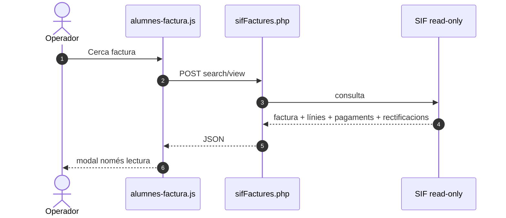
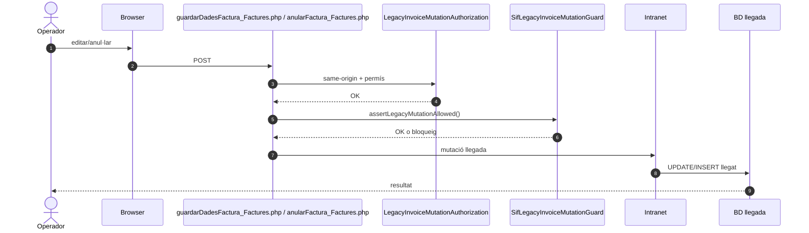
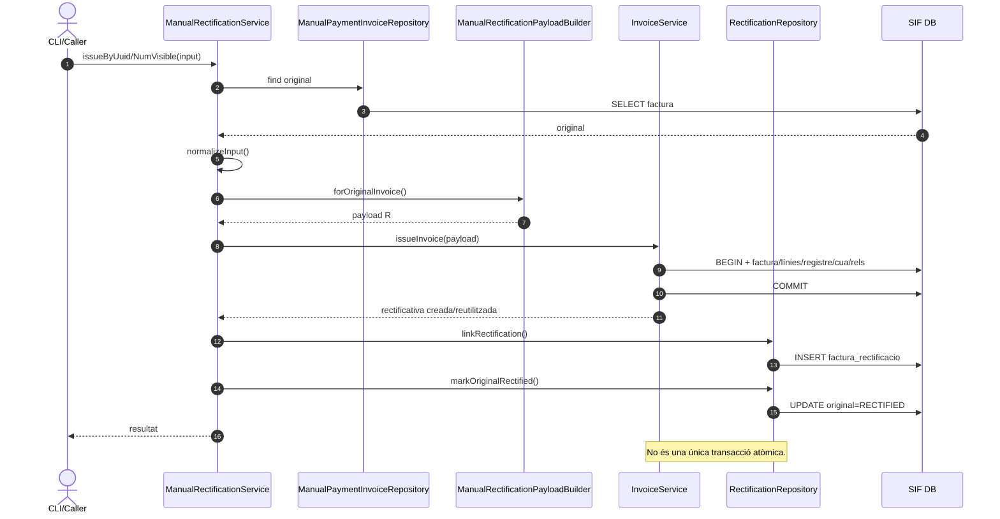
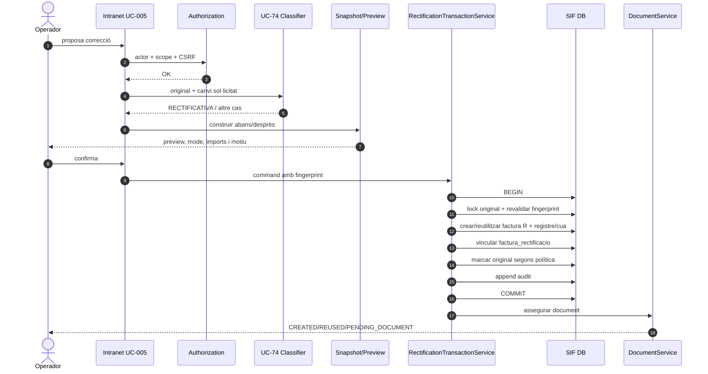

# UC-005 · Diagrames de seqüència ACTUAL / FINAL

## 1. ACTUAL — consulta SIF

## 2. ACTUAL — mutació llegada protegida

## 3. SIF existent — rectificació manual

## 4. FINAL — preview + classificació + commit atòmic

