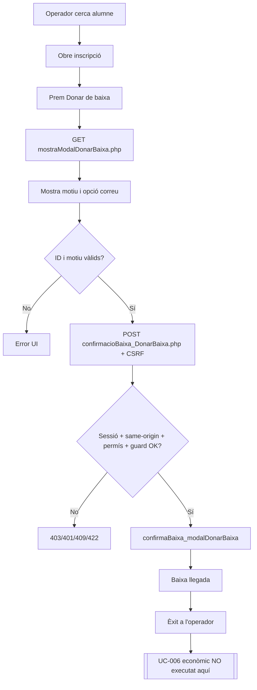
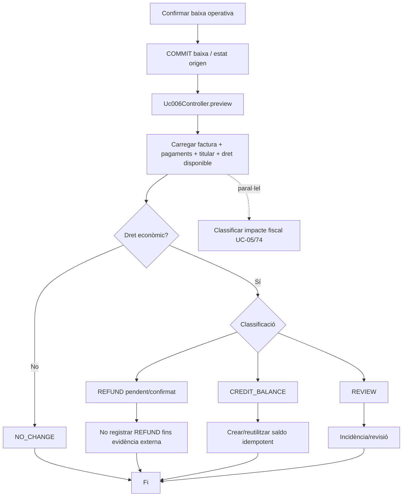
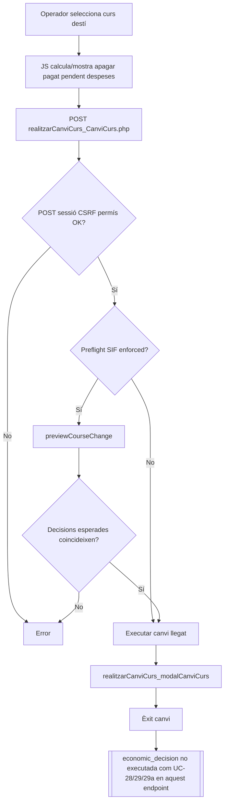
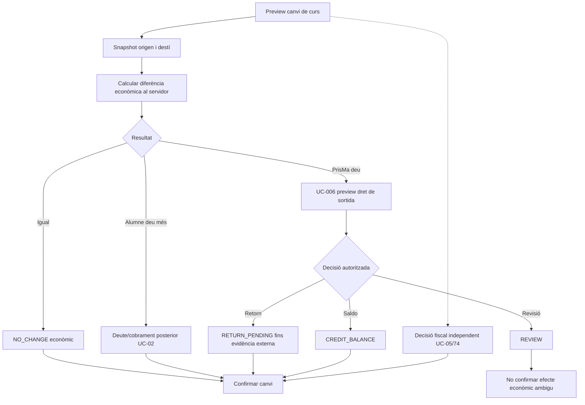
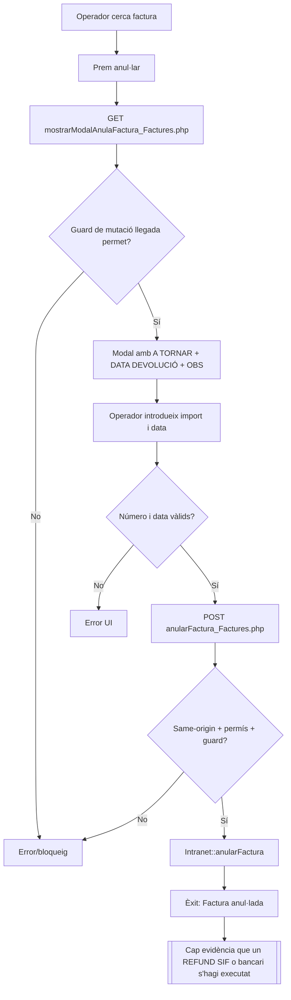
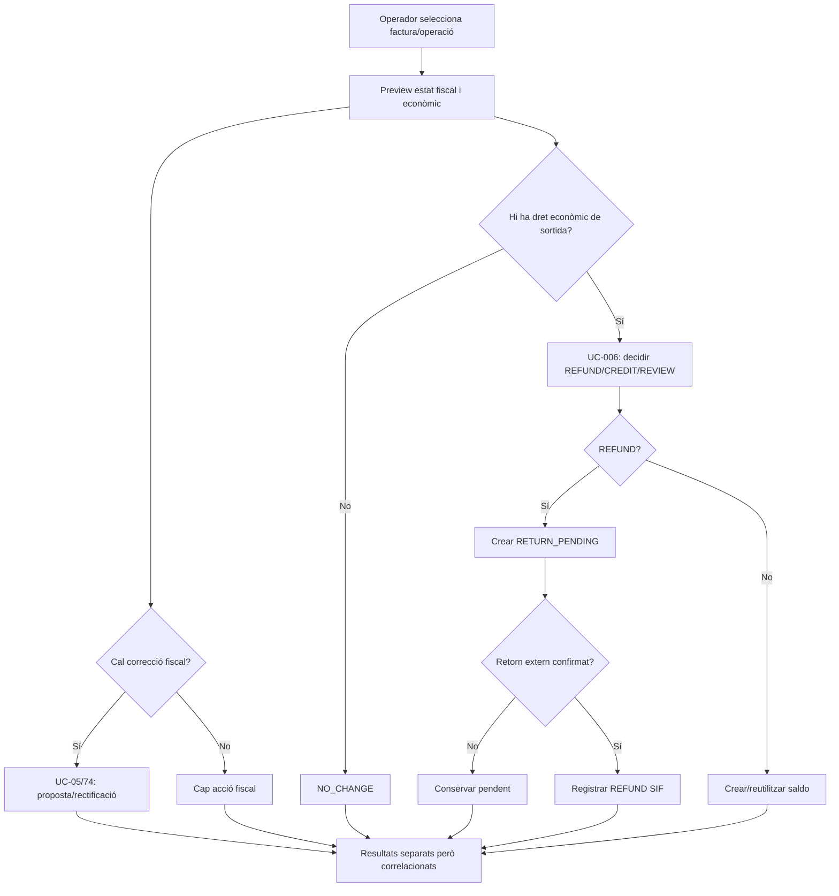
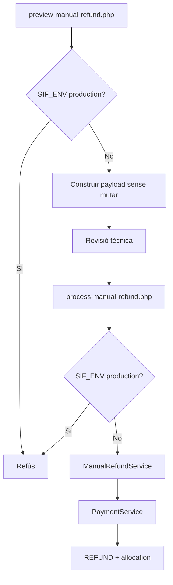
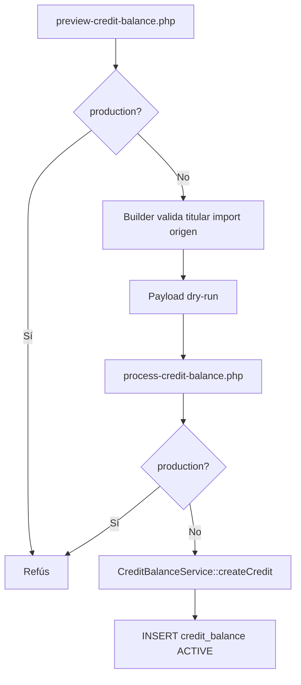
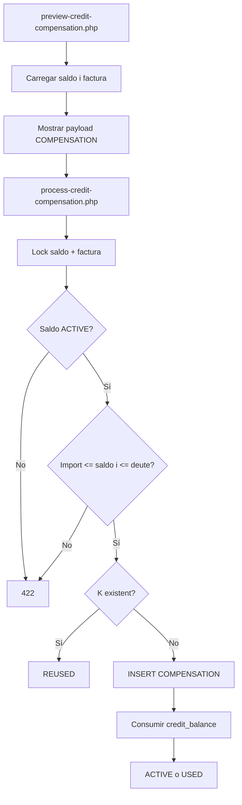
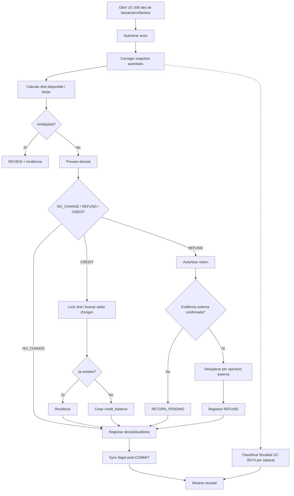

# UC-006 · Diagrames d’activitats ACTUAL / FINAL per pàgina i apartat

**Cas d'ús:** UC-006 — Registrar devolució, saldo o compensació  
**Data:** 2026-10-03  
**Criteri:** es documenten les superfícies que realment poden disparar o confondre UC-006. No es crea una “pàgina UC-006 actual” fictícia perquè no existeix.

## 1. Inventari de superfícies

| ID | Superfície | Apartat / acció | Estat UC-006 |
| --- | --- | --- | --- |
| P-UC006-01 | `/alumnes/mostrar-alumne/` | Donar de baixa | ACTUAL LLEGAT; només disparador |
| P-UC006-02 | `/alumnes/mostrar-alumne/` | Canviar de curs | ACTUAL LLEGAT + preview SIF opcional; execució econòmica no cablejada |
| P-UC006-03 | `/alumnes/factura/` | Anul·lar factura / A TORNAR | ACTUAL LLEGAT; barreja conceptes |
| P-UC006-04 | CLI SIF | Preview/process manual refund | IMPLEMENTAT TÈCNIC, no UI productiva |
| P-UC006-05 | CLI SIF | Preview/process credit balance | IMPLEMENTAT TÈCNIC, no UI productiva |
| P-UC006-06 | CLI SIF | Preview/process credit compensation | IMPLEMENTAT TÈCNIC, no UI productiva |
| P-UC006-F | Pantalla final UC-006 | Decisió econòmica i confirmació | PENDENT |

## 2. P-UC006-01 ACTUAL — baixa des de Consulta / Modifica alumne

### Mancança

La baixa pot crear una necessitat econòmica, però no hi ha pas explícit “què fem amb l’import?” ni enllaç transaccional a devolució/saldo.

## 3. P-UC006-01 FINAL — baixa + decisió econòmica separada

## 4. P-UC006-02 ACTUAL — canvi de curs

### Mancança

El preview ja permet distingir impacte econòmic, però la confirmació final no materialitza la decisió amb un contracte UC-006.

## 5. P-UC006-02 FINAL — canvi de curs amb partició econòmica

## 6. P-UC006-03 ACTUAL — Consulta / Anul·la factura

### Risc

La paraula “devolució” al camp de data i “A TORNAR” poden induir a interpretar una intenció/registre administratiu com si fos una sortida de diners confirmada.

## 7. P-UC006-03 FINAL — separar fiscal/administratiu d’econòmic

## 8. P-UC006-04 ACTUAL — CLI devolució

**Cobertura:** útil per prova/preproducció; no substitueix actor/autorització/evidència externa/UI.

## 9. P-UC006-05 ACTUAL — CLI crear saldo

**Mancança:** no hi ha guard idempotent d’origen acreditat.

## 10. P-UC006-06 ACTUAL — CLI aplicar saldo

**Mancança:** no s’acredita titularitat compatible.

## 11. P-UC006-F FINAL — pantalla unificada

### Apartat A · Context

Ha de mostrar, només en lectura:
- origen (baixa/canvi/operació);
- inscripció/linia;
- factura i receptor;
- pagador/titular;
- cobraments reals;
- devolucions ja registrades;
- saldos ja creats/consumits;
- dret encara disponible;
- estat fiscal separat.

### Apartat B · Decisió

Opcions:
- cap moviment;
- retorn monetari;
- saldo a favor;
- revisió.

“Compensació” només apareix en aplicar un saldo existent a una factura/deute compatible.

### Apartat C · Evidència de retorn

Només per devolució:
- canal;
- identificador extern estable;
- data real;
- import;
- pagador/receptor;
- estat `PENDING | CONFIRMED | FAILED`.

### Apartat D · Confirmació

Mostra fingerprint/snapshot, motiu, actor i efectes. Si l’estat ha canviat des del preview, força nou preview.

### Apartat E · Resultat

Mostra per separat:
- decisió econòmica;
- UUID payment/credit si existeix;
- estat de cobrament;
- decisió fiscal / UUID rectificativa si correspon;
- sync llegat;
- incidència si alguna fase posterior falla.

## 12. Activitat FINAL global

## 13. Criteris d’acceptació per superfície

- **P-UC006-01:** una baixa no pot afirmar devolució ni saldo sense UC-006.
- **P-UC006-02:** una diferència positiva/negativa de canvi ha de derivar explícitament al cas econòmic corresponent.
- **P-UC006-03:** “A TORNAR” no pot persistir-se com REFUND confirmat sense evidència.
- **P-UC006-04/05/06:** eines CLI continuen sent no productives; han de servir per verificació controlada.
- **P-UC006-F:** cap import/titular autoritatiu depèn només del navegador; tota confirmació rellegeix i bloqueja l’estat rellevant.
