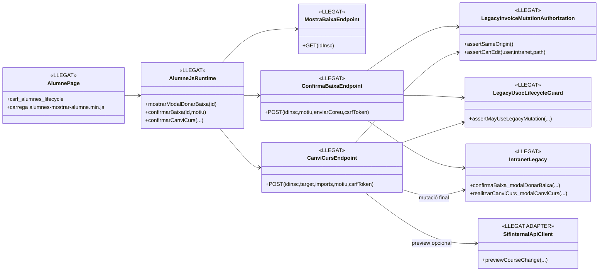
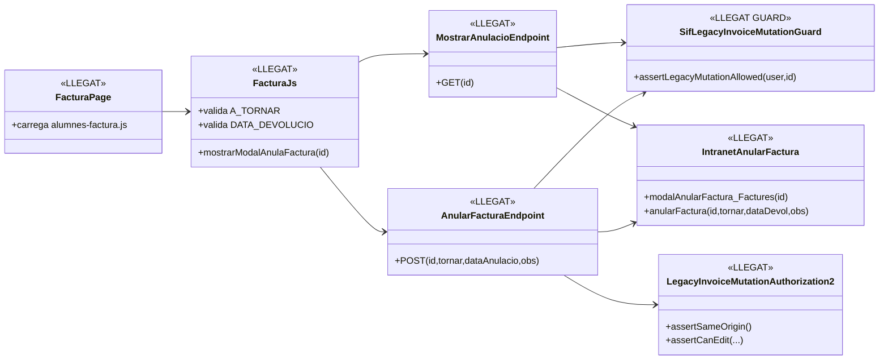
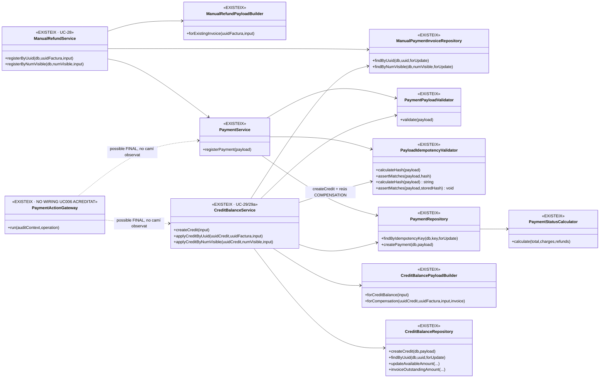
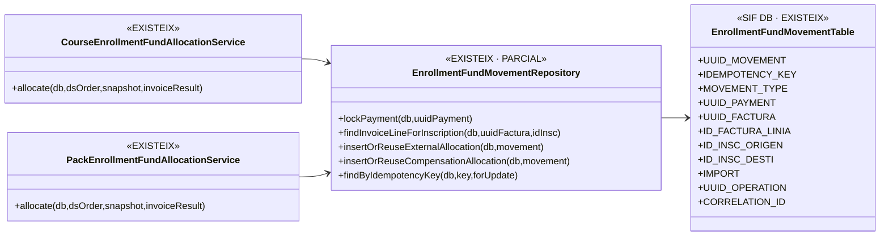
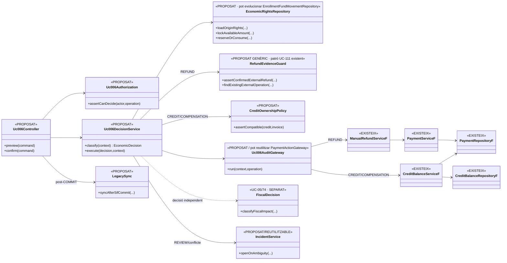

# UC-006 · Diagrames de classes ACTUAL / FINAL

**Cas d'ús:** UC-006 — Registrar devolució, saldo o compensació  
**Data d'auditoria estàtica:** 2026-10-03  
**Principi:** ACTUAL descriu els circuits que existeixen avui al repositori; FINAL descriu l’arquitectura necessària per tancar UC-006. Cap classe marcada `PROPOSAT` s’ha de llegir com a implementada.

## 1. Fonts directes contrastades

### Intranet / llegat
- `codi-drive/intranet-actual/alumnes-mostrar-alumne.php`
- `codi-drive/intranet-actual/js/alumnes-mostrar-alumne.min.js`
- `codi-drive/intranet-actual/ajax/alumnes/mostraModalDonarBaixa.php`
- `codi-drive/intranet-actual/ajax/alumnes/confirmacioBaixa_DonarBaixa.php`
- `codi-drive/intranet-actual/ajax/alumnes/realitzarCanviCurs_CanviCurs.php`
- `codi-drive/intranet-actual/alumnes-factura.php`
- `codi-drive/intranet-actual/js/alumnes-factura.js`
- `codi-drive/intranet-actual/ajax/alumnes/mostrarModalAnulaFactura_Factures.php`
- `codi-drive/intranet-actual/ajax/alumnes/anularFactura_Factures.php`
- `codi-drive/intranet-actual/LegacyInvoiceMutationAuthorization.php`
- `codi-drive/intranet-actual/SifLegacyInvoiceMutationGuard.php`

### SIF
- `sif/src/Service/ManualRefundService.php`
- `sif/src/Service/ManualRefundPayloadBuilder.php`
- `sif/src/Service/CreditBalanceService.php`
- `sif/src/Service/CreditBalancePayloadBuilder.php`
- `sif/src/Service/PaymentService.php`
- `sif/src/Service/PaymentActionGateway.php`
- `sif/src/Repository/PaymentRepository.php`
- `sif/src/Repository/CreditBalanceRepository.php`
- `sif/src/Repository/ManualPaymentInvoiceRepository.php`
- `sif/public/api/payments/register.php`

## 2. Llegenda

- **LLEGAT:** codi executat per les superfícies actuals.
- **EXISTEIX:** classe SIF localitzada i executable.
- **PARCIAL:** existeix, però no cobreix tot UC-006.
- **PROPOSAT:** responsabilitat necessària no localitzada com a component executable.
- **PENDENT INTEGRACIÓ:** codi existent sense wiring acreditat a la pantalla UC-006.

## 3. Classes ACTUAL — baixa / canvi de curs

### Lectura

- La baixa i el canvi tenen hardening parcial de servidor.
- El canvi pot obtenir una `economic_decision` d’un preview SIF, però l’endpoint final **no invoca** els serveis econòmics UC-006.
- No existeix en aquest circuit una classe que decideixi i executi `REFUND`/`CREDIT_BALANCE`/`COMPENSATION`.

## 4. Classes ACTUAL — anul·lació llegada de factura

**Risc funcional:** `A TORNAR` i `DATA DEVOLUCIÓ` viuen al mateix modal que “anul·lar factura”, però el camí observat no prova ni executa un retorn bancari SIF. La UI barreja decisió fiscal/administrativa i econòmica.

## 5. Classes ACTUAL — serveis SIF disponibles

## 5.1. Classes ACTUAL — ledger d'atribució per inscripció ja existent

La migració admet `EXTERNAL_ALLOCATION`, `INTERNAL_TRANSFER`, `REVERSAL` i `COMPENSATION_ALLOCATION`. El repositori implementa inserció/reús d'atribució externa i de compensació. No s'ha localitzat, però, la integració d'aquest ledger amb `ManualRefundService` o `CreditBalanceService`.

## 6. Mancances del model ACTUAL

1. **No hi ha orquestrador UC-006**, tot i que ja existeix un ledger parcial per inscripció.
2. **No hi ha command/controller UC-006** que obligui a triar una decisió econòmica única.
3. `ManualRefundService` no acredita:
   - límit retornable;
   - titular;
   - inscripció/línia origen;
   - evidència externa del retorn.
4. `CreditBalanceService::createCredit()` no mostra idempotència per origen.
5. `applyCredit*` comprova saldo i deute, però no titularitat compatible.
6. `PaymentActionGateway` existeix, però els serveis i scripts examinats no hi passen.
7. `public/api/payments/register.php` instancia `PaymentService` directament: no és un endpoint UC-006 complet.
8. La UI llegada d’anul·lació conserva semàntica “A TORNAR” sense separar estat pendent de retorn vs retorn confirmat.

## 7. Classes FINAL — UC-006 tancat

## 8. Responsabilitats FINAL

### `Uc006Controller`
- rep identificadors estables, no imports autoritatius calculats només al DOM;
- separa preview de confirm;
- exigeix actor, request/correlation id i versió/fingerprint de l’estat previsualitzat.

### `Uc006DecisionService`
- decideix `NO_CHANGE | REFUND | CREDIT_BALANCE | COMPENSATION | REVIEW`;
- no crea rectificatives: deriva la decisió fiscal al cas corresponent;
- no permet que baixa/canvi “inventin” moviments econòmics.

### `EconomicRightsRepository`
- calcula el valor econòmic disponible per origen/inscripció;
- bloqueja concurrentment;
- impedeix doble consum entre retorn, saldo i compensació.

### `RefundEvidenceGuard`
- diferencia retorn aprovat/pending de retorn bancari real;
- correlaciona Redsys/transferència/operació externa;
- evita duplicat manual d’un retorn ja conciliat.

- pot generalitzar el patró existent de `NovicePromotionOriginRefundEvidenceSourceInterface` i l'estat `APPROVED_WAITING_REFUND`, sense acoblar-se al domini UC-111;

### `CreditOwnershipPolicy`
- evita usar un saldo d’un titular en una factura incompatible sense regla explícita.

## 9. Criteri de pas a FINAL implementat

El diagrama FINAL només serà “implementat/verificat” quan el camí real sigui:

`pàgina intranet → Uc006Controller → Authorization → DecisionService → rights/evidence guards → audit gateway → servei UC-28/29/29a → COMMIT SIF → sync llegada`

i existeixin proves d’autorització, titularitat, límits, concurrència, idempotència, fallada parcial i E2E.
