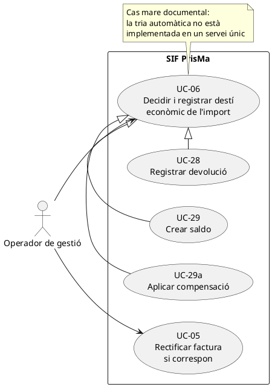
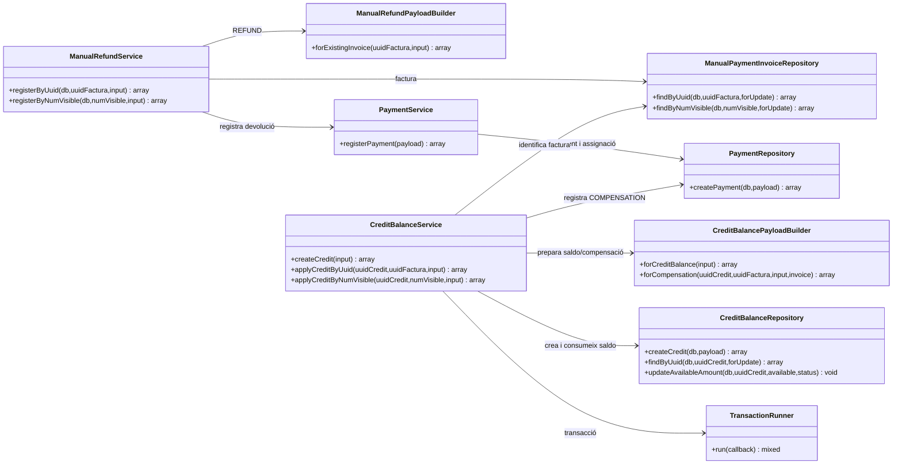
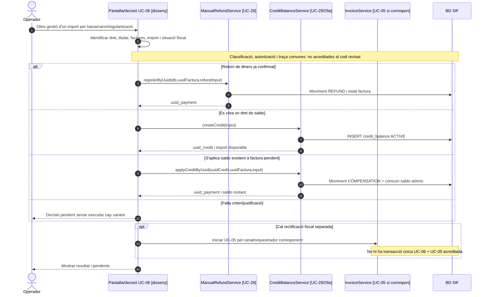

# UC-06 · Escollir i registrar devolució, saldo o compensació — fitxa i UML integrats

**Funció del cas mare:** representar una decisió de gestió entre tres **efectes econòmics diferents**. El catàleg original anomena aquest cas «Registrar devolució, saldo o compensació». En el codi revisat **no s'ha identificat una classe `Uc06Service` ni un orquestrador únic que prengui automàticament aquesta decisió**. El cas és una agrupació funcional, resolta pels casos concrets UC-28, UC-29 i UC-29a.

**Fonts del projecte:** [catàleg general UC-06](../04-estat-final/33-casos-us-sif.md), [fitxa genèrica anterior](../06-fitxes-funcionals/uc-006.md) i els tres serveis/repositoris referenciats més avall. No assumir que la modalitat escollida queda automàticament autoritzada per la situació fiscal de l'operació.

## 1. Fitxa del cas d'ús mare

| Camp | Definició |
| --- | --- |
| Actor principal | Operador de gestió; responsable tècnica en cas d'incidència o manca de criteri. |
| Disparador | Una baixa, un canvi de curs, una regularització o una altra decisió econòmica obliga a determinar què passa amb un import cobrat o degut. |
| Precondicions de negoci (objectiu, pendents d'integració) | Identificar operació d'origen, titular del dret econòmic, factures afectades, import, justificació i criteri fiscal. |
| Variant A | **Devolució (UC-28):** s'ha retornat diners al pagador; registrar `REFUND` sobre factura existent. |
| Variant B | **Saldo (UC-29):** s'atorga un import disponible a un titular, sense retorn bancari ni aplicació immediata. |
| Variant C | **Compensació (UC-29a):** existeix un saldo actiu i s'aplica a una factura amb import pendent; registrar `COMPENSATION` i consumir saldo atòmicament. |
| Possibilitat fiscal | Si es modifica o anul·la el servei facturat, valorar **UC-05** per separat. Un moviment econòmic no substitueix el document fiscal que correspongui. |
| Estat d'implementació | Serveis individuals disponibles; **pantalla/classificador de decisió UC-06 i regles completes de titularitat, permís, conciliació i auditoria no acreditats** en els camins consultats. |

### 1.1. Flux funcional objectiu de decisió

1. L'operador identifica el fet d'origen (p. ex. una baixa o canvi de curs) i consulta imports cobrats, imports pendents, factures i titular real. **Això és el requisit del cas mare, no una funcionalitat ja provada d'un servei d'elecció automàtica.**
2. Classifica amb criteri funcional la destinació de l'import: devolució al pagador, saldo del titular o aplicació d'un saldo ja existent.
3. Comprova si cal una rectificativa o una altra actuació fiscal. Si no existeix una decisió fiscal validada, la ruta no s'hauria de donar per finalitzada.
4. Executa el cas concret escollit: UC-28, UC-29 o UC-29a, cadascun amb les seves entrades, resultats, errors i garanties descrites a les fitxes vinculades.
5. Vincula la decisió de gestió, el moviment econòmic i, quan existeix, la factura/rectificativa. **El registre de correlació transversal complet continua pendent de demostrar.**

### 1.2. Distincions imprescindibles

| Decisió | Què registra el servei actual | Què NO registra pel sol fet d'executar-lo |
| --- | --- | --- |
| Devolució UC-28 | `payment_transaction` `REFUND` + `payment_allocation` | No acredita el pagament bancari de sortida; no emet rectificativa automàticament. |
| Saldo UC-29 | `credit_balance` amb titular, origen i import `ACTIVE` | No registra moviment `payment_transaction`; no redueix cap import pendent de factura; no evita duplicats per origen en el camí revisat. |
| Compensació UC-29a | `payment_transaction` `COMPENSATION` + assignació; minva de `credit_balance` en la mateixa transacció | No mou diners al banc; no crea nova factura; el servei revisat no compara titular de saldo i receptor de factura. |

### 1.3. Errors, alternatives i criteri de completitud

- Import o titular no determinats: la decisió operativa continua pendent; **cap modalitat no s'hauria de deduir només de l'existència d'un cobrament**.
- Una factura no trobada impedeix UC-28/UC-29a; un saldo absent o inactiu impedeix UC-29a. UC-29 pot crear saldo sense factura aportada, per la qual cosa la justificació d'origen ha de formar part de la validació funcional.
- Una devolució i un saldo **no són equivalents**: registrar totes dues modalitats pel mateix dret econòmic, sense una operació específica de repartiment/conciliació, pot duplicar l'efecte econòmic.
- La decisió fiscal, l'autorització, la traça de titular i les comprovacions de duplicats s'han de tancar abans que una pantalla única pugui automatitzar la tria.
- Les proves individuals dels serveis existeixen, però no demostren un orquestrador transaccional comú ni un flux complet de baixa/canvi de curs fins a cobrament i rectificació.

## 2. Diagrama UML de casos d'ús — alternatives independents

**Precisió:** les fletxes de generalització indiquen variants documentals d'una decisió de gestió; no són una crida PHP d'UC-06 a tres serveis ni impliquen executar les tres operacions conjuntament.

## 3. Diagrama de classes dels tres serveis existents

No es dibuixa un `EconomicDecisionOrchestrator` implementat perquè **el camí de codi consultat no acredita l'existència d'aquesta classe**.

## 4. Diagrama de seqüència — classificació funcional i delegació (OBJECTIU)

**Aquest és el diagrama de seqüència del contracte funcional objectiu del cas mare**, no una afirmació que la pantalla o la tria automàtica ja estiguin implementades. Els diagrames executables individuals consten a les fitxes UC-28, UC-29 i UC-29a.

## 5. Traçabilitat

[UC-28 devolució](uc-028-registrar-devolucio.md) · [UC-29 saldo](uc-029-crear-saldo.md) · [UC-29a compensació](uc-029a-aplicar-compensacio.md) · [UC-05 rectificació](uc-005-rectificar-factura.md) · [Catàleg general UC-06](../04-estat-final/33-casos-us-sif.md) · [Fitxa anterior UC-06](../06-fitxes-funcionals/uc-006.md) · [ManualRefundService](../../sif/src/Service/ManualRefundService.php) · [CreditBalanceService](../../sif/src/Service/CreditBalanceService.php).
