# UC-006 · Diagrames de seqüència ACTUAL / FINAL

**Cas d'ús:** UC-006 — Registrar devolució, saldo o compensació  
**Data:** 2026-10-03  
**Principi:** ACTUAL és codi observat; FINAL és el contracte objectiu. Els serveis SIF poden existir sense que la pantalla els estigui usant.

## 1. ACTUAL — baixa d’una inscripció

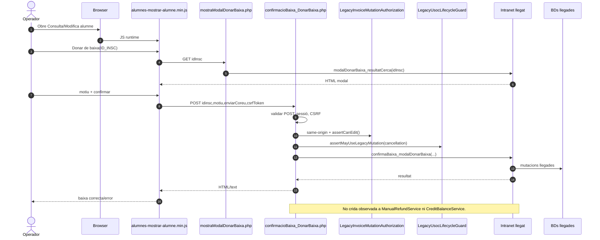

**Conclusió:** la baixa és un disparador potencial d’UC-006, no la seva implementació econòmica.

## 2. ACTUAL — canvi de curs amb preview SIF opcional

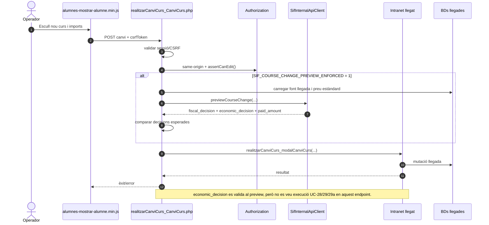

## 2.1. Contracte ACTUAL de `economic_decision` al canvi de curs

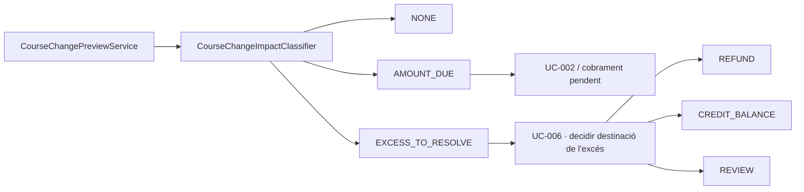

La part esquerra fins a `EXCESS_TO_RESOLVE` existeix i està provada. La derivació `EXCESS_TO_RESOLVE → UC-006` és el wiring que falta.

## 3. ACTUAL — “anul·lar factura” llegada amb A TORNAR

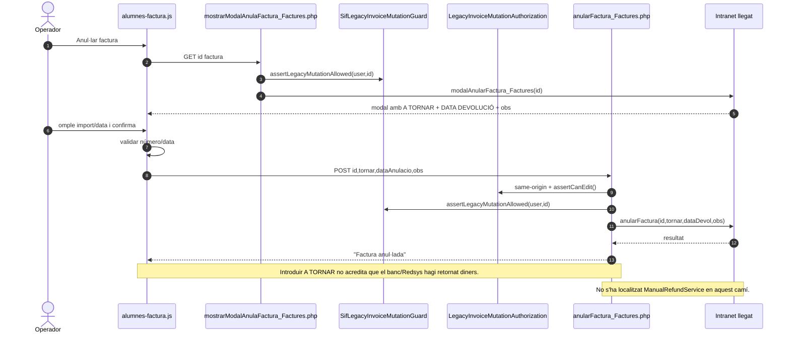

## 4. ACTUAL — registre SIF de devolució amb ledger opcional

```mermaid
sequenceDiagram
autonumber
participant Caller as Script/adaptador tècnic
participant R as ManualRefundService
participant IR as ManualPaymentInvoiceRepository
participant B as ManualRefundPayloadBuilder
participant PS as PaymentService
participant F as EnrollmentFundMovementRepository
participant DB as BD SIF

Caller->>R: registerByUuid/NumVisible(invoice,input)
R->>IR: find invoice
IR->>DB: SELECT factura
alt factura absent
  R--xCaller: 422
else factura existent
  R->>B: forExistingInvoice(...)
  B-->>R: REFUND + K + allocation + source_enrollment_id?
  alt sense source_enrollment_id
    R->>PS: registerPayment(payload)
    PS->>DB: create/reuse REFUND + allocation
    R-->>Caller: resultat
  else amb source_enrollment_id
    R->>DB: BEGIN
    R->>PS: registerPaymentInTransaction(db,payload)
    PS->>DB: create/reuse REFUND + allocation
    R->>F: insertOrReuseRefundExit(...)
    F->>DB: lock REFUND + ledger origen
    alt excedeix import REFUND o dret disponible
      F--xR: 409
      R->>DB: ROLLBACK
    else vàlid
      F->>DB: INSERT REFUND_EXIT
      R->>DB: COMMIT
      R-->>Caller: uuid_payment / reused
    end
  end
end
Note over Caller,R: El límit quantitatiu per inscripció ja existeix; titularitat i evidència externa del retorn continuen fora d'aquest servei.
```

## 5. ACTUAL — crear saldo amb idempotència i consum opcional del dret

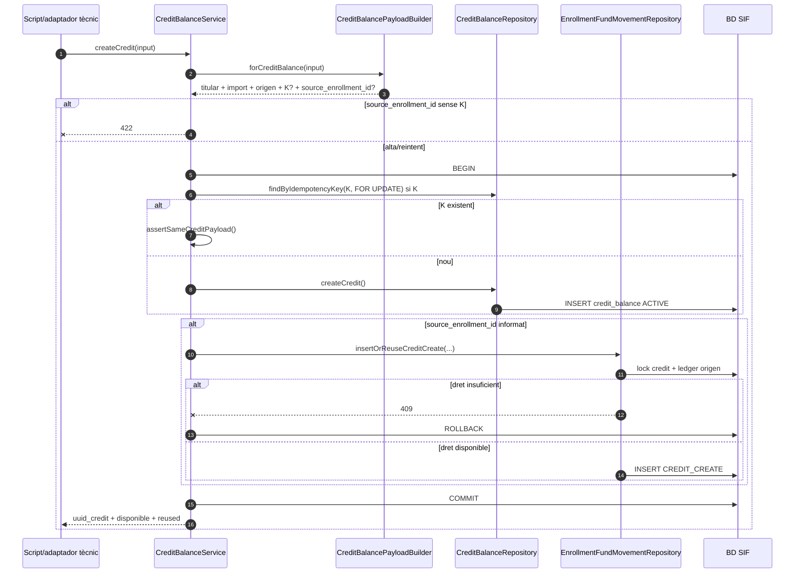

**Límit ACTUAL:** la K tècnica i el consum quantitatiu ja existeixen, però el futur orquestrador encara ha de construir la identitat estable del dret i validar-ne titularitat/origen de negoci.

## 6. ACTUAL — aplicar compensació amb destí d'inscripció opcional

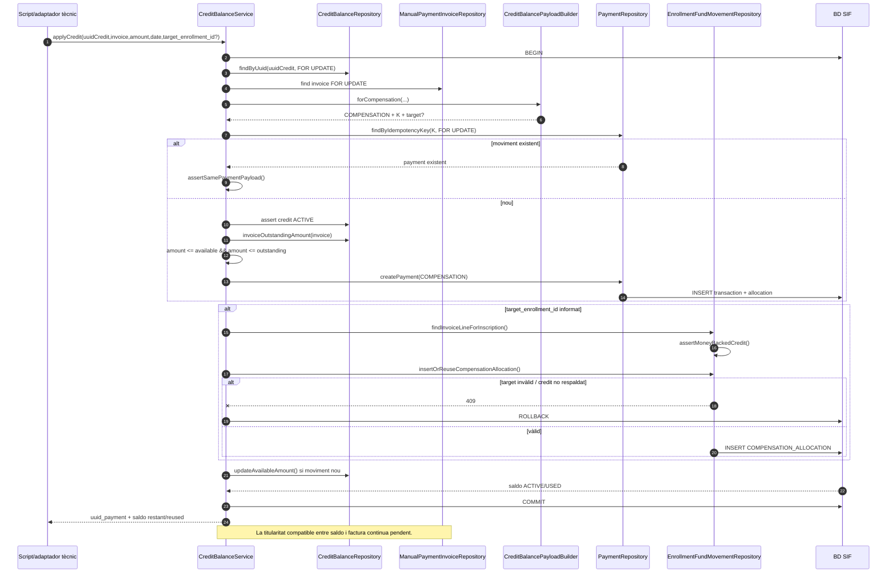

## 6.1. ACTUAL — atribució de fons per inscripció ja implementada en curs/pack

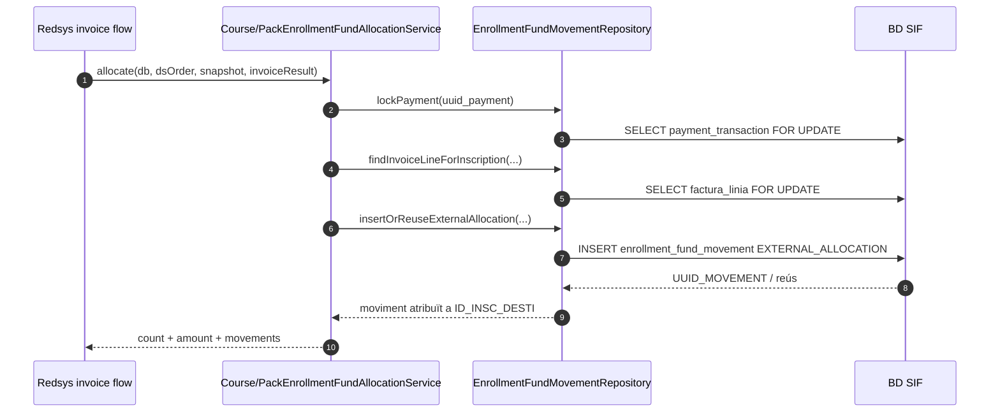

**Lectura d'auditoria actualitzada:** l'atribució inicial `EXTERNAL_ALLOCATION` continua sent la base; les seccions 6.2–6.4 documenten ara els recorreguts executables afegits per treure fons via refund, convertir-los en saldo i tornar a atribuir un saldo a una inscripció.

## 6.2. ACTUAL ampliat — crear saldo consumint dret d'inscripció

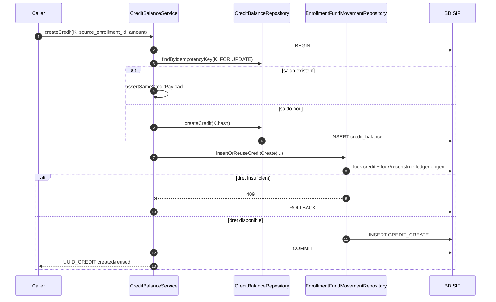

## 6.3. ACTUAL ampliat — refund consumint el mateix dret

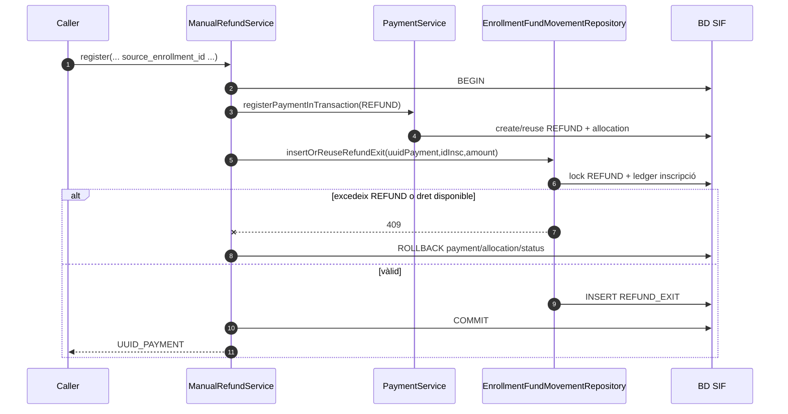

## 6.4. ACTUAL ampliat — aplicar saldo a una inscripció de la factura

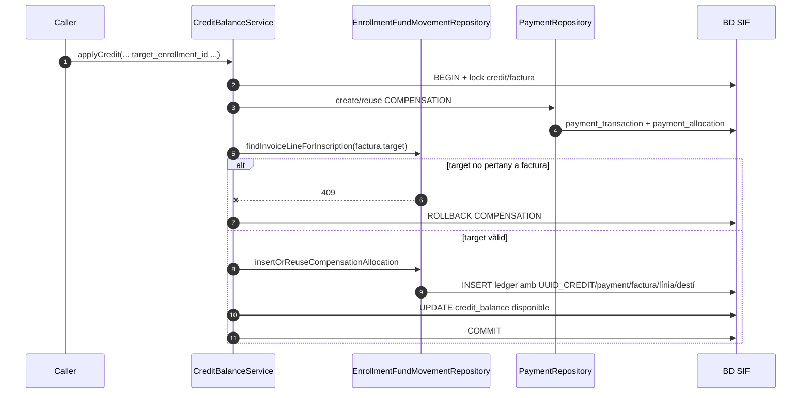

**Nota:** aquests tres recorreguts són ACTUALS a la branca, però encara no estan invocats per la UI llegada ni acreditats per CI/preproducció.
## 6.5. ACTUAL ampliat — traspàs intern A → B sense nou cobrament

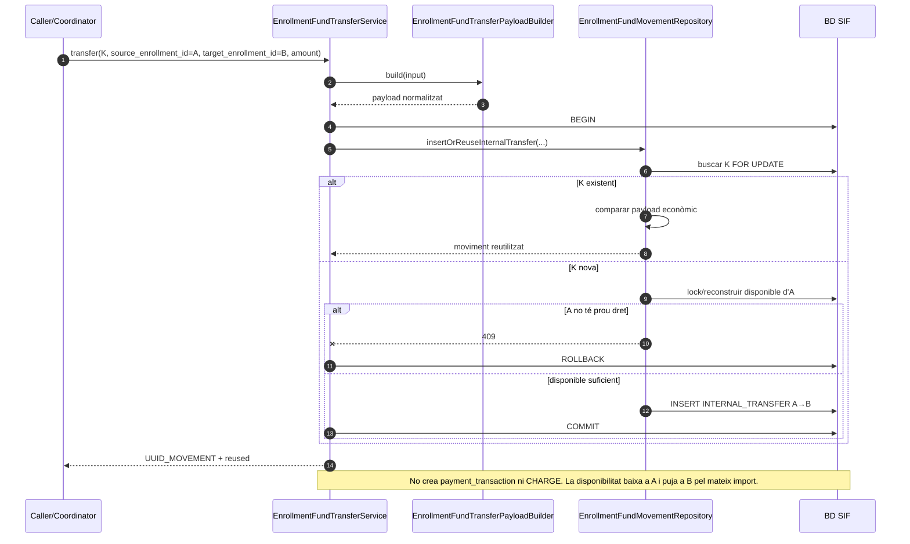

**Implementat a la branca:** builder, servei transaccional, repositori, preview/process CLI i proves A→B/A→B→C. **Pendent:** que UC-071/UC-006 decideixi i autoritzi quan/quanta quantitat traspassar.

## 6.6. ACTUAL ampliat — reversió segura d'un traspàs A → B

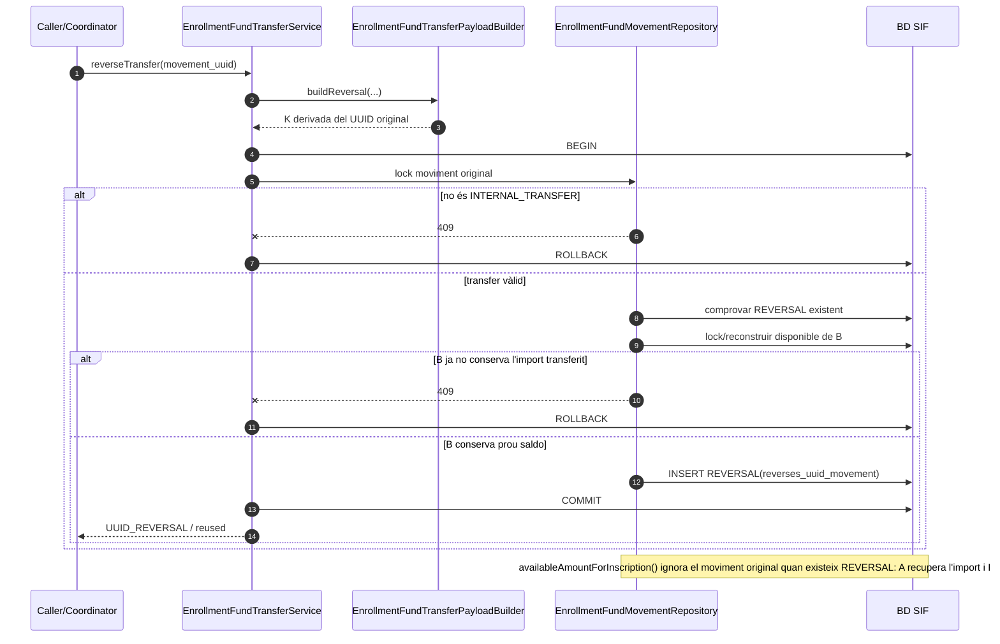

**Límit deliberat:** aquesta reversió no desfà `REFUND_EXIT`, `CREDIT_CREATE` ni `COMPENSATION_ALLOCATION`. Si el canvi ja ha generat altres efectes, cal regularització específica i no una reversió genèrica.

## 7. FINAL — preview de decisió UC-006

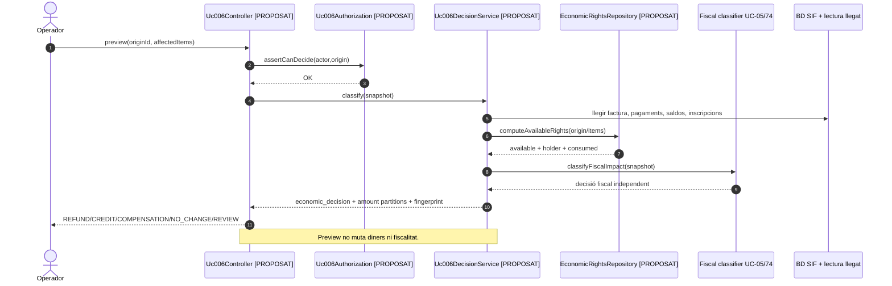

## 8. FINAL — confirmar devolució real

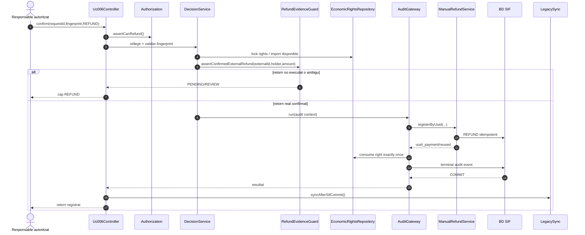

## 9. FINAL — crear saldo idempotent

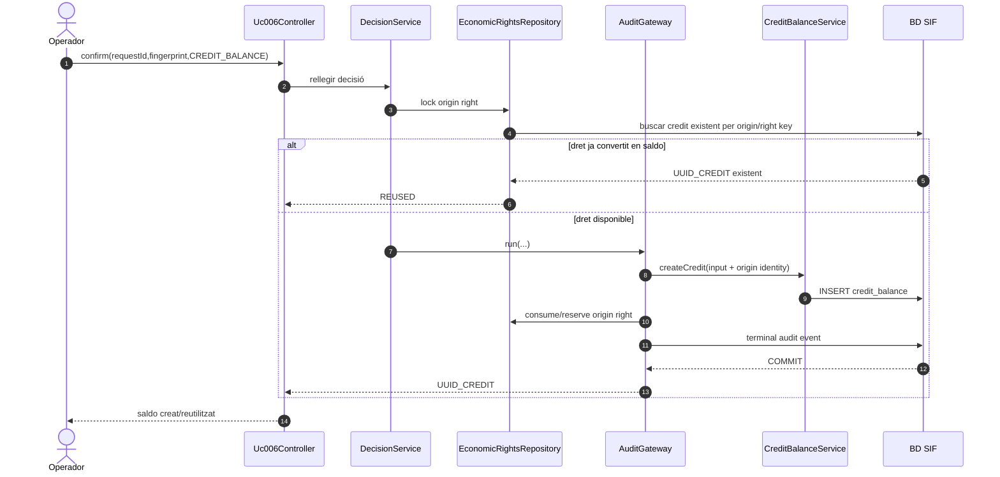

## 10. FINAL — compensar saldo

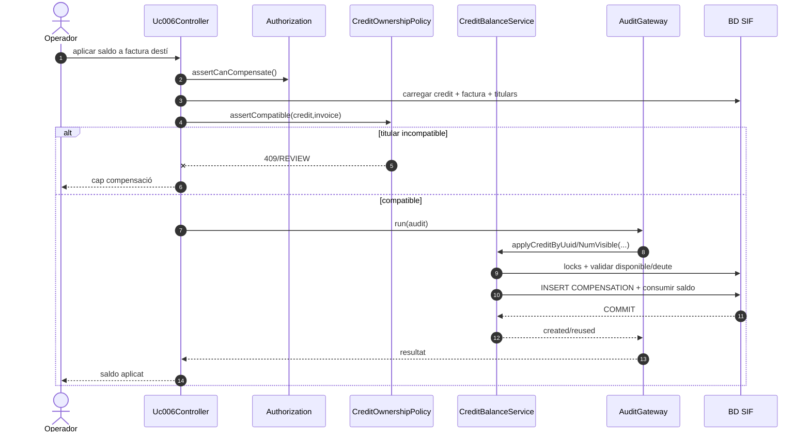

## 11. Errors i recuperació FINAL

- **preview caducat:** 409 i nou preview;
- **dret ja consumit per devolució/saldo:** 409/REVIEW, cap segon efecte;
- **retorn extern confirmat però SIF falla:** incidència i reintent de registre, **mai segon retorn bancari**;
- **SIF confirma però sync llegat falla:** conservar SIF i reintentar només sync;
- **mateixa clau amb payload diferent:** CONFLICT;
- **titular ambigu:** REVIEW;
- **fiscalitat amb dubte:** decisió UC-05/74 pendent, sense inventar efecte econòmic;
- **conciliació Redsys/manual duplicada:** reutilitzar el mateix fet extern.
