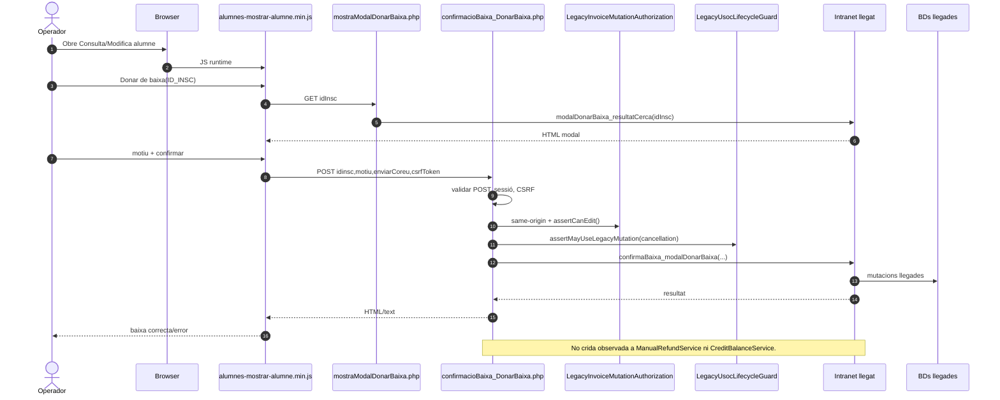
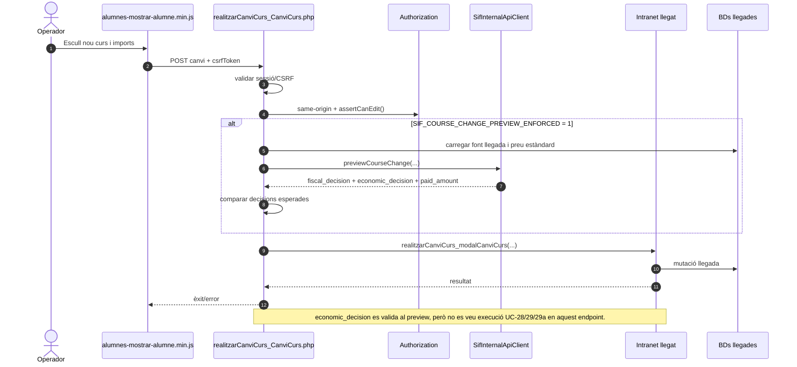
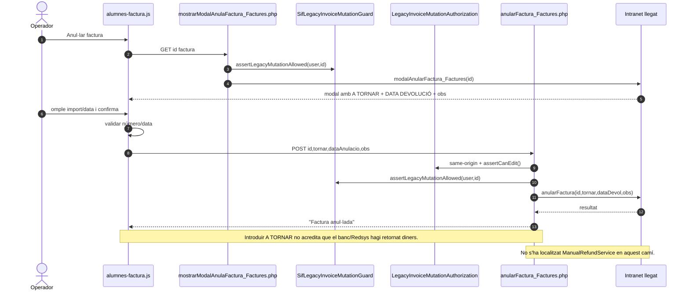
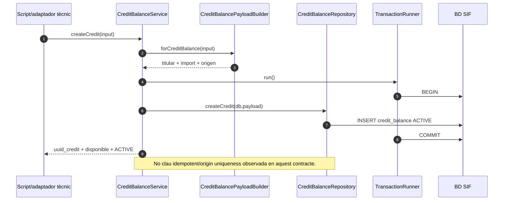
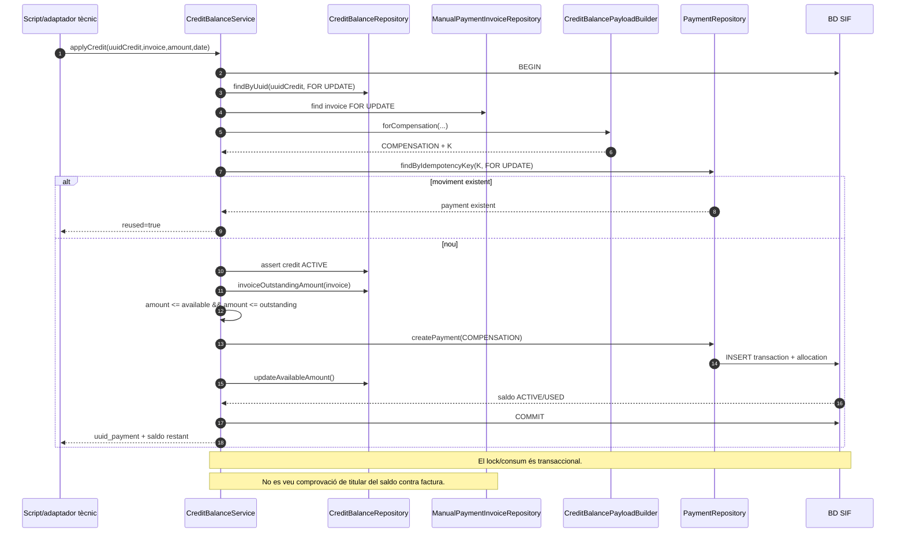
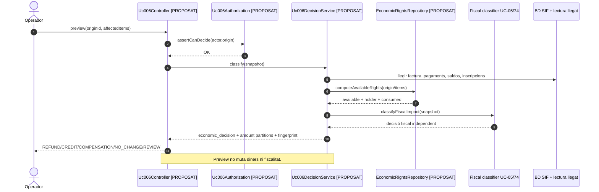
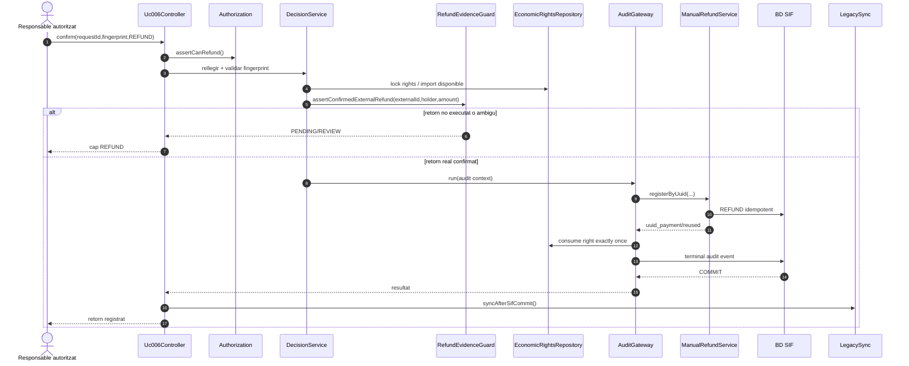
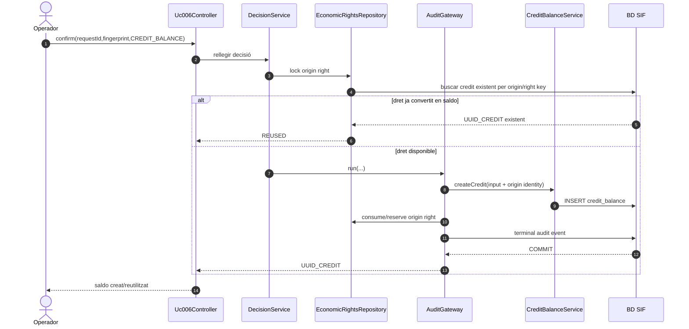
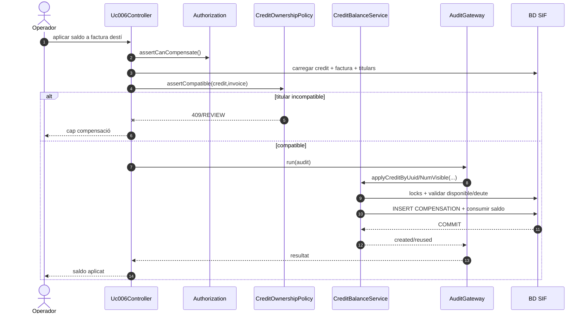

# UC-006 · Diagrames de seqüència ACTUAL / FINAL

**Cas d'ús:** UC-006 — Registrar devolució, saldo o compensació  
**Data:** 2026-10-03  
**Principi:** ACTUAL és codi observat; FINAL és el contracte objectiu. Els serveis SIF poden existir sense que la pantalla els estigui usant.

## 1. ACTUAL — baixa d’una inscripció



**Conclusió:** la baixa és un disparador potencial d’UC-006, no la seva implementació econòmica.

## 2. ACTUAL — canvi de curs amb preview SIF opcional



## 3. ACTUAL — “anul·lar factura” llegada amb A TORNAR



## 4. ACTUAL — registre SIF de devolució disponible però no cablejat a la UI

```mermaid
sequenceDiagram
autonumber
participant Caller as Script/adaptador tècnic
participant R as ManualRefundService
participant IR as ManualPaymentInvoiceRepository
participant B as ManualRefundPayloadBuilder
participant PS as PaymentService
participant PR as PaymentRepository
participant DB as BD SIF

Caller->>R: registerByUuid/NumVisible(invoice,input)
R->>IR: find invoice
IR->>DB: SELECT factura
alt factura absent
  R--xCaller: 422
else factura existent
  R->>B: forExistingInvoice(...)
  B-->>R: REFUND + K + allocation
  R->>PS: registerPayment(payload)
  PS->>PR: findByIdempotencyKey(K, FOR UPDATE)
  alt existent
    PS->>PS: assertSamePayload(hash)
    PS-->>R: reused
  else nou
    PS->>PR: createPayment()
    PR->>DB: INSERT payment_transaction REFUND
    PR->>DB: INSERT payment_allocation
    PR->>DB: recalcular ESTAT_COBRAMENT
    PS-->>R: uuid_payment
  end
  R-->>Caller: resultat
end
Note over Caller,R: El caller ha d'acreditar permisos, límit retornable i retorn extern; el servei no ho resol completament.
```

## 5. ACTUAL — crear saldo



## 6. ACTUAL — aplicar compensació



## 7. FINAL — preview de decisió UC-006



## 8. FINAL — confirmar devolució real



## 9. FINAL — crear saldo idempotent



## 10. FINAL — compensar saldo



## 11. Errors i recuperació FINAL

- **preview caducat:** 409 i nou preview;
- **dret ja consumit per devolució/saldo:** 409/REVIEW, cap segon efecte;
- **retorn extern confirmat però SIF falla:** incidència i reintent de registre, **mai segon retorn bancari**;
- **SIF confirma però sync llegat falla:** conservar SIF i reintentar només sync;
- **mateixa clau amb payload diferent:** CONFLICT;
- **titular ambigu:** REVIEW;
- **fiscalitat amb dubte:** decisió UC-05/74 pendent, sense inventar efecte econòmic;
- **conciliació Redsys/manual duplicada:** reutilitzar el mateix fet extern.
