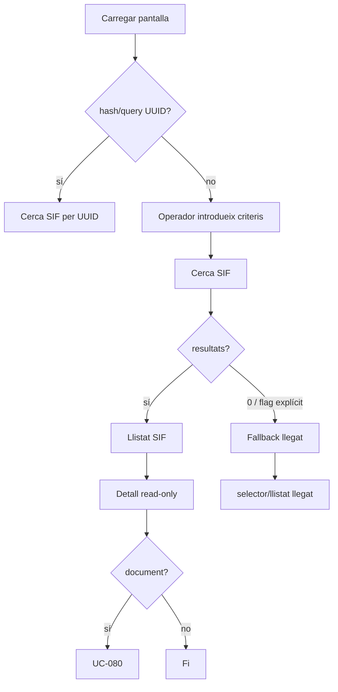
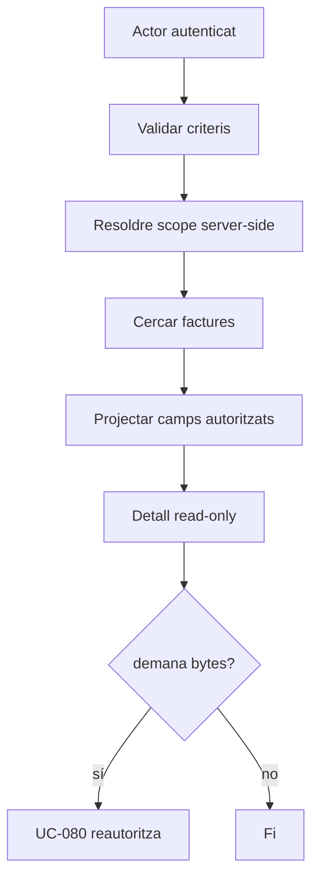
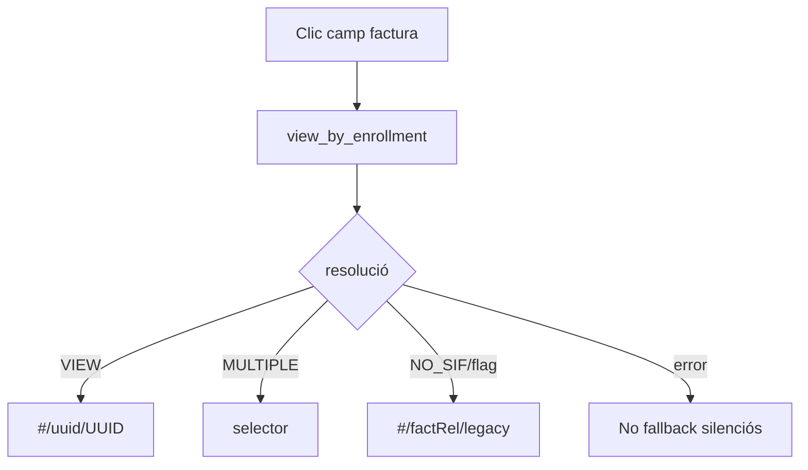
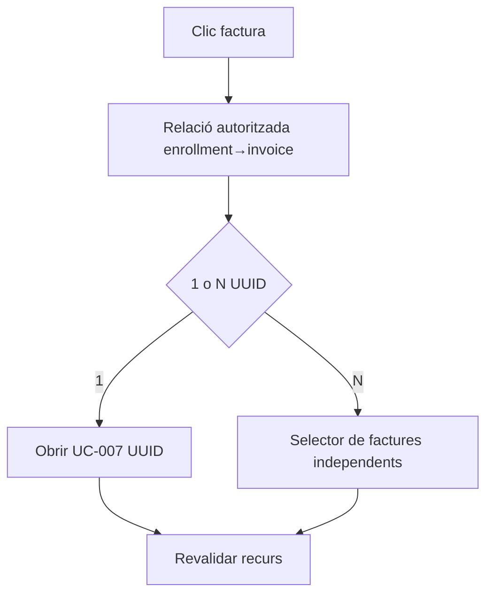
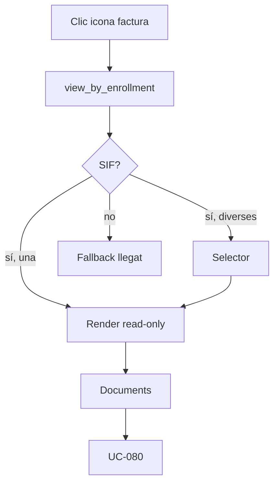
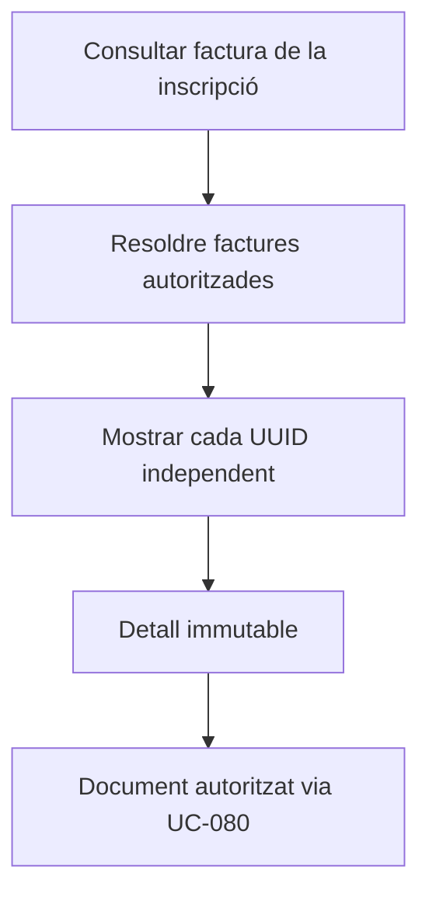
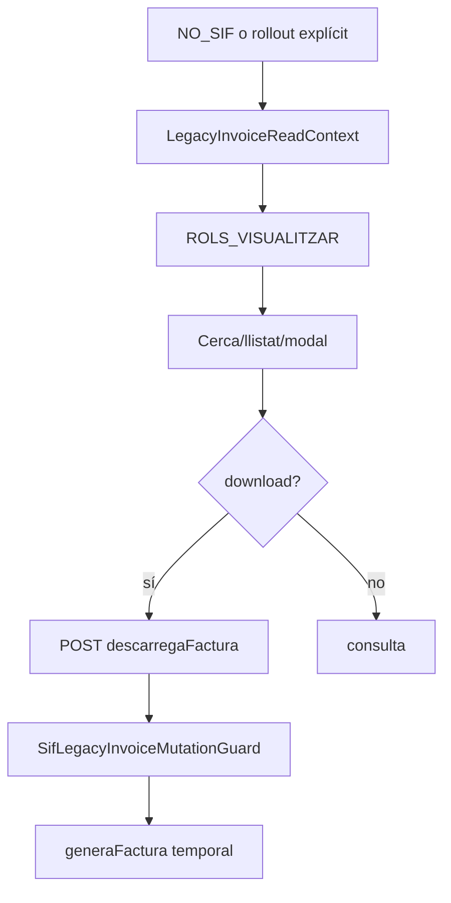
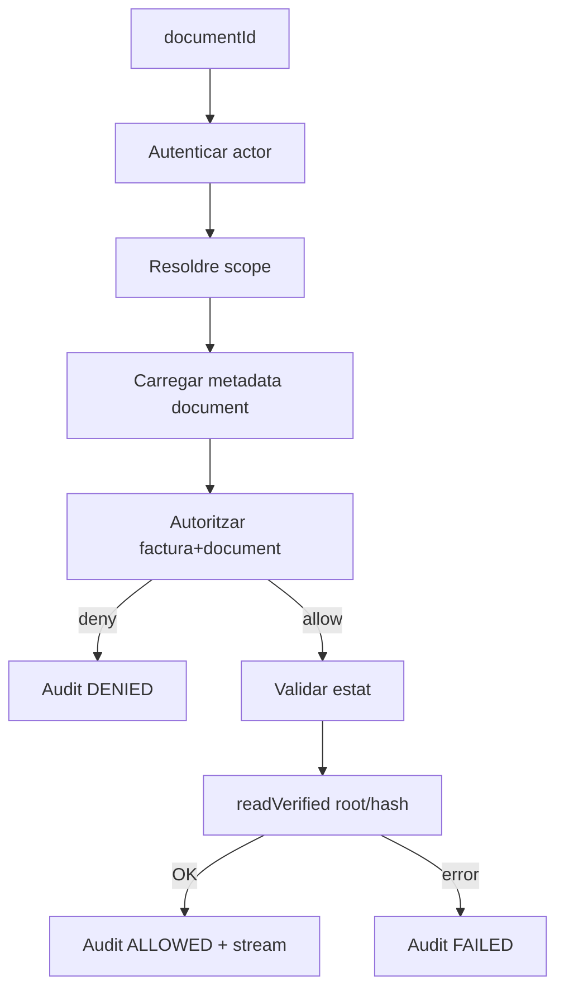

# UC-007 · Activitats ACTUAL / FINAL per pàgina i apartat

## P-07-01 · `/alumnes/factura/`

### ACTUAL

### FINAL

## P-07-02 · Fitxa alumne — AL-16

### ACTUAL

### FINAL

## P-07-02 · Fitxa alumne — AL-17 modal

### ACTUAL

### FINAL

## Fallback llegat F02–F07

**FINAL:** aquest bloc desapareix quan totes les factures consultables siguin SIF/històriques classificades i la matriu de regressió estigui tancada.

## UC-080 · Activitat documental

