# UC-007 · Activitats ACTUAL / FINAL per pàgina i apartat

## P-07-01 · `/alumnes/factura/`

### ACTUAL
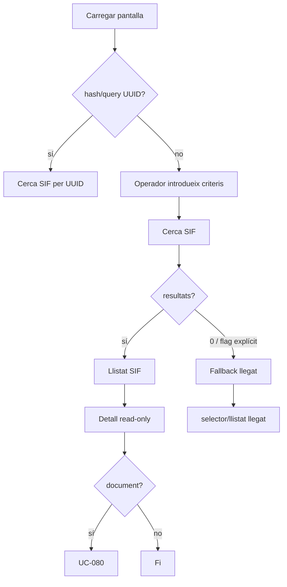

### FINAL
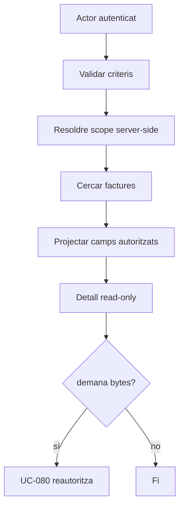

## P-07-02 · Fitxa alumne — AL-16

### ACTUAL
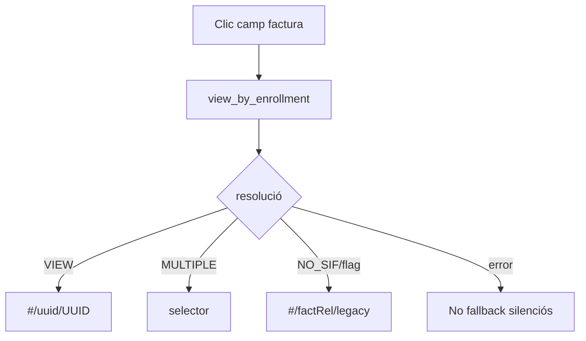

### FINAL
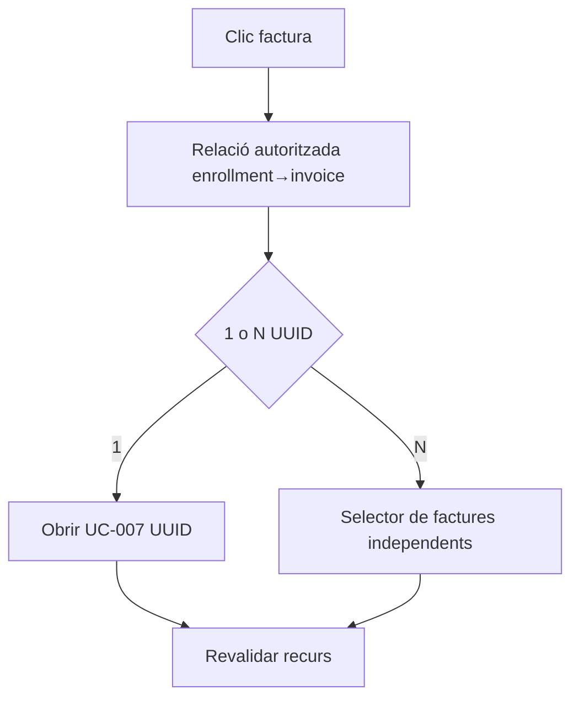

## P-07-02 · Fitxa alumne — AL-17 modal

### ACTUAL
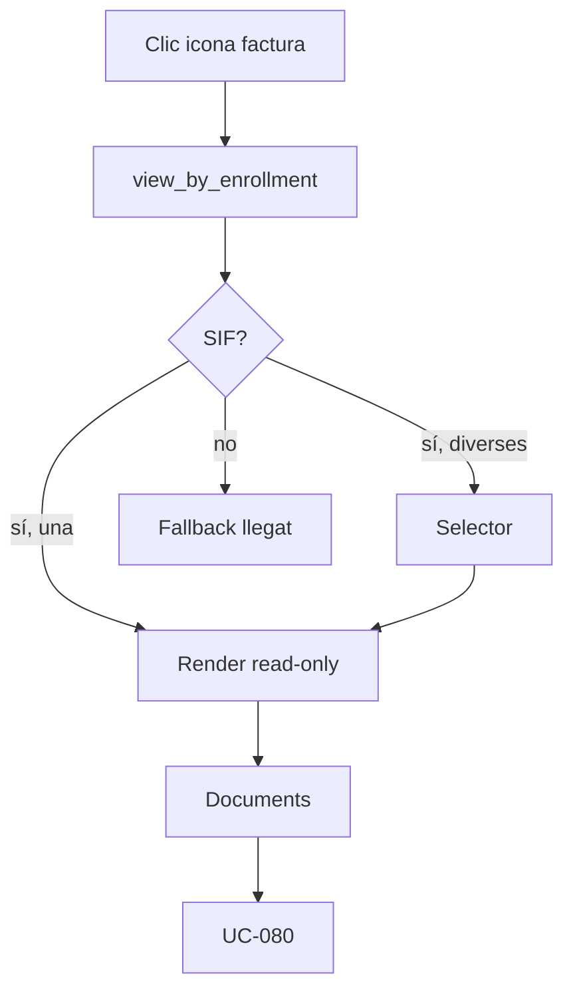

### FINAL
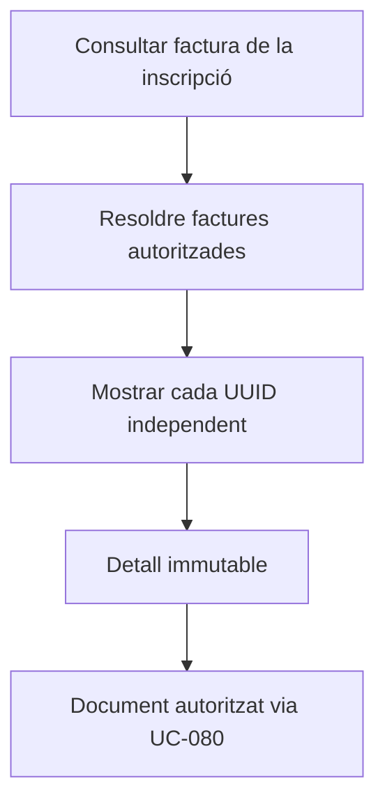

## Fallback llegat F02–F07

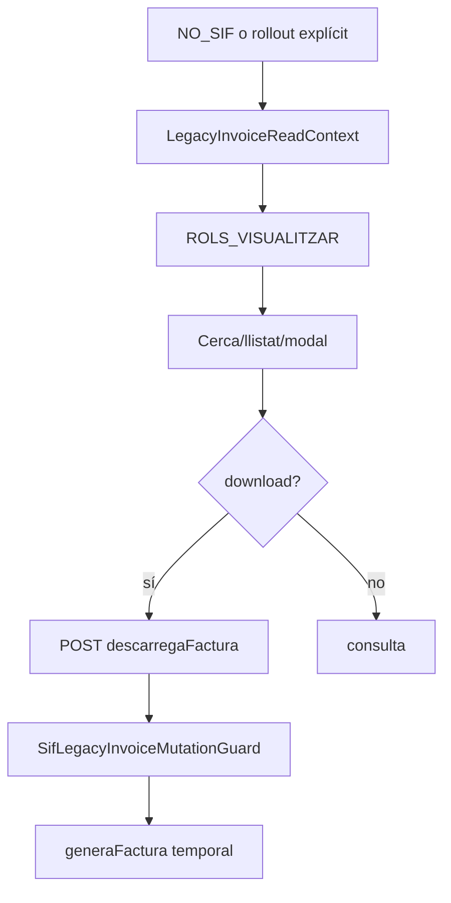

**FINAL:** aquest bloc desapareix quan totes les factures consultables siguin SIF/històriques classificades i la matriu de regressió estigui tancada.

## UC-080 · Activitat documental

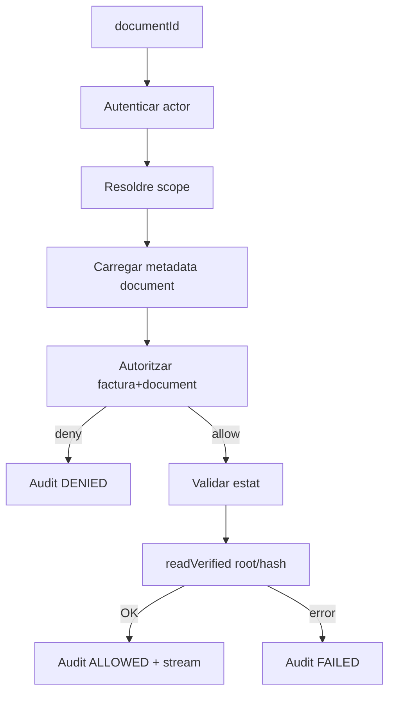


# Desglossament per apartat funcional

## F01 · Carregar pantalla i autorització

### ACTUAL
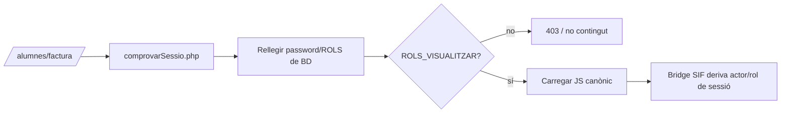

### FINAL
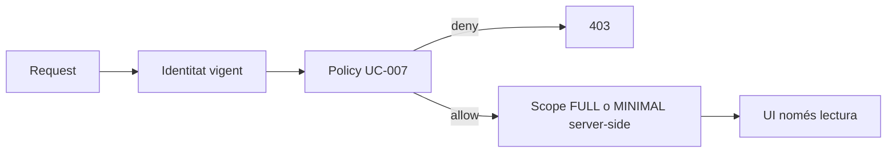

## F02 · Cercar factures

### ACTUAL
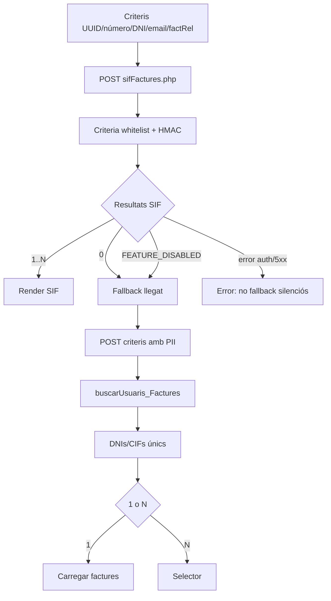

### FINAL
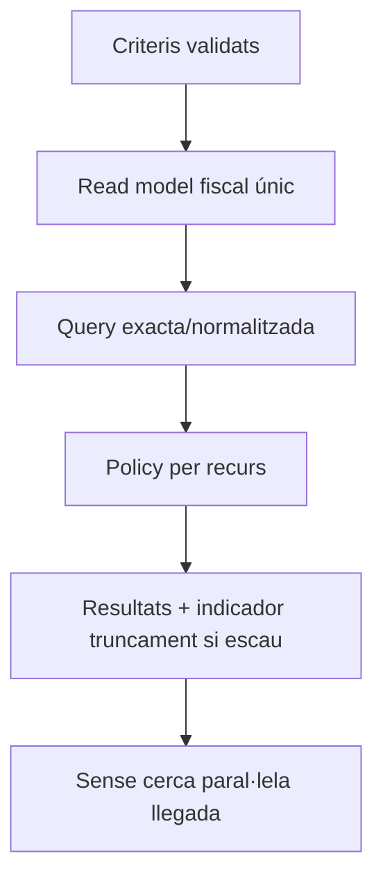

## F03 · Selector de coincidències

### ACTUAL
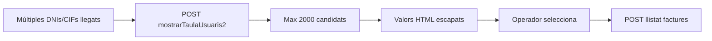

### FINAL
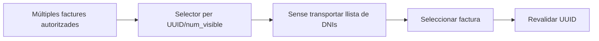

## F04 · Llistat de factures

### ACTUAL
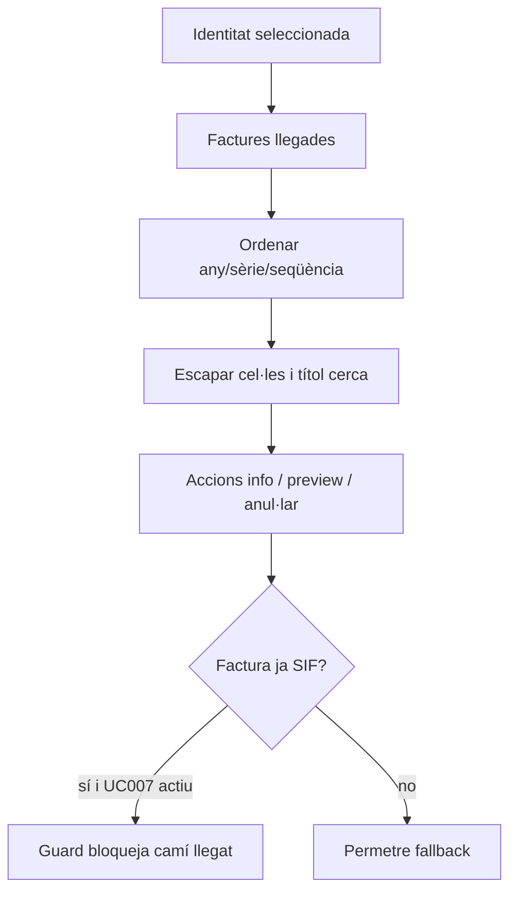

### FINAL
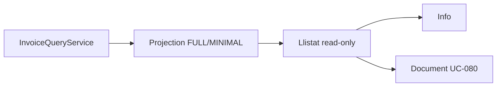

## F05 · Consultar informació / edició llegada transitòria

### ACTUAL
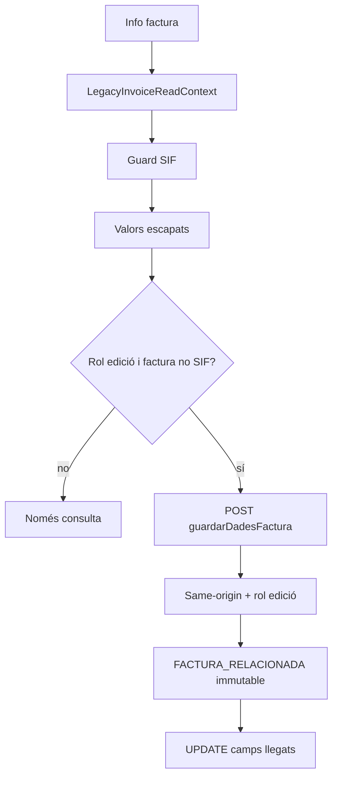

### FINAL
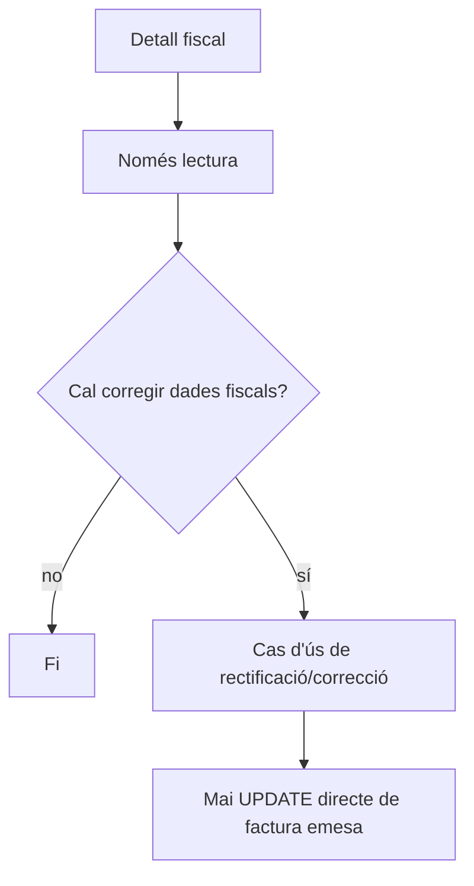

## F06 · Previsualitzar document

### ACTUAL
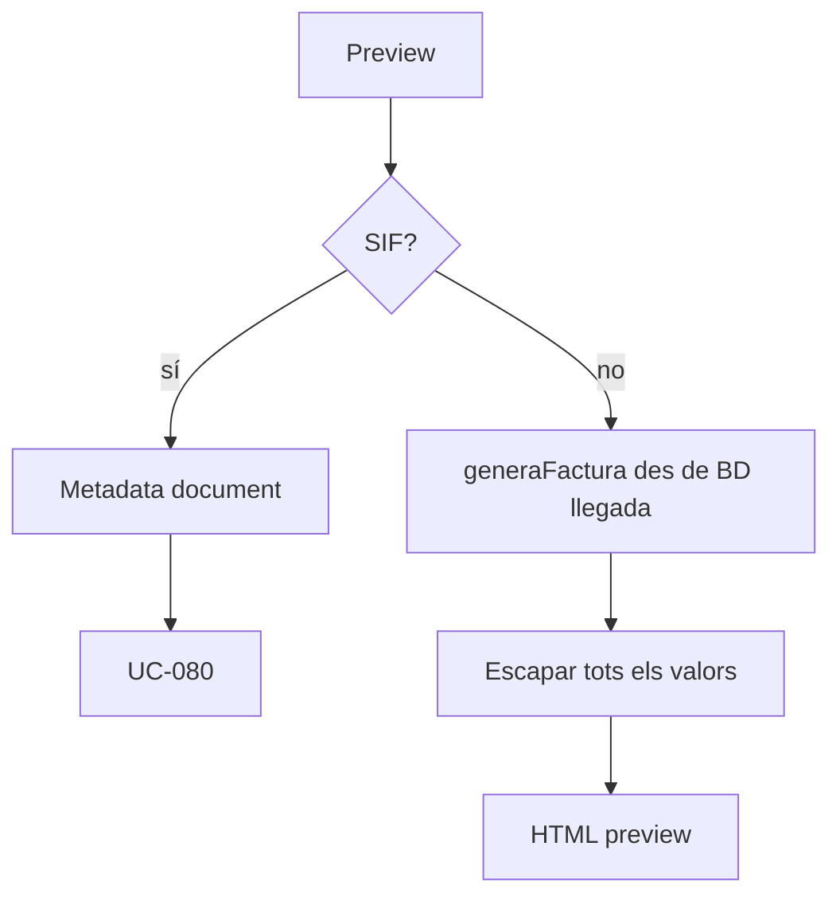

### FINAL
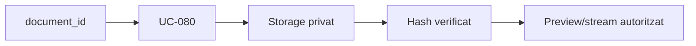

## F07 · Descarregar factura

### ACTUAL
```mermaid
flowchart TD
A[Clic descarregar] --> B{SIF?}
B -->|sí| C[POST sifDocument.php]
C --> D[HMAC + scope FULL]
D --> E[Hash/root/audit]
B -->|no| F[POST descarregaFactura.php]
F --> G[Same-origin + ROLS_VISUALITZAR]
G --> H[Guard: si ja és SIF, 409]
H --> I[generaFactura true,false]
I --> J[PDF temporal]
J --> K[Sense UPDATE generada]
```

### FINAL
```mermaid
flowchart LR
A[Descarregar] --> B[UC-080]
B --> C[Reautoritzar document]
C --> D[Audit ALLOWED/DENIED/FAILED]
D --> E[Bytes immutables]
```

## AL-18 · Descàrrega des de la fitxa alumne

### ACTUAL
```mermaid
flowchart TD
A[Modal factura alumne] --> B{Resolució SIF}
B -->|VIEW| C[document_id]
C --> D[UC-080]
B -->|NO_SIF| E[Fallback modal llegat]
E --> F[POST descarregaFactura]
F --> G[Mateix contracte F07-L]
```

### FINAL
```mermaid
flowchart LR
A[Fitxa alumne] --> B[UUID factura autoritzada]
B --> C[document_id]
C --> D[UC-080]
```
