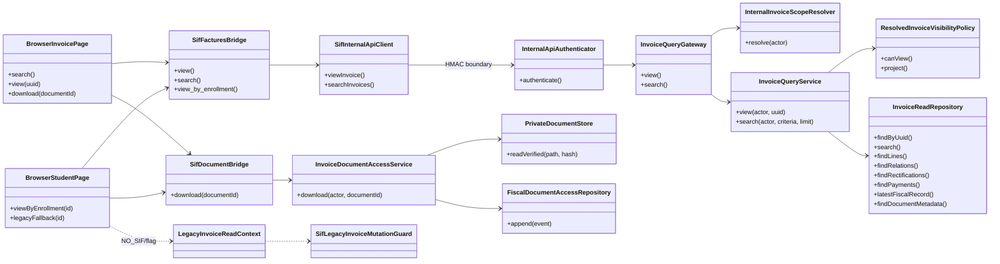
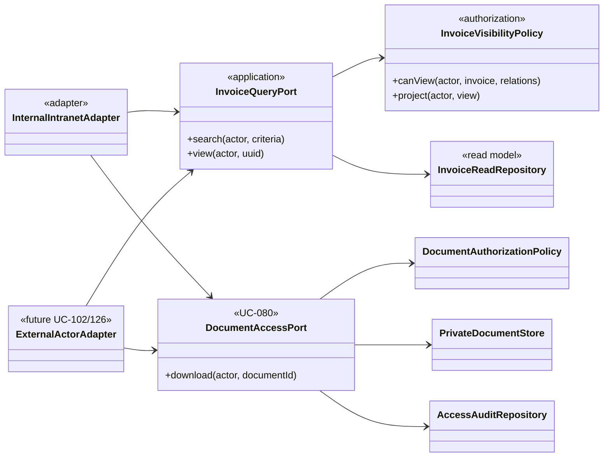

# UC-007 · Diagrames de classes ACTUAL / FINAL

## 1. ACTUAL — convivència

## 2. FINAL — frontera estable

## 3. Decisions

- `InvoiceQueryService` mai serveix bytes.
- `InvoiceDocumentAccessService` mai genera una factura/document fiscal nou.
- La política de lectura no rep scope fiable del navegador.
- El fallback llegat no forma part del model FINAL.
- Els adaptadors externs d'alumne/empresa requereixen política per recurs pròpia; el scope intern “all + projection” és exclusiu d'actors interns autoritzats.
