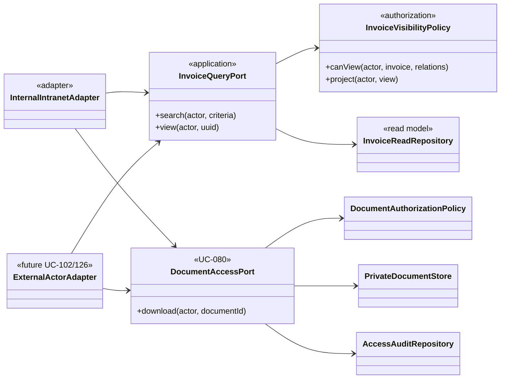
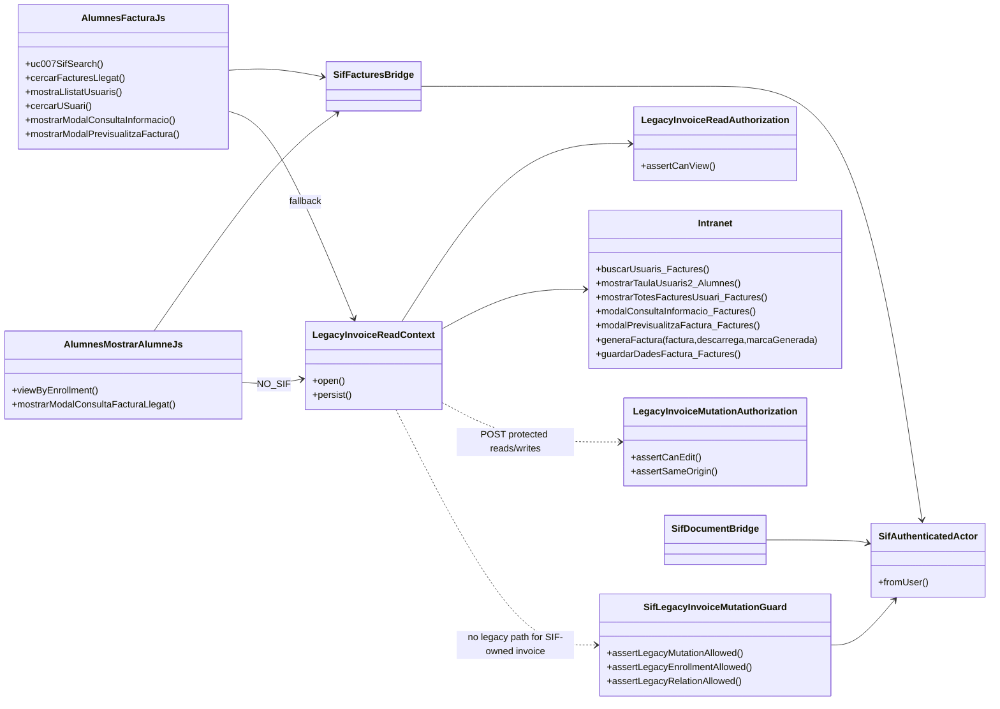

# UC-007 · Diagrames de classes ACTUAL / FINAL

## 1. ACTUAL — convivència

## 2. FINAL — frontera estable

## 5. Decisions

- `InvoiceQueryService` mai serveix bytes.
- `InvoiceDocumentAccessService` mai genera una factura/document fiscal nou.
- La política de lectura no rep scope fiable del navegador.
- El fallback llegat no forma part del model FINAL.
- Els adaptadors externs d'alumne/empresa requereixen política per recurs pròpia; el scope intern “all + projection” és exclusiu d'actors interns autoritzats.

## 3. ACTUAL — frontera intranet/llegat detallada

## 4. Mapatge de classes per superfície/apartat

| Superfície/apartat | Classes/adaptadors principals |
| --- | --- |
| F01 càrrega/rol | `comprovarSessio.php`, `LegacyInvoiceReadContext`, `LegacyInvoiceReadAuthorization`, `SifAuthenticatedActor`, `InternalInvoiceScopeResolver` |
| F02 cerca | `alumnes-factura.js`, `sifFactures.php`, `InvoiceQueryGateway`, `InvoiceQueryService`, `InvoiceQueryCriteriaValidator`, fallback `Intranet::buscarUsuaris_Factures` |
| F03 selector | `alumnes-factura.js`, `mostrarTaulaUsuaris2.php`, `Intranet::mostrarTaulaUsuaris2_Alumnes` |
| F04 llistat | `InvoiceQueryService` / fallback `Intranet::mostrarTotesFacturesUsuari_Factures` |
| F05 detall | `InvoiceQueryService::view` / fallback `Intranet::modalConsultaInformacio_Factures` + guard |
| F06 preview | metadata `InvoiceReadRepository` + UC-080 / fallback `Intranet::generaFactura(...,false)` |
| F07 download | `sifDocument.php`, `InvoiceDocumentAccessService`, `PrivateDocumentStore`, `FiscalDocumentAccessRepository`; fallback `generaFactura(...,true,false)` |
| AL-16/17/18 | `alumnes-mostrar-alumne.js`, `sifFactures.php`, `SifDocumentBridge`, fallback llegat |
