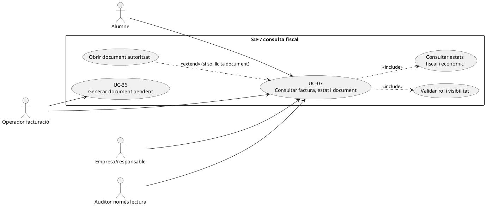
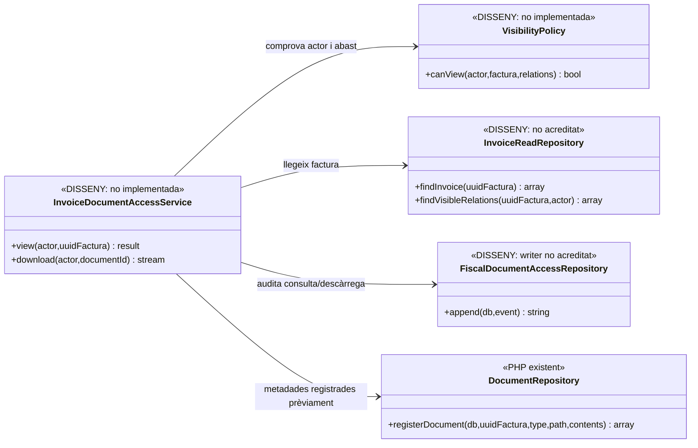
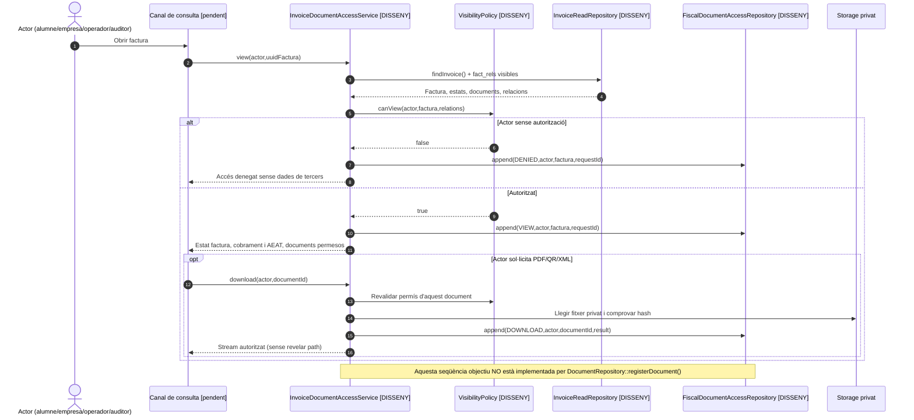

# UC-07 · Consultar factura, estat i document — fitxa i UML integrats

**Àmbit:** consulta autoritzada de l'estat fiscal, econòmic i dels documents d'una factura SIF. **No** equival a emetre, cobrar, rectificar, generar de nou un PDF, donar accés d'auditor ni exposar les dades de tots els inscrits d'una factura de grup.

**Estat:** el catàleg preveu actors i regles de visibilitat; existeixen `factura`, `fact_rels`, `factura_documents` i `DocumentRepository::registerDocument()` per registrar metadades de documents. **No s'ha acreditat** un servei PHP segur de lectura/descàrrega i control d'accés final que implementi totes les regles d'UC-07. La migració defineix `fiscal_document_access`, però una taula definida no prova registres d'accés operatius.

## 1. Fitxa funcional

| Camp | Comportament específic |
| --- | --- |
| Actors | Alumne, empresa/responsable, operador facturació, suport autoritzat i auditor només lectura, **cadascun amb visibilitat diferenciada**. |
| Entrada | Identificació d'actor/sessió o token segur i identificador de factura/document. Els UUIDs i URLs no són autorització per si sols. |
| Dades de consulta | `NUM_VISIBLE`, `ESTAT_FACTURA`, `ESTAT_COBRAMENT`, `ESTAT_AEAT`, línies visibles, moviments atribuïbles, document `PDF`/`QR`/`XML` segons permís i estat. |
| Resultat | Vista mínima autoritzada de factura, estat i document disponible; per a un document no generat, estat explícit, no reconstrucció espontània des de dades vives. |
| Dades que NO s'han d'exposar | Dades dels altres participants d'una factura conjunta, paths interns de fitxers, secrets, token reutilitzable i informació no fiscal innecessària en accés auditor. |

### 1.1. Flux principal objectiu

1. L'actor inicia consulta autenticada, o usa un enllaç amb token segur quan el seu canal ho preveu. L'adaptador servidor ha de comprovar identitat, rol, caducitat i abast de factura/document; **cap pantalla per si sola atorga permís**.
2. Es localitza la factura i es resol el rol efectiu. La documentació existent exigeix que l'alumne vegi únicament factures que li siguin visibles per receptor i `fact_rels.VISIBLE_ALUMNE`; l'empresa/responsable veu les factures on és receptor o pagador autoritzat, sense exposar persones alienes.
3. La consulta recupera per separat estat de factura, cobrament i resultat AEAT. **`ESTAT_COBRAMENT=PAID` no implica `ESTAT_AEAT=ACCEPTED`, ni al revés.**
4. S'identifica el document registrat a `factura_documents` pel tipus i hash. `DocumentRepository::registerDocument()` **registra metadades d'un fitxer i hash**, no genera PDF ni concedeix accés per si sol.
5. El servei de descàrrega objectiu comprova autorització de nou, registra un event d'accés a `fiscal_document_access` i serveix el document des de storage privat; **aquest servei no està acreditat en el codi consultat**.
6. Si falta document, informa d'estat pendent/incidència i deriva a UC-36/55; no modifica la factura i no retorna una ruta privada com si fos una URL pública.

### 1.2. Alternatives i riscos

| Escenari | Tractament |
| --- | --- |
| Alumne participant però receptor empresa | No assumir que pot veure tota la factura; cal decidir visibilitat segons rol i les relacions per línia. |
| Grup amb N participants | Filtrar dades i documents per dret d'accés; no mostrar dades d'altres alumnes en un sol PDF sense valorar si és possible la separació. |
| Empresa amb correu/enllaç segur | Validar token, receptor, caducitat i abast; **la possessió d'un URL sense comprovació és insuficient**. |
| Auditor temporal | Només lectura, dades fiscals autoritzades i registre d'accessos, sense operacions d'emissió/cobrament. |
| Document no generat o error PDF | Mostrar estat i obrir/consultar incidència UC-08; no regenerar silenciosament ni marcar la factura com a no emesa. |
| Document hash/path canviat | Error de custòdia que exigeix investigació, no substituir el hash històric ni servir un fitxer d'una altra factura. |
| Risc del llegat | Enllaç d'inscripció a factura a `fact_rels` **no prova** que una empresa hagi autoritzat tots els participants ni que una atribució de fons sigui visible a cadascun. |

### 1.3. Evidència de dades existent

`factura_documents` conté `UUID_FACTURA`, `TIPUS`, `PATH_FITXER`, `HASH_FITXER` i `ESTAT`. `fiscal_document_access` està definit en la migració d'auditoria amb referència al document/factura, acció, resultat, actor, canal i correlació. **No hi ha en aquesta revisió una prova d'integració que executi el flux actor→autorització→descàrrega→event.**

### 1.4. Cerca i consulta a la intranet llegada vs autorització del SIF

**Pantalla real.** `/alumnes/factura/` presenta «Consulta - Edita - Anul·la factura», i `consultaUsuarisFacturaRelacionada.php` permet cercar per DNI/NIE, correu, factura relacionada o número fiscal visible; quan la cerca retorna diversos candidats, `mostrarTaulaUsuaris2.php` en demana selecció, i `mostrarTotesFacturesUsuari_Factures.php` ofereix la llista. `mostraModalConsultaInformacio_Factures.php` mostra simultàniament dades d'inscripció (`A PAGAR`, fracció, pagaments) i dades de factura (número, receptor, CIF, concepte i import). **Localitzar per DNI d'un participant o per `FACTURA_RELACIONADA` no atorga dret a llegir tot el document d'una empresa o grup.** L'autorització final es comprova al servidor per receptor fiscal, relació concreta i canal.

**Accions diferents en una mateixa pantalla antiga.** Els controls de llista inclouen consulta, «anul·lar» i previsualitzar/descarregar PDF. La consulta SIF és **només lectura**; el llapis `.editar-apartat`, la crida `guardarDadesFactura_Factures.php` i `anularFactura_Factures.php` pertanyen als fluxos històrics que han de derivar a UC-05/28/30/31 quan correspongui. La marca `E_FACT` s'ha de gestionar com a acció administrativa diferenciada UC-32, no com a efecte de mostrar o descarregar una factura.

**Tres estats independents.** A la mateixa fitxa s'ha de veure separadament (1) existència/estat de la **factura emesa**, (2) saldo real de cobrament calculat de `payment_transaction/payment_allocation`, i (3) estat de registres/cua/AEAT. Una factura prèvia d'empresa és emesa encara que `ESTAT_COBRAMENT=PENDING`; un callback Redsys en cua pot no haver acabat d'atribuir diners, i un PDF en generació no transforma la factura en proforma. `FACTURA_RELACIONADA` és una agrupació històrica: consultar original A i rectificativa R pels identificadors/document propis, no reconstruir una sola factura amb l'última versió del llegat.

**PDF històric vs PDF SIF.** El modal antic `mostraModalPrevFactura_Factures.php` i `descarregaFactura.php` poden regenerar el PDF amb `generaFactura($id,true)` i dades llegades vives. A la consulta de factura SIF cal servir un document custodiat per UUID/hash i permisos, amb estat `PENDING` quan el job encara no l'ha escrit; no invocar `generaFactura()` per sobreescriure'n l'artefacte. Un alumne inclòs en una factura d'empresa pot veure que el seu pagament és responsabilitat de l'entitat i l'estat atribuïble a la seva inscripció, però no per defecte el CIF, les altres persones o el PDF complet del receptor.

### 1.5. Proves de consulta i separació d'estats (no executades)

| ID | Escenari | Resultat exigible |
| --- | --- | --- |
| CF-01 | Alumne busca per DNI i hi ha factura emesa al seu responsable | Veure informació mínima autoritzada, no PDF complet de l'empresa per pertànyer al grup. |
| CF-02 | Factura emesa abans de pagar i PDF pendent | Mostrar factura real, deute pendent i document no disponible; no regenerar PDF del llegat. |
| CF-03 | Factura original A amb rectificativa R | Documents separats i relació explícita per UUID, no una reconstrucció actualitzada de l'original. |
| CF-04 | `ESTAT_COBRAMENT=PAID` amb cua AEAT pendent | Mostrar estats diferents, sense presentar pagament com a acceptació remota. |
| CF-05 | Operador consulta factura i intenta editar CIF des del llapis antic | Derivar a UC-05/74 amb autorització; cap UPDATE a la factura emesa. |
| CF-06 | Enllaç públic identifica un UUID de factura però no acredita receptor | Denegar lectura/descàrrega fins a autorització del servidor. |

## 2. Diagrama UML de casos d'ús

## 3. Subdiagrama de classes: existent i servei objectiu

**Important:** no es dedueix que `DocumentRepository` exposi lectura o descarrega: el seu mètode comprovat és **només** `registerDocument()`. Les altres classes són noms del disseny, no fitxers PHP trobats.

## 4. Seqüència — consulta/descàrrega autoritzada (DISSENY)

## 5. Proves pendents i traçabilitat

Exigir proves per alumne receptor/no receptor, empresa i participants múltiples, grup, auditor només lectura, token caducat, ID manipulat, PDF pendent, hash incorrecte, fallada d'auditoria, accés registrat i absència de paths interns en resposta.

[Fitxa original UC-07](../06-fitxes-funcionals/uc-007.md) · [Catàleg i regles de visibilitat](../04-estat-final/33-casos-us-sif.md) · [Migració document i accés](../../sif/database/migrations/2026_09_15_000003_add_functional_audit_control.sql) · [DocumentRepository](../../sif/src/Repository/DocumentRepository.php) · [Test metadades de document](../../sif/tests/Integration/DocumentsAndIncidentsTest.php) · [UC-21 empresa](uc-021-empresa-responsable-paga-inscripcions.md).

**Pendent de validar:** permisos i canals reals, URL/entrega, custòdia de documents, generació efectiva i registre d'accés.
