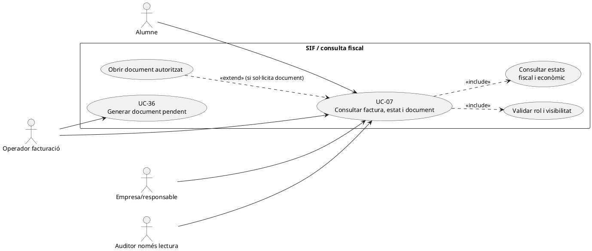
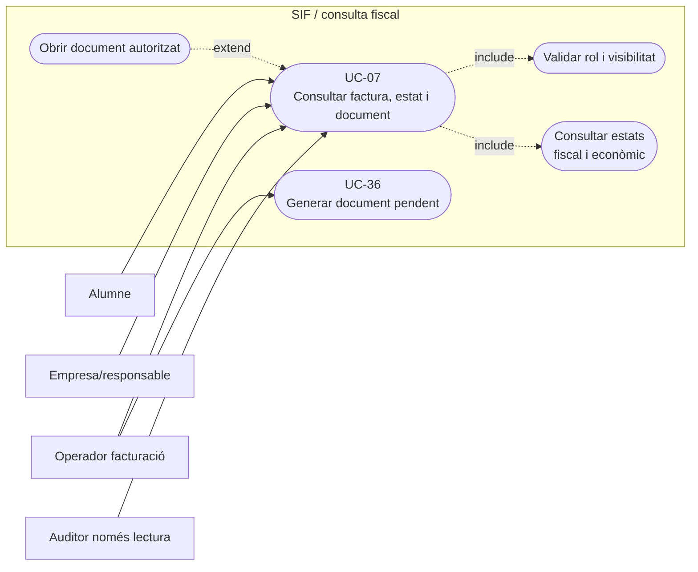
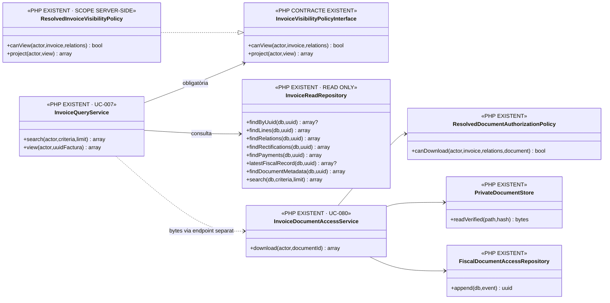
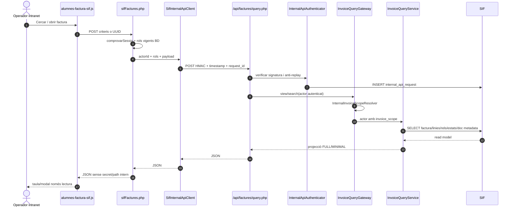

# UC-07 · Consultar factura, estat i document — fitxa i UML integrats

**Àmbit:** consulta autoritzada de l'estat fiscal, econòmic i dels documents d'una factura SIF. **No** equival a emetre, cobrar, rectificar, generar de nou un PDF, donar accés d'auditor ni exposar les dades de tots els inscrits d'una factura de grup.

**Estat:** implementació parcial executable. Existeixen `InvoiceReadRepository`, `InvoiceQueryService`, `InvoiceVisibilityPolicyInterface`, `ResolvedInvoiceVisibilityPolicy`, endpoint intern HMAC `api/factures/query.php`, client servidor→servidor de la intranet i guard de convivència amb el llegat. UC-080 també disposa d'endpoint intern de download, `InvoiceDocumentAccessService`, `PrivateDocumentStore`, política FULL i writer `fiscal_document_access`. **Pendents:** configuració/desplegament per entorn i proves E2E/preproducció; el navegador no rep secrets ni paths interns.

## 1. Fitxa funcional

| Camp | Comportament específic |
| --- | --- |
| Actors | Alumne, empresa/responsable, operador facturació, suport autoritzat i auditor només lectura, **cadascun amb visibilitat diferenciada**. |
| Entrada | Identificació d'actor/sessió o token segur i identificador de factura/document. Els UUIDs i URLs no són autorització per si sols. |
| Dades de consulta | `NUM_VISIBLE`, `ESTAT_FACTURA`, `ESTAT_COBRAMENT`, `ESTAT_AEAT`, línies visibles, moviments atribuïbles, document `PDF`/`QR`/`XML` segons permís i estat. |
| Resultat | Vista mínima autoritzada de factura, estat i document disponible; per a un document no generat, estat explícit, no reconstrucció espontània des de dades vives. |
| Dades que NO s'han d'exposar | Dades dels altres participants d'una factura conjunta, paths interns de fitxers, secrets, token reutilitzable i informació no fiscal innecessària en accés auditor. |

### 1.1. Flux principal objectiu

1. L'actor inicia consulta autenticada, o usa un enllaç amb token segur quan el seu canal ho preveu. L'adaptador servidor ha de comprovar identitat, rol, caducitat i abast de factura/document; **cap pantalla per si sola atorga permís**.
2. Es localitza la factura i es resol el rol efectiu. La documentació existent exigeix que l'alumne vegi únicament factures que li siguin visibles per receptor i `fact_rels.VISIBLE_ALUMNE`; l'empresa/responsable veu les factures on és receptor o pagador autoritzat, sense exposar persones alienes.
3. La consulta recupera per separat estat de factura, cobrament i resultat AEAT. **`ESTAT_COBRAMENT=PAID` no implica `ESTAT_AEAT=ACCEPTED`, ni al revés.**
4. S'identifica el document registrat a `factura_documents` pel tipus i hash. `DocumentRepository::registerDocument()` **registra metadades d'un fitxer i hash**, no genera PDF ni concedeix accés per si sol.
5. El servei de descàrrega objectiu comprova autorització de nou, registra un event d'accés a `fiscal_document_access` i serveix el document des de storage privat; **aquest servei no està acreditat en el codi consultat**.
6. Si falta document, informa d'estat pendent/incidència i deriva a UC-36/55; no modifica la factura i no retorna una ruta privada com si fos una URL pública.

### 1.2. Alternatives i riscos

| Escenari | Tractament |
| --- | --- |
| Alumne participant però receptor empresa | No assumir que pot veure tota la factura; cal decidir visibilitat segons rol i les relacions per línia. |
| Grup amb N participants | Filtrar dades i documents per dret d'accés; no mostrar dades d'altres alumnes en un sol PDF sense valorar si és possible la separació. |
| Empresa amb correu/enllaç segur | Validar token, receptor, caducitat i abast; **la possessió d'un URL sense comprovació és insuficient**. |
| Auditor temporal | Només lectura, dades fiscals autoritzades i registre d'accessos, sense operacions d'emissió/cobrament. |
| Document no generat o error PDF | Mostrar estat i obrir/consultar incidència UC-08; no regenerar silenciosament ni marcar la factura com a no emesa. |
| Document hash/path canviat | Error de custòdia que exigeix investigació, no substituir el hash històric ni servir un fitxer d'una altra factura. |
| Risc del llegat | Enllaç d'inscripció a factura a `fact_rels` **no prova** que una empresa hagi autoritzat tots els participants ni que una atribució de fons sigui visible a cadascun. |

### 1.3. Evidència de dades existent

`factura_documents` conté `UUID_FACTURA`, `TIPUS`, `PATH_FITXER`, `HASH_FITXER` i `ESTAT`. `fiscal_document_access` està definit en la migració d'auditoria amb referència al document/factura, acció, resultat, actor, canal i correlació. **No hi ha en aquesta revisió una prova d'integració que executi el flux actor→autorització→descàrrega→event.**

### 1.4. Cerca i consulta a la intranet llegada vs autorització del SIF

**Pantalla real.** `/alumnes/factura/` presenta «Consulta - Edita - Anul·la factura», i `consultaUsuarisFacturaRelacionada.php` permet cercar per DNI/NIE, correu, factura relacionada o número fiscal visible; quan la cerca retorna diversos candidats, `mostrarTaulaUsuaris2.php` en demana selecció, i `mostrarTotesFacturesUsuari_Factures.php` ofereix la llista. `mostraModalConsultaInformacio_Factures.php` mostra simultàniament dades d'inscripció (`A PAGAR`, fracció, pagaments) i dades de factura (número, receptor, CIF, concepte i import). **Localitzar per DNI d'un participant o per `FACTURA_RELACIONADA` no atorga dret a llegir tot el document d'una empresa o grup.** L'autorització final es comprova al servidor per receptor fiscal, relació concreta i canal.

**Accions diferents en una mateixa pantalla antiga.** Els controls de llista inclouen consulta, «anul·lar» i previsualitzar/descarregar PDF. La consulta SIF és **només lectura**; el llapis `.editar-apartat`, la crida `guardarDadesFactura_Factures.php` i `anularFactura_Factures.php` pertanyen als fluxos històrics que han de derivar a UC-05/28/30/31 quan correspongui. La marca `E_FACT` s'ha de gestionar com a acció administrativa diferenciada UC-32, no com a efecte de mostrar o descarregar una factura.

**Tres estats independents.** A la mateixa fitxa s'ha de veure separadament (1) existència/estat de la **factura emesa**, (2) saldo real de cobrament calculat de `payment_transaction/payment_allocation`, i (3) estat de registres/cua/AEAT. Una factura prèvia d'empresa és emesa encara que `ESTAT_COBRAMENT=PENDING`; un callback Redsys en cua pot no haver acabat d'atribuir diners, i un PDF en generació no transforma la factura en proforma. `FACTURA_RELACIONADA` és una agrupació històrica: consultar original A i rectificativa R pels identificadors/document propis, no reconstruir una sola factura amb l'última versió del llegat.

**PDF històric vs PDF SIF.** El modal antic `mostraModalPrevFactura_Factures.php` i `descarregaFactura.php` poden regenerar el PDF amb `generaFactura($id,true)` i dades llegades vives. A la consulta de factura SIF cal servir un document custodiat per UUID/hash i permisos, amb estat `PENDING` quan el job encara no l'ha escrit; no invocar `generaFactura()` per sobreescriure'n l'artefacte. Un alumne inclòs en una factura d'empresa pot veure que el seu pagament és responsabilitat de l'entitat i l'estat atribuïble a la seva inscripció, però no per defecte el CIF, les altres persones o el PDF complet del receptor.

### 1.5. Proves de consulta i separació d'estats (no executades)

| ID | Escenari | Resultat exigible |
| --- | --- | --- |
| CF-01 | Alumne busca per DNI i hi ha factura emesa al seu responsable | Veure informació mínima autoritzada, no PDF complet de l'empresa per pertànyer al grup. |
| CF-02 | Factura emesa abans de pagar i PDF pendent | Mostrar factura real, deute pendent i document no disponible; no regenerar PDF del llegat. |
| CF-03 | Factura original A amb rectificativa R | Documents separats i relació explícita per UUID, no una reconstrucció actualitzada de l'original. |
| CF-04 | `ESTAT_COBRAMENT=PAID` amb cua AEAT pendent | Mostrar estats diferents, sense presentar pagament com a acceptació remota. |
| CF-05 | Operador consulta factura i intenta editar CIF des del llapis antic | Derivar a UC-05/74 amb autorització; cap UPDATE a la factura emesa. |
| CF-06 | Enllaç públic identifica un UUID de factura però no acredita receptor | Denegar lectura/descàrrega fins a autorització del servidor. |

## 2. Diagrama UML de casos d'ús

```plantuml
@startuml
left to right direction
actor "Alumne" as Student
actor "Empresa/responsable" as Company
actor "Operador facturació" as Op
actor "Auditor només lectura" as Audit
rectangle "SIF / consulta fiscal" {
 usecase "UC-07\nConsultar factura, estat i document" as Consult
 usecase "Validar rol i visibilitat" as Auth
 usecase "Consultar estats\nfiscal i econòmic" as Status
 usecase "Obrir document autoritzat" as Doc
 usecase "UC-36\nGenerar document pendent" as Gen
}
Student --> Consult
Company --> Consult
Op --> Consult
Audit --> Consult
Consult ..> Auth : <<include>>
Consult ..> Status : <<include>>
Doc ..> Consult : <<extend>> (si sol·licita document)
Op --> Gen
@enduml
```

### Vista del cas d'ús a GitHub (Mermaid)

```mermaid
flowchart LR
  a_0["Alumne"]
  a_1["Empresa/responsable"]
  a_2["Operador facturació"]
  a_3["Auditor només lectura"]
  subgraph SIF_BOUNDARY["SIF / consulta fiscal"]
    u_0(["UC-07<br/>Consultar factura, estat i document"])
    u_1(["Validar rol i visibilitat"])
    u_2(["Consultar estats<br/>fiscal i econòmic"])
    u_3(["Obrir document autoritzat"])
    u_4(["UC-36<br/>Generar document pendent"])
  end
  a_0 --> u_0
  a_1 --> u_0
  a_2 --> u_0
  a_3 --> u_0
  u_0 -.->|include| u_1
  u_0 -.->|include| u_2
  u_3 -.->|extend| u_0
  a_2 --> u_4
```

## 3. Subdiagrama de classes — implementat parcial + frontera UC-080

```mermaid
classDiagram
direction LR
class InvoiceQueryService {
 <<PHP EXISTENT · UC-007>>
 +search(actor,criteria,limit) array
 +view(actor,uuidFactura) array
}
class InvoiceVisibilityPolicyInterface {
 <<PHP CONTRACTE EXISTENT>>
 +canView(actor,invoice,relations) bool
 +project(actor,view) array
}
class ResolvedInvoiceVisibilityPolicy {
 <<PHP EXISTENT · SCOPE SERVER-SIDE>>
 +canView(actor,invoice,relations) bool
 +project(actor,view) array
}
class InvoiceReadRepository {
 <<PHP EXISTENT · READ ONLY>>
 +findByUuid(db,uuid) array?
 +findLines(db,uuid) array
 +findRelations(db,uuid) array
 +findRectifications(db,uuid) array
 +findPayments(db,uuid) array
 +latestFiscalRecord(db,uuid) array?
 +findDocumentMetadata(db,uuid) array
 +search(db,criteria,limit) array
}
class InvoiceDocumentAccessService {
 <<PHP EXISTENT · UC-080>>
 +download(actor,documentId) array
}
class ResolvedDocumentAuthorizationPolicy {
 <<PHP EXISTENT>>
 +canDownload(actor,invoice,relations,document) bool
}
class PrivateDocumentStore {
 <<PHP EXISTENT>>
 +readVerified(path,hash) bytes
}
class FiscalDocumentAccessRepository {
 <<PHP EXISTENT>>
 +append(db,event) uuid
}
InvoiceQueryService --> InvoiceVisibilityPolicyInterface : obligatòria
ResolvedInvoiceVisibilityPolicy ..|> InvoiceVisibilityPolicyInterface
InvoiceQueryService --> InvoiceReadRepository : consulta
InvoiceQueryService ..> InvoiceDocumentAccessService : bytes via endpoint separat
InvoiceDocumentAccessService --> ResolvedDocumentAuthorizationPolicy
InvoiceDocumentAccessService --> PrivateDocumentStore
InvoiceDocumentAccessService --> FiscalDocumentAccessRepository
```

**Implementat:** servei/repositori de lectura, política fail-closed, resolver de scope per rols signats, autenticació HMAC anti-replay, endpoint intern de consulta, clients/proxies de la intranet i servei UC-080 de bytes amb storage/hash/auditoria. El repositori de lectura no retorna `PATH_FITXER`. **Pendent:** activar/configurar secrets, rols, storage i feature flags per entorn i executar la bateria E2E documentada.
## 3.1. Seqüència implementada parcialment — consulta interna signada

```mermaid
sequenceDiagram
autonumber
actor O as Operador intranet
participant UI as alumnes-factura-sif.js
participant B as sifFactures.php
participant S as SifInternalApiClient
participant API as /api/factures/query.php
participant H as InternalApiAuthenticator
participant G as InvoiceQueryGateway
participant Q as InvoiceQueryService
participant DB as SIF
O->>UI: Cercar / obrir factura
UI->>B: POST criteris o UUID
B->>B: comprovarSessio + rols vigents BD
B->>S: actorId + rols + payload
S->>API: POST HMAC + timestamp + request_id
API->>H: verificar signatura i anti-replay
H->>DB: INSERT internal_api_request
API->>G: view/search(actor autenticat)
G->>G: InternalInvoiceScopeResolver
G->>Q: actor amb invoice_scope
Q->>DB: SELECT factura/linies/rels/estats/doc metadata
DB-->>Q: read model
Q-->>API: projecció FULL/MINIMAL
API-->>S: JSON
S-->>B: JSON
B-->>UI: JSON sense secret/path intern
UI-->>O: taula/modal només lectura
```

La cerca per DNI/email té dues branques al pont: coincidència amb receptor fiscal i resolució d'IDs d'inscripció llegada → `fact_rels.SOURCE_ID`; els resultats es dedupliquen per UUID. L'API SIF no confon participant amb receptor.

## 4. Seqüència FINAL — consultar factura i, opcionalment, demanar document

~~~mermaid
sequenceDiagram
autonumber
actor A as Actor
participant UI as Canal
participant Q as InvoiceQueryService [PHP]
participant Auth as ResolvedInvoiceVisibilityPolicy [PHP]
participant R as InvoiceReadRepository [PHP]
participant Doc as InvoiceDocumentAccessService [PHP UC-080]
participant Av as PrivateDocumentStore [PHP]
A->>UI: Cercar/obrir factura
UI->>Q: search/view(actor,criteri|UUID)
Q->>Auth: Resoldre abast de factura
alt Sense autorització
  Auth-->>Q: DENIED
  Q-->>UI: Denegació sense dades de tercers
else Autoritzat
  Auth-->>Q: ALLOWED
  Q->>R: SELECT factura, línies, relacions, rectificacions i estats
  R-->>Q: Projecció autoritativa
  Q-->>UI: UUID/NUM_VISIBLE + estats + metadata documental
  opt Actor demana PDF/QR/XML
    UI->>Doc: download(actor,documentId,token/sessió)
    Doc->>Auth: Revalidar document/actor
    Doc->>Av: Comprovar bytes, hash, UUID i disponibilitat
    alt Disponible i íntegre
      Av-->>Doc: bytes verificats
      Doc-->>UI: Stream privat + registre d'accés
    else Denegat/absent/hash incorrecte
      Doc-->>UI: Resultat tipificat + registre d'intent/incidència
    end
  end
end
Note over Q,R: UC-007 no executa UPDATE/INSERT fiscal o econòmic per una lectura.
~~~

## 5. Cobertura detallada ACTUAL/FINAL

L'auditoria per pantalla i subacció, amb F01–F07, AL-16–AL-18, diagrames ACTUAL/FINAL, incidències de permisos/identitat/PDF/històric i matriu de proves, queda consolidada a:

**[Auditoria detallada UC-007 · 2026-09-29](02-auditoria-detallada-uc-007-consultar-factura-estat-document-2026-09-29.md).**

Punts de tancament documental:

- F05 consulta una fila per ID, però F06/F07 passen a FACTURA_RELACIONADA i poden reconstruir diverses files; FINAL conserva UUID_FACTURA.
- El PDF llegat pot agrupar original i rectificativa; FINAL manté documents independents.
- tePermisVisualitzacio/tePermisEdicio del client o de la pàgina no substitueixen autorització per recurs.
- GENERAT no és un estat documental SIF fiable: està acoblat a descàrrega i a gates administratius.
- L'emissor/text fiscal/logo del generador llegat són dades del codi/recurs actual, no prova de document històric immutable.
- VISIBLE_ALUMNE=1 és una dada de relació, no una autorització completa.
- CREATED a factura_documents és metadata; disponibilitat real exigeix storage/hash verificats.
- La consulta repetida no crea emissió, pagament, rectificació ni document fiscal nou.

## 6. Proves pendents i evidència existent

**Tests localitzats, no executats en aquesta revisió:** DocumentsAndIncidentsTest comprova metadata/hash de registre; HistoricalInvoiceMigrationServiceTest comprova importació històrica sense alta/cua fiscal; HttpEndpointsTest cobreix textualment endpoints existents d'emissió/pagament/redsys. Cap d'aquests acredita encara actor → consulta autoritzada → document → audit d'accés.

La matriu executable pendent és a l'auditoria detallada i inclou autorització per recurs, original/rectificativa, cerca, estats independents, històric, bytes/hash, token/grant, repetició/concurrència i invariants de zero mutació.

[Fitxa funcional UC-07](../06-fitxes-funcionals/uc-007.md) · [Auditoria detallada UC-007](02-auditoria-detallada-uc-007-consultar-factura-estat-document-2026-09-29.md) · [Catàleg i regles de visibilitat](../04-estat-final/33-casos-us-sif.md) · [UC-55 custòdia](uc-055-custodiar-reintentar-documents.md) · [UC-78 generació/custòdia](uc-078-generar-custodiar-pdf-qr-xml.md) · [UC-80 accés documental](uc-080-servir-registrar-acces-document-fiscal.md) · [DocumentRepository](../../sif/src/Repository/DocumentRepository.php) · [Test metadades](../../sif/tests/Integration/DocumentsAndIncidentsTest.php).

**Estat final d'aquesta revisió:** DOCUMENTAT I IMPLEMENTAT PARCIALMENT: consulta interna signada, scope per rols, UI intranet, streaming privat UC-080 i bloqueig del llegat ja tenen codi. Pendents: desplegament/configuració per entorn i proves E2E ajornades.
