# UC-007 · Diagrames de seqüència ACTUAL / FINAL

## S1. Cerca a `/alumnes/factura/` — ACTUAL revalidat

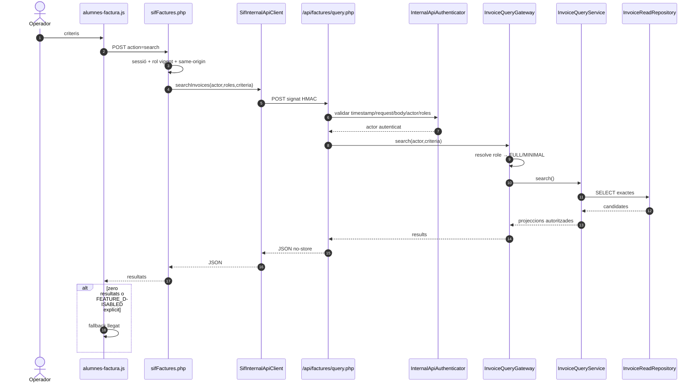

## S2. Detall factura SIF

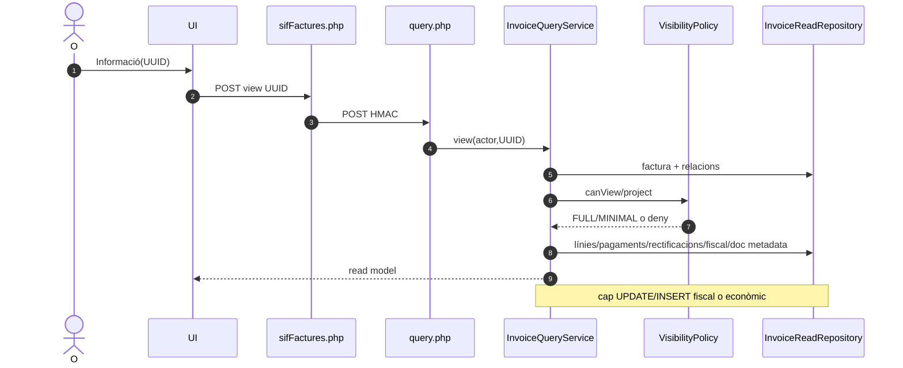

## S3. AL-16 — camp factura de fitxa alumne

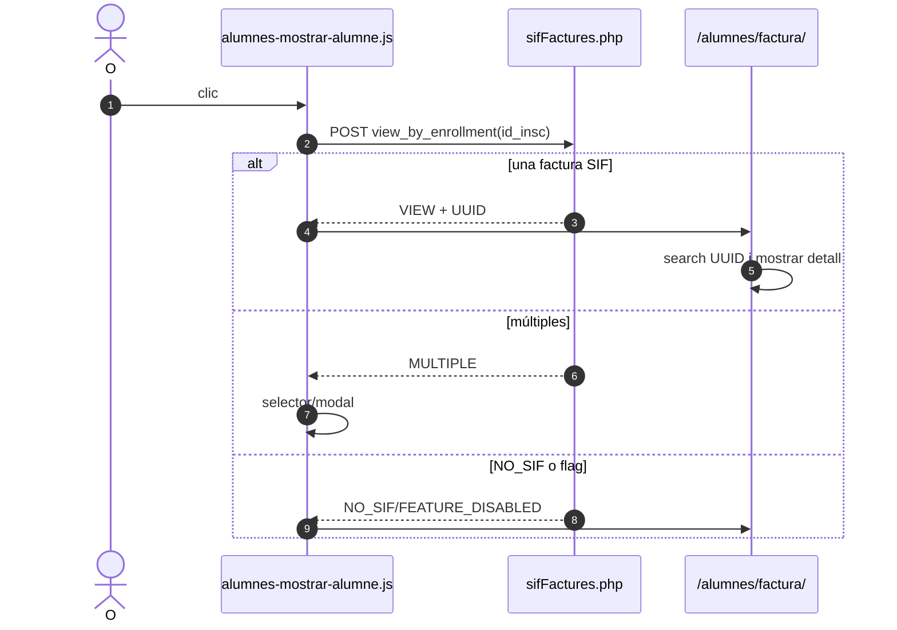

## S4. AL-17 — modal des d'inscripció

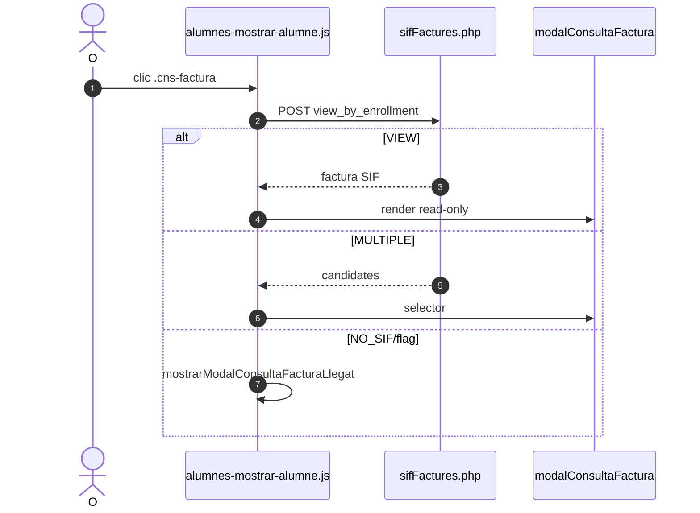

## S5. UC-080 — document

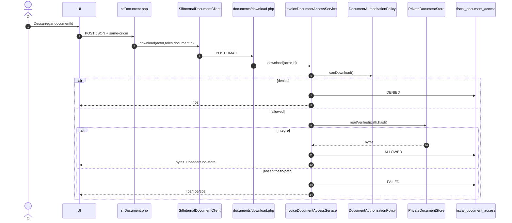

## S6. F02–F04 · Fallback llegat de cerca, selector i llistat — ACTUAL

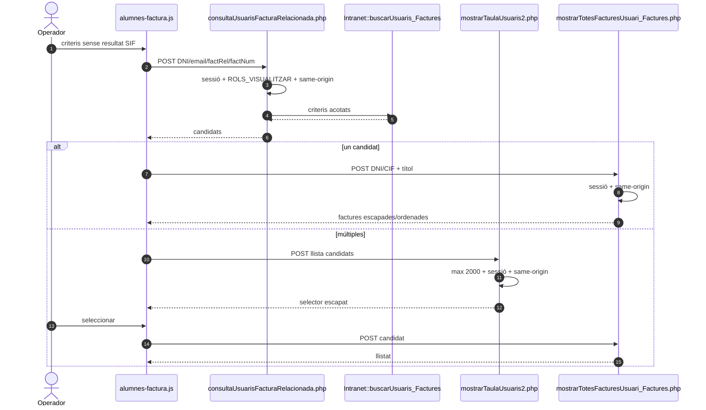

### FINAL F02–F04

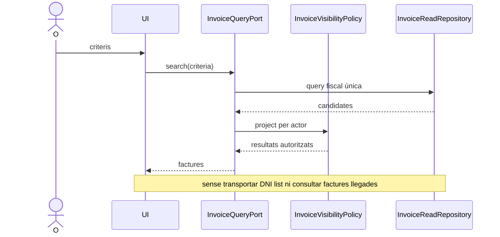

## S7. F05 · Detall i edició llegada transitòria — ACTUAL

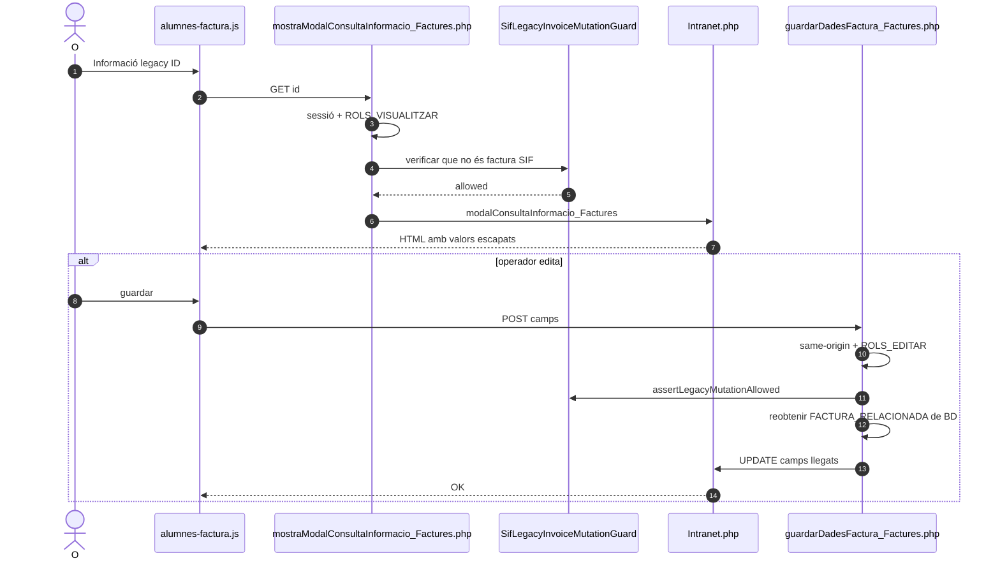

### FINAL F05

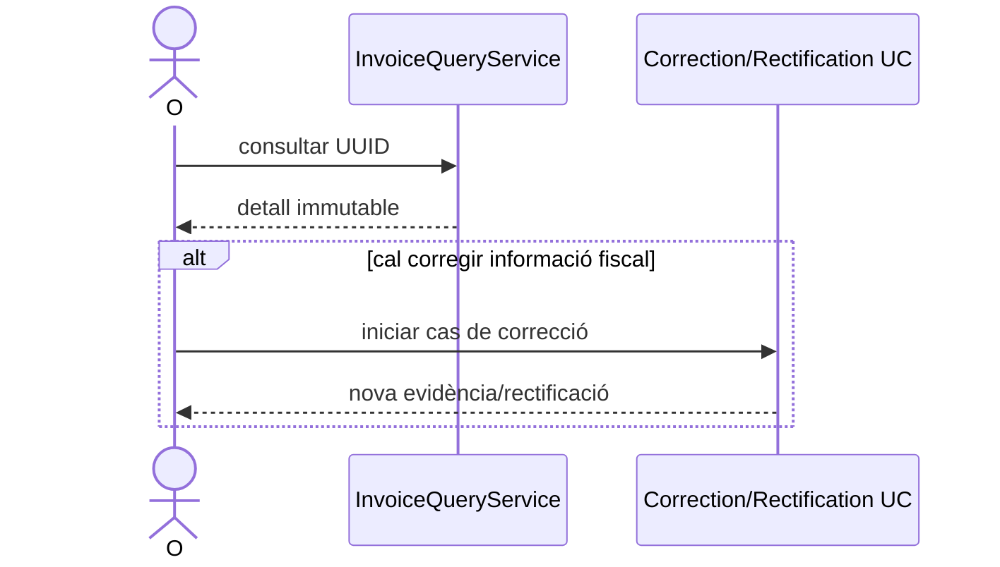

## S8. F06–F07 · Preview i descàrrega llegada — ACTUAL

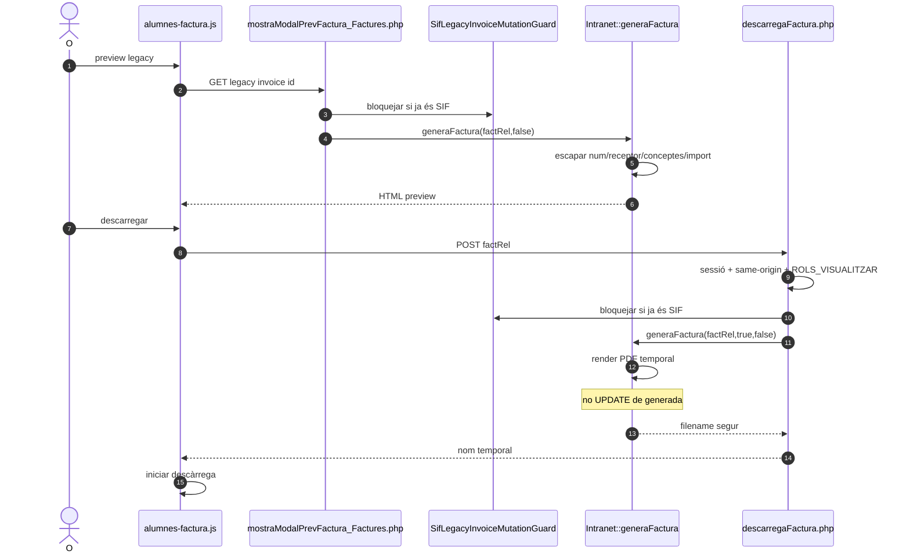

### FINAL F06–F07

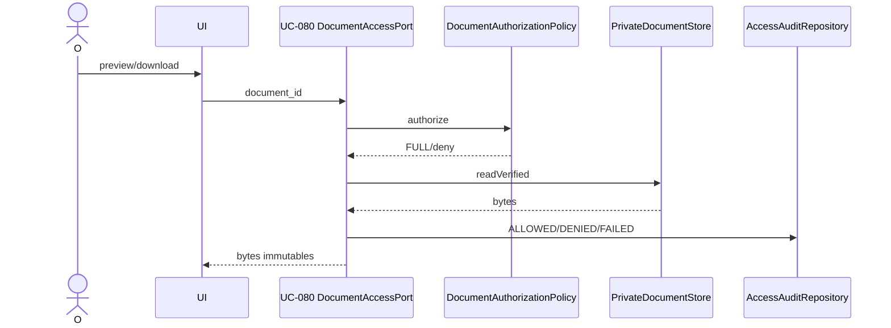

## S9. AL-18 · Descàrrega des de fitxa alumne

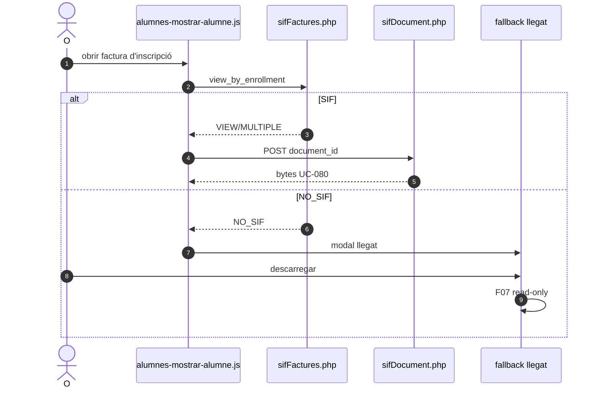

### FINAL AL-18

AL-18 reutilitza exclusivament S4 + S5: inscripció → UUID autoritzat → document_id → UC-080.

## S10. FINAL GLOBAL

El FINAL conserva la frontera de consulta SIF i UC-080, elimina S6/S7/S8 llegats, i manté factura i document en serveis separats. Qualsevol correcció fiscal surt d'UC-007 cap al cas d'ús de rectificació corresponent.
