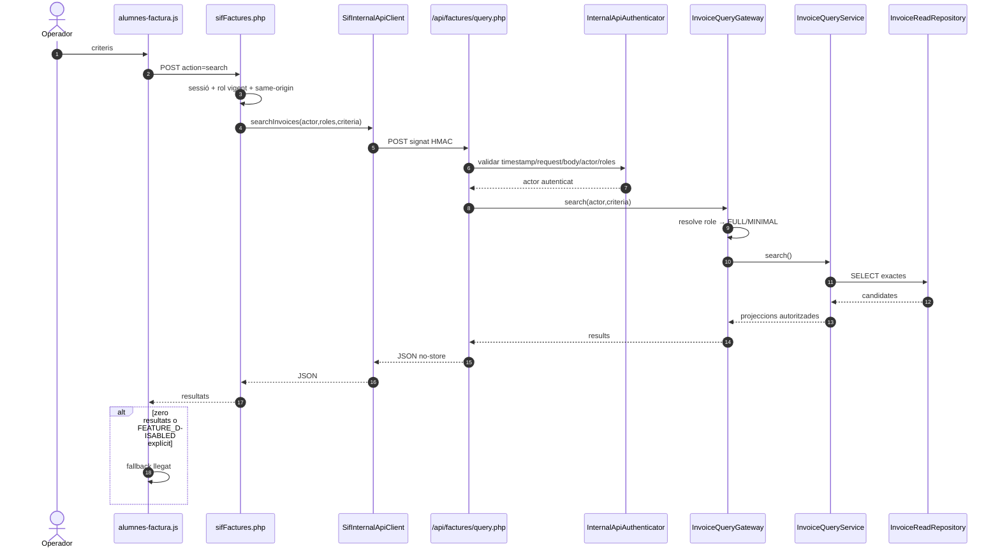
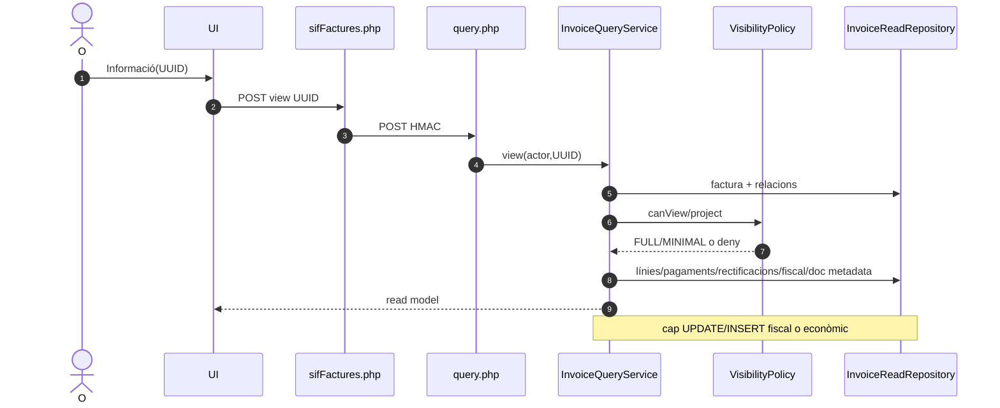
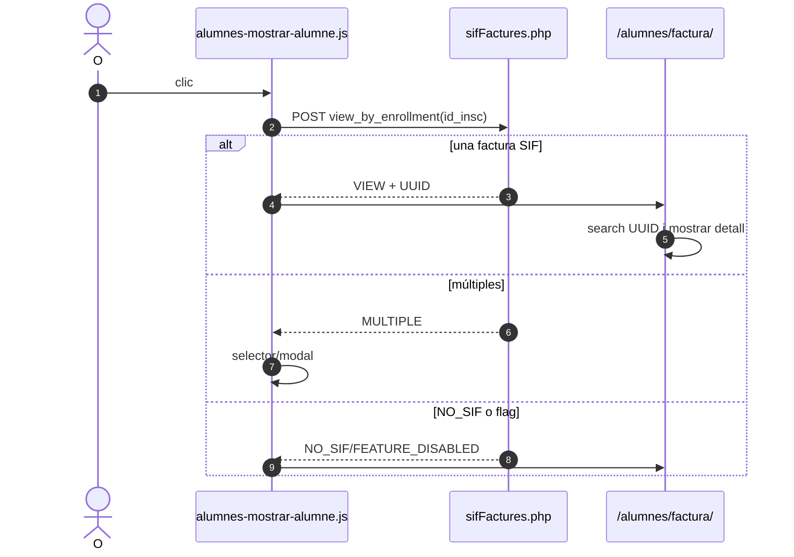
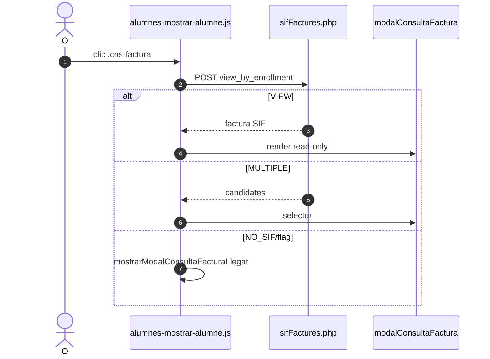
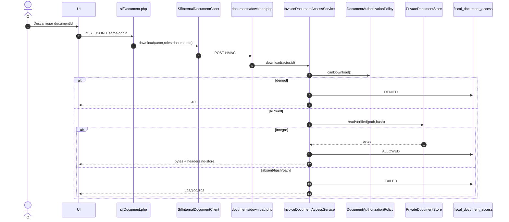

# UC-007 · Diagrames de seqüència ACTUAL / FINAL

## S1. Cerca a `/alumnes/factura/` — ACTUAL revalidat

## S2. Detall factura SIF

## S3. AL-16 — camp factura de fitxa alumne

## S4. AL-17 — modal des d'inscripció

## S5. UC-080 — document

## S6. FINAL

El FINAL conserva S1–S5 eliminant el fallback llegat i substituint els adaptadors interns/externs segons actor. La factura i el document continuen en fronteres separades.
