# UC-008 — Diagrames d'activitat ACTUAL/FINAL per pàgina i apartat

**Data:** 29/09/2026  
**Objectiu:** aplicar el criteri RM-037 al UC-008. Quan la UI encara no existeix, el diagrama ACTUAL ho diu explícitament i representa només el backend real; no s'inventa una pantalla.

Vegeu [classes](uc-008-classes-actual-final.md), [seqüències](uc-008-sequencies-actual-final.md) i [fitxa integrada](uc-008-gestionar-incidencia-sif.md).

## 0. Inventari de pàgines/apartats

| ID | Superfície | Apartats | ACTUAL | FINAL |
| --- | --- | --- | --- | --- |
| P-INC-01 | `pay.prisma.cat/sif/incidencies` · llistat | filtres, prioritat/estat, obrir detall | UI no acreditada; API list sí | panell autenticat |
| P-INC-02 | detall d'incidència | capçalera, recurs, timeline, evidències | API view sí; UI no | expedient complet |
| P-INC-03 | accions de lifecycle | assignar, evidència, resoldre, dismiss, reobrir | API/service sí; UI no | controls per rol |
| P-INC-04 | Intranet · VERI*FACTU | indicador, resum, enllaç | no acreditat | read-only + fallback indisponibilitat |
| A-INC-05 | obertura automàtica | Redsys, AEAT integritat/dead-letter | implementat parcial | tots els detectors rellevants |
| A-INC-06 | reparació | derivació a UC específic | manual/orquestrada per cas | derivació explícita correlacionada |

## 1. P-INC-01 · Llistat

### 1.1 ACTUAL

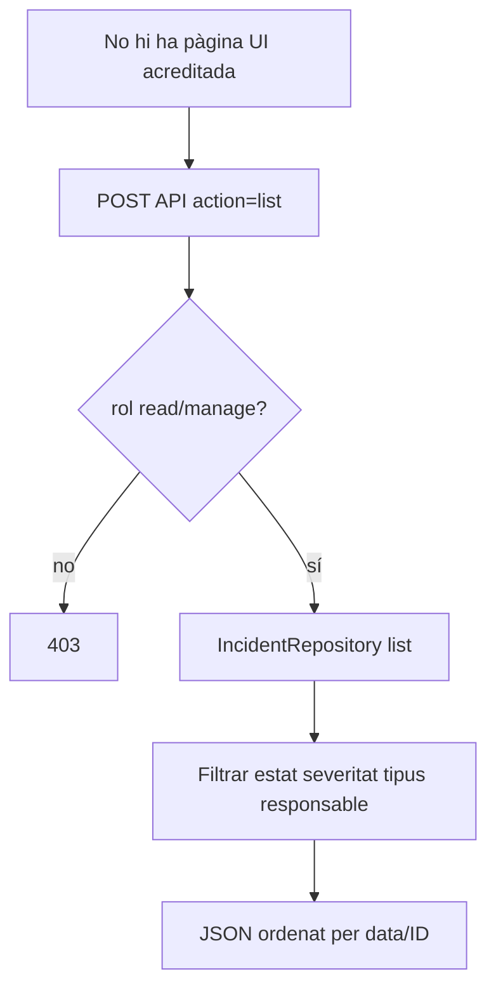

### 1.2 FINAL

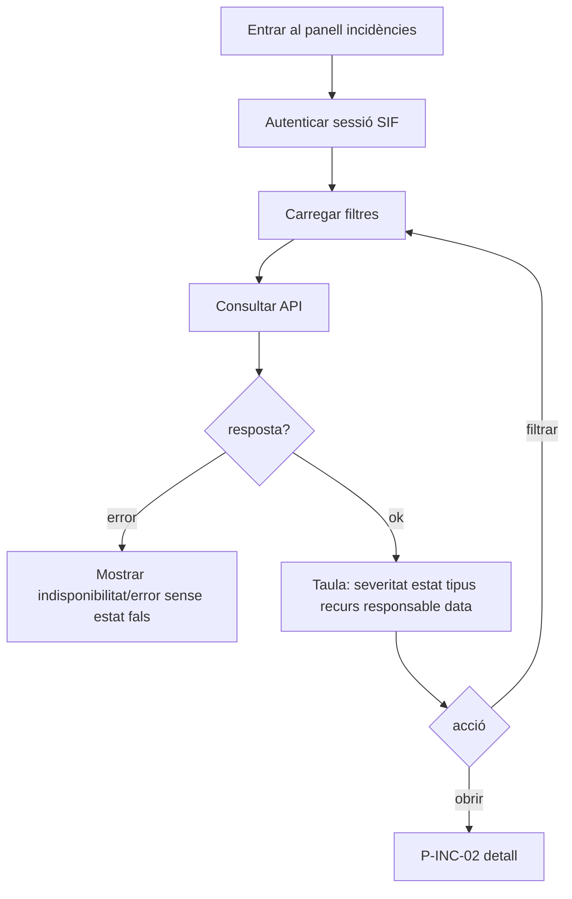

## 2. P-INC-02 · Detall

### 2.1 ACTUAL

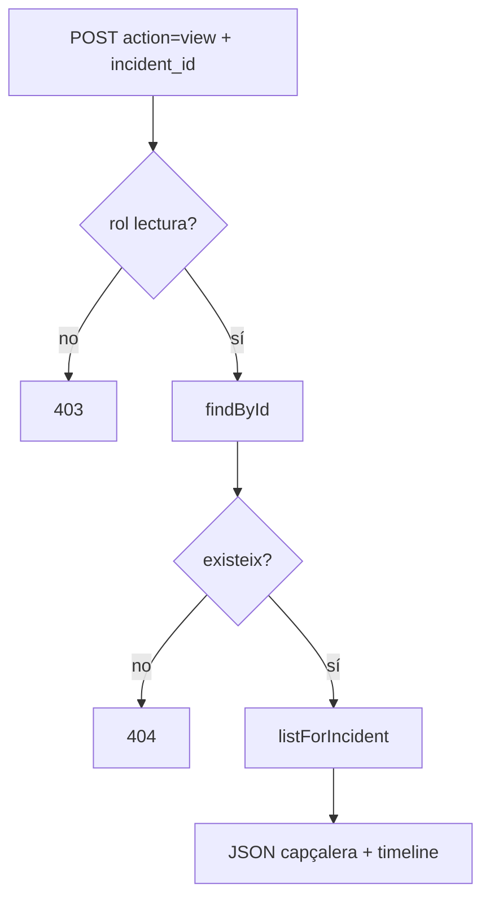

### 2.2 FINAL

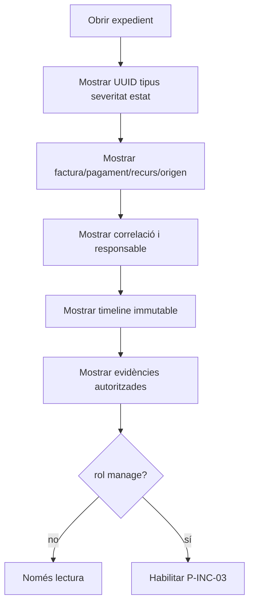

## 3. P-INC-03A · Assignar / triage

### ACTUAL

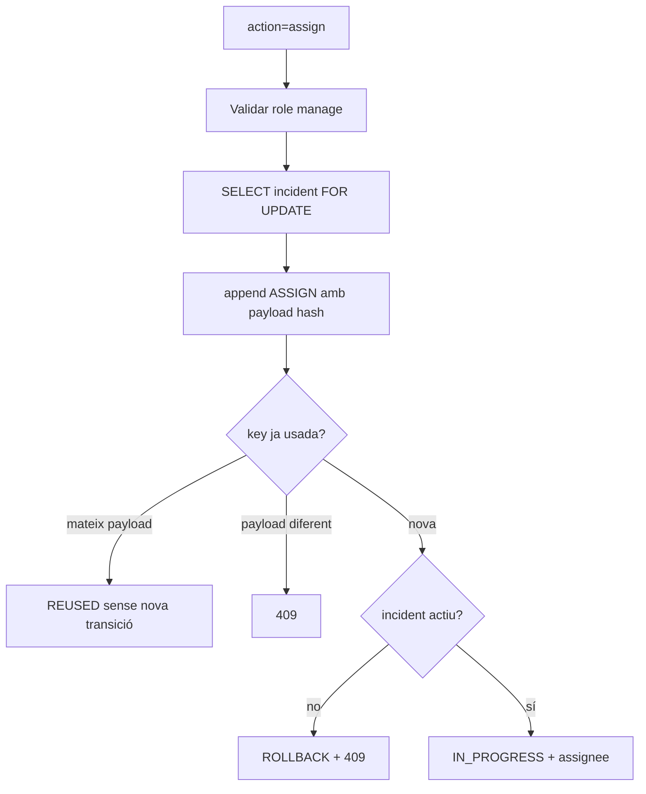

### FINAL

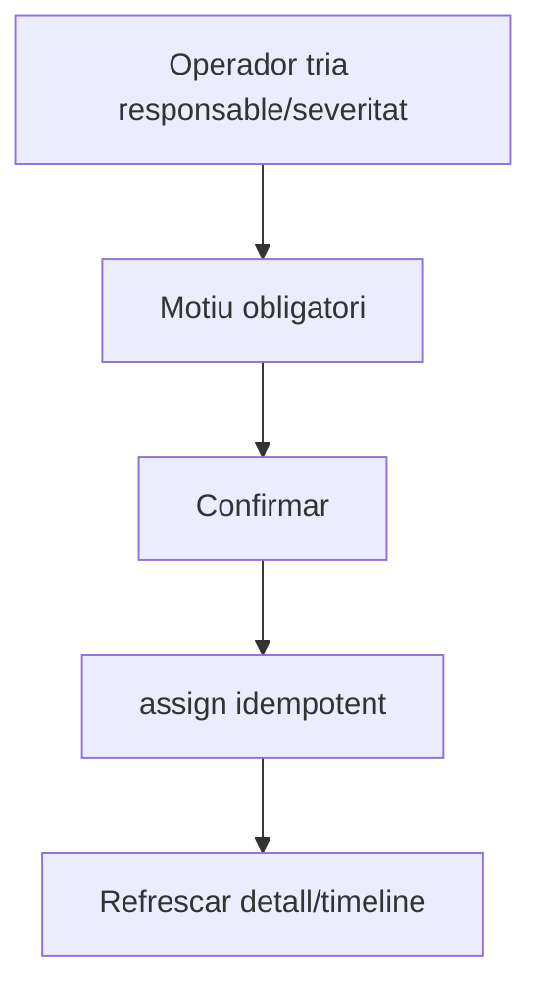

## 4. P-INC-03B · Afegir evidència

### ACTUAL

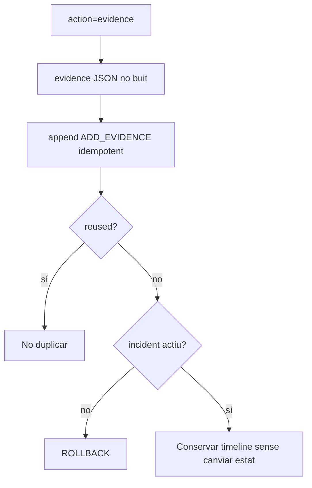

### FINAL

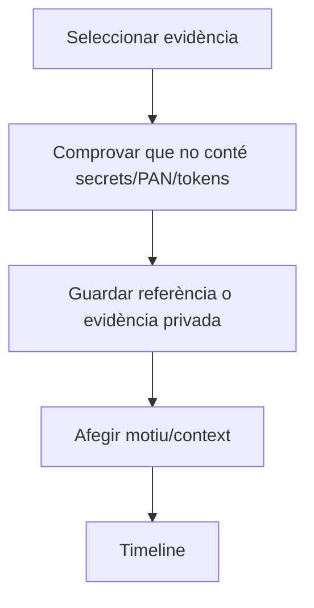

## 5. P-INC-03C · Resoldre / dismiss

### ACTUAL

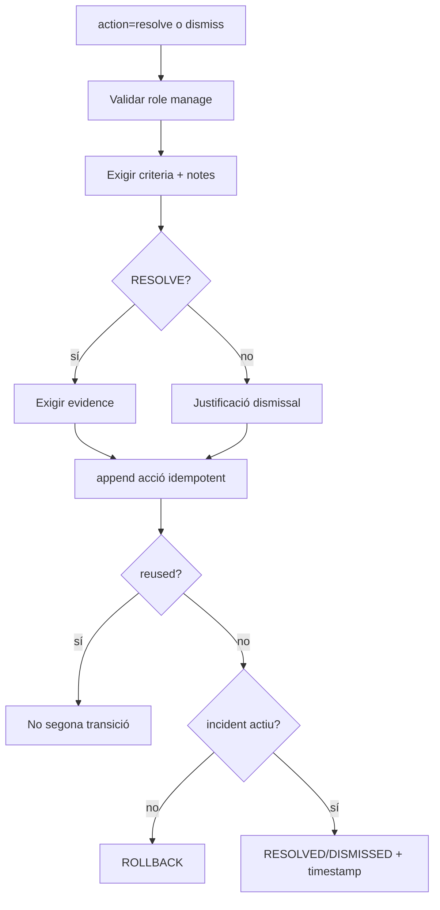

### FINAL

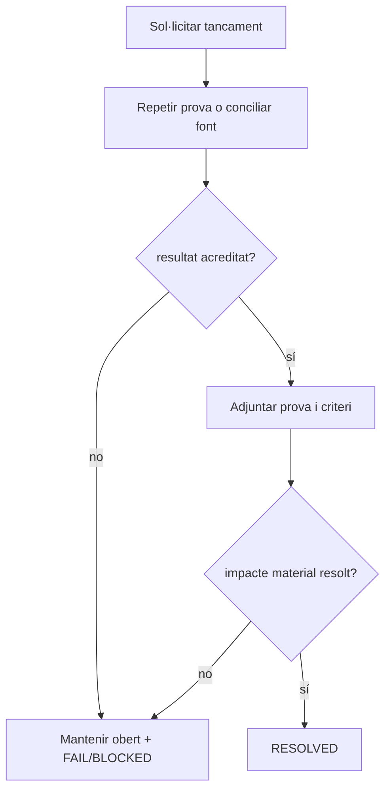

## 6. P-INC-03D · Reobrir

### ACTUAL

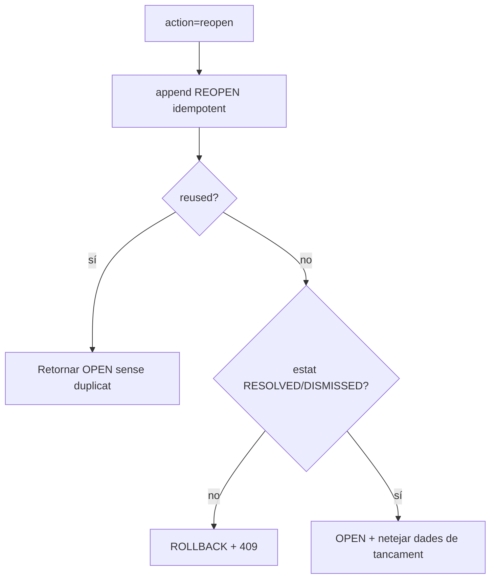

### FINAL

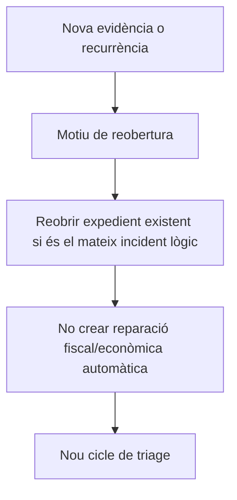

## 7. A-INC-05 · Obertura automàtica

### ACTUAL

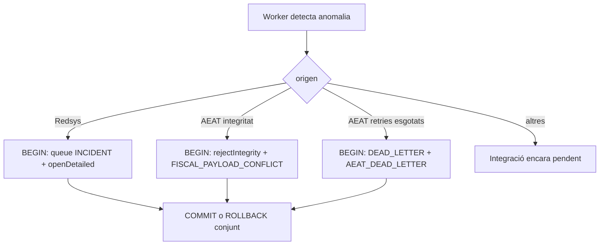

### FINAL

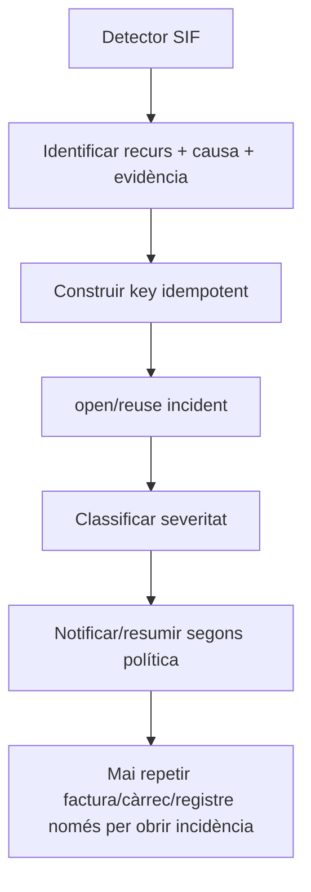

## 8. A-INC-06 · Reparació

### ACTUAL

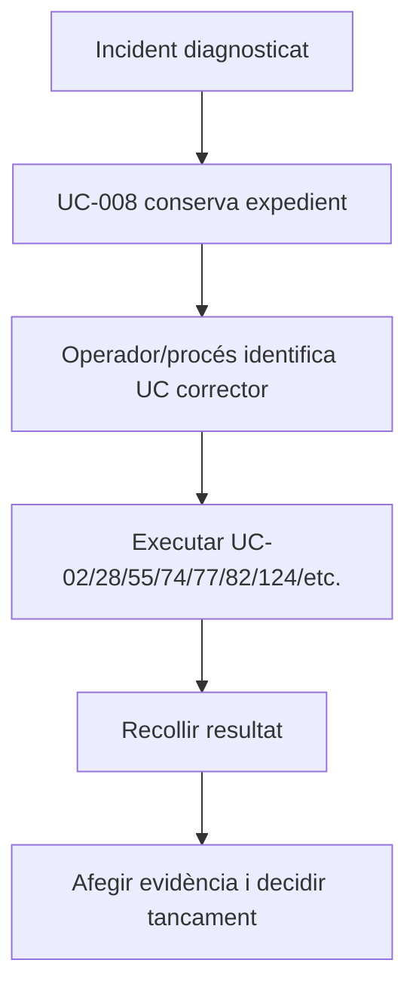

### FINAL

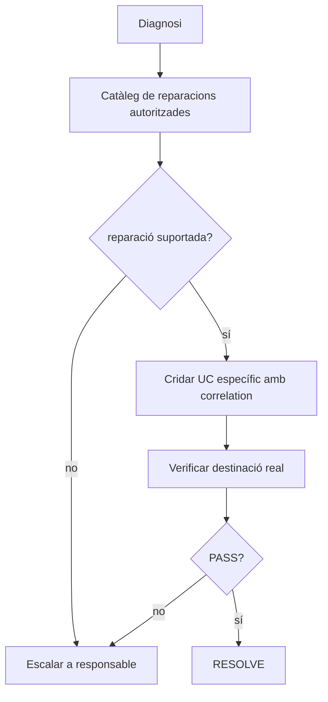

## 9. P-INC-04 · Intranet VERI*FACTU

### ACTUAL

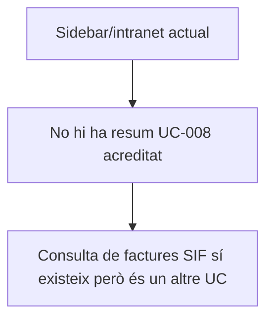

### FINAL

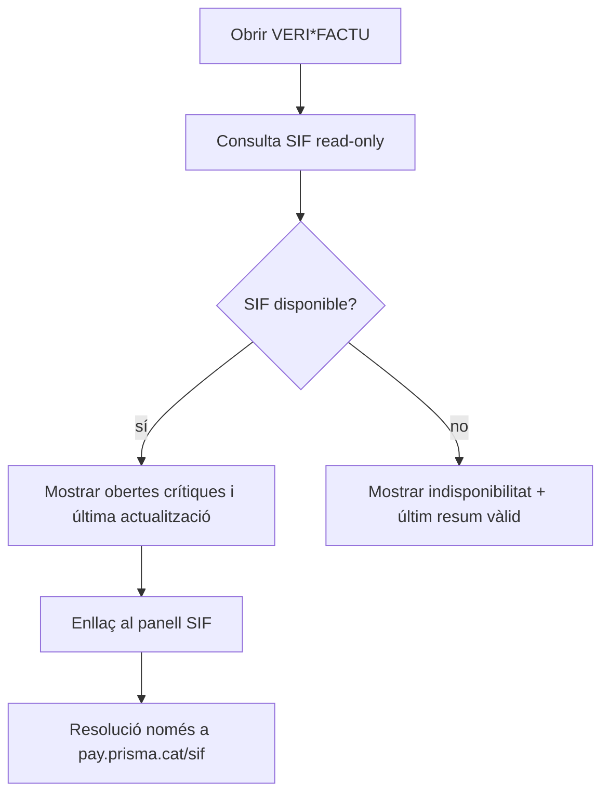

## 10. Cobertura

**Pàgines/superfícies identificades:** 4.  
**Accions transversals amb activitat pròpia:** 2.  
**Parells ACTUAL/FINAL:** 10.  
**UI implementada:** 0 de 4 superfícies; backend API/lifecycle sí.  
**No s'ha inventat cap pantalla com a implementada.**
