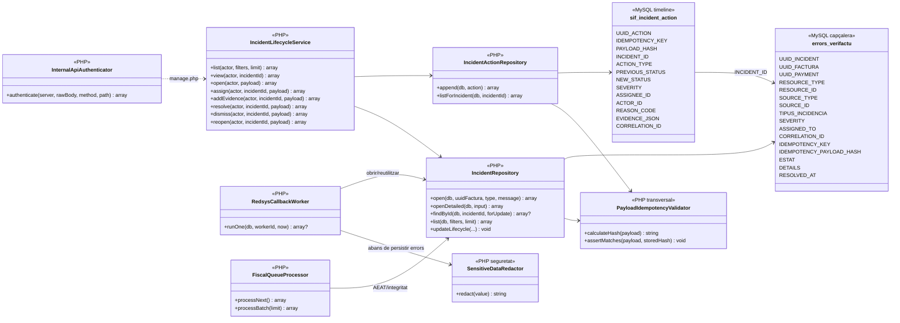
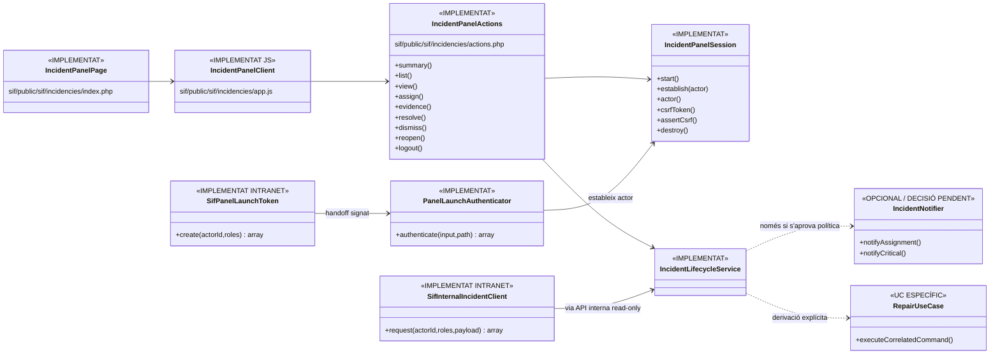

# UC-008 — Diagrames de classes ACTUAL i FINAL

**Data d'auditoria:** 30/09/2026  
**Estat de referència:** integrat a `main` mitjançant el PR #18 (2026-09-30); aquesta fitxa descriu el backend existent després del merge.  
**Regla:** ACTUAL = codi PHP/SQL/JS real integrat a `main`. FINAL = arquitectura objectiu després de la implementació; els components ja codificats es marquen com a existents i només el desplegament/configuració d'entorn queda pendent.

Vegeu també [fitxa integrada UC-008](uc-008-gestionar-incidencia-sif.md), [seqüències](uc-008-sequencies-actual-final.md), [activitats](uc-008-activitats-pagines-incidencies-actual-final.md) i [UC-081 lifecycle](uc-081-cicle-complet-incidencia.md).

## 1. CL-008-ACTUAL · Backend executable

## 2. Classes ACTUALS i estat

| Component | Estat | Observació |
| --- | --- | --- |
| `IncidentRepository` | IMPLEMENTAT + CONCURRÈNCIA VERIFICADA | `open()` + `openDetailed()`; duplicate concurrent recuperat amb current read `FOR UPDATE` sota MySQL REPEATABLE READ |
| `IncidentActionRepository` | IMPLEMENTAT | timeline append-only i idempotent |
| `IncidentLifecycleService` | IMPLEMENTAT | lifecycle backend, sense reparació genèrica |
| `PayloadIdempotencyValidator` | REUTILITZAT | hash canònic del payload, conflicte si divergeix |
| `InternalApiAuthenticator` | IMPLEMENTAT PREVI | HMAC, timestamp, request-id i anti-replay |
| `SensitiveDataRedactor` | IMPLEMENTAT | redacció de PAN Luhn, CVV, signatures, secrets/password/merchant key |
| `RedsysCallbackWorker` | INTEGRAT | job INCIDENT + expedient atòmic; payload estable per `UUID_JOB`; redacció sensible abans de `LAST_ERROR/DETAILS` |
| `FiscalQueueProcessor` | INTEGRAT | incidència per integritat/dead-letter, deduplicada per `fiscal_queue.ID`; REVIEW per outcome incert |
| `errors_verifactu` | AMPLIAT | capçalera/lifecycle |
| `sif_incident_action` | AMPLIAT | idempotency key + payload hash; accions concurrents serialitzades per lock de capçalera |
| UI de panell | IMPLEMENTADA AL CODI | handoff HMAC, sessió SIF, CSRF, vista, accions i resum intranet; desplegament pendent |

## 3. CL-008-FINAL · Arquitectura objectiu reconciliada

### Diferència ACTUAL / FINAL

A nivell de codi, **ACTUAL i FINAL ja coincideixen en el nucli funcional**. El FINAL no requereix crear un segon controlador, una segona vista ni un segon client d'incidències. El que queda fora del repositori és:

- desplegament/configuració real;
- rols i secrets reals;
- alta/verificació del menú de la intranet;
- E2E de navegador/preproducció;
- SLA/notificacions només si s'aproven funcionalment.

## 4. Regla de frontera

No es crearà un segon `IncidentWorkflowService`. **UC-008 i UC-081 comparteixen `IncidentLifecycleService`**. La reparació d'una factura, pagament, document, cua AEAT o matrícula no es converteix en un mètode genèric del lifecycle: es deriva al cas d'ús responsable amb la mateixa correlació.

## 5. Pendent per tancar entorn

- desplegament/configuració productiva del panell;
- alta del menú VERI*FACTU a la BD de menú de la intranet;
- política real de rols, severitats i SLA;
- notificacions si s'aproven;
- evidència E2E de preproducció/producció.

**UI existent al repositori:** `PanelLaunchAuthenticator`, `IncidentPanelSession`, `sif/public/sif/incidencies/*`, `SifInternalIncidentClient`, `SifPanelLaunchToken` i `sif-verifactu.php`.
