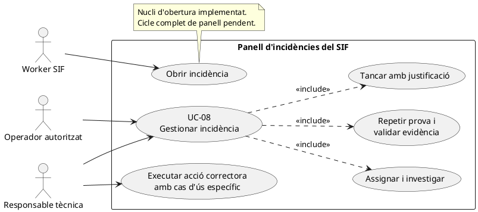
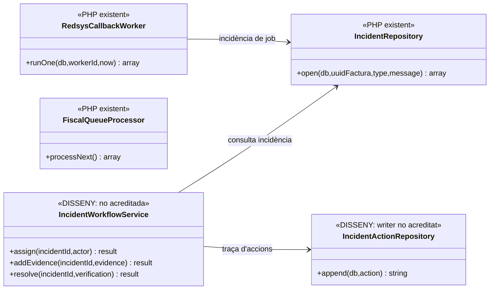
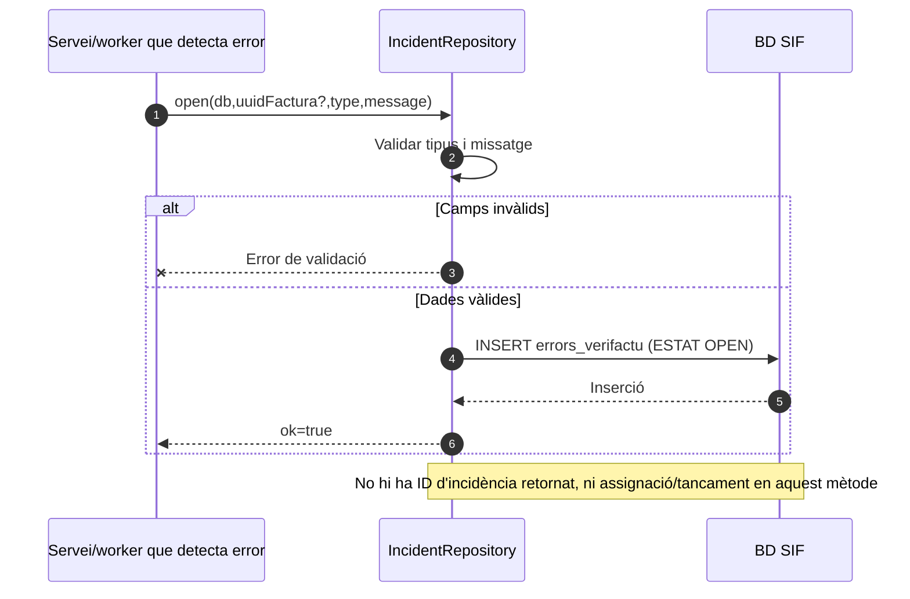

# UC-08 · Gestionar una incidència SIF — fitxa i UML integrats

**Àmbit:** detectar, obrir, assignar, investigar i tancar una incidència fiscal, econòmica, documental o de sincronització. **La incidència no autoritza per si sola a modificar una factura emesa o a moure diners.** Cada acció correctora correspon al seu cas d'ús i ha de deixar rastre propi.

**Estat del codi consultat:** `IncidentRepository::open(db,uuidFactura,type,message)` crea una fila `OPEN` a `errors_verifactu`. Existeix l'esquema `sif_incident_action` per registrar el cicle d'operació, però **no s'ha acreditat el workflow executable complet** (assignació, notes, prova de correcció, tancament) ni el panell final de `pay.prisma.cat/sif/incidencies`. Els workers poden obrir incidències de forma parcial.

## 1. Fitxa de cas d'ús

| Camp | Regla |
| --- | --- |
| Actors | Procés automàtic SIF/worker pot **obrir** incidència; responsable tècnica i operadors segons permís poden consultar/assignar/investigar; només persona autoritzada pot validar resolució de negocis/fiscalitat. |
| Disparador | Error o anomalia: AEAT rebutja, cua queda bloquejada, PDF falla, callback contradictori, factura amb cobrament no reconciliat o diferència SIF↔llegat. |
| Identificadors d'objecte | Factura, pagament, crèdit, inscripció, operació/event, job o prova, segons el cas. `IncidentRepository::open()` actual només admet `uuidFactura` opcional, tipus i missatge: falta generalitzar la vinculació a altres objectes. |
| Entrada mínima codi existent | `type` no buit i màxim 50 caràcters, `message` no buit; `uuidFactura` nul o existent quan s'aporta. |
| Resultat inicial actual | `errors_verifactu` fila `OPEN`; el servei retorna `ok=true`, **no retorna un ID d'incidència**. |
| Resultat de negoci objectiu | Responsable assignada, historial d'accions i evidència de correcció; tancament únicament després de verificar la prova/conciliació corresponent. |

### 1.1. Flux actual d'obertura (IMPLEMENTAT)

1. Un servei/worker detecta una anomalia i la qualifica, sense alterar factura/pagament només per haver-la detectat.
2. `IncidentRepository::open()` normalitza tipus/missatge i rebutja valors buits o fora de límit.
3. Insereix a `errors_verifactu` `UUID_FACTURA`, `TIPUS_INCIDENCIA`, `ESTAT=OPEN`, `DETAILS`.
4. Retorna `ok=true`. El nucli no assigna persona, no registra una prova de correcció i no tanca la incidència.

### 1.2. Flux de gestió objectiu (NO ACREDITAT AL PHP CONSULTAT)

5. El panell intern oficial ha de mostrar incidències i relacionar-les amb factura/pagament/inscripció/event; els avisos d'intranet són consulta secundària, no font de veritat.
6. La persona autoritzada acusa recepció, assigna responsable, documenta diagnosi i acció correctora amb actor, data, motiu, resultat i evidència; cada transició es guarda a `sif_incident_action` o equivalent.
7. La correcció s'executa pel cas d'ús pertinent: UC-09 per cua, UC-30/31 per registre, UC-02/28/29a per diners, UC-71/72 per canvi/baixa, UC-36/55 per documents. **No es permet una actualització manual silenciosa** dels imports o de la cadena fiscal.
8. El tancament exigeix nova comprovació o prova satisfactòria, evidència i responsable de validació; sinó continua oberta/pendent. `DISMISSED` necessita justificació perquè no hi ha impacte material.

### 1.3. Alternatives i riscos

| Situació | Regla |
| --- | --- |
| Duplicat de la mateixa anomalia | Associar a una incidència existent per objecte i causa idèntica quan es pugui, mantenint les noves evidències; `IncidentRepository::open()` actual **no** comprova deduplicació. |
| Falla l'obertura | El procés que havia fallat no pot afirmar «incidència creada» si la inserció també falla; cal alarma i recuperació segura. |
| Error AEAT o transport amb resposta incerta | Conservar la prova/referència d'intent i validar resultat extern abans de reintentar o modificar un registre fiscal. |
| Pagament d'una inscripció mal assignat | La correcció ha d'usar un moviment intern d'atribució/reversió traçable i, si cal, el contracte de pagament; **no** un segon `CHARGE` fictici. |
| Incidència oberta per prova `FAIL` o `BLOCKED` | No tancar només per haver canviat codi; repetir prova i vincular-ne evidència satisfactòria. |
| Accés de suport/auditor | Només accions de consulta permeses, sense resoldre incidències o executar canvis fiscals per tenir accés de lectura. |
| Estat final | `RESOLVED` exigeix evidència; `DISMISSED` exigeix raó. Els estats estan **proposats** al document d'operació, no es dedueixen del mètode `open()`. |

**Persistència existent:** `errors_verifactu` per la fila inicial, `sif_incident_action` definida a migració amb `INCIDENT_ID`, `ACTION_TYPE`, `PREVIOUS_STATUS`, `NEW_STATUS`, `SEVERITY`, `ASSIGNEE_ID`, `ACTOR_ID`, `REASON_CODE`, `EVIDENCE_JSON`, `CORRELATION_ID`; **la definició SQL no prova que el workflow l'escrigui.**

**Prova localitzada, NO executada:** `DocumentsAndIncidentsTest::testOpenIncidentStoresOpenFiscalIssue`; cobreix només l'obertura senzilla.

## 2. Diagrama UML de casos d'ús



## 3. Diagrama de classes — capa implementada i objectiu



La referència de `FiscalQueueProcessor` és contextual: el seu `failure()` consultat actualitza la cua/estat fiscal però **no acredita una crida directa a `IncidentRepository::open()`**. No s'ha dibuixat aquesta dependència inventada.

## 4. Seqüència A — obrir incidència amb codi actual



## 5. Seqüència B — gestió i tancament (DISSENY)

```mermaid
sequenceDiagram
autonumber
actor T as Responsable tècnica
participant UI as Panell SIF [pendent]
participant W as IncidentWorkflowService [DISSENY]
participant A as IncidentActionRepository [DISSENY]
participant Test as Prova/conciliació del cas
participant DB as BD SIF
T->>UI: Obrir incidència i comprovar evidència inicial
UI->>W: assign(id,actor) amb rol i motiu
W->>A: append(OPEN→ACKNOWLEDGED)
A->>DB: INSERT sif_incident_action
T->>UI: Diagnosticar i executar acció correctora específica
UI->>W: addEvidence(id,causa,versió,canvis)
W->>A: append(IN_PROGRESS, evidència)
T->>UI: Sol·licitar validació de tancament
W->>Test: Repetir prova o conciliar objecte
alt Prova/evidència insuficient
 Test-->>W: FAIL/BLOCKED
 W-->>UI: Incidència continua oberta
else Verificació satisfactòria
 Test-->>W: PASS i referència evidència
 W->>A: append(RESOLVED, actor, motiu, prova)
 A->>DB: INSERT historial i UPDATE estat incidència
 W-->>UI: Tancament confirmat
end
Note over W,DB: Seqüència objectiu; IncidentWorkflowService i writer no acreditats
```

## 6. Traçabilitat

[Fitxa base UC-08](../06-fitxes-funcionals/uc-008.md) · [Catàleg i actors](../04-estat-final/33-casos-us-sif.md) · [Estat final operació/incidències](../04-estat-final/18-estat-final-operacio-incidencies.md) · [IncidentRepository](../../sif/src/Repository/IncidentRepository.php) · [Migració sif_incident_action](../../sif/database/migrations/2026_09_15_000003_add_functional_audit_control.sql) · [DocumentsAndIncidentsTest](../../sif/tests/Integration/DocumentsAndIncidentsTest.php) · [Revisió de moviments d'inscripció](00-revisio-moviments-inscripcions.md).
