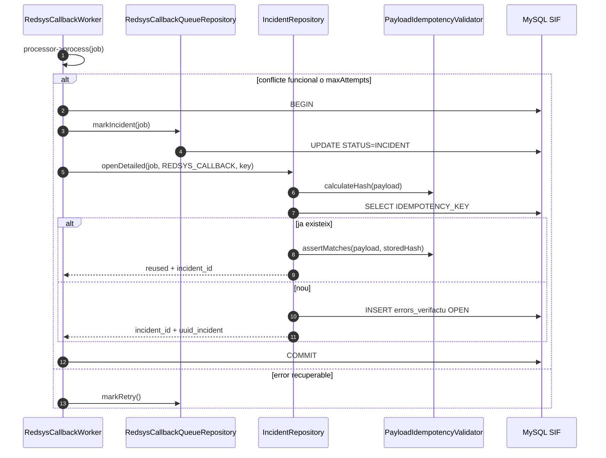
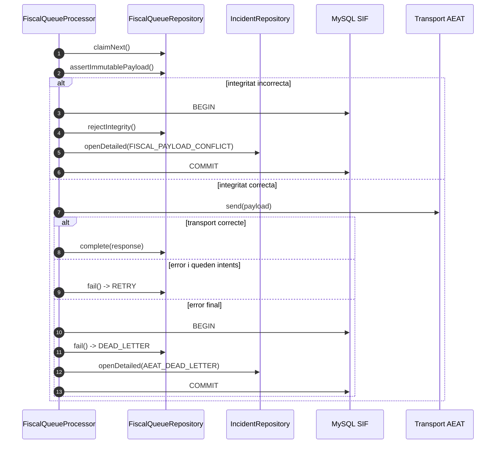
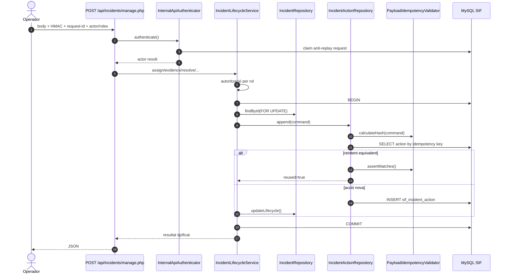
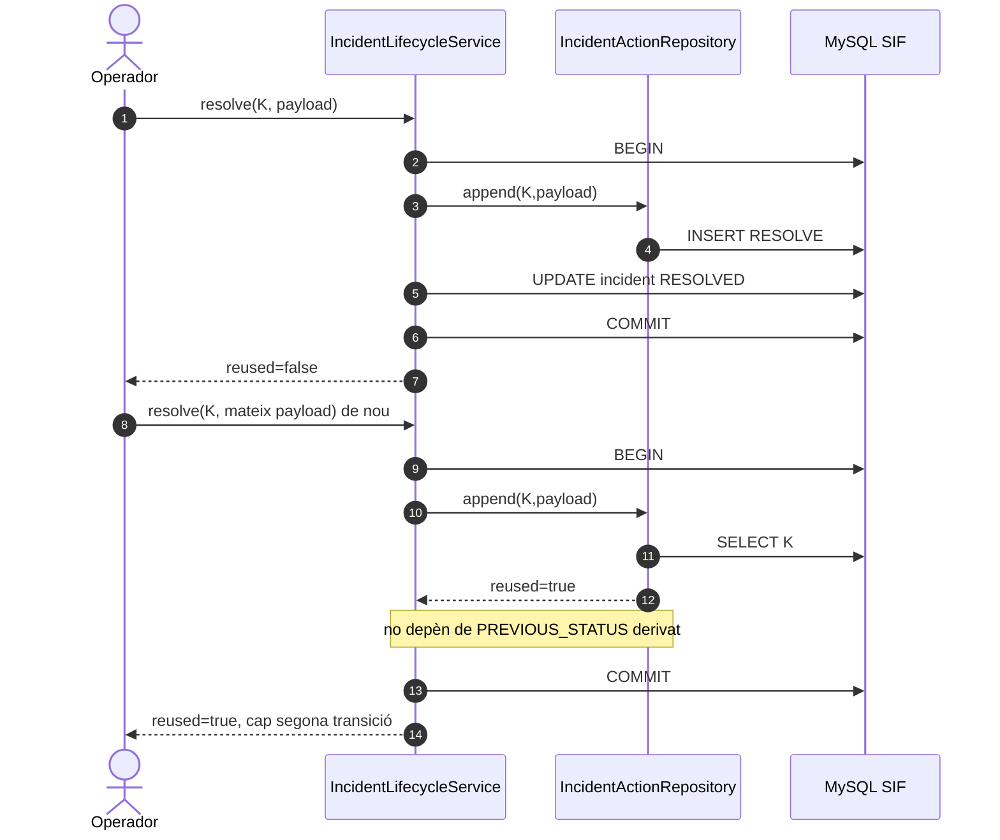
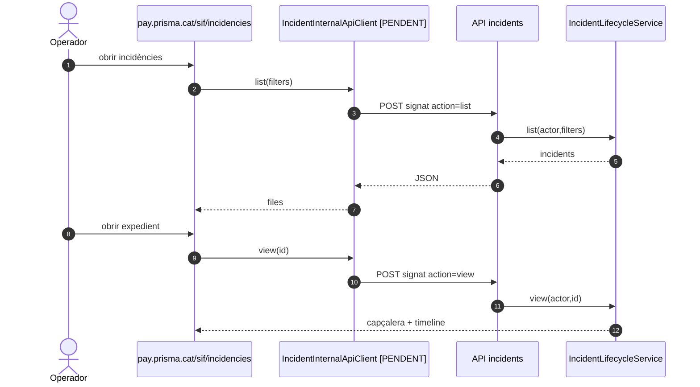
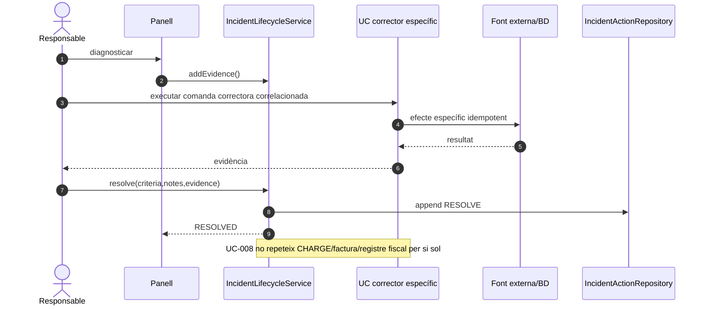
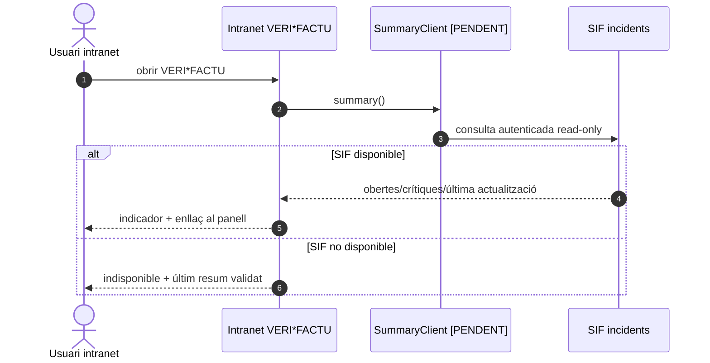

# UC-008 — Diagrames de seqüència ACTUAL i FINAL

**Data:** 29/09/2026  
**Regla:** ACTUAL descriu el backend executable integrat a `main`; FINAL incorpora les superfícies UI encara pendents.

Vegeu [classes](uc-008-classes-actual-final.md), [activitats](uc-008-activitats-pagines-incidencies-actual-final.md) i [auditoria](04-auditoria-detallada-uc-008-gestionar-incidencia-2026-09-29.md).

## 1. SEQ-008-ACTUAL-A · Redsys → INCIDENT atòmic

## 2. SEQ-008-ACTUAL-B · AEAT integritat i dead-letter

## 3. SEQ-008-ACTUAL-C · Acció manual autenticada

## 4. SEQ-008-ACTUAL-D · Reintent després d'una transició

## 5. SEQ-008-FINAL-A · Panell llistat i detall

## 6. SEQ-008-FINAL-B · Reparació explícita i tancament

## 7. SEQ-008-FINAL-C · Resum intranet read-only

## 8. Proves associades

- conflicte funcional Redsys → incidència sense retry;
- cinquè error Redsys → incidència;
- divergència fiscal → no enviar a AEAT + incidència;
- dead-letter final → incidència;
- mateixa key + mateix payload → reuse;
- mateixa key + payload divergent → 409;
- retry assign/resolve després del canvi d'estat → reuse, no duplicat;
- rol read-only → consulta sí, mutació no.
