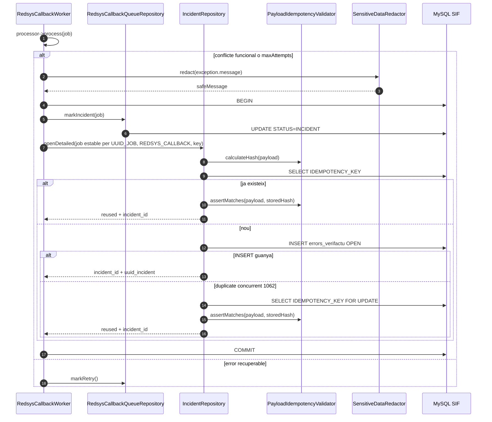
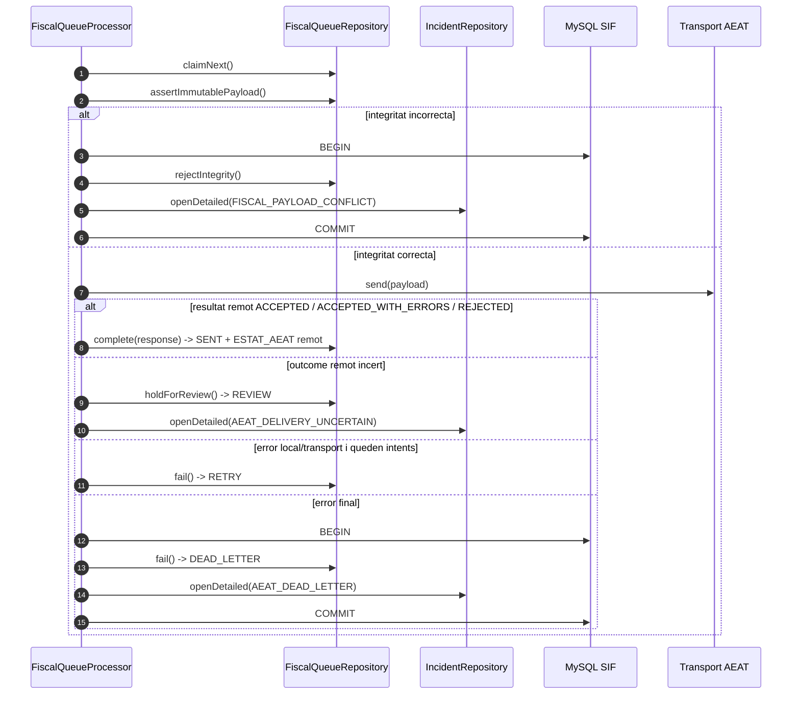
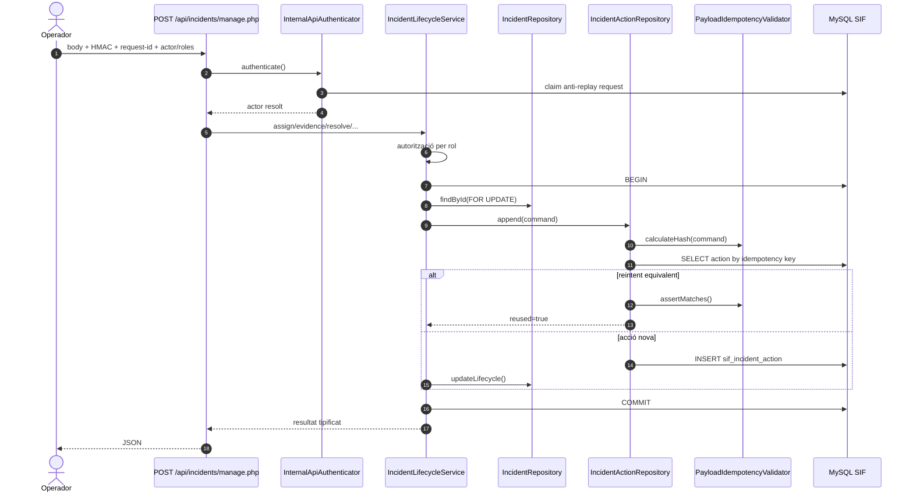
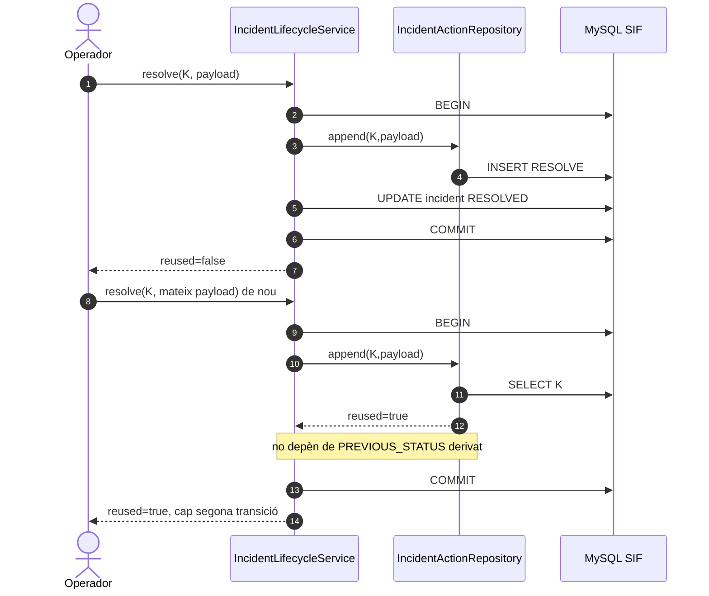
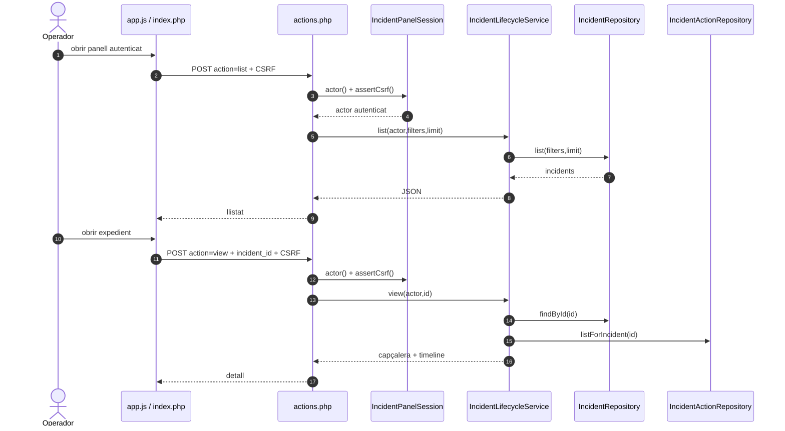
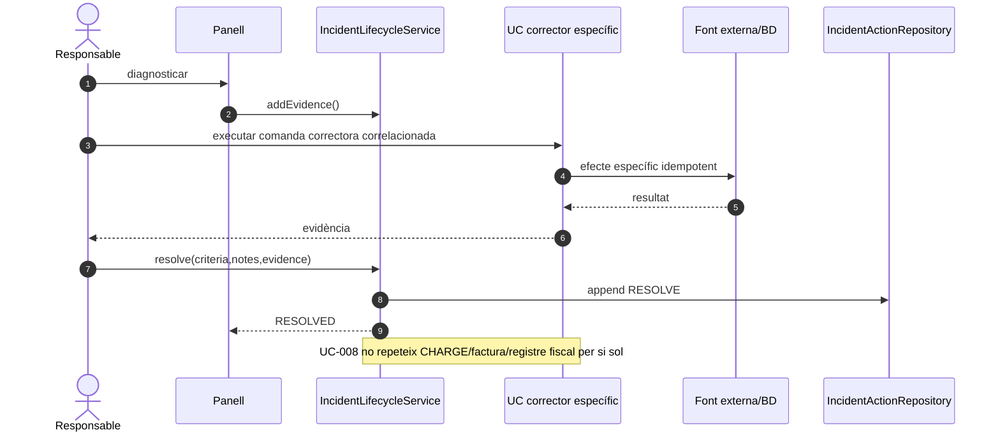
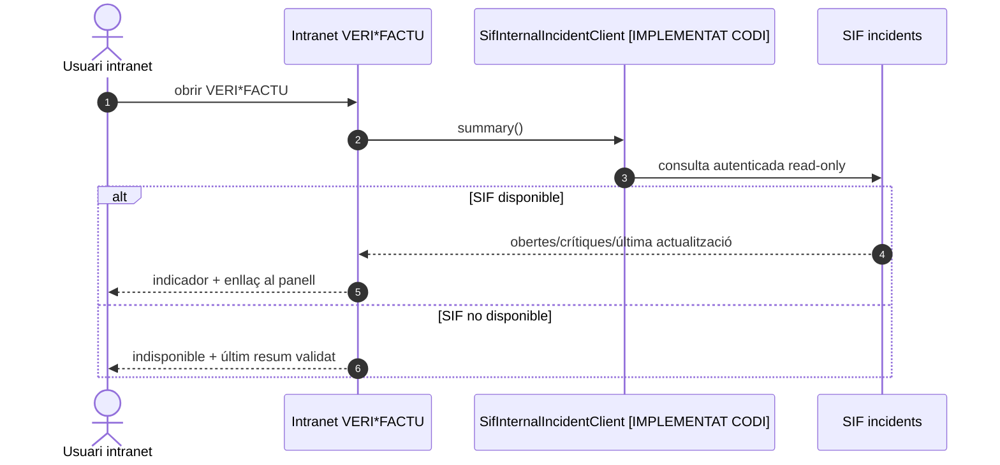

# UC-008 — Diagrames de seqüència ACTUAL i FINAL

**Data:** 30/09/2026  
**Revalidació:** 03/10/2026 contra `main` `b0e8ff7150c5a8b415cc109d298d82f0db1f68df`; no s'ha detectat divergència del nucli UC-008. Vegeu [inventari PHP/JS ACTUAL/FINAL](uc-008-inventari-codi-php-js-actual-final-2026-10-03.md) i [revalidació de `main`](uc-008-revalidacio-main-2026-10-03.md).  
**Regla:** ACTUAL descriu backend i UI executable al repositori; FINAL conserva els passos operatius que encara depenen de desplegament/configuració.

Vegeu [classes](uc-008-classes-actual-final.md), [activitats](uc-008-activitats-pagines-incidencies-actual-final.md) i [auditoria vigent](04b-auditoria-detallada-uc-008-2026-09-30.md).

## 1. SEQ-008-ACTUAL-A · Redsys → INCIDENT atòmic



## 2. SEQ-008-ACTUAL-B · AEAT integritat i dead-letter



## 3. SEQ-008-ACTUAL-C · Acció manual autenticada



## 4. SEQ-008-ACTUAL-D · Reintent després d'una transició



## 5. SEQ-008-ACTUAL-E · Concurrència idempotent real

```mermaid
sequenceDiagram
autonumber
participant A as Procés A
participant B as Procés B
participant IA as IncidentRepository A
participant IB as IncidentRepository B
participant DB as MySQL REPEATABLE READ

par mateixa IDEMPOTENCY_KEY
  A->>IA: openDetailed(payload)
  B->>IB: openDetailed(payload)
end
IA->>DB: SELECT key (snapshot)
IB->>DB: SELECT key (snapshot)
par cursa INSERT
  IA->>DB: INSERT unique key
  IB->>DB: INSERT unique key
end
DB-->>IA: un INSERT guanya
DB-->>IB: 1062 duplicate després del commit guanyador
IB->>DB: SELECT key FOR UPDATE (current read)
alt fila visible en current read
  IB-->>B: reused=true, mateix incident_id
else 1062 encara propaga
  B->>B: TransactionRunner fa ROLLBACK
  B->>IB: reintenta open una sola vegada en transacció nova
  IB->>DB: SELECT key
  DB-->>IB: incidència guanyadora ja confirmada
  IB-->>B: reused=true, mateix incident_id
end
IA-->>A: reused=false, incident_id
Note over A,B: defensa en dues capes; 1 errors_verifactu + 1 acció OPEN

par dues assignacions mateix incident
  A->>DB: SELECT incident FOR UPDATE
  B->>DB: SELECT incident FOR UPDATE (espera)
end
A->>DB: append ASSIGN + UPDATE
A-->>B: allibera lock
B->>DB: llegeix estat actual + append ASSIGN + UPDATE
Note over A,B: 2 accions coherents, 1 estat final IN_PROGRESS
```

**Evidència:** `IncidentConcurrencyTest` amb dos subprocessos PHP i dues connexions PDO independents; run `36661335874`.

## 6. SEQ-008-FINAL-A · Panell llistat i detall



**Nota:** el panell SIF no torna a passar per l'API interna HMAC. Un cop establerta la sessió SIF mitjançant el handoff signat, `actions.php` treballa same-origin amb sessió + CSRF i invoca directament `IncidentLifecycleService`. L'API interna HMAC és la frontera servidor→servidor utilitzada, entre altres, pel resum read-only de la intranet.

## 7. SEQ-008-FINAL-B · Reparació explícita i tancament



## 8. SEQ-008-FINAL-C · Resum intranet read-only



## 9. Proves associades

- conflicte funcional Redsys → incidència sense retry;
- cinquè error Redsys → incidència;
- divergència fiscal → no enviar a AEAT + incidència;
- dead-letter final → incidència;
- mateixa key + mateix payload → reuse;
- mateixa key + payload divergent → 409;
- retry assign/resolve després del canvi d'estat → reuse, no duplicat;
- rol read-only → consulta sí, mutació no.
