# UC-009 · Diagrames d'activitat ACTUAL / FINAL — remetre registre fiscal a AEAT

**Data d'auditoria:** 2026-09-29  
**Branca:** `audit/uc-009-completar-implementacio-2026-09-29`  
**Criteri:** cada superfície executable o prevista queda separada en ACTUAL i FINAL. Quan una pantalla no existeix, l'ACTUAL ho indica explícitament i el FINAL descriu el comportament que s'ha de construir.

## 1. Mapa de superfícies i apartats

| ID | Superfície / apartat | ACTUAL | FINAL |
| --- | --- | --- | --- |
| A09-01 | Worker fiscal CLI | Implementat en preproducció | Mateix flux + evidència i ownership persistents |
| A09-02 | Claim d'una entrada de cua | Implementat | Fencing obligatori per claim token |
| A09-03 | Validació d'immutabilitat | Implementat | Es manté bloquejant |
| A09-04 | Enviament SOAP/mTLS | Implementat només endpoint AEAT de proves | Qualificació explícita abans d'habilitar producció |
| A09-05 | Resposta ACCEPTED / WITH_ERRORS / REJECTED | Implementat | Persistència d'intent abans de tancar la cua |
| A09-06 | Error retryable | Implementat | Només errors sense resultat remot acreditat |
| A09-07 | Resultat remot incert | Abans es podia convertir en RETRY | Estat REVIEW, sense reenviament cec |
| A09-08 | Stale lock / recuperació | Implementat | Claim token invalidat en recuperar |
| A09-09 | Preflight | Implementat via CLI | També visible des del panell |
| A09-10 | Panell `/sif/registres-aeat` | No localitzat / no executable | Llista, detall, incidents, intents i evidència |
| A09-11 | Reconciliació manual | No hi ha UI específica | Acció protegida sobre un intent REVIEW |
| A09-12 | Producció AEAT | Bloquejada per codi | Activació només després de qualificació i evidència |

---

## 2. A09-01 · Worker fiscal CLI

### ACTUAL

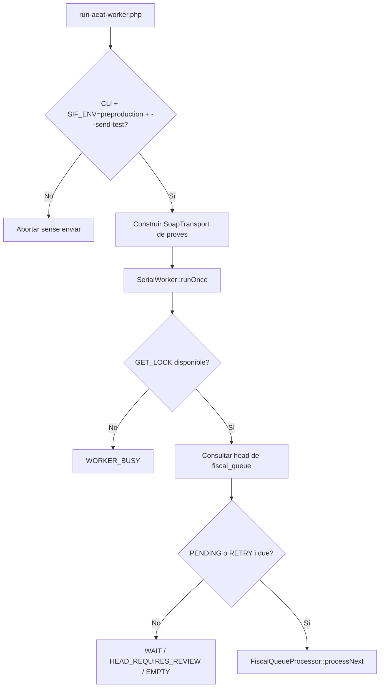

### FINAL

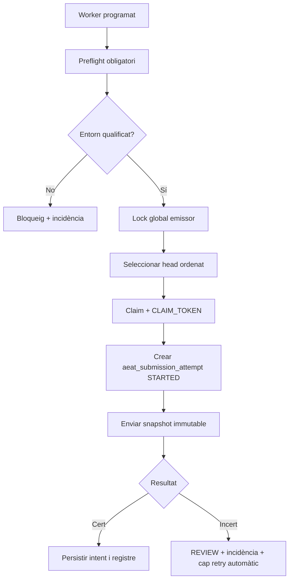

---

## 3. A09-02 · Claim, ownership i fencing

### ACTUAL abans de la correcció auditada

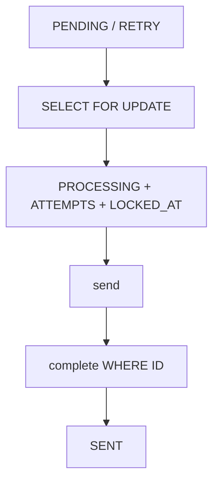

El `WHERE ID` no acreditava que el procés que completava continués sent propietari del claim.

### FINAL implementat a la branca

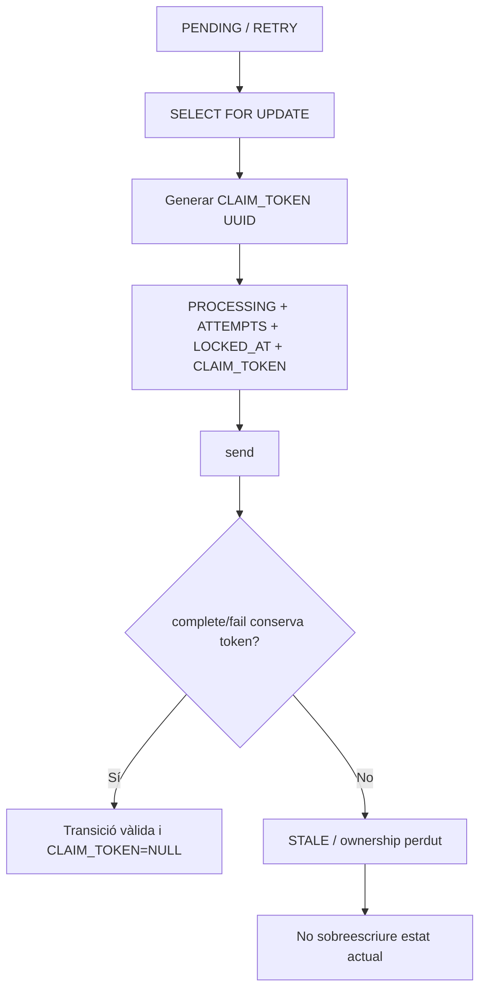

---

## 4. A09-03 · Validació d'immutabilitat

### ACTUAL / FINAL

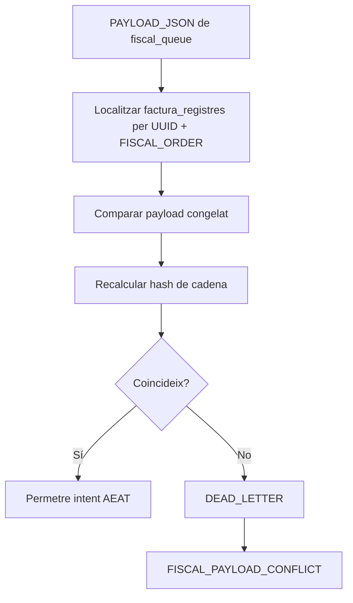

Aquest flux ja és coherent amb l'objectiu FINAL i s'ha de mantenir bloquejant.

---

## 5. A09-04 · Enviament SOAP/mTLS

### ACTUAL

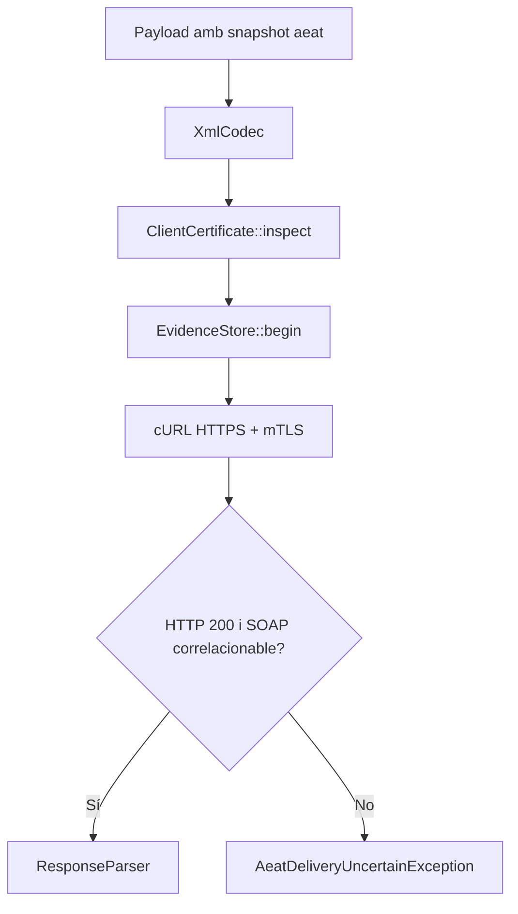

`SoapTransport` només accepta `TEST_ENDPOINT`.

### FINAL

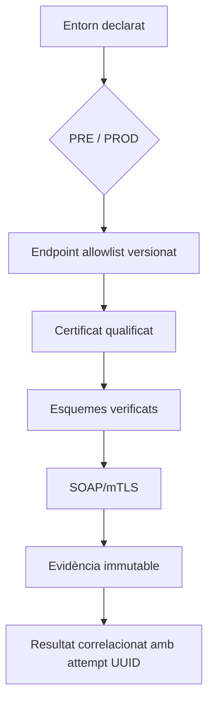

Producció no s'ha d'activar simplement canviant una URL.

---

## 6. A09-05 · Resposta AEAT certa

### ACTUAL corregit

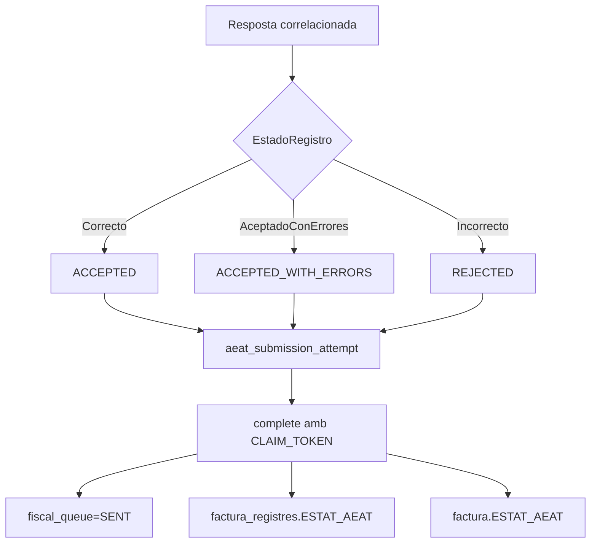

`SENT` és estat de transport; no equival a `ACCEPTED`.

---

## 7. A09-06 · Error retryable

### ACTUAL / FINAL

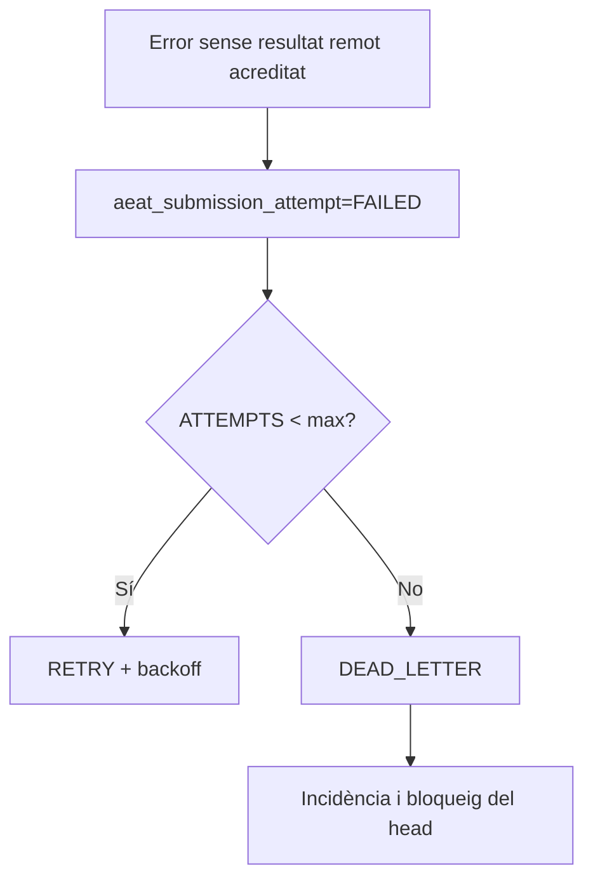

Només els errors que no tenen resultat remot conegut o potencialment rebut poden entrar en aquest camí.

---

## 8. A09-07 · Resultat remot incert

### ACTUAL abans de la correcció

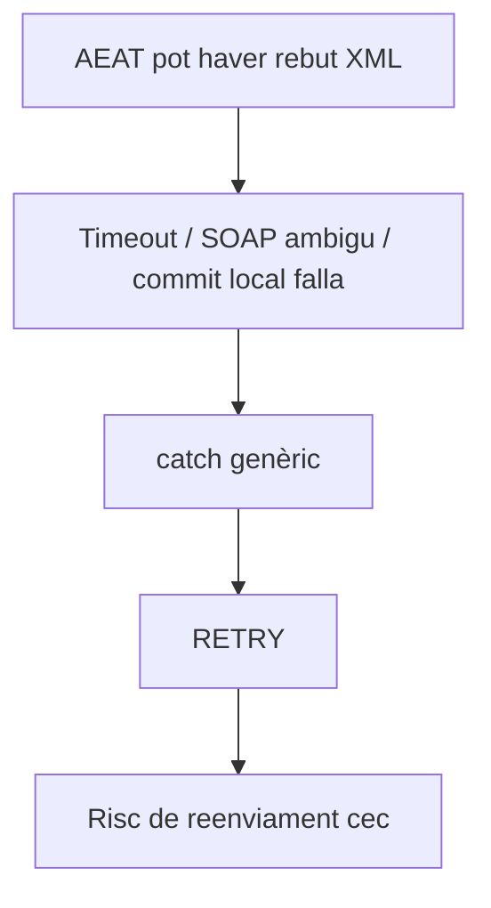

### FINAL implementat a la branca

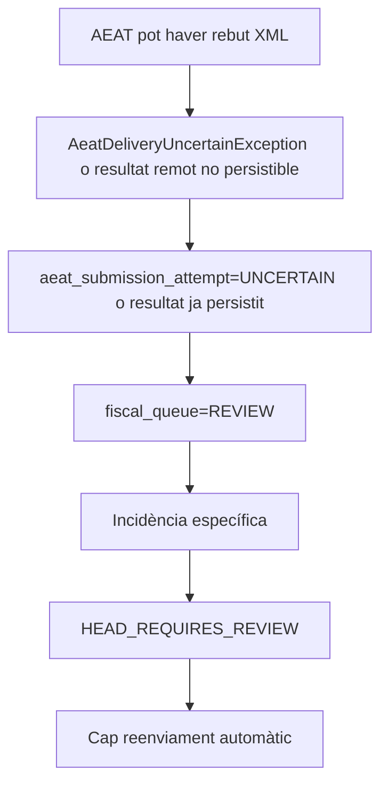

---

## 9. A09-08 · Recuperació de stale lock

### ACTUAL corregit / FINAL

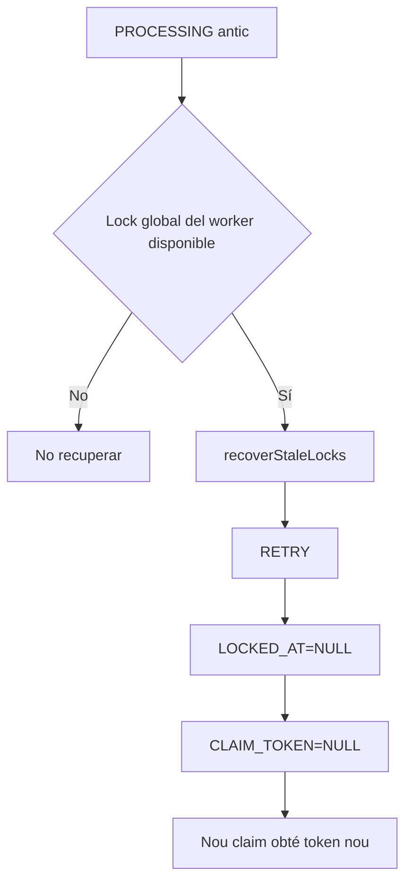

Un procés antic no pot completar amb el token anterior.

---

## 10. A09-09 · Preflight

### ACTUAL

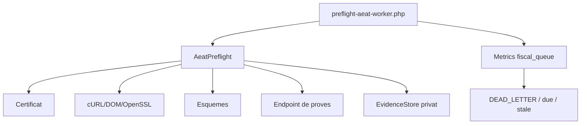

### FINAL

El mateix resultat s'ha d'exposar al panell intern en mode lectura, sense revelar secrets, paths de certificat ni contingut sensible.

---

## 11. A09-10 · Panell `pay.prisma.cat/sif/registres-aeat`

### ACTUAL implementat a la branca 2026-09-30

```mermaid
flowchart TD
    A[GET /sif-registres-aeat.php] --> B[Sessió intranet]
    B --> C[Proxy ajax/sif/sifAeat.php]
    C --> D[HMAC servidor-servidor]
    D --> E[/api/aeat/operations.php]
    E --> F[summary / list / detail / preflight]
    F --> G[Resum + cua + registre + intents + incidències]
```

### FINAL — pàgina i apartats

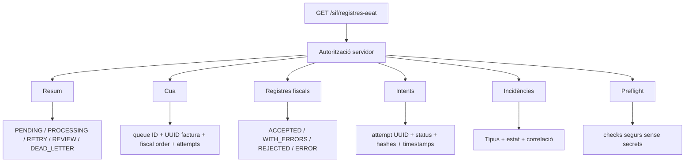

### Apartat «Detall d'intent»

Ha de mostrar:
- `UUID_ATTEMPT`;
- `FISCAL_QUEUE_ID`;
- número d'intent;
- hash de request;
- estat `STARTED/FAILED/UNCERTAIN/ACCEPTED/ACCEPTED_WITH_ERRORS/REJECTED`;
- timestamps;
- CSV/codi d'error quan existeixen;
- referència d'evidència protegida quan estigui disponible.

No ha de mostrar:
- password del certificat;
- clau privada;
- PAN/CVV;
- paths interns sensibles;
- XML complet sense control d'accés.

---

## 12. A09-11 · Reconciliació de REVIEW

### ACTUAL implementat a la branca 2026-09-30

La UI mostra «Conciliar sense reenviar» només per un job `REVIEW` amb intent terminal remot `ACCEPTED`, `ACCEPTED_WITH_ERRORS` o `REJECTED`. El backend torna a validar el mateix `FISCAL_QUEUE_ID`, bloqueja files amb `FOR UPDATE`, regenera l'XML des del snapshot fiscal immutable i persisteix el resultat original sense cap segon SOAP. Un intent `UNCERTAIN` continua en `REVIEW`.

### FINAL

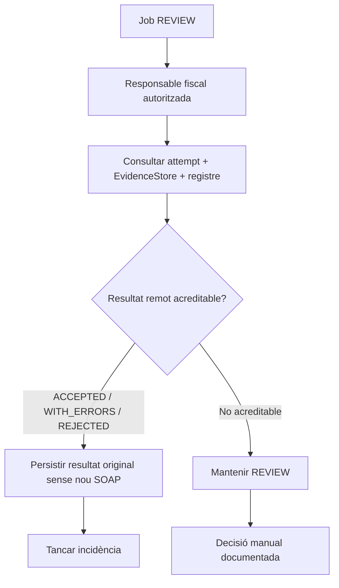

La reconciliació no pot crear una factura nova ni alterar el registre fiscal immutable.

---

## 13. A09-12 · Activació de producció

### ACTUAL

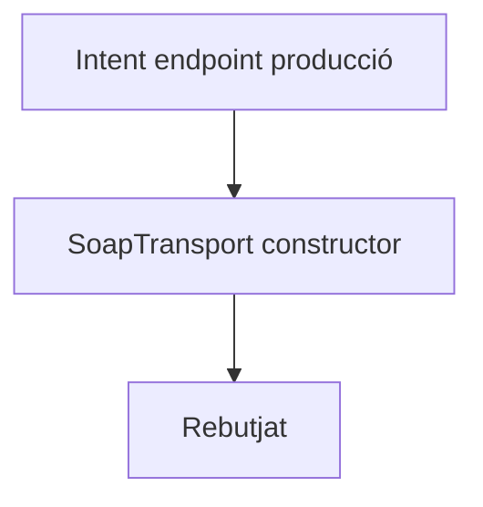

### FINAL

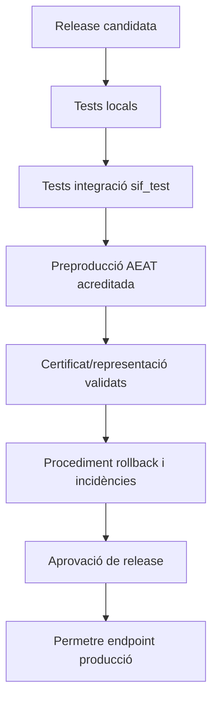

---

## 14. Traçabilitat d'aquesta auditoria

| Necessitat | Codi / document |
| --- | --- |
| Claim i fencing | `FiscalQueueRepository`, migració `000010` |
| Intent persistent | `AeatSubmissionAttemptRepository`, `aeat_submission_attempt` |
| Resultat remot incert | `AeatDeliveryUncertainException`, `FiscalQueueProcessor::reviewHold()` |
| Lock d'emissor | `SerialWorker` |
| Control freqüència | `FlowControlledTransport`, `aeat_worker_state` |
| SOAP/mTLS | `SoapTransport`, `ClientCertificate` |
| XML / resposta | `XmlCodec`, `ResponseParser` |
| Evidència privada | `EvidenceStore` |
| Preflight | `AeatPreflight`, `preflight-aeat-worker.php` |
| Proves | `AeatWorkflowTest`, `FiscalQueueProcessorTest`, tests AEAT unit/integració |
| Panell | Implementat a la branca 2026-09-30; alta al menú de l'entorn pendent |

## 15. Estat de tancament

- **Documentat:** sí, inclosos ACTUAL/FINAL.
- **Implementat backend preproducció:** sí, amb fencing, ledger d'intents i REVIEW incorporats a la branca.
- **Panell web:** implementat; alta/configuració del menú de preproducció pendent.
- **Proves escrites:** sí; ampliades per intents, resultat incert, fencing, consulta operativa i reconciliació REVIEW.
- **Proves executades en entorn `sif_test*`:** pendents d'evidència.
- **Enviament AEAT real de preproducció:** pendent d'evidència.
- **Producció:** no habilitada.
