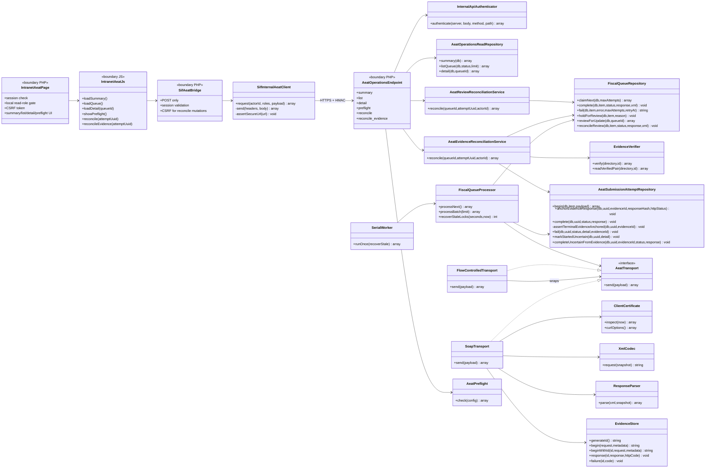
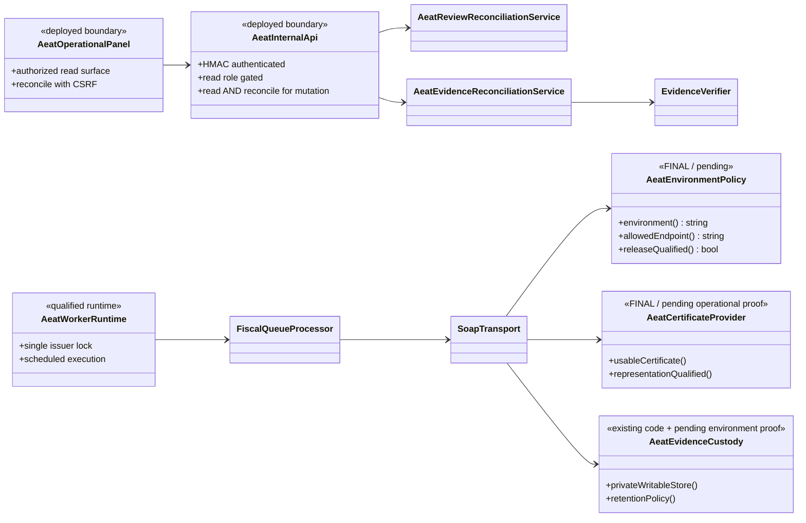
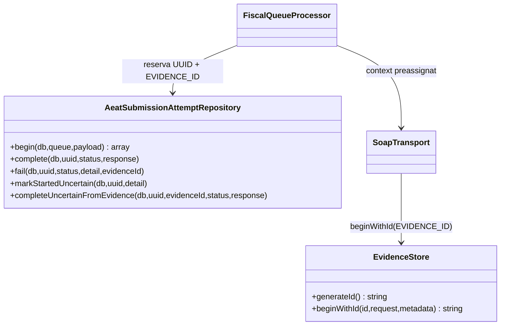

# UC-009 · Diagrama de classes ACTUAL / FINAL — remissió AEAT

**Revalidació:** 2026-10-03  
**Tall auditat:** `main@b0e8ff7150c5a8b415cc109d298d82f0db1f68df`  
**Objectiu:** separar el codi executable actual del model final necessari per tancar preproducció i, més endavant, habilitar producció de manera explícita.

## 1. Cobertura

Aquesta vista cobreix les cinc fronteres executables del UC-009:

1. panell intranet `/sif-registres-aeat.php`;
2. bridge AJAX + client HMAC servidor-servidor;
3. API interna `/api/aeat/operations.php`;
4. worker/cua/transport AEAT;
5. reconciliació de `REVIEW` amb resultat terminal ja persistit;
6. reconciliació d'`UNCERTAIN` des d'evidència privada verificada, sempre sense segon SOAP.

No converteix fitxers PHP procedimentals en classes fictícies: la pàgina, el bridge i l'endpoint es representen com a fronteres, i només les classes PHP reals apareixen com a classes.

## 2. ACTUAL — classes i fronteres reals a `main`

### 2.1. Responsabilitats verificades

| Component | Responsabilitat ACTUAL | Evidència |
| --- | --- | --- |
| `sif-registres-aeat.php` | sessió, gate local `SIF_AEAT_READ_ROLES`, token CSRF i shell del panell | codi real intranet + contract test |
| `sif-registres-aeat.js` | summary/list/detail/preflight, reconcile terminal i reconcile d'evidència segons `capabilities.reconcile` | codi real JS |
| `ajax/sif/sifAeat.php` | POST, sessió i CSRF per mutació | codi real bridge |
| `SifInternalAeatClient` | HTTPS + HMAC + request id | codi real client |
| `operations.php` | HMAC/anti-replay; lectura exigeix rol read i mutacions exigeixen read + reconcile | codi real API + contract test |
| `AeatOperationsReadRepository` | projecció operativa sense XML/payload protegit | codi + test |
| `FiscalQueueProcessor` | integritat, intent, transport, retry/dead-letter/review | codi + tests |
| `FiscalQueueRepository` | ownership amb `CLAIM_TOKEN` i persistència terminal | codi + tests |
| `AeatReviewReconciliationService` | tancar `REVIEW` amb resultat terminal ja persistit | codi + tests |
| `AeatEvidenceReconciliationService` | validar bundle privat, metadata, request immutable i resposta abans de `UNCERTAIN → terminal` | codi + tests |
| `EvidenceVerifier` | integritat, no symlinks, hashes, HTTP i metadata d'ownership | codi + tests |
| `SoapTransport` | SOAP/mTLS només endpoint AEAT de proves | codi + tests |

## 3. FINAL — separació de responsabilitats exigida

El model final de preproducció no necessita crear una segona arquitectura. La major part ja existeix; els elements no acreditats són d'entorn i release.

### 3.1. Diferència ACTUAL → FINAL

| Punt | ACTUAL | FINAL / criteri de sortida |
| --- | --- | --- |
| endpoint | constructor bloquejat a proves | producció només via política/release explícits |
| certificat | validació criptogràfica local | evidència d'ús/representació a preproducció |
| panell | codi versionat | desplegat, menú i rols verificats |
| worker | executable preproducció manual `--send-test` | planificació i operació verificades |
| intents | `ENVIRONMENT='preproduction'` fix al repositori | entorn derivat de configuració si s'habilita més d'un runtime |
| evidència | custòdia privada implementada | ruta, permisos i retenció acreditats a l'entorn |
| CI | tests UC-009 passen al run 02/10 | pipeline global verd o excepció de baseline documentada abans de merge/release |

## 4. Classes que NO s'han d'inventar

No hi ha evidència d'una classe `AeatPanelController` ni d'un `AeatProductionTransport`. Fins que existeixin al codi, no s'han de representar com a implementats. Igualment, l'alta del menú `apartats` és configuració de la intranet, no una classe de domini.

## 5. Estat

- **Documentat:** complet per classes ACTUAL/FINAL.
- **Implementat:** nucli preexistent a `main`; correccions i extensió d'evidència implementades al PR #133.
- **Verificat:** tall anterior del PR amb 57/57 UC-009 PASS; el head amb conciliació d'evidència i doble gate de rol requereix el PASS dedicat corresponent.
- **Pendent:** evidència de desplegament/preproducció i política d'activació de producció.

## 6. Extensió 2026-10-04 — evidència estructurada

`aeat_submission_attempt` incorpora `EVIDENCE_ID VARCHAR(64) NULL UNIQUE`. La unicitat impedeix que una mateixa evidència privada quedi associada a més d'un intent, mantenint compatibilitat amb intents antics `NULL`.

`AeatEvidenceReconciliationService` no depèn d'`AeatTransport` ni de `SoapTransport`: només llegeix una evidència privada ja existent, la verifica amb `EvidenceVerifier`, valida la resposta amb `ResponseParser` i aplica el resultat terminal mitjançant repositoris transaccionals.

## 7. Preassignació i ownership d'evidència

`EVIDENCE_ID` és `UNIQUE` a BD i immutable després de crear l'intent. `SoapTransport` rebutja enviaments sense context preassignat.

### 6.1. Àncora de resposta fora del bundle

`aeat_submission_attempt` incorpora, mitjançant la migració `2026_10_04_000034_anchor_aeat_evidence_response.sql`:

- `EVIDENCE_RESPONSE_SHA256 CHAR(64) NULL`;
- `EVIDENCE_HTTP_STATUS INT NULL`.

Aquests camps són la referència independent usada per `AeatEvidenceReconciliationService`. El panell no els exposa: `AeatOperationsReadRepository` només projecta `EVIDENCE_RECONCILABLE=0|1`.

## 8. Invariant terminal ancorat — 2026-10-04

`AeatSubmissionAttemptRepository::complete()` ja no admet un resultat terminal només perquè el transport retorni `ACCEPTED|ACCEPTED_WITH_ERRORS|REJECTED`.

Abans de `STARTED → terminal` exigeix:
1. `EVIDENCE_ID` present a la resposta;
2. coincidència exacta amb l'ID preassignat a l'intent;
3. `EVIDENCE_RESPONSE_SHA256` vàlid ja ancorat a MySQL;
4. `EVIDENCE_HTTP_STATUS = 200`;
5. intent encara `STARTED`.

Si qualsevol condició falla, el processador no consolida el resultat fiscal: passa a `REVIEW`, l'intent queda `UNCERTAIN` i el worker no torna a invocar el transport automàticament.
