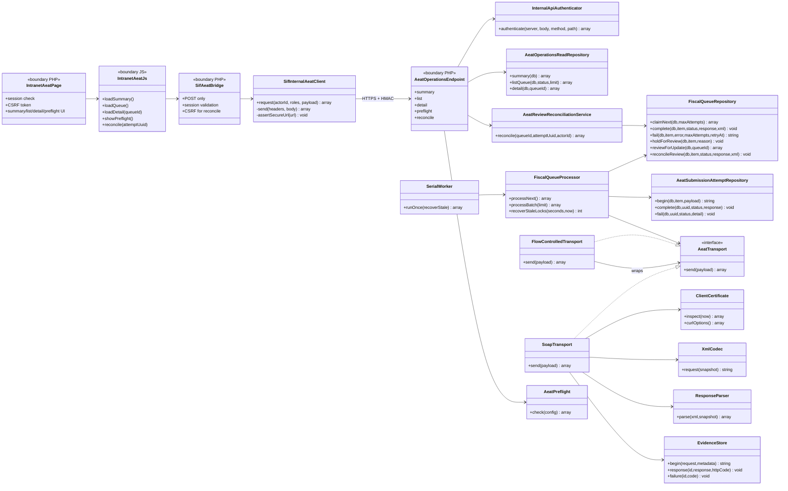
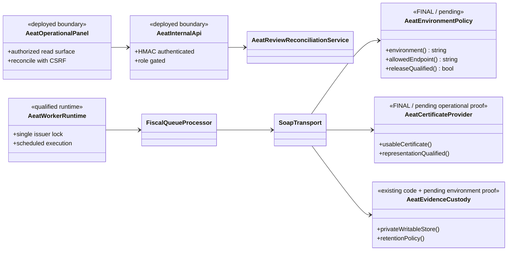

# UC-009 · Diagrama de classes ACTUAL / FINAL — remissió AEAT

**Revalidació:** 2026-10-03  
**Tall auditat:** `main@b0e8ff7150c5a8b415cc109d298d82f0db1f68df`  
**Objectiu:** separar el codi executable actual del model final necessari per tancar preproducció i, més endavant, habilitar producció de manera explícita.

## 1. Cobertura

Aquesta vista cobreix les cinc fronteres executables del UC-009:

1. panell intranet `/sif-registres-aeat.php`;
2. bridge AJAX + client HMAC servidor-servidor;
3. API interna `/api/aeat/operations.php`;
4. worker/cua/transport AEAT;
5. reconciliació de `REVIEW` sense segon SOAP.

No converteix fitxers PHP procedimentals en classes fictícies: la pàgina, el bridge i l'endpoint es representen com a fronteres, i només les classes PHP reals apareixen com a classes.

## 2. ACTUAL — classes i fronteres reals a `main`

### 2.1. Responsabilitats verificades

| Component | Responsabilitat ACTUAL | Evidència |
| --- | --- | --- |
| `sif-registres-aeat.php` | sessió, token CSRF i shell del panell | codi real intranet |
| `sif-registres-aeat.js` | summary/list/detail/preflight/reconcile | codi real JS |
| `ajax/sif/sifAeat.php` | POST, sessió i CSRF per mutació | codi real bridge |
| `SifInternalAeatClient` | HTTPS + HMAC + request id | codi real client |
| `operations.php` | autenticació interna i separació read/reconcile roles | codi real API |
| `AeatOperationsReadRepository` | projecció operativa sense XML/payload protegit | codi + test |
| `FiscalQueueProcessor` | integritat, intent, transport, retry/dead-letter/review | codi + tests |
| `FiscalQueueRepository` | ownership amb `CLAIM_TOKEN` i persistència terminal | codi + tests |
| `AeatReviewReconciliationService` | tancar `REVIEW` amb resultat terminal ja persistit | codi + tests |
| `SoapTransport` | SOAP/mTLS només endpoint AEAT de proves | codi + tests |

## 3. FINAL — separació de responsabilitats exigida

El model final de preproducció no necessita crear una segona arquitectura. La major part ja existeix; els elements no acreditats són d'entorn i release.

### 3.1. Diferència ACTUAL → FINAL

| Punt | ACTUAL | FINAL / criteri de sortida |
| --- | --- | --- |
| endpoint | constructor bloquejat a proves | producció només via política/release explícits |
| certificat | validació criptogràfica local | evidència d'ús/representació a preproducció |
| panell | codi versionat | desplegat, menú i rols verificats |
| worker | executable preproducció manual `--send-test` | planificació i operació verificades |
| intents | `ENVIRONMENT='preproduction'` fix al repositori | entorn derivat de configuració si s'habilita més d'un runtime |
| evidència | custòdia privada implementada | ruta, permisos i retenció acreditats a l'entorn |
| CI | tests UC-009 passen al run 02/10 | pipeline global verd o excepció de baseline documentada abans de merge/release |

## 4. Classes que NO s'han d'inventar

No hi ha evidència d'una classe `AeatPanelController` ni d'un `AeatProductionTransport`. Fins que existeixin al codi, no s'han de representar com a implementats. Igualment, l'alta del menú `apartats` és configuració de la intranet, no una classe de domini.

## 5. Estat

- **Documentat:** complet per classes ACTUAL/FINAL.
- **Implementat:** classes ACTUAL anteriors localitzades a `main`.
- **Verificat:** tests AEAT del run CI del 02/10 passen; s'afegeix contracte específic d'intranet en aquesta auditoria.
- **Pendent:** evidència de desplegament/preproducció i política d'activació de producció.
