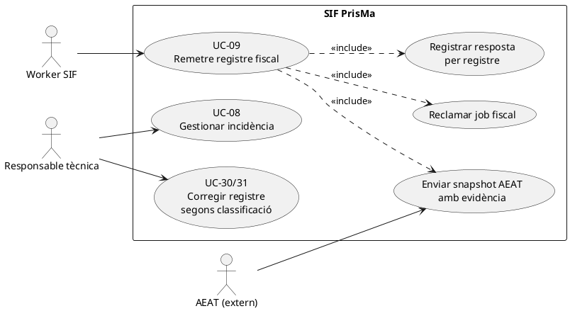
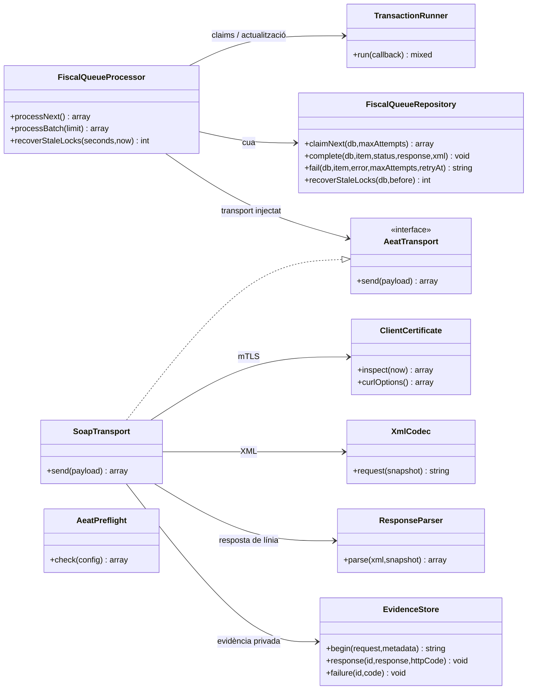
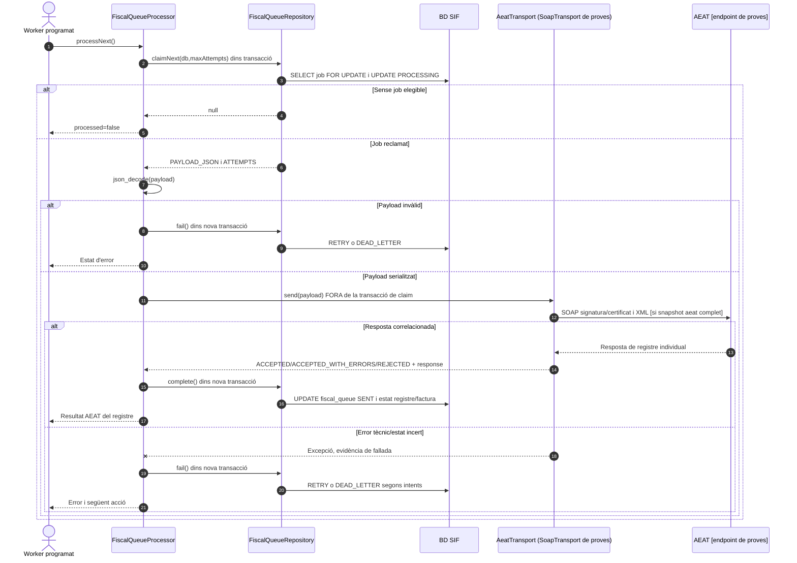

# UC-09 · Remetre un registre fiscal a AEAT — fitxa i UML integrats

**Àmbit:** enviar un registre **ja emès i congelat** al SIF. L'emissió i l'encadenament són UC-01/05/30/31; la remissió d'una tasca de `fiscal_queue` és UC-09. **Estat real contrastat amb `main`:** `FiscalQueueProcessor`, `FiscalQueueRepository`, `AeatTransport` i una implementació `SoapTransport` **limitada deliberadament a l'endpoint de proves**. Per tant, el catàleg que etiqueta UC-09 únicament `[DISSENY]` queda **desactualitzat respecte de l'existència de codi local**, però aquest codi **no acredita cap enviament real, resultat acceptat ni desplegament en producció**.

## 1. Fitxa del cas

| Camp | Descripció específica i estat |
| --- | --- |
| Actor inicial | Procés automàtic SIF/worker; AEAT és un sistema extern que respon. Responsable tècnica pot activar/revisar el procés segons política i permisos del panell pendent. |
| Disparador | Una entrada `fiscal_queue` `PENDING` o `RETRY` ha arribat a `NEXT_RETRY_AT` i no ha esgotat intents. |
| Precondicions de l'enviament real | Registre fiscal congelat, payload AEAT complet, configuració del servei de proves, certificat usable, dependències XML/cURL i directori privat d'evidències; `AeatPreflight` comprova diverses condicions locals però no prova confiança de l'AEAT ni bona representació fiscal. |
| Resultat del worker | `processed=false` si no hi ha job; si se'n reclama un, estat d'AEAT `ACCEPTED`, `ACCEPTED_WITH_ERRORS` o `REJECTED`, o `RETRY`/`DEAD_LETTER` davant fallada. |
| Límits de responsabilitat | `fiscal_queue.STATUS=SENT` significa petició enviada i resposta processada, **no** acceptació de cada registre. L'estat real de la línia es conserva a `factura_registres.ESTAT_AEAT` i al resum `factura.ESTAT_AEAT`. |
| Diners/inscripcions | UC-09 **no** crea `CHARGE`, `REFUND`, `payment_allocation` ni moviments d'atribució per inscripció. |

### 1.1. Flux executable del processador

1. `FiscalQueueProcessor::processNext()` usa `TransactionRunner` per reclamar una entrada; `FiscalQueueRepository::claimNext()` selecciona la primera `PENDING`/`RETRY` disponible amb `ATTEMPTS < maxAttempts`, aplica `FOR UPDATE`, la marca `PROCESSING` i n'incrementa els intents.
2. Decodifica `PAYLOAD_JSON`; si no és un objecte/array vàlid, deriva el job al tractament de fallada.
3. Invoca `AeatTransport::send(payload)` **fora de la transacció de reclamació**. `SoapTransport` concret exigeix `payload['aeat']` i rebutja un payload intern o llegat que no tingui snapshot AEAT.
4. L'implementació SOAP de proves genera XML amb `XmlCodec`, inspecciona el certificat amb `ClientCertificate`, crea evidència privada via `EvidenceStore`, envia amb cURL/mTLS i processa `ResponseParser`. El constructor rebutja qualsevol endpoint diferent de `TEST_ENDPOINT`.
5. `ResponseParser` comprova el registre respost (identitat de factura i operació) i distingeix `ACCEPTED`, `ACCEPTED_WITH_ERRORS` i `REJECTED`, amb indicadors de duplicat i revisió. **Els tests amb transport simulat no proven que un endpoint real hagi acceptat una petició.**
6. `FiscalQueueRepository::complete()` marca la cua `SENT`, desa XML i resposta al registre fiscal corresponent a `UUID_FACTURA` + `FISCAL_ORDER`, i actualitza `factura.ESTAT_AEAT` segons el resultat. La confirmació de la cua i dels estats de BD passa en una transacció **diferent** de l'enviament extern.
7. Davant error, `failure()` programa `RETRY` amb retard exponencial limitat; en esgotar intents, `DEAD_LETTER`, `ERROR` al registre/factura i informació de l'error. `recoverStaleLocks()` reprèn jobs en `PROCESSING` massa antics.

### 1.2. Alternatives, incidències i riscos identificats

| Escenari | Regla i evidència |
| --- | --- |
| Sense tasques elegibles | `processNext()` retorna `ok=true, processed=false`; no hi ha cap enviament. |
| AEAT accepta amb errors | Es registra `ACCEPTED_WITH_ERRORS` a `factura_registres` i `factura`; no s'ha de presentar com `ACCEPTED` sense incidències. |
| AEAT rebutja el registre | Es desa `REJECTED` i la resposta; la cua acaba `SENT` per haver-se tramitat la petició. **Decidir la correcció és un altre cas**; no reemetre la mateixa factura a cegues. |
| Error de transport o payload llegat | `RETRY` o `DEAD_LETTER` per intents; el worker no transforma màgicament un payload sense `aeat` en un registre vàlid. |
| Resposta HTTP 200, però SOAP ambigu, línia d'una altra factura o d'operació diferent | `ResponseParser` rebutja el resultat i `SoapTransport` el tracta com a resposta incerta que requereix revisió, conservant evidència. |
| Worker mor després de l'enviament extern i abans d'actualitzar BD | **Risc de resultat extern incert**. Recuperar un lock i reintentar pot repetir un enviament ja rebut; cal conciliació de l'evidència i resposta AEAT abans de permetre un reintent no supervisat, segons política final. |
| Evidència de certificat | `ClientCertificate::inspect()` verifica localment lectura, desxifrat, parella clau/certificat i dates, però no estableix per si sola revocació o capacitat representativa. |
| Estat `[DISSENY]` del catàleg | Es conserva com a etiqueta documental històrica fins a revisió; el codi actual té processador i transport de **proves**, no es pot inferir disponibilitat en producció. |

**Proves localitzades, NO executades ara:** `FiscalQueueProcessorTest` cobreix resposta simulada acceptada, errors, reintents, `DEAD_LETTER`, lots i locks; `AeatPreflightTest` comprova requisits locals. Falta evidència aquí d'un enviament real del certificat/endpoint requerits i del comportament davant resposta externa incerta.

## 2. Diagrama UML de casos d'ús



## 3. Diagrama de classes — codi present a `main`



## 4. Diagrama de seqüència — remissió i resposta



### 4.1. Seqüència d'estat extern incert — risc de duplicat

```mermaid
sequenceDiagram
participant P as FiscalQueueProcessor
participant T as AEAT
participant Q as FiscalQueueRepository
participant DB as BD SIF
P->>T: Enviar registre congelat
T-->>P: Acceptació externa [pot haver arribat]
Note over P,DB: El procés pot fallar abans de guardar la resposta en BD
P-xQ: Pèrdua de confirmació / caiguda
Q->>DB: Job continua PROCESSING fins recuperació
Q->>DB: recoverStaleLocks() → RETRY
Note over Q,T: Reenviament sense conciliació podria duplicar un intent extern; criteri de recuperació pendent de validar
```

## 5. Matriu de persistència i evidències

| Etapa | Dada |
| --- | --- |
| Emissió original | `factura_registres.PAYLOAD_JSON` + `HASH_FACT`, `fiscal_queue.PAYLOAD_JSON`. La inserció de la cua **no** significa enviament. |
| Reclamació | `fiscal_queue.STATUS=PROCESSING`, `ATTEMPTS`, `LOCKED_AT`. |
| Enviament / resposta | XML i resposta a `factura_registres`; `ESTAT_AEAT` a registre/factura; estat cua `SENT`. |
| Fallada | `LAST_ERROR`, `NEXT_RETRY_AT`, `RETRY` o `DEAD_LETTER`; resum `ERROR` al registre/factura quan s'esgoten intents. |
| Evidència detallada externa | `EvidenceStore` crea fitxers privats fora del repositori, amb identificador d'intent. La migració també preveu `aeat_submission_attempt`, però el camí `FiscalQueueProcessor` consultat **no demostra que escrigui aquesta taula**. |

## 6. Fonts

[Fitxa base UC-09](../06-fitxes-funcionals/uc-009.md) · [Catàleg UC-09](../04-estat-final/33-casos-us-sif.md) · [Documentació SIF AEAT](../01-compliment-aeat/documentacio-sif-aeat.md) · [FiscalQueueProcessor](../../sif/src/Service/FiscalQueueProcessor.php) · [FiscalQueueRepository](../../sif/src/Repository/FiscalQueueRepository.php) · [Transport SOAP de proves](../../sif/src/Aeat/SoapTransport.php) · [ResponseParser](../../sif/src/Aeat/ResponseParser.php) · [EvidenceStore](../../sif/src/Aeat/EvidenceStore.php) · [AeatPreflight](../../sif/src/Service/AeatPreflight.php) · [FiscalQueueProcessorTest](../../sif/tests/Integration/FiscalQueueProcessorTest.php).

**No es declara:** compliment normatiu de l'entorn desplegat, acceptació real d'AEAT, ús de certificat productiu, o execució de proves en aquesta revisió.
