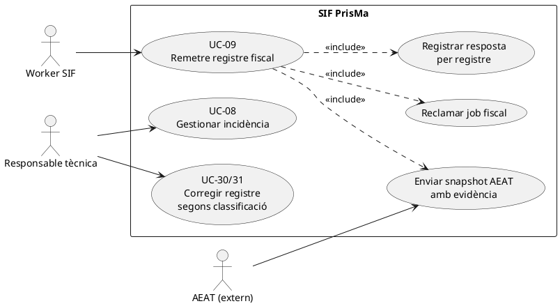
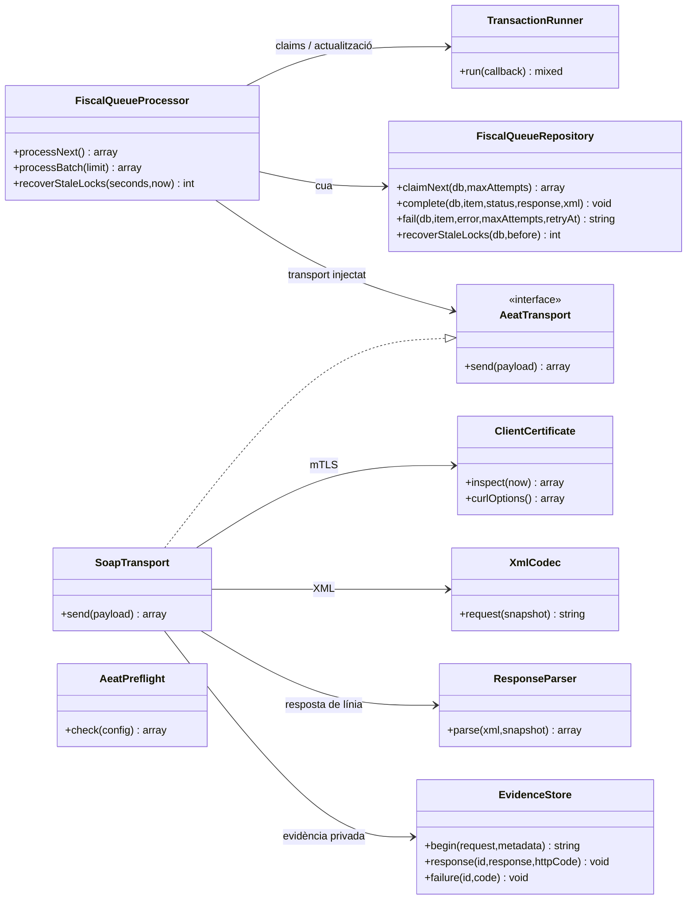
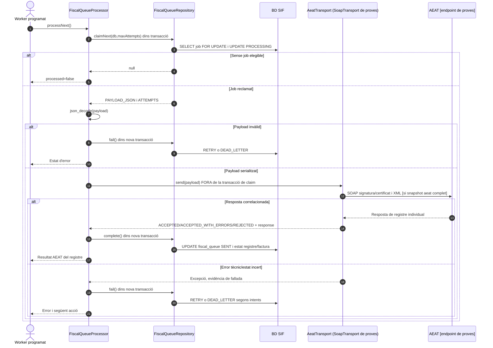
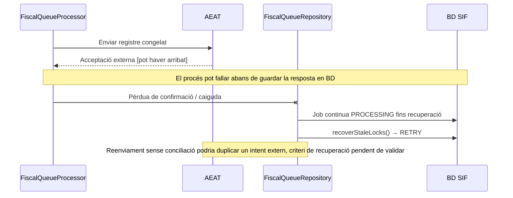
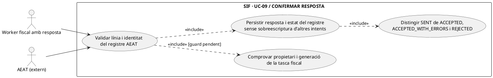
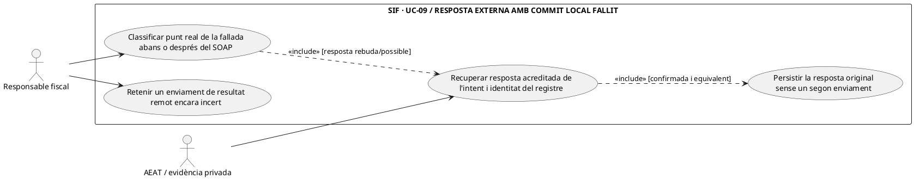

# UC-09 · Remetre un registre fiscal a AEAT — fitxa i UML integrats

**Àmbit:** enviar un registre **ja emès i congelat** al SIF. L'emissió i l'encadenament són UC-01/05/30/31; la remissió d'una tasca de `fiscal_queue` és UC-09. **Estat real contrastat amb `main`:** `FiscalQueueProcessor`, `FiscalQueueRepository`, `AeatTransport` i una implementació `SoapTransport` **limitada deliberadament a l'endpoint de proves**. Per tant, el catàleg que etiqueta UC-09 únicament `[DISSENY]` queda **desactualitzat respecte de l'existència de codi local**, però aquest codi **no acredita cap enviament real, resultat acceptat ni desplegament en producció**.

## 1. Fitxa del cas

| Camp | Descripció específica i estat |
| --- | --- |
| Actor inicial | Procés automàtic SIF/worker; AEAT és un sistema extern que respon. Responsable tècnica pot activar/revisar el procés segons política i permisos del panell pendent. |
| Disparador | Una entrada `fiscal_queue` `PENDING` o `RETRY` ha arribat a `NEXT_RETRY_AT` i no ha esgotat intents. |
| Precondicions de l'enviament real | Registre fiscal congelat, payload AEAT complet, configuració del servei de proves, certificat usable, dependències XML/cURL i directori privat d'evidències; `AeatPreflight` comprova diverses condicions locals però no prova confiança de l'AEAT ni bona representació fiscal. |
| Resultat del worker | `processed=false` si no hi ha job; si se'n reclama un, estat d'AEAT `ACCEPTED`, `ACCEPTED_WITH_ERRORS` o `REJECTED`, o `RETRY`/`DEAD_LETTER` davant fallada. |
| Límits de responsabilitat | `fiscal_queue.STATUS=SENT` significa petició enviada i resposta processada, **no** acceptació de cada registre. L'estat real de la línia es conserva a `factura_registres.ESTAT_AEAT` i al resum `factura.ESTAT_AEAT`. |
| Diners/inscripcions | UC-09 **no** crea `CHARGE`, `REFUND`, `payment_allocation` ni moviments d'atribució per inscripció. |

### 1.1. Flux executable del processador

1. `FiscalQueueProcessor::processNext()` usa `TransactionRunner` per reclamar una entrada; `FiscalQueueRepository::claimNext()` selecciona la primera `PENDING`/`RETRY` disponible amb `ATTEMPTS < maxAttempts`, aplica `FOR UPDATE`, la marca `PROCESSING` i n'incrementa els intents.
2. Decodifica `PAYLOAD_JSON`; si no és un objecte/array vàlid, deriva el job al tractament de fallada.
3. Invoca `AeatTransport::send(payload)` **fora de la transacció de reclamació**. `SoapTransport` concret exigeix `payload['aeat']` i rebutja un payload intern o llegat que no tingui snapshot AEAT.
4. L'implementació SOAP de proves genera XML amb `XmlCodec`, inspecciona el certificat amb `ClientCertificate`, crea evidència privada via `EvidenceStore`, envia amb cURL/mTLS i processa `ResponseParser`. El constructor rebutja qualsevol endpoint diferent de `TEST_ENDPOINT`.
5. `ResponseParser` comprova el registre respost (identitat de factura i operació) i distingeix `ACCEPTED`, `ACCEPTED_WITH_ERRORS` i `REJECTED`, amb indicadors de duplicat i revisió. **Els tests amb transport simulat no proven que un endpoint real hagi acceptat una petició.**
6. `FiscalQueueRepository::complete()` marca la cua `SENT`, desa XML i resposta al registre fiscal corresponent a `UUID_FACTURA` + `FISCAL_ORDER`, i actualitza `factura.ESTAT_AEAT` segons el resultat. La confirmació de la cua i dels estats de BD passa en una transacció **diferent** de l'enviament extern.
7. Davant error, `failure()` programa `RETRY` amb retard exponencial limitat; en esgotar intents, `DEAD_LETTER`, `ERROR` al registre/factura i informació de l'error. `recoverStaleLocks()` reprèn jobs en `PROCESSING` massa antics.

### 1.2. Alternatives, incidències i riscos identificats

| Escenari | Regla i evidència |
| --- | --- |
| Sense tasques elegibles | `processNext()` retorna `ok=true, processed=false`; no hi ha cap enviament. |
| AEAT accepta amb errors | Es registra `ACCEPTED_WITH_ERRORS` a `factura_registres` i `factura`; no s'ha de presentar com `ACCEPTED` sense incidències. |
| AEAT rebutja el registre | Es desa `REJECTED` i la resposta; la cua acaba `SENT` per haver-se tramitat la petició. **Decidir la correcció és un altre cas**; no reemetre la mateixa factura a cegues. |
| Error de transport o payload llegat | `RETRY` o `DEAD_LETTER` per intents; el worker no transforma màgicament un payload sense `aeat` en un registre vàlid. |
| Resposta HTTP 200, però SOAP ambigu, línia d'una altra factura o d'operació diferent | `ResponseParser` rebutja el resultat i `SoapTransport` el tracta com a resposta incerta que requereix revisió, conservant evidència. |
| Worker mor després de l'enviament extern i abans d'actualitzar BD | **Risc de resultat extern incert**. Recuperar un lock i reintentar pot repetir un enviament ja rebut; cal conciliació de l'evidència i resposta AEAT abans de permetre un reintent no supervisat, segons política final. |
| Evidència de certificat | `ClientCertificate::inspect()` verifica localment lectura, desxifrat, parella clau/certificat i dates, però no estableix per si sola revocació o capacitat representativa. |
| Estat `[DISSENY]` del catàleg | Es conserva com a etiqueta documental històrica fins a revisió; el codi actual té processador i transport de **proves**, no es pot inferir disponibilitat en producció. |

**Proves localitzades, NO executades ara:** `FiscalQueueProcessorTest` cobreix resposta simulada acceptada, errors, reintents, `DEAD_LETTER`, lots i locks; `AeatPreflightTest` comprova requisits locals. Falta evidència aquí d'un enviament real del certificat/endpoint requerits i del comportament davant resposta externa incerta.

### 1.3. Distingir la resposta del registre del resultat del transport — contrast amb el panell previst

**Tres identificadors i tres estats independents.** La factura ja emesa té `UUID_FACTURA` i número visible; el registre fiscal concret s'identifica amb `UUID_FACTURA` **i `FISCAL_ORDER`**; el treball de transport amb `fiscal_queue.ID`. En el panell previst `pay.prisma.cat/sif/registres-aeat` la consulta ha de mostrar **l'estat del job**, **el resultat AEAT de cada registre** i **l'estat resum de la factura**, sense transformar un `SENT` de transport en `ACCEPTED` fiscal. Una factura pot tenir diversos registres al llarg de la seva història i la resposta d'un no es pot imputar a tots pel sol `UUID_FACTURA`.

**Resposta amb errors o rebuig.** `FiscalQueueRepository::complete()` marca la cua `SENT` i desa la resposta de la línia sobre el registre del `FISCAL_ORDER` corresponent, també quan `ResponseParser` indica `ACCEPTED_WITH_ERRORS` o `REJECTED`. Aquesta situació requereix mostrar codi i detall de resposta i obrir revisió de l'operació, **no** tractar-la com un timeout que s'hagi de reenviar indefinidament ni modificar directament el document A/R inicial. El cas fiscal següent es classifica per UC-74/30/31 segons causa i evidència, no per la sola etiqueta `REJECTED`.

**Resposta remota incerta.** El transport opera **fora** de la transacció que reclama el job; si AEAT ha rebut l'XML però el procés cau abans de confirmar `complete()`, el registre local pot continuar `PROCESSING` i després `RETRY`. Recuperar el lock no acredita que el servidor remot **no** hagi registrat la petició. La política objectiu és preservar payload/XML, identitat de registre i evidència de cada intent, investigar el resultat extern i autoritzar un eventual reenviament del **mateix registre**, mai emetre una altra factura amb un nou número per «recuperar» la remissió.

**Preproducció i producció.** `SoapTransport` consultat restringeix el constructor a l'endpoint de proves. El panell pot mostrar mètriques locals i estats de transport, però ni un preflight local favorable ni un resultat amb transport simulat documenten recepció real ni disponibilitat productiva. Diferenciar clarament evidència de test, de resposta externa i de codi pendent d'adaptar abans de desplegar.

### 1.4. Proves de frontera entre emissió, transport i resultat (no executades)

| ID | Escenari | Resultat exigible |
| --- | --- | --- |
| AE-09-01 | Factura emesa i job encara PENDING | Factura real sense afirmar remissió ni acceptació AEAT. |
| AE-09-02 | Job SENT amb registre REJECTED | Mostrar rebuig i evidència, no etiquetar la factura com a acceptada. |
| AE-09-03 | Factura amb més d'un registre fiscal | Resposta i XML correlacionats amb `FISCAL_ORDER` correcte. |
| AE-09-04 | AEAT rep XML, worker cau abans de persistir resultat | Investigar intent i estat extern abans del retry; cap nova factura. |
| AE-09-05 | Preflight local satisfactori sense enviament extern | No etiquetar «acceptat per AEAT» ni «producció acreditada». |

## 2. Diagrama UML de casos d'ús



## 3. Diagrama de classes — codi present a `main`



## 4. Diagrama de seqüència — remissió i resposta



### 4.1. Seqüència d'estat extern incert — risc de duplicat



### 4.2. Acció independent: registrar una resposta AEAT correlacionada només per a l'intent fiscal vigent — PHP real sense fencing / DISSENY

**Actor/disparador:** `AeatTransport::send(payload)` retorna `ACCEPTED`, `ACCEPTED_WITH_ERRORS` o `REJECTED` i l'array de resposta del registre immutable. **Entrades:** `fiscal_queue.ID`, `UUID_FACTURA`, `FISCAL_ORDER` del payload, resposta individual, `request_xml` i identitat de l'intent que havia reclamat la tasca. **Postcondició correcta:** una sola transició final feta per **l'intent que encara conserva la propietat**; desar XML/resposta al registre fiscal de l'ordre exacte i exposar per separat `SENT` de cua i estat AEAT de línia. Un `REJECTED` és una resposta remota tractada, no un error de transport a reenviar indefinidament.

**Comportament contrastat:** `FiscalQueueRepository::complete()` marca `fiscal_queue.STATUS='SENT'` amb `UPDATE ... WHERE ID=?`, sense exigir `PROCESSING`, propietari ni generació; actualitza el registre amb `WHERE UUID_FACTURA=? AND FISCAL_ORDER=?` i valida que s'ha actualitzat una fila; finalment actualitza `factura.ESTAT_AEAT` per `UUID_FACTURA`. `FiscalQueueProcessor::processNext()` tracta una excepció de `complete()` mitjançant el mateix `catch` que una excepció de transport i crida `failure()`, **encara que el SOAP ja hagués retornat una resposta remota**. Sense una categoria d'intent obsolet, una cursa de lock/commit pot convertir un resultat extern real en `RETRY` o `DEAD_LETTER` local.



```mermaid
sequenceDiagram
autonumber
actor W as Worker fiscal
participant T as AeatTransport [PHP]
participant G as FiscalAttemptOwnershipGuard [DISSENY]
participant Q as FiscalQueueRepository [PHP]
participant DB as fiscal_queue + factura_registres + factura
W->>T: send(payload de F+FISCAL_ORDER)
T-->>W: status + response individual + request_xml
W->>G: confirmOnlyIfOwner(queueId,attemptToken,status,response) [PENDENT]
G->>DB: BEGIN i verificar lock/generació vigent i identitat d'F+FISCAL_ORDER
alt Intent obsolet o resposta atribuïda a una altra línia
 DB-->>G: STALE_ATTEMPT/CONFLICT
 G-->>W: Conservar evidència i conciliar; cap UPDATE de fila actual
else Intent vigent i resposta correlacionada
 G->>Q: complete(db,item,status,response,request_xml) [PHP: sense fencing propi]
 Q->>DB: UPDATE fiscal_queue SENT WHERE ID
 Q->>DB: UPDATE factura_registres per F+FISCAL_ORDER
 Q->>DB: UPDATE factura.ESTAT_AEAT del resum
 G->>DB: COMMIT
 G-->>W: Job SENT + estat real del registre (no implica ACCEPTED)
end
Note over G,Q: El PHP present crida Q dins TransactionRunner però NO passa per G. Guard i token són DISSENY.
```

### 4.3. Acció independent: tractar una fallada local després de rebre resposta remota — DISSENY

**Actor/disparador:** `send()` ha retornat una resposta correlacionada, però `complete()` falla per BD, propietat perduda o altra incidència; o bé el procés mor entre rebre resposta i fer commit local. **Precondicions:** distingir error **abans d'enviar**, transport de resultat **remot incert** i error **després de resposta rebuda**; preservar identificador/hash d'intent i XML/resposta abans de decidir un reenviament. **Postcondició:** recuperar la mateixa resposta sobre el registre fiscal original quan estigui acreditada; si continua incerta, mantenir revisió o quarantena. Cap segona emissió, cap nou número i cap `REJECTED/ERROR` atribuït a AEAT sense resposta correlacionada.

**Frontera real:** `FiscalQueueProcessor::processNext()` inclou `$this->transactions->run(fn=>queue->complete(...))` dins el `try` que també inclou `transport->send()`. El `catch` crida `failure(item,exception)` per qualsevol excepció, també si la resposta externa **ja existeix en memòria**. `fail()` marca `RETRY/DEAD_LETTER` per `ID`, no comprova propietat, ni desa la resposta rebuda en aquell camí. `EvidenceStore` crea XML i metadades privades per intent, però **no s'ha acreditat** al processador un ledger/writer SQL que correlacioni tots els intents amb el registre i reconstitueixi automàticament la resposta després de fallada local. **Precisió del transport:** `SoapTransport::send()` inclou `uuid_factura` i `fiscal_order` als metadades privats de `EvidenceStore::begin()`; en una resposta normal afegeix `response.evidence_id` al resultat, que `complete()` pot desar com a part de `AEAT_RESPONSE_JSON`. Si `complete()` falla/hi ha una caiguda, l'identificador de l'intent **no queda garantit en una taula SQL** per aquell camí, malgrat existir els fitxers al directori privat. `EvidenceStore` proporciona escriptura append-only (`begin/response/failure`), no una API PHP pública de cerca i lectura d'intents per tasca: el lector/procediment de reconciliació continua pendent. `aeat_submission_attempt` existeix a migracions posteriors, però el camí de processador revisat no l'escriu.



```mermaid
sequenceDiagram
autonumber
actor R as Responsable fiscal
participant T as AeatTransport + EvidenceStore [PHP]
participant Q as FiscalQueueProcessor + FiscalQueueRepository [PHP]
participant DB as fiscal_queue + factura_registres [SQL]
participant G as FiscalSubmissionAttemptReconciler [DISSENY]
Q->>T: send(payload original F+FISCAL_ORDER)
T-->>Q: ACCEPTED,responseOriginal,requestXml [remot rebut]
Q->>DB: BEGIN; complete(item,responseOriginal)
DB--xQ: Error local/commit fallit [exemple possible]
Q->>Q: catch -> failure(item,error) [PHP real]
Q->>DB: UPDATE RETRY o DEAD_LETTER per ID [sense propietari]
R->>G: Conciliar intent amb resposta remota ja rebuda
G->>T: Recuperar XML i resposta originals d'evidència privada
G->>DB: Consultar registre F+FISCAL_ORDER i estat local actual
alt Resposta íntegra correlacionada amb registre original
 G-->>R: Persistir resultat acreditat sense segon SOAP [DISSENY]
else Estat extern encara incert o contradicció de propietat
 G-->>R: Revisió/retenció; no reconvertir-se automàticament en nou enviament
end
Note over Q,G: El reconciliador no existeix al PHP examinat; el transport de proves i la guarda de fitxers no proven recepció de producció.
```

| Prova pendent | Escenari | Resultat exigible |
| --- | --- | --- |
| AE-09-06 | Resposta ACCEPTED de línia vàlida, `complete()` pateix excepció/rollback local | No classificar-la com a «AEAT no ha acceptat» ni reenviar a cegues; recuperar resposta i identitat de l'intent. |
| AE-09-07 | A obté resposta i B torna a reclamar el mateix job recuperat | A no sobreescriu B, conservar resposta real d'A per conciliació sense falsejar-ne propietat. |
| AE-09-08 | Q marca SENT amb resposta REJECTED | Mostrar remissió acabada i rebuig de línia; tramitar revisió separada, no inventar una fallada de transport. |
| AE-09-09 | `complete()` rep UUID_FACTURA vàlid però FISCAL_ORDER no existent | Rollback de la transacció completa; conservar error i evidència, no marcar SENT el job incompatible. |
| AE-09-10 | Dues respostes/estats d'intent incompatibles per la mateixa ordre fiscal | Correlacionar cada intent i resoldre segons evidència, no sobreescriure per ordre d'arribada local. |
| AE-09-11 | `SoapTransport` ha creat `request.json`/`response.xml` privats però `complete()` falla | Localitzar el mateix `evidence_id` amb `UUID_FACTURA+FISCAL_ORDER`; el PHP actual no garanteix índex SQL de l'intent quan no es confirma `AEAT_RESPONSE_JSON`. |

## 5. Matriu de persistència i evidències

| Etapa | Dada |
| --- | --- |
| Emissió original | `factura_registres.PAYLOAD_JSON` + `HASH_FACT`, `fiscal_queue.PAYLOAD_JSON`. La inserció de la cua **no** significa enviament. |
| Reclamació | `fiscal_queue.STATUS=PROCESSING`, `ATTEMPTS`, `LOCKED_AT`. |
| Enviament / resposta | XML i resposta a `factura_registres`; `ESTAT_AEAT` a registre/factura; estat cua `SENT`. |
| Fallada | `LAST_ERROR`, `NEXT_RETRY_AT`, `RETRY` o `DEAD_LETTER`; resum `ERROR` al registre/factura quan s'esgoten intents. |
| Evidència detallada externa | `EvidenceStore` crea fitxers privats fora del repositori, amb identificador d'intent. La migració també preveu `aeat_submission_attempt`, però el camí `FiscalQueueProcessor` consultat **no demostra que escrigui aquesta taula**. |

## 6. Fonts

[Fitxa base UC-09](../06-fitxes-funcionals/uc-009.md) · [Catàleg UC-09](../04-estat-final/33-casos-us-sif.md) · [Documentació SIF AEAT](../01-compliment-aeat/documentacio-sif-aeat.md) · [FiscalQueueProcessor](../../sif/src/Service/FiscalQueueProcessor.php) · [FiscalQueueRepository](../../sif/src/Repository/FiscalQueueRepository.php) · [Transport SOAP de proves](../../sif/src/Aeat/SoapTransport.php) · [ResponseParser](../../sif/src/Aeat/ResponseParser.php) · [EvidenceStore](../../sif/src/Aeat/EvidenceStore.php) · [AeatPreflight](../../sif/src/Service/AeatPreflight.php) · [FiscalQueueProcessorTest](../../sif/tests/Integration/FiscalQueueProcessorTest.php).

**No es declara:** compliment normatiu de l'entorn desplegat, acceptació real d'AEAT, ús de certificat productiu, o execució de proves en aquesta revisió.
