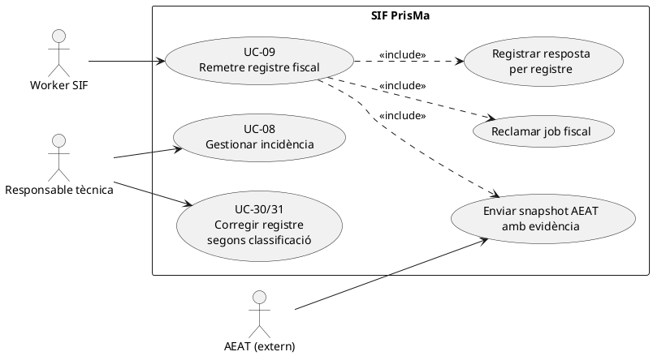
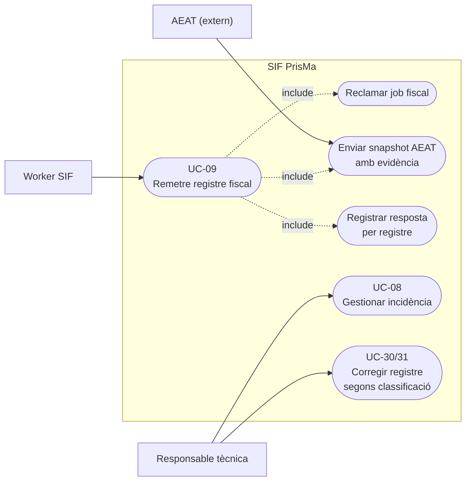
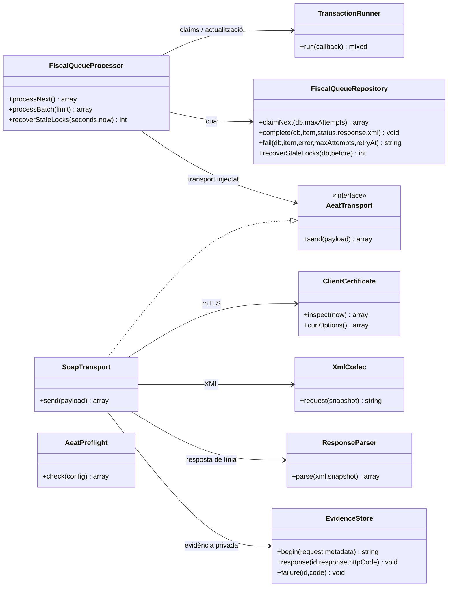
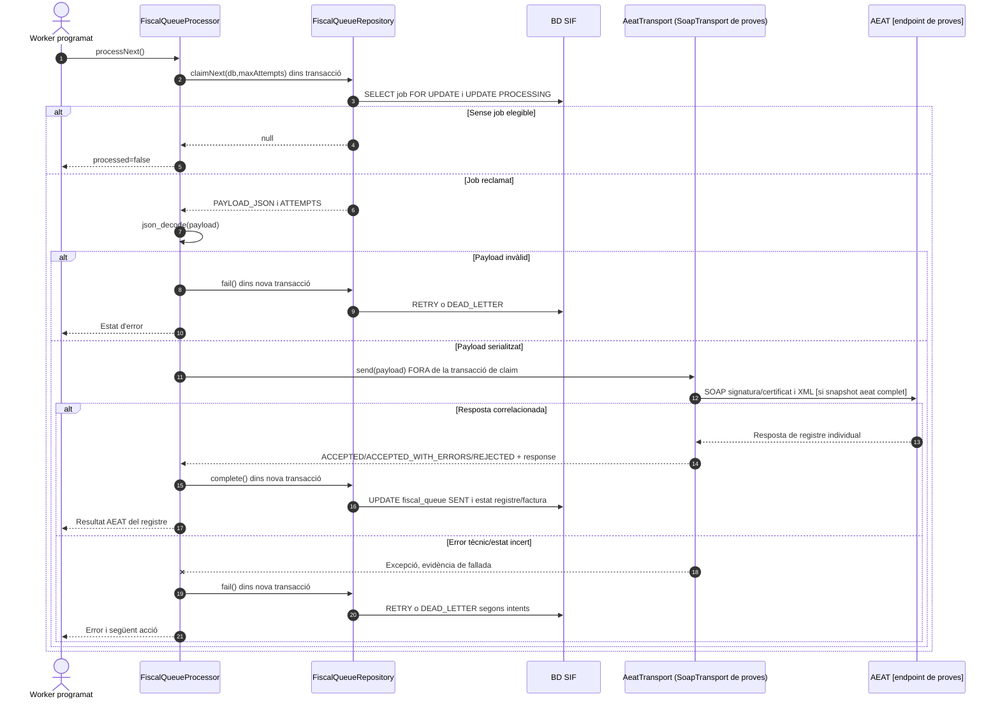
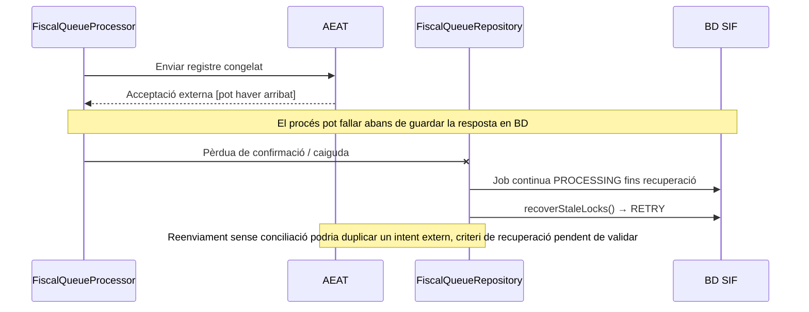
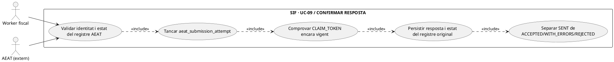
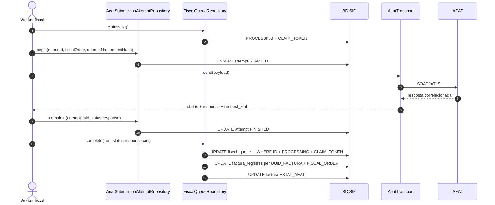
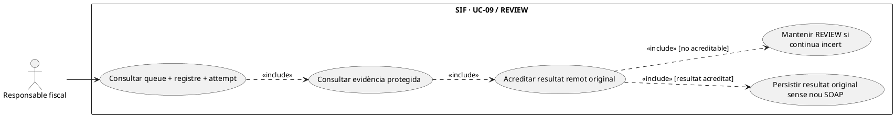
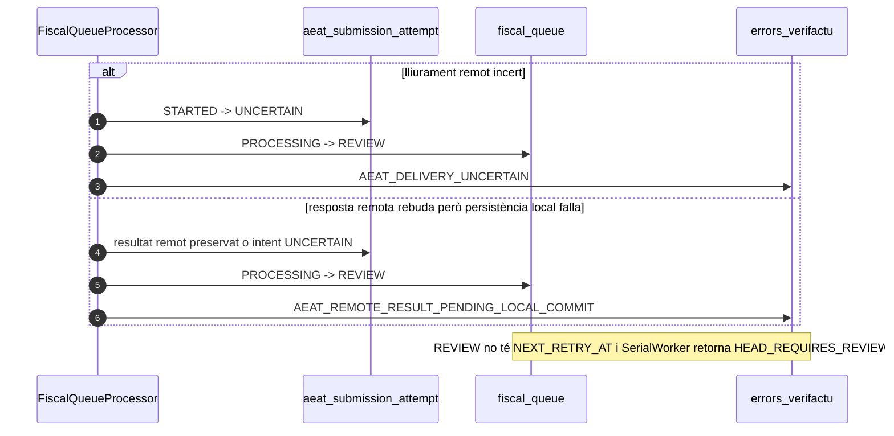
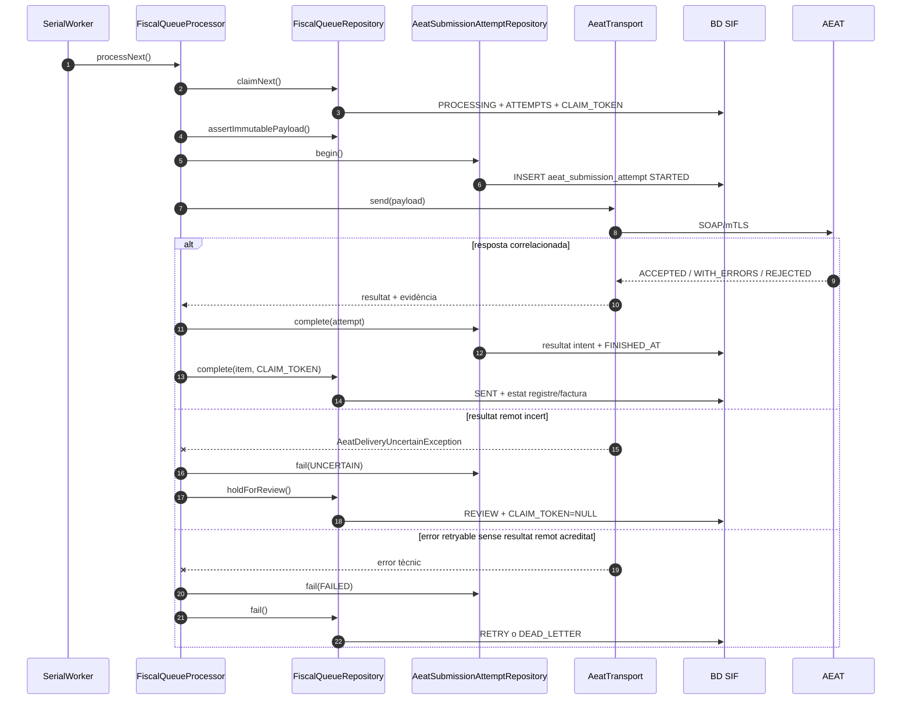

# UC-09 · Remetre un registre fiscal a AEAT — fitxa i UML integrats

**Àmbit:** enviar un registre **ja emès i congelat** al SIF. L'emissió i l'encadenament són UC-01/05/30/31; la remissió d'una tasca de `fiscal_queue` és UC-09. **Estat contrastat:** el backend de preproducció és executable (`SerialWorker`, `FiscalQueueProcessor`, `FiscalQueueRepository`, `FlowControlledTransport`, `SoapTransport` de proves, validació de resposta i evidència). La branca d'auditoria 2026-09-29 hi afegeix `CLAIM_TOKEN`, persistència real a `aeat_submission_attempt`, estat `REVIEW` i API interna de consulta. Això **no acredita enviament real acceptat per AEAT ni desplegament de producció**.

## 1. Fitxa del cas

| Camp | Descripció específica i estat |
| --- | --- |
| Actor inicial | Procés automàtic SIF/worker; AEAT és un sistema extern que respon. Responsable tècnica pot activar/revisar el procés segons política i permisos del panell pendent. |
| Disparador | Una entrada `fiscal_queue` `PENDING` o `RETRY` ha arribat a `NEXT_RETRY_AT` i no ha esgotat intents. |
| Precondicions de l'enviament real | Registre fiscal congelat, payload AEAT complet, configuració del servei de proves, certificat usable, dependències XML/cURL i directori privat d'evidències; `AeatPreflight` comprova diverses condicions locals però no prova confiança de l'AEAT ni bona representació fiscal. |
| Resultat del worker | `processed=false` si no hi ha job; si se'n reclama un, estat d'AEAT `ACCEPTED`, `ACCEPTED_WITH_ERRORS` o `REJECTED`, o `RETRY`/`DEAD_LETTER` davant fallada. |
| Límits de responsabilitat | `fiscal_queue.STATUS=SENT` significa petició enviada i resposta processada, **no** acceptació de cada registre. L'estat real de la línia es conserva a `factura_registres.ESTAT_AEAT` i al resum `factura.ESTAT_AEAT`. |
| Diners/inscripcions | UC-09 **no** crea `CHARGE`, `REFUND`, `payment_allocation` ni moviments d'atribució per inscripció. |

### 1.1. Flux executable del processador

1. `FiscalQueueProcessor::processNext()` usa `TransactionRunner` per reclamar una entrada; `FiscalQueueRepository::claimNext()` selecciona la primera `PENDING`/`RETRY` disponible amb `ATTEMPTS < maxAttempts`, aplica `FOR UPDATE`, la marca `PROCESSING` i n'incrementa els intents.
2. Decodifica `PAYLOAD_JSON`; si no és un objecte/array vàlid, deriva el job al tractament de fallada.
3. Invoca `AeatTransport::send(payload)` **fora de la transacció de reclamació**. `SoapTransport` concret exigeix `payload['aeat']` i rebutja un payload intern o llegat que no tingui snapshot AEAT.
4. L'implementació SOAP de proves genera XML amb `XmlCodec`, inspecciona el certificat amb `ClientCertificate`, crea evidència privada via `EvidenceStore`, envia amb cURL/mTLS i processa `ResponseParser`. El constructor rebutja qualsevol endpoint diferent de `TEST_ENDPOINT`.
5. `ResponseParser` comprova el registre respost (identitat de factura i operació) i distingeix `ACCEPTED`, `ACCEPTED_WITH_ERRORS` i `REJECTED`, amb indicadors de duplicat i revisió. **Els tests amb transport simulat no proven que un endpoint real hagi acceptat una petició.**
6. `FiscalQueueRepository::complete()` marca la cua `SENT`, desa XML i resposta al registre fiscal corresponent a `UUID_FACTURA` + `FISCAL_ORDER`, i actualitza `factura.ESTAT_AEAT` segons el resultat. La confirmació de la cua i dels estats de BD passa en una transacció **diferent** de l'enviament extern.
7. Davant error, `failure()` programa `RETRY` amb retard exponencial limitat; en esgotar intents, `DEAD_LETTER`, `ERROR` al registre/factura i informació de l'error. `recoverStaleLocks()` reprèn jobs en `PROCESSING` massa antics.

### 1.2. Alternatives, incidències i riscos identificats

| Escenari | Regla i evidència |
| --- | --- |
| Sense tasques elegibles | `processNext()` retorna `ok=true, processed=false`; no hi ha cap enviament. |
| AEAT accepta amb errors | Es registra `ACCEPTED_WITH_ERRORS` a `factura_registres` i `factura`; no s'ha de presentar com `ACCEPTED` sense incidències. |
| AEAT rebutja el registre | Es desa `REJECTED` i la resposta; la cua acaba `SENT` per haver-se tramitat la petició. **Decidir la correcció és un altre cas**; no reemetre la mateixa factura a cegues. |
| Error de transport o payload llegat | `RETRY` o `DEAD_LETTER` per intents; el worker no transforma màgicament un payload sense `aeat` en un registre vàlid. |
| Resposta HTTP 200, però SOAP ambigu, línia d'una altra factura o d'operació diferent | `ResponseParser` rebutja el resultat i `SoapTransport` el tracta com a resposta incerta que requereix revisió, conservant evidència. |
| Worker mor després de l'enviament extern i abans d'actualitzar BD | **Risc de resultat extern incert**. Recuperar un lock i reintentar pot repetir un enviament ja rebut; cal conciliació de l'evidència i resposta AEAT abans de permetre un reintent no supervisat, segons política final. |
| Evidència de certificat | `ClientCertificate::inspect()` verifica localment lectura, desxifrat, parella clau/certificat i dates, però no estableix per si sola revocació o capacitat representativa. |
| Estat `[DISSENY]` del catàleg | Es conserva com a etiqueta documental històrica fins a revisió; el codi actual té processador i transport de **proves**, no es pot inferir disponibilitat en producció. |

**Proves localitzades, NO executades ara:** `FiscalQueueProcessorTest` cobreix resposta simulada acceptada, errors, reintents, `DEAD_LETTER`, lots i locks; `AeatPreflightTest` comprova requisits locals. Falta evidència aquí d'un enviament real del certificat/endpoint requerits i del comportament davant resposta externa incerta.

### 1.3. Distingir la resposta del registre del resultat del transport — contrast amb el panell previst

**Tres identificadors i tres estats independents.** La factura ja emesa té `UUID_FACTURA` i número visible; el registre fiscal concret s'identifica amb `UUID_FACTURA` **i `FISCAL_ORDER`**; el treball de transport amb `fiscal_queue.ID`. En el panell previst `pay.prisma.cat/sif/registres-aeat` la consulta ha de mostrar **l'estat del job**, **el resultat AEAT de cada registre** i **l'estat resum de la factura**, sense transformar un `SENT` de transport en `ACCEPTED` fiscal. Una factura pot tenir diversos registres al llarg de la seva història i la resposta d'un no es pot imputar a tots pel sol `UUID_FACTURA`.

**Resposta amb errors o rebuig.** `FiscalQueueRepository::complete()` marca la cua `SENT` i desa la resposta de la línia sobre el registre del `FISCAL_ORDER` corresponent, també quan `ResponseParser` indica `ACCEPTED_WITH_ERRORS` o `REJECTED`. Aquesta situació requereix mostrar codi i detall de resposta i obrir revisió de l'operació, **no** tractar-la com un timeout que s'hagi de reenviar indefinidament ni modificar directament el document A/R inicial. El cas fiscal següent es classifica per UC-74/30/31 segons causa i evidència, no per la sola etiqueta `REJECTED`.

**Resposta remota incerta.** El transport opera **fora** de la transacció que reclama el job; si AEAT ha rebut l'XML però el procés cau abans de confirmar `complete()`, el registre local pot continuar `PROCESSING` i després `RETRY`. Recuperar el lock no acredita que el servidor remot **no** hagi registrat la petició. La política objectiu és preservar payload/XML, identitat de registre i evidència de cada intent, investigar el resultat extern i autoritzar un eventual reenviament del **mateix registre**, mai emetre una altra factura amb un nou número per «recuperar» la remissió.

**Preproducció i producció.** `SoapTransport` consultat restringeix el constructor a l'endpoint de proves. El panell pot mostrar mètriques locals i estats de transport, però ni un preflight local favorable ni un resultat amb transport simulat documenten recepció real ni disponibilitat productiva. Diferenciar clarament evidència de test, de resposta externa i de codi pendent d'adaptar abans de desplegar.

### 1.4. Proves de frontera entre emissió, transport i resultat (no executades)

| ID | Escenari | Resultat exigible |
| --- | --- | --- |
| AE-09-01 | Factura emesa i job encara PENDING | Factura real sense afirmar remissió ni acceptació AEAT. |
| AE-09-02 | Job SENT amb registre REJECTED | Mostrar rebuig i evidència, no etiquetar la factura com a acceptada. |
| AE-09-03 | Factura amb més d'un registre fiscal | Resposta i XML correlacionats amb `FISCAL_ORDER` correcte. |
| AE-09-04 | AEAT rep XML, worker cau abans de persistir resultat | Investigar intent i estat extern abans del retry; cap nova factura. |
| AE-09-05 | Preflight local satisfactori sense enviament extern | No etiquetar «acceptat per AEAT» ni «producció acreditada». |

## 2. Diagrama UML de casos d'ús

```plantuml
@startuml
left to right direction
actor "Worker SIF" as W
actor "AEAT (extern)" as AEAT
actor "Responsable tècnica" as T
rectangle "SIF PrisMa" {
 usecase "UC-09\nRemetre registre fiscal" as Send
 usecase "Reclamar job fiscal" as Claim
 usecase "Enviar snapshot AEAT\namb evidència" as Soap
 usecase "Registrar resposta\nper registre" as Response
 usecase "UC-08\nGestionar incidència" as Inc
 usecase "UC-30/31\nCorregir registre\nsegons classificació" as Fix
}
W --> Send
AEAT --> Soap
T --> Inc
T --> Fix
Send ..> Claim : <<include>>
Send ..> Soap : <<include>>
Send ..> Response : <<include>>
@enduml
```

### Vista de casos d’ús per a GitHub (Mermaid)

```mermaid
flowchart LR
  actor_0["Worker SIF"]
  actor_1["AEAT (extern)"]
  actor_2["Responsable tècnica"]
  subgraph SIF_BOX["SIF PrisMa"]
    uc_0(["UC-09<br/>Remetre registre fiscal"])
    uc_1(["Reclamar job fiscal"])
    uc_2(["Enviar snapshot AEAT<br/>amb evidència"])
    uc_3(["Registrar resposta<br/>per registre"])
    uc_4(["UC-08<br/>Gestionar incidència"])
    uc_5(["UC-30/31<br/>Corregir registre<br/>segons classificació"])
  end
  actor_0 --> uc_0
  actor_1 --> uc_2
  actor_2 --> uc_4
  actor_2 --> uc_5
  uc_0 -.->|include| uc_1
  uc_0 -.->|include| uc_2
  uc_0 -.->|include| uc_3
```

## 3. Diagrama de classes — codi present a `main`

```mermaid
classDiagram
direction LR
class FiscalQueueProcessor {
 +processNext() array
 +processBatch(limit) array
 +recoverStaleLocks(seconds,now) int
}
class FiscalQueueRepository {
 +claimNext(db,maxAttempts) array
 +complete(db,item,status,response,xml) void
 +fail(db,item,error,maxAttempts,retryAt) string
 +recoverStaleLocks(db,before) int
}
class TransactionRunner {
 +run(callback) mixed
}
class AeatTransport {
 <<interface>>
 +send(payload) array
}
class SoapTransport {
 +send(payload) array
}
class ClientCertificate {
 +inspect(now) array
 +curlOptions() array
}
class XmlCodec {
 +request(snapshot) string
}
class ResponseParser {
 +parse(xml,snapshot) array
}
class EvidenceStore {
 +begin(request,metadata) string
 +response(id,response,httpCode) void
 +failure(id,code) void
}
class AeatPreflight {
 +check(config) array
}
FiscalQueueProcessor --> TransactionRunner : claims / actualització
FiscalQueueProcessor --> FiscalQueueRepository : cua
FiscalQueueProcessor --> AeatTransport : transport injectat
SoapTransport ..|> AeatTransport
SoapTransport --> ClientCertificate : mTLS
SoapTransport --> XmlCodec : XML
SoapTransport --> ResponseParser : resposta de línia
SoapTransport --> EvidenceStore : evidència privada
```

## 4. Diagrama de seqüència — remissió i resposta

```mermaid
sequenceDiagram
autonumber
actor Worker as Worker programat
participant P as FiscalQueueProcessor
participant Q as FiscalQueueRepository
participant DB as BD SIF
participant T as AeatTransport (SoapTransport de proves)
participant AEAT as AEAT [endpoint de proves]
Worker->>P: processNext()
P->>Q: claimNext(db,maxAttempts) dins transacció
Q->>DB: SELECT job FOR UPDATE i UPDATE PROCESSING
alt Sense job elegible
 Q-->>P: null
 P-->>Worker: processed=false
else Job reclamat
 Q-->>P: PAYLOAD_JSON i ATTEMPTS
 P->>P: json_decode(payload)
 alt Payload invàlid
  P->>Q: fail() dins nova transacció
  Q->>DB: RETRY o DEAD_LETTER
  P-->>Worker: Estat d'error
 else Payload serialitzat
  P->>T: send(payload) FORA de la transacció de claim
  T->>AEAT: SOAP signatura/certificat i XML [si snapshot aeat complet]
  alt Resposta correlacionada
   AEAT-->>T: Resposta de registre individual
   T-->>P: ACCEPTED/ACCEPTED_WITH_ERRORS/REJECTED + response
   P->>Q: complete() dins nova transacció
   Q->>DB: UPDATE fiscal_queue SENT i estat registre/factura
   P-->>Worker: Resultat AEAT del registre
  else Error tècnic/estat incert
   T--xP: Excepció, evidència de fallada
   P->>Q: fail() dins nova transacció
   Q->>DB: RETRY o DEAD_LETTER segons intents
   P-->>Worker: Error i següent acció
  end
 end
end
```

### 4.1. Seqüència d'estat extern incert — risc de duplicat

```mermaid
sequenceDiagram
participant P as FiscalQueueProcessor
participant T as AEAT
participant Q as FiscalQueueRepository
participant DB as BD SIF
P->>T: Enviar registre congelat
T-->>P: Acceptació externa [pot haver arribat]
Note over P,DB: El procés pot fallar abans de guardar la resposta en BD
P-xQ: Pèrdua de confirmació / caiguda
Q->>DB: Job continua PROCESSING fins recuperació
Q->>DB: recoverStaleLocks() → RETRY
Note over Q,T: Reenviament sense conciliació podria duplicar un intent extern, criteri de recuperació pendent de validar
```

### 4.2. Acció independent: registrar una resposta AEAT correlacionada només per a l'intent fiscal vigent — auditoria inicial i correcció

**Actor/disparador:** `AeatTransport::send(payload)` retorna `ACCEPTED`, `ACCEPTED_WITH_ERRORS` o `REJECTED` i la resposta del registre immutable.

**Auditoria inicial:** `complete()` només filtrava per `ID` i una fallada local posterior al SOAP podia acabar en el mateix camí de retry que un error de transport.

**Correcció implementada a la branca UC-009:** cada claim genera `CLAIM_TOKEN`; `complete()`, `fail()` i la quarantena d'integritat exigeixen `ID + STATUS=PROCESSING + CLAIM_TOKEN`. Abans de sortir a xarxa es crea un `aeat_submission_attempt` amb `ATTEMPT_NO` i `REQUEST_HASH`.

```plantuml
@startuml
left to right direction
actor "Worker fiscal" as W
actor "AEAT (extern)" as A
rectangle "SIF · UC-09 / CONFIRMAR RESPOSTA" {
 usecase "Validar identitat i estat\ndel registre AEAT" as Validate
 usecase "Comprovar CLAIM_TOKEN\nencara vigent" as Own
 usecase "Tancar aeat_submission_attempt" as Attempt
 usecase "Persistir resposta i estat\ndel registre original" as Persist
 usecase "Separar SENT de\nACCEPTED/WITH_ERRORS/REJECTED" as Distinct
}
W --> Validate
A --> Validate
Validate ..> Attempt : <<include>>
Attempt ..> Own : <<include>>
Own ..> Persist : <<include>>
Persist ..> Distinct : <<include>>
@enduml
```

```mermaid
sequenceDiagram
autonumber
actor W as Worker fiscal
participant A as AeatSubmissionAttemptRepository
participant Q as FiscalQueueRepository
participant DB as BD SIF
participant T as AeatTransport
participant X as AEAT

W->>Q: claimNext()
Q->>DB: PROCESSING + CLAIM_TOKEN
W->>A: begin(queueId, fiscalOrder, attemptNo, requestHash)
A->>DB: INSERT attempt STARTED
W->>T: send(payload)
T->>X: SOAP/mTLS
X-->>T: resposta correlacionada
T-->>W: status + response + request_xml
W->>A: complete(attemptUuid,status,response)
A->>DB: UPDATE attempt FINISHED
W->>Q: complete(item,status,response,xml)
Q->>DB: UPDATE fiscal_queue ... WHERE ID + PROCESSING + CLAIM_TOKEN
Q->>DB: UPDATE factura_registres per UUID_FACTURA + FISCAL_ORDER
Q->>DB: UPDATE factura.ESTAT_AEAT
```

### 4.3. Acció independent: tractar una fallada local després de rebre resposta remota — REVIEW implementat / reconciliació operativa pendent

**Actor/disparador:** l'enviament pot haver arribat a AEAT però el SIF no disposa encara d'un resultat local consolidat, o bé s'ha rebut una resposta però falla la persistència posterior.

**Estat corregit:** `FiscalQueueProcessor` distingeix tres famílies:
1. error tècnic retryable sense resultat remot acreditat → `FAILED` + `RETRY/DEAD_LETTER`;
2. resultat remot incert → `UNCERTAIN` + `REVIEW`;
3. resposta remota certa que no es pot consolidar localment → intent preservat + `REVIEW`.

`REVIEW` bloqueja el head i evita reenviaments automàtics. Continua pendent l'acció operativa que permeti conciliar i tancar el job sense un segon SOAP.

```plantuml
@startuml
left to right direction
actor "Responsable fiscal" as R
rectangle "SIF · UC-09 / REVIEW" {
 usecase "Consultar queue + registre + attempt" as Inspect
 usecase "Consultar evidència protegida" as Evidence
 usecase "Acreditar resultat remot original" as Reconcile
 usecase "Persistir resultat original\nsense nou SOAP" as Save
 usecase "Mantenir REVIEW si\ncontinua incert" as Hold
}
R --> Inspect
Inspect ..> Evidence : <<include>>
Evidence ..> Reconcile : <<include>>
Reconcile ..> Save : <<include>> [resultat acreditat]
Reconcile ..> Hold : <<include>> [no acreditable]
@enduml
```

```mermaid
sequenceDiagram
autonumber
participant P as FiscalQueueProcessor
participant A as aeat_submission_attempt
participant Q as fiscal_queue
participant I as errors_verifactu

alt lliurament remot incert
 P->>A: STARTED -> UNCERTAIN
 P->>Q: PROCESSING -> REVIEW
 P->>I: AEAT_DELIVERY_UNCERTAIN
else resposta remota rebuda però persistència local falla
 P->>A: resultat remot preservat o intent UNCERTAIN
 P->>Q: PROCESSING -> REVIEW
 P->>I: AEAT_REMOTE_RESULT_PENDING_LOCAL_COMMIT
end
Note over Q,I: REVIEW no té NEXT_RETRY_AT i SerialWorker retorna HEAD_REQUIRES_REVIEW
```

| Prova pendent | Escenari | Resultat exigible |
| --- | --- | --- |
| AE-09-06 | Resposta ACCEPTED de línia vàlida, `complete()` pateix excepció/rollback local | No classificar-la com a «AEAT no ha acceptat» ni reenviar a cegues; recuperar resposta i identitat de l'intent. |
| AE-09-07 | A obté resposta i B torna a reclamar el mateix job recuperat | A no sobreescriu B, conservar resposta real d'A per conciliació sense falsejar-ne propietat. |
| AE-09-08 | Q marca SENT amb resposta REJECTED | Mostrar remissió acabada i rebuig de línia; tramitar revisió separada, no inventar una fallada de transport. |
| AE-09-09 | `complete()` rep UUID_FACTURA vàlid però FISCAL_ORDER no existent | Rollback de la transacció completa; conservar error i evidència, no marcar SENT el job incompatible. |
| AE-09-10 | Dues respostes/estats d'intent incompatibles per la mateixa ordre fiscal | Correlacionar cada intent i resoldre segons evidència, no sobreescriure per ordre d'arribada local. |
| AE-09-11 | `SoapTransport` ha creat `request.json`/`response.xml` privats però `complete()` falla | Localitzar el mateix `evidence_id` amb `UUID_FACTURA+FISCAL_ORDER`; el PHP actual no garanteix índex SQL de l'intent quan no es confirma `AEAT_RESPONSE_JSON`. |

## 5. Matriu de persistència i evidències

| Etapa | Dada |
| --- | --- |
| Emissió original | `factura_registres.PAYLOAD_JSON` + `HASH_FACT`, `fiscal_queue.PAYLOAD_JSON`. La inserció de la cua **no** significa enviament. |
| Reclamació | `fiscal_queue.STATUS=PROCESSING`, `ATTEMPTS`, `LOCKED_AT`, `CLAIM_TOKEN`. |
| Enviament / resposta | XML i resposta a `factura_registres`; `ESTAT_AEAT` a registre/factura; estat cua `SENT`. |
| Fallada | Error retryable: `RETRY/DEAD_LETTER`; resultat remot incert o commit local posterior fallit: `REVIEW` sense `NEXT_RETRY_AT`. |
| Evidència detallada externa | `EvidenceStore` crea fitxers privats fora del repositori. `AeatSubmissionAttemptRepository` escriu `aeat_submission_attempt` abans de xarxa i tanca l'intent com `ACCEPTED`, `ACCEPTED_WITH_ERRORS`, `REJECTED`, `FAILED` o `UNCERTAIN`. |

## 6. Fonts

[Fitxa base UC-09](../06-fitxes-funcionals/uc-009.md) · [Catàleg UC-09](../04-estat-final/33-casos-us-sif.md) · [Documentació SIF AEAT](../01-compliment-aeat/documentacio-sif-aeat.md) · [FiscalQueueProcessor](../../sif/src/Service/FiscalQueueProcessor.php) · [FiscalQueueRepository](../../sif/src/Repository/FiscalQueueRepository.php) · [Transport SOAP de proves](../../sif/src/Aeat/SoapTransport.php) · [ResponseParser](../../sif/src/Aeat/ResponseParser.php) · [EvidenceStore](../../sif/src/Aeat/EvidenceStore.php) · [AeatPreflight](../../sif/src/Service/AeatPreflight.php) · [FiscalQueueProcessorTest](../../sif/tests/Integration/FiscalQueueProcessorTest.php).

**No es declara:** compliment normatiu de l'entorn desplegat, acceptació real d'AEAT, ús de certificat productiu, o execució de proves en aquesta revisió.

## 7. Actualització d'implementació 2026-09-29

### 7.1. Components afegits o connectats
- `AeatSubmissionAttemptRepository`: activa la taula existent `aeat_submission_attempt`.
- `AeatDeliveryUncertainException`: separa resultat remot incert d'error retryable.
- `fiscal_queue.CLAIM_TOKEN`: fencing per impedir que un claim obsolet completi/falli una tasca reclamada de nou.
- `FiscalQueueRepository::holdForReview()`: estat terminal-operatiu `REVIEW` sense reenviament automàtic.
- `AeatOperationsReadRepository` + `/api/aeat/operations.php`: consulta interna autenticada de resum, cua, registre, intents i incidències.
- `FiscalQueueMetricsRepository`: inclou `REVIEW`.

### 7.2. Seqüència executable després de la correcció

```mermaid
sequenceDiagram
autonumber
participant W as SerialWorker
participant P as FiscalQueueProcessor
participant Q as FiscalQueueRepository
participant A as AeatSubmissionAttemptRepository
participant T as AeatTransport
participant DB as BD SIF
participant X as AEAT

W->>P: processNext()
P->>Q: claimNext()
Q->>DB: PROCESSING + ATTEMPTS + CLAIM_TOKEN
P->>Q: assertImmutablePayload()
P->>A: begin()
A->>DB: INSERT aeat_submission_attempt STARTED
P->>T: send(payload)
T->>X: SOAP/mTLS
alt resposta correlacionada
  X-->>T: ACCEPTED / WITH_ERRORS / REJECTED
  T-->>P: resultat + evidència
  P->>A: complete(attempt)
  A->>DB: resultat intent + FINISHED_AT
  P->>Q: complete(item, CLAIM_TOKEN)
  Q->>DB: SENT + estat registre/factura
else resultat remot incert
  T--xP: AeatDeliveryUncertainException
  P->>A: fail(UNCERTAIN)
  P->>Q: holdForReview()
  Q->>DB: REVIEW + CLAIM_TOKEN=NULL
else error retryable sense resultat remot acreditat
  T--xP: error tècnic
  P->>A: fail(FAILED)
  P->>Q: fail()
  Q->>DB: RETRY o DEAD_LETTER
end
```

### 7.3. Diagrames d'activitat per superfície i apartat

Vegeu [UC-009 · Activitats ACTUAL/FINAL](./uc-009-activitats-actual-final.md). Aquest document cobreix worker, claim/fencing, immutabilitat, SOAP, resposta, retry, resultat incert, stale locks, preflight, panell, reconciliació i activació de producció.

### 7.4. Extensió operativa 2026-09-30
- panell intranet `sif-registres-aeat.php` amb API interna HMAC i CSRF per mutacions;
- `AeatReviewReconciliationService` per tancar `REVIEW` només contra un intent terminal del mateix job;
- cap reconciliació d'un intent `UNCERTAIN`;
- cap segon SOAP durant la conciliació;
- incidència del queue marcada `RESOLVED` i nova traça `AEAT_RECONCILED`;
- document de desplegament a `05-governanca-operacio/uc-009-panell-registres-aeat-desplegament.md`.

### 7.5. Estat que encara no es declara
- **verificat en CI 2026-09-30:** suite SIF sobre `sif_test*` amb **558 proves passades i 0 fallades**, més lint PHP i sintaxi JS del panell;
- no s'afirma recepció real per AEAT;
- no s'afirma certificat productiu qualificat;
- l'alta del nou apartat a la BD de menú de preproducció no s'ha executat des del repositori;
- no s'afirma producció habilitada.
