# UC-009 · Diagrames de seqüència ACTUAL / FINAL per superfície

**Revalidació:** 2026-10-03  
**Tall auditat:** `main@b0e8ff7150c5a8b415cc109d298d82f0db1f68df`

## 1. SQ09-01 · Obrir panell i carregar resum/cua

### ACTUAL

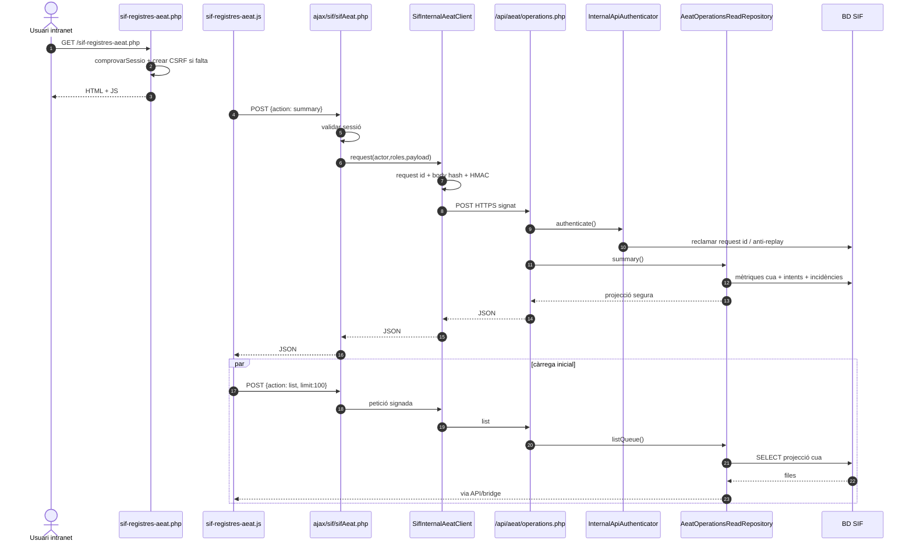

### FINAL

Mateixa seqüència, amb el menú i els rols de preproducció verificats. La pàgina no ha de rebre secrets HMAC, `PAYLOAD_JSON` ni `XML_PAYLOAD`.

## 2. SQ09-02 · Filtrar cua i obrir detall

### ACTUAL / FINAL

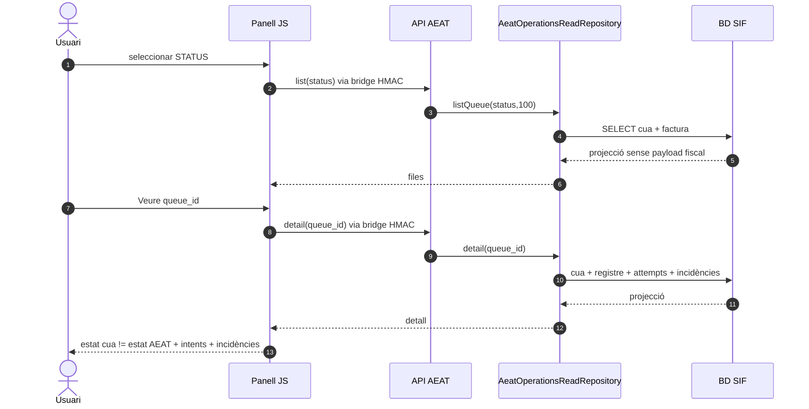

**Invariant:** `fiscal_queue.STATUS=SENT` no s'ha de presentar com `factura_registres.ESTAT_AEAT=ACCEPTED`.

## 3. SQ09-03 · Preflight des del panell

### ACTUAL

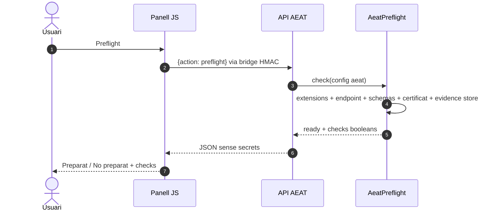

### FINAL

Afegir evidència d'entorn al procés de release; un preflight `ready=true` continua sense equivaldre a una acceptació real AEAT.

## 4. SQ09-04 · Claim i remissió del worker

### ACTUAL

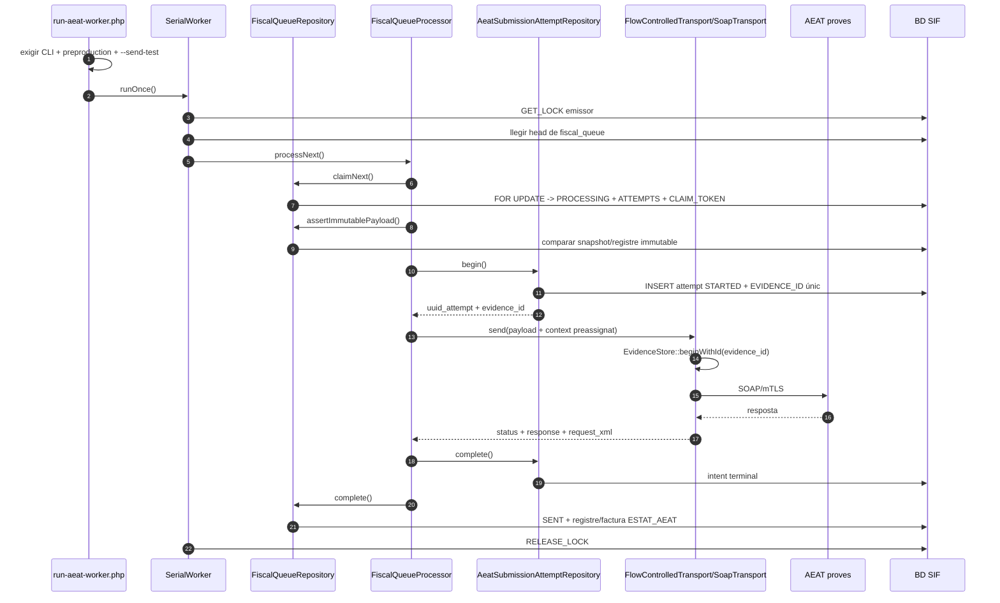

### FINAL

La seqüència es manté. Per producció cal una política explícita d'entorn/release; no s'ha d'eliminar el bloqueig actual canviant només la URL.

## 5. SQ09-05 · Error tècnic retryable

### ACTUAL / FINAL

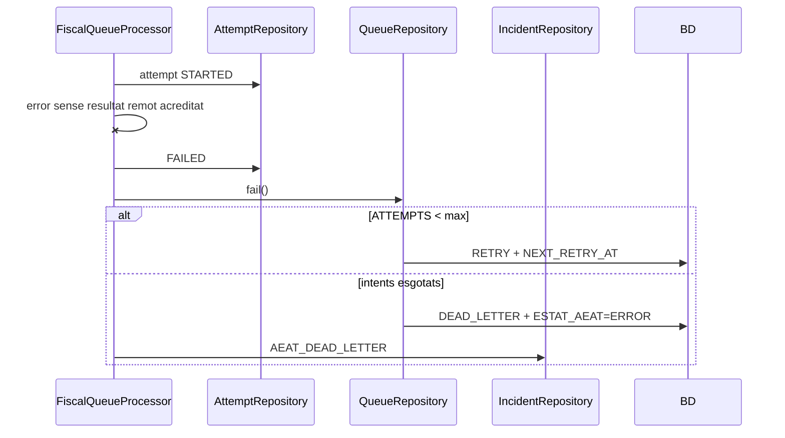

## 6. SQ09-06 · Resultat remot incert

### ACTUAL / FINAL

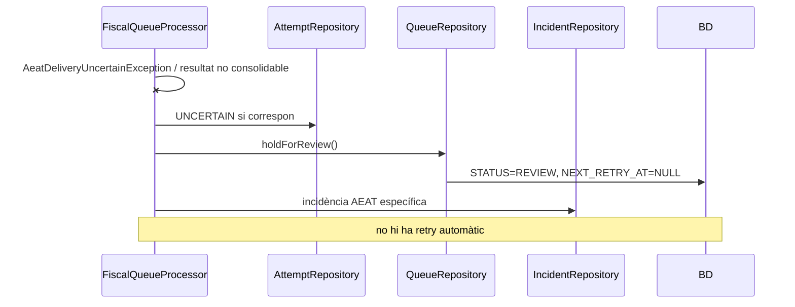

## 7. SQ09-07 · Conciliar REVIEW des del panell

### ACTUAL

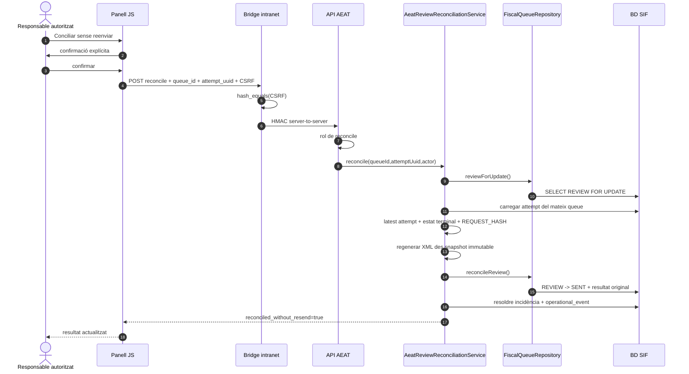

### FINAL

Mateixa seqüència. Si l'intent és `UNCERTAIN`, antic o amb hash incompatible, es manté `REVIEW`; la UI no ha de disposar d'una acció que faci un segon SOAP.

## 8. SQ09-08 · Deep-link des d'incidències

### ACTUAL / FINAL

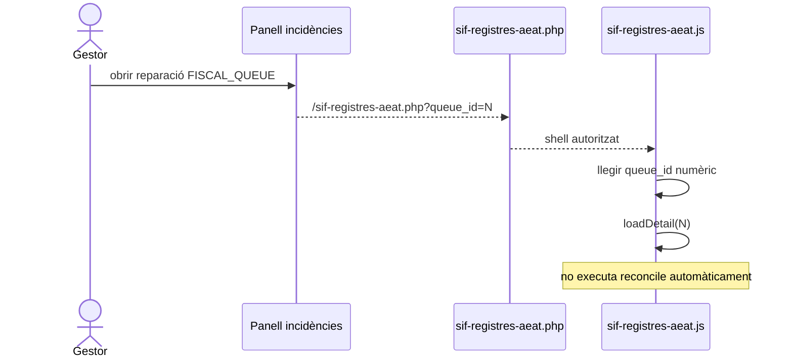

## 7.1. SQ09-07b · Resposta terminal amb flow wait invàlid

### ACTUAL corregit / FINAL

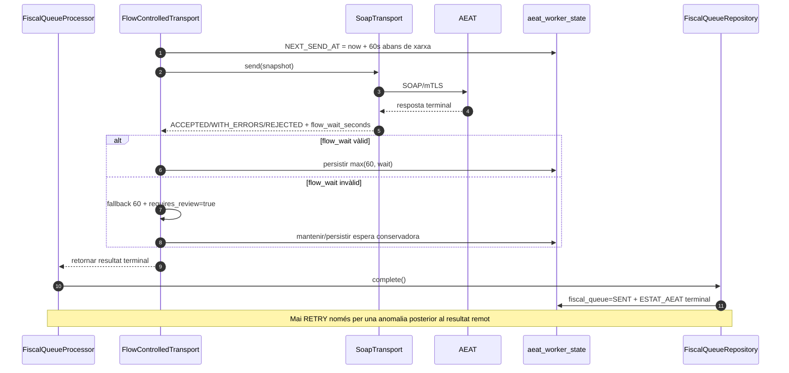

## 8.1. SQ09-09 · Recuperar un `PROCESSING` caducat

### ACTUAL corregit / FINAL

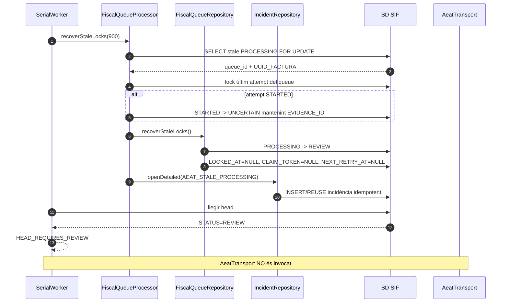

**Invariant de seguretat:** un timeout de lock local no és evidència que AEAT no hagi rebut el SOAP. La recuperació només allibera ownership local; qualsevol nou enviament exigeix revisió/conciliació explícita.

## 8.2. SQ09-10 · Conciliar un intent UNCERTAIN des d'evidència privada

### ACTUAL implementat / FINAL

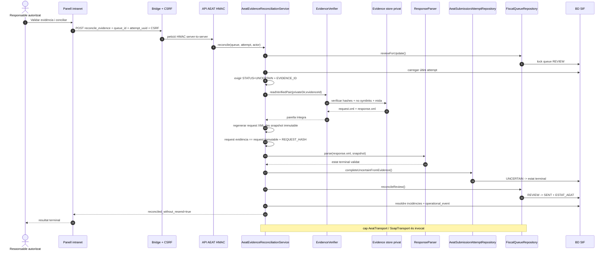

### Bloqueig explícit

Si l'intent és `STARTED`, no té `EVIDENCE_ID`, l'evidència és incompleta/alterada, el request no coincideix o la resposta no valida per aquella factura, la seqüència acaba en conflicte i el job continua `REVIEW`.

## 9. Matriu de verificació

| Seqüència | Codi localitzat | Prova existent abans | Cobertura afegida 03/10 |
| --- | --- | --- | --- |
| SQ09-01 | sí | repositori/API/auth genèrics | contracte UI intranet |
| SQ09-02 | sí | `AeatOperationsReadRepositoryTest` | contracte UI |
| SQ09-03 | sí | `AeatPreflightTest`, worker preflight | contracte UI |
| SQ09-04 | sí | `AeatWorkflowTest`, `FiscalQueueProcessorTest` | CI path/lint panell |
| SQ09-05 | sí | sí | — |
| SQ09-06 | sí | sí | — |
| SQ09-07 | sí | `AeatReviewReconciliationServiceTest` | UUID estricte + contracte UI |
| SQ09-07b | sí | `AeatWorkflowTest::testInvalidRemoteFlowWaitKeepsTerminalResultAndRequiresReviewWithoutResend` | resultat terminal preservat |
| SQ09-08 | sí | `IncidentPanelUiContractTest` | contracte UI UC-009 |
| SQ09-09 | sí | tests stale de `FiscalQueueProcessorTest` i `AeatWorkflowTest` | `PROCESSING → REVIEW`, cap transport |
| SQ09-10 | implementat a branca | `AeatEvidenceReconciliationServiceTest` | evidència íntegra + mismatch fail-closed |

## 10. Estat

- **Documentat:** sí, seqüències ACTUAL/FINAL separades.
- **Implementat:** totes les seqüències ACTUAL, excepte desplegament/menú real d'entorn.
- **Verificat:** proves UC-009 passen al run CI del 02/10; nova cobertura queda pendent del CI de la branca.
- **Pendent:** prova preproducció real, certificat/configuració, rols i menú desplegats, enviament AEAT de proves acreditat.
