# UC-010 · Activitats ACTUAL / FINAL per pàgina i apartat

## 1. Mapa de superfícies

| Superfície | ACTUAL baseline | FINAL branca |
| --- | --- | --- |
| Intranet `sif-verifactu.php` | Resum + incidències | + accés “Configuració i versions” |
| `ajax/sif/sifPanelLaunch.php` | Launch incidències | target allowlist incidents/versions |
| `/sif/versions/index.php` | No existia | Panell UC-010 |
| `/sif/versions/actions.php` | No existia | API sessió+CSRF |
| `/sif/versions/app.js` | No existia | UX read/manage |
| `build-release-manifest.php` | No existia | Build evidence |
| `preflight-version-governance.php` | No existia | Gate read-only |
| `verify-version-governance-evidence.php` | No existia | Evidència post-activació read-only |

## 2. Intranet · botó “Configuració i versions”

### ACTUAL

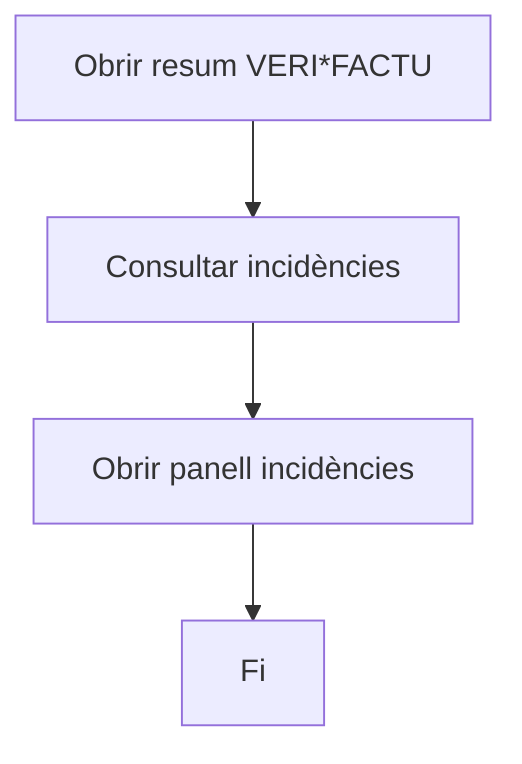

No hi havia ruta UC-010.

### FINAL

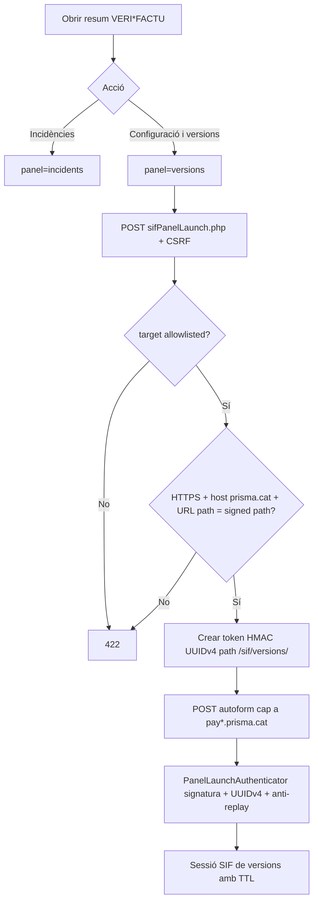

## 3. Panell · Runtime observat

### FINAL

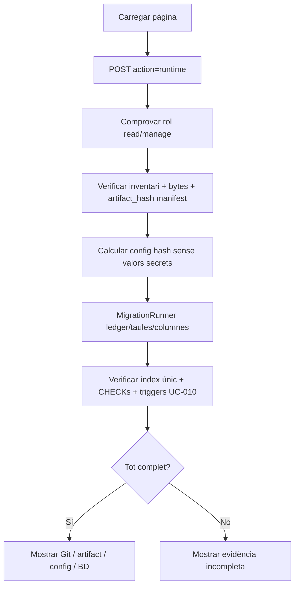

És read-only.

## 4. Panell · Registrar candidata

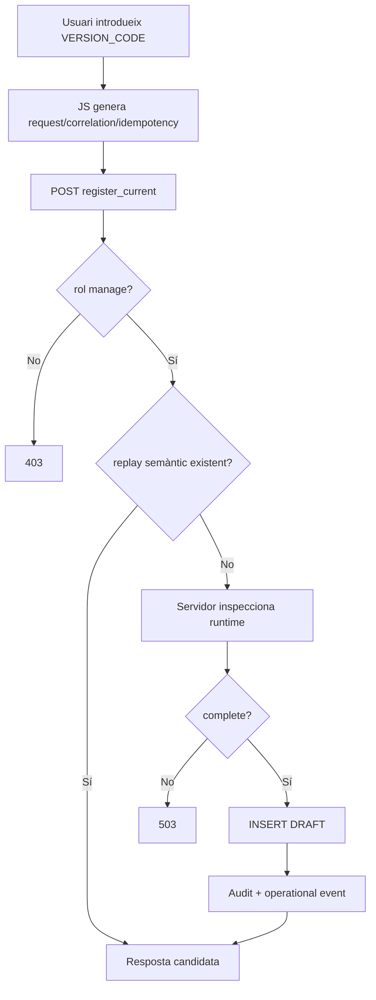

### Camps que NO existeixen al formulari

- git revision;
- artifact hash;
- config hash;
- database version.

Aquests valors són server-authoritative.

## 5. Panell · Llistat i detall

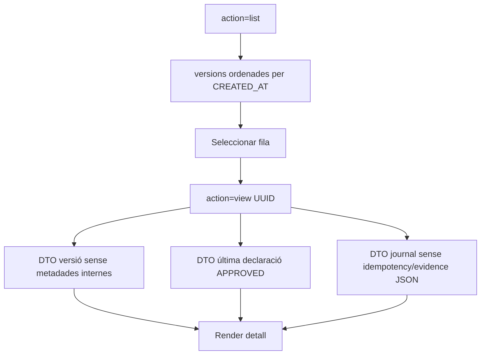

## 6. Panell · Vincular declaració

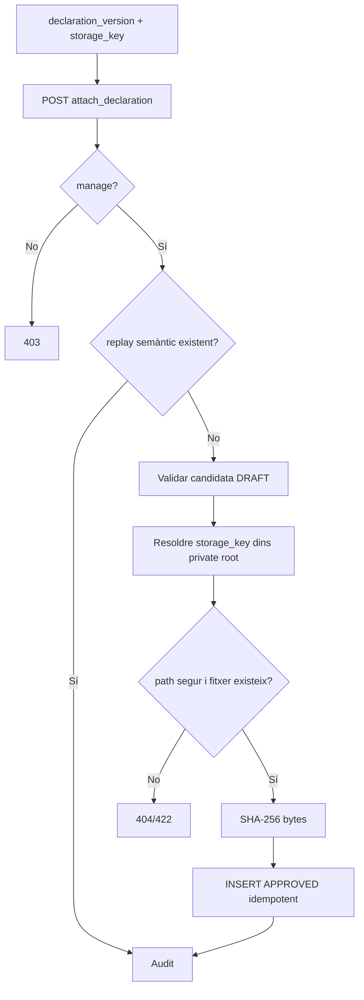

No hi ha upload de fitxer en aquest cas d'ús.

## 7. Panell · Preflight

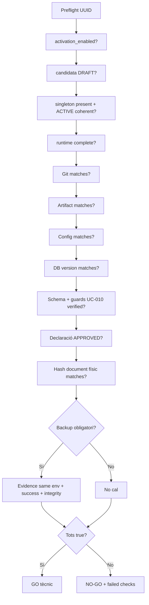

## 8. Panell · Activació

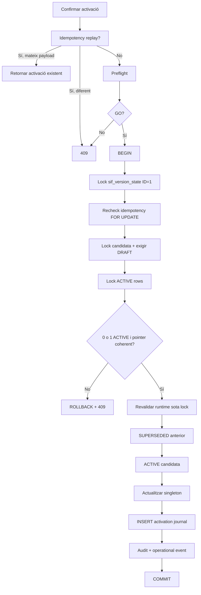

## 9. Script · build-release-manifest.php

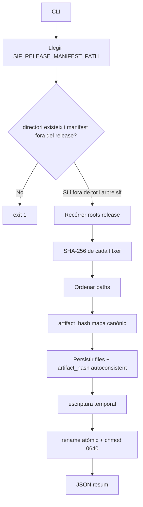

## 10. Script · preflight-version-governance.php

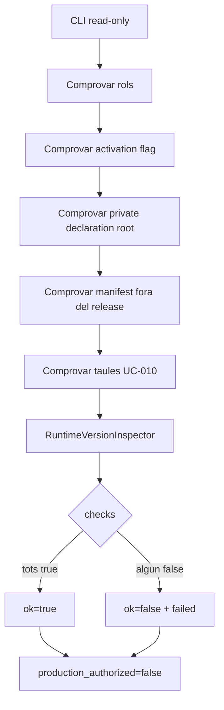

El camp `production_authorized=false` és intencional: un preflight tècnic no substitueix una decisió productiva.

## 11. Script · verify-version-governance-evidence.php

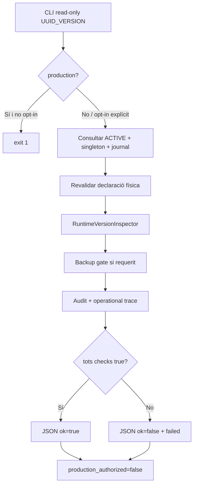

## 12. Errors i recuperació per apartat

| Apartat | Error | Resposta |
| --- | --- | --- |
| Launch | target/host/path no allowlisted | 422/launch rebutjat |
| Launch | replay/signatura/caducitat/UUID invàlid | 401/409 |
| Sessió | no autenticada o TTL expirat | 401 |
| Mutació | CSRF | 403 |
| Lectura | rol no configurat/no permès | 403 |
| Candidata | runtime incomplet | 503 |
| Declaració | path traversal | 422 |
| Declaració | fitxer absent | 404 |
| Preflight | drift runtime / guard BD absent / pointer incoherent | NO-GO |
| Activació | payload semàntic diferent | 409 |
| Activació | múltiples ACTIVE | 409 |
| Activació | pointer incoherent | 409 |
| Activació | canvi d'evidència sota lock | 409/rollback |
| Evidència | ACTIVE/journal/declaració/runtime/trace incoherent | JSON ok=false |

## 13. Estat per superfície després de la reconciliació

| Superfície | Documentat | Implementat en branca | Verificat automàtic | Verificat entorn |
| --- | --- | --- | --- | --- |
| Launch intranet/HMAC | Sí | Sí | tests nous preparats; CI final queued | No |
| Runtime/list/detail DTO | Sí | Sí | tests d'integració preparats | No |
| Registrar candidata | Sí | Sí | replay/trace/reason coberts | No |
| Declaració | Sí | Sí | replay/DRAFT/traversal coberts | No |
| Preflight | Sí | Sí | state/schema guards coberts | No |
| Activació | Sí | Sí, lock + guards BD | tests preparats; CI queued | No |
| Manifest CLI | Sí | Sí, inventari + artifact hash | unit tests preparats | No |
| Evidència CLI | Sí | Sí read-only | contracte/integració preparats | No |
| Backup gate UC-85 | Sí com a dependència | reader sí | parcial | No; UC-85 no està tancat |
