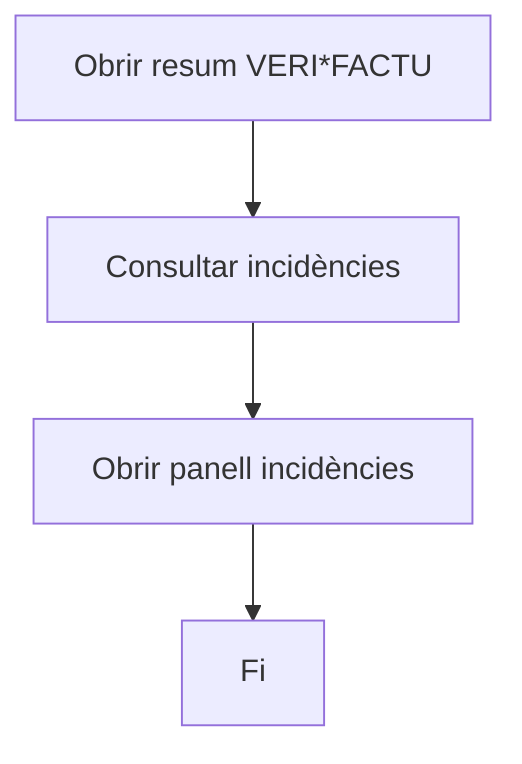
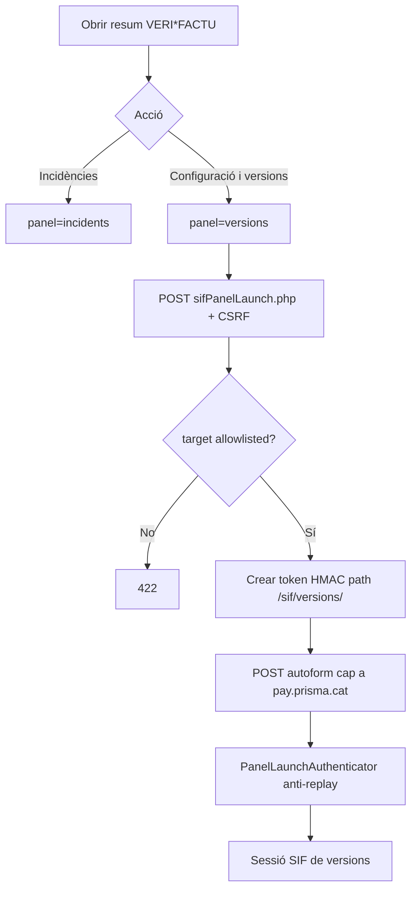
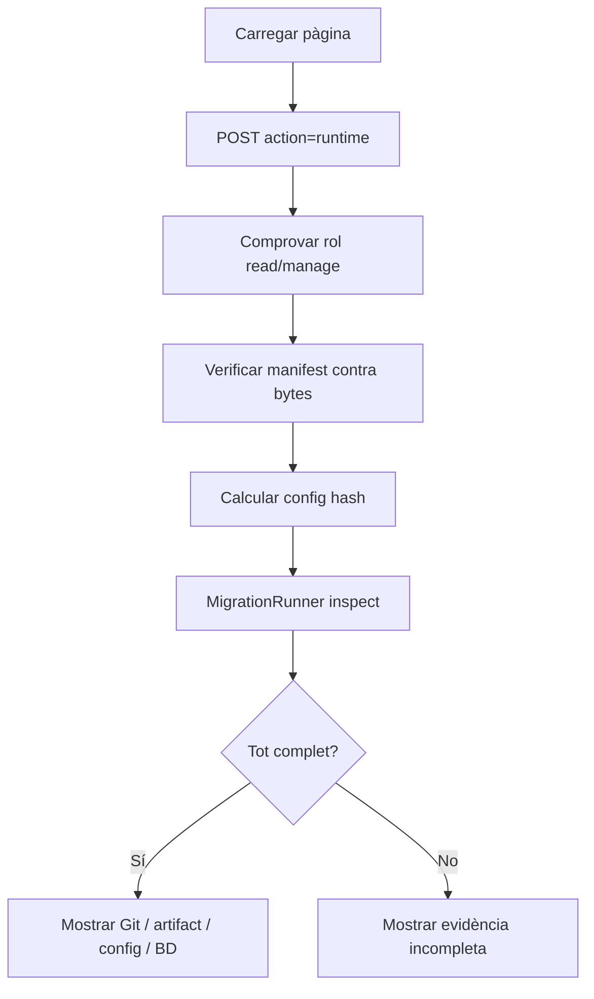
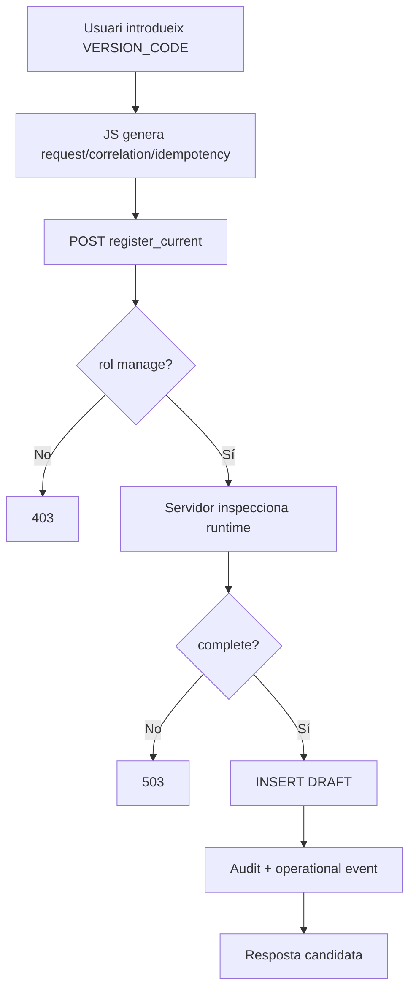
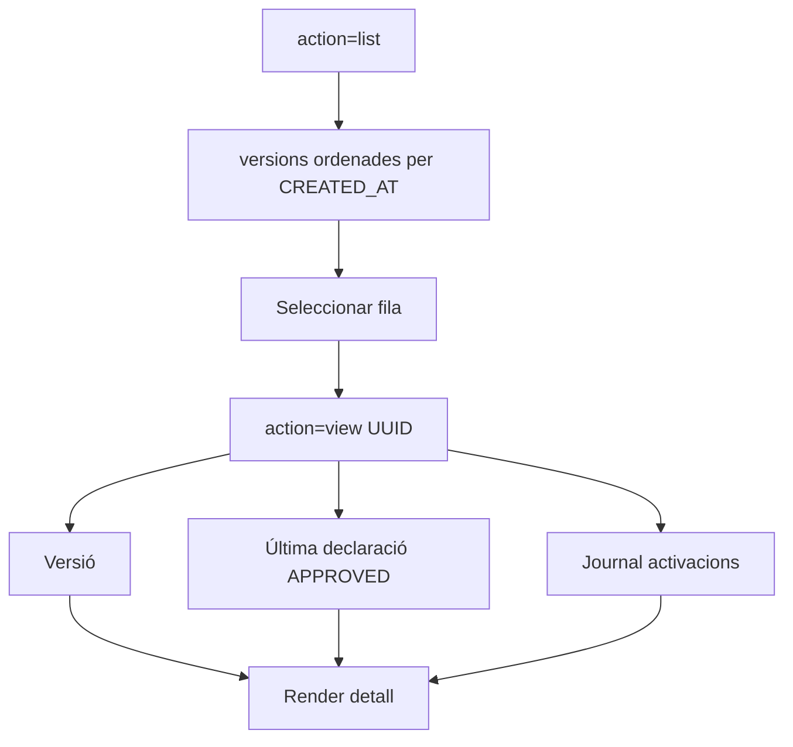
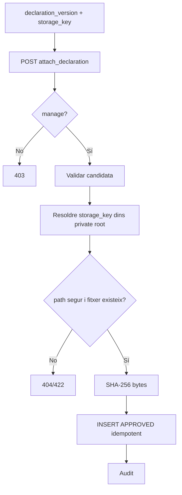
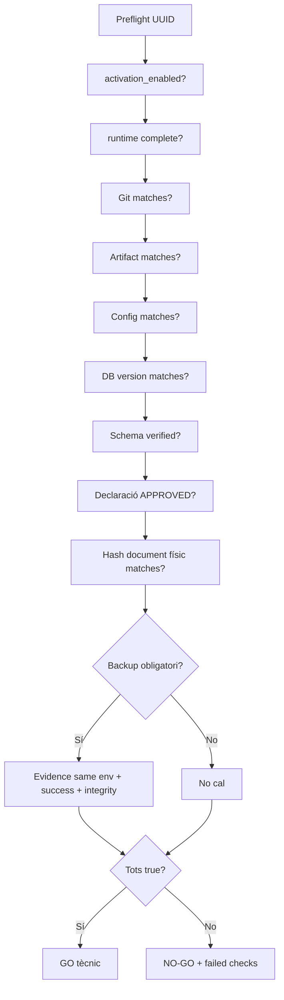
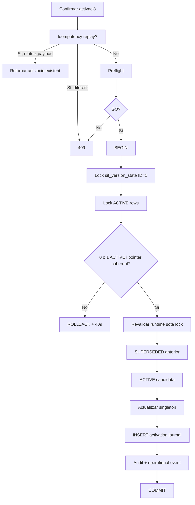
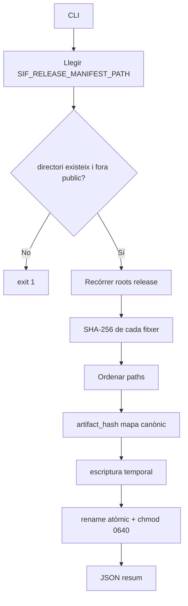
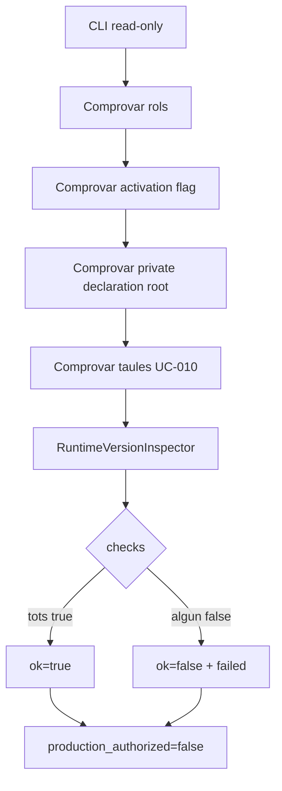

# UC-010 · Activitats ACTUAL / FINAL per pàgina i apartat

## 1. Mapa de superfícies

| Superfície | ACTUAL baseline | FINAL branca |
| --- | --- | --- |
| Intranet `sif-verifactu.php` | Resum + incidències | + accés “Configuració i versions” |
| `ajax/sif/sifPanelLaunch.php` | Launch incidències | target allowlist incidents/versions |
| `/sif/versions/index.php` | No existia | Panell UC-010 |
| `/sif/versions/actions.php` | No existia | API sessió+CSRF |
| `/sif/versions/app.js` | No existia | UX read/manage |
| `build-release-manifest.php` | No existia | Build evidence |
| `preflight-version-governance.php` | No existia | Gate read-only |

## 2. Intranet · botó “Configuració i versions”

### ACTUAL

No hi havia ruta UC-010.

### FINAL

## 3. Panell · Runtime observat

### FINAL

És read-only.

## 4. Panell · Registrar candidata

### Camps que NO existeixen al formulari

- git revision;
- artifact hash;
- config hash;
- database version.

Aquests valors són server-authoritative.

## 5. Panell · Llistat i detall

## 6. Panell · Vincular declaració

No hi ha upload de fitxer en aquest cas d'ús.

## 7. Panell · Preflight

## 8. Panell · Activació

## 9. Script · build-release-manifest.php

## 10. Script · preflight-version-governance.php

El camp `production_authorized=false` és intencional: un preflight tècnic no substitueix una decisió productiva.

## 11. Errors i recuperació per apartat

| Apartat | Error | Resposta |
| --- | --- | --- |
| Launch | target no allowlisted | 422 |
| Launch | replay/signatura/caducitat | 401/409 |
| Sessió | no autenticada | 401 |
| Mutació | CSRF | 403 |
| Lectura | rol no configurat/no permès | 403 |
| Candidata | runtime incomplet | 503 |
| Declaració | path traversal | 422 |
| Declaració | fitxer absent | 404 |
| Preflight | drift runtime | NO-GO |
| Activació | payload idempotent diferent | 409 |
| Activació | múltiples ACTIVE | 409 |
| Activació | pointer incoherent | 409 |
| Activació | canvi d'evidència sota lock | 409/rollback |
