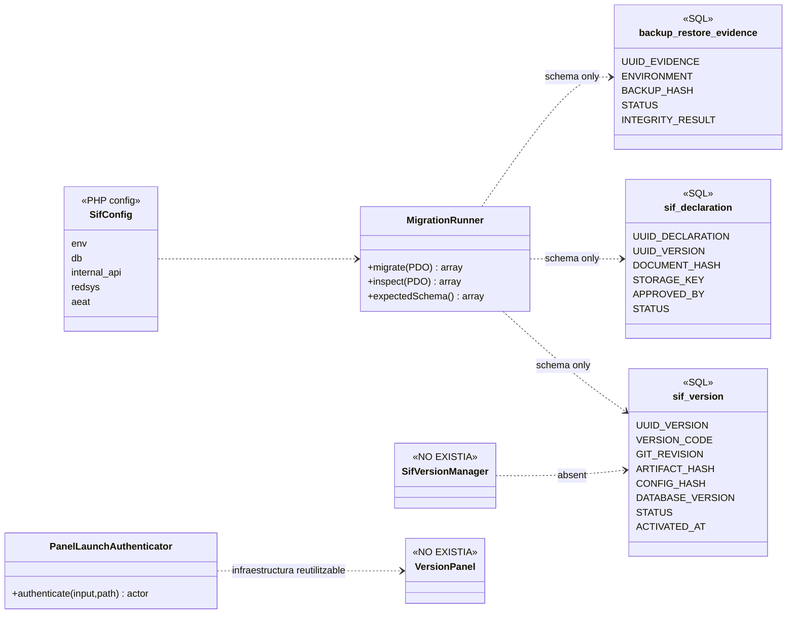
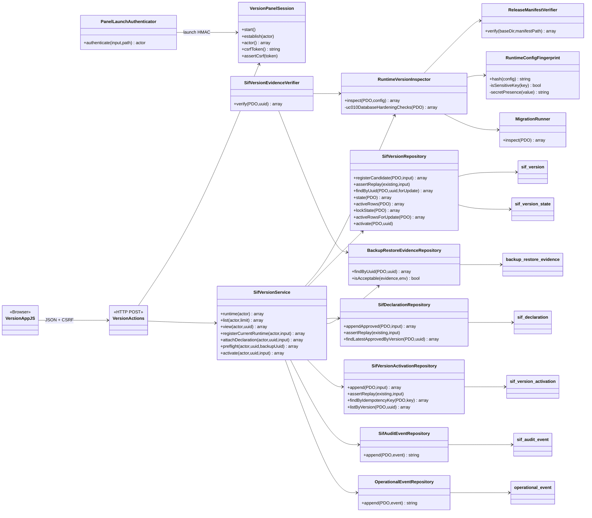
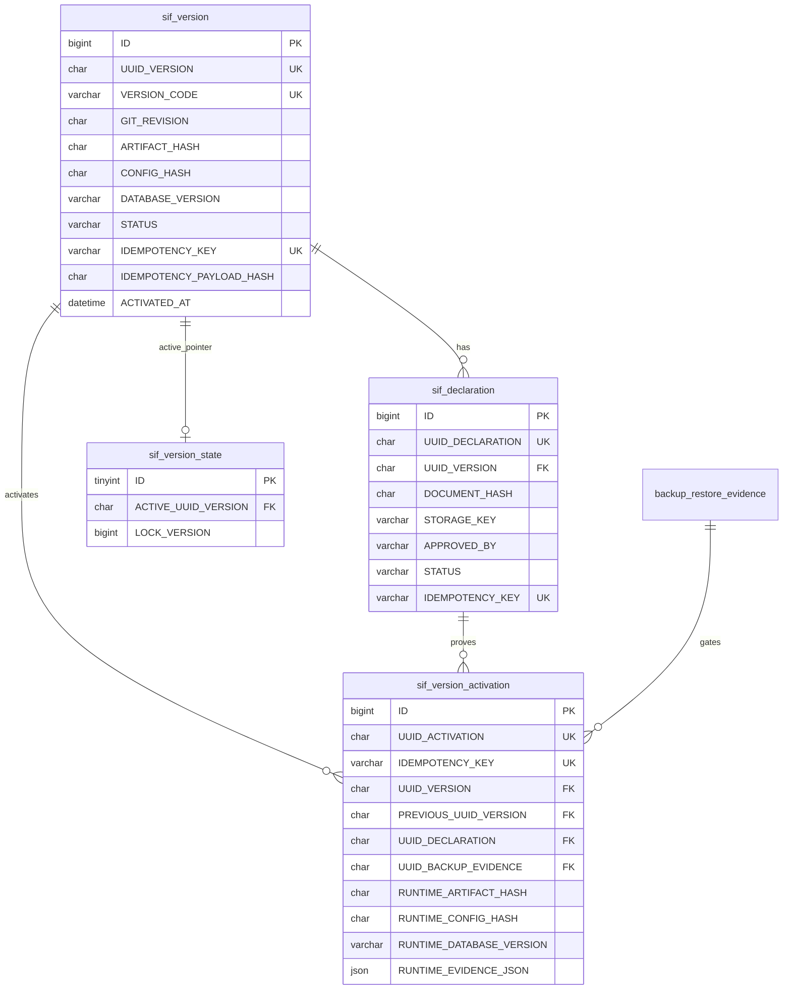
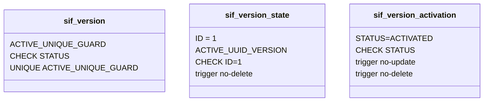

# UC-010 · Diagrama de classes ACTUAL / FINAL

**ACTUAL** = baseline de `main` abans de l'auditoria del 2026-10-04.  
**FINAL** = arquitectura implementada a la branca `audit/uc-010-reconciliacio-2026-10-04`.

## 1. ACTUAL — persistència sense servei UC-010

### Lectura

El baseline tenia dades estructurals, però no un writer ni un gate UC-010. `STATUS` no era una exclusió transaccional.

## 2. FINAL — domini de governança executable

## 3. Responsabilitats i invariants

| Component | Responsabilitat | No ha de fer |
| --- | --- | --- |
| `RuntimeVersionInspector` | observar runtime | activar ni desplegar |
| `SifVersionRepository` | candidata + estat actiu | verificar bytes |
| `SifDeclarationRepository` | persistir aprovació/hash | crear/signar el document |
| `SifVersionActivationRepository` | journal immutable | editar activacions antigues |
| `SifVersionService` | orquestrar gate | executar FTP/deploy |
| `VersionActions` | frontera HTTP | confiar en rols/valors del navegador |
| `VersionAppJS` | UX | decidir hashes o permisos |
| UC-85 | generar evidència backup | activar UC-010 |

## 4. Persistència FINAL

## 5. Diferències auditades entre el FINAL antic i el FINAL reconciliat

- `SifAuditEventRepository` és el component compartit ja existent a `main`; UC-010 l'injecta amb `UuidGenerator` i no en manté una còpia divergent.
- `SifVersionRepository::activate()` comprova `STATUS=DRAFT` abans de supersedir cap versió.
- `ReleaseManifestVerifier` considera invàlid un manifest ubicat dins del mateix arbre del release.
- `SifVersionService::activate()` serialitza primer amb `sif_version_state FOR UPDATE`; després fa la comprovació idempotent autoritativa i bloqueja candidata/ACTIVE rows.
- `MigrationRunner::inspect()` acredita ledger, hashes de migració i presència de taules/columnes declarades. `RuntimeVersionInspector` hi afegeix verificació explícita dels invariants físics crítics UC-010 (ACTIVE únic, CHECKs i triggers); continua sense pretendre auditar tots els índexs/constraints/tipus de tot el SIF.
- `BackupRestoreEvidenceRepository` és només un reader del contracte persistent UC-85. UC-85 continua sense servei executable complet, per tant aquesta relació és una dependència pendent d'entorn/governança.

## 6. Guards físics de persistència afegits

Aquests guards complementen, però no substitueixen, els locks i validacions del servei.
