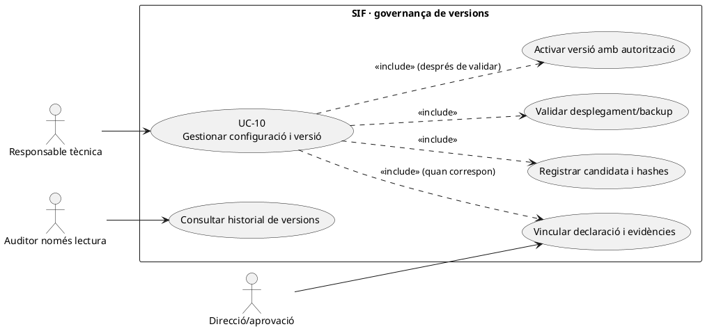
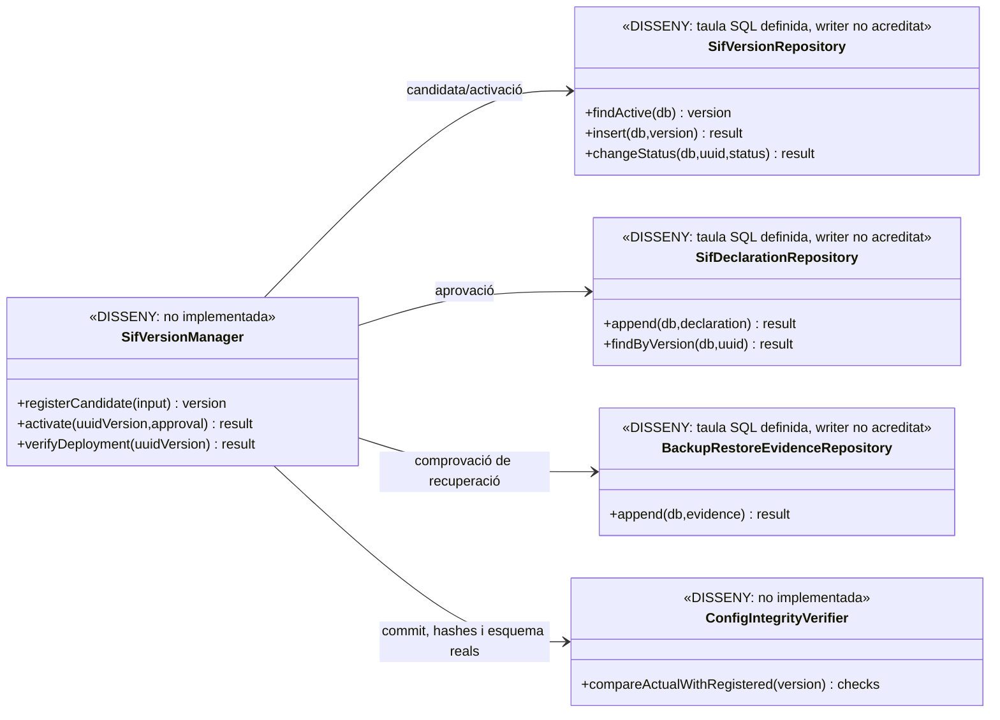

# UC-10 · Gestionar configuració i versió del SIF

**Objectiu:** controlar quina versió del SIF, configuració, esquema de BD i declaració responsable corresponen a cada activació, i impedir un canvi de configuració fiscal sense autorització, evidència i reversibilitat. **Estat:** hi ha definicions SQL de `sif_version`, `sif_declaration` i `backup_restore_evidence`, i documentació del panell. **No s'ha identificat** en `sif/src` una classe `SifVersionService` o un panell executable que governi l'activació d'una versió i validi tots els requisits.

## 1. Fitxa funcional específica

| Element | Regla/documentació |
| --- | --- |
| Actors | Responsable tècnica o administrador SIF; aprovació legal/direcció quan pertoqui a la declaració responsable. Un auditor només lectura pot consultar l'evidència, no canviar versió. |
| Versió definida a BD | `sif_version`: `UUID_VERSION`, `VERSION_CODE` únic, `GIT_REVISION` SHA-1 de 40 caràcters, `ARTIFACT_HASH`, `CONFIG_HASH`, `DATABASE_VERSION`, `STATUS=DRAFT` per defecte, creador i data d'activació. **La fila no prova que el binari desplegat coincideixi amb el hash registrat.** |
| Declaració vinculada | `sif_declaration`: `UUID_DECLARATION`, `UUID_VERSION` (FK), `DECLARATION_VERSION`, `DOCUMENT_HASH`, `STORAGE_KEY`, `APPROVED_BY`, `APPROVED_AT` i `STATUS=ACTIVE` per defecte. El document real ha de custodiar-se i verificar el hash. |
| Evidència de seguretat/recuperació | `backup_restore_evidence`: tipus i entorn, `BACKUP_REFERENCE`, hash, integritat, RPO/RTO declarats quan s'han mesurat, actor, correlació i dates. L'existència de la taula no implica backup o restauració executats. |
| Configuració sensible | Dades d'emissor, sèries, mode de SIF, endpoints, certificat i claus, retries, rutes de documents i rols; el panell és disseny. **No registrar secrets en clar en `CONFIG_HASH`, log o evidència.** |
| Resultat objectiu | Versió candidata/activa vinculada a commit i artefacte desplegat, configuració i esquema comprovats, aprovació/document custodiat i evidències verificables; historial d'activacions i incidències. |

### 1.1. Flux objectiu d'alta i activació

1. La responsable prepara una candidata amb commit exacte, artefacte compilat/desplegable, hash del paquet, configuració sanejada i versió de BD; conserva l'anterior versió activa.
2. Un servei d'administració **pendent** valida que no hi hagi un codi de versió duplicat, que els hashes siguin de la longitud/format esperats i que el paquet real coincideixi amb `ARTIFACT_HASH`. Un `GIT_REVISION` registrat **no acredita** per si sol què està executant el servidor.
3. Es fan les proves i el preflight que pertoquin, es guarda resultat amb evidència i correlació, s'associa la declaració responsable real i la seva aprovació a la mateixa `UUID_VERSION`. No interpretar el `STATUS=ACTIVE` per defecte de `sif_declaration` com a prova d'aprovació efectiva.
4. La decisió d'activació exigeix autorització, comprovació de disponibilitat de certificat/rutes/configuració, compatibilitat de migracions i, quan sigui obligatori pel procediment aprovat, backup/restauració amb referència i integritat. Les condicions exactes de `go/no-go` són les del pla de governança, no les deduïdes d'un sol camp SQL.
5. S'executa el desplegament amb control de concurrència de versió; **si l'execució falla, no marcar `ACTIVATED_AT` o estat `ACTIVE` per una mera intenció de publicar**. El servei de versions i el desplegament real encara s'han de vincular.
6. Després de l'activació, es comprova de nou commit/artefacte/configuració/esquema en l'entorn real i es registra l'event immutable de canvi amb actor, data, versió anterior i nova; les incidències de desplegament es gestionen per UC-08.
7. Canvis posteriors de certificat, endpoint, sèrie o emissor requereixen nova decisió traçada i una comprovació d'impacte fiscal; **un canvi de configuració no reescriu factures emeses ni recalcula els seus registres fiscals**.

### 1.2. Variants i riscos

| Situació | Resposta |
| --- | --- |
| Mateix `VERSION_CODE`, hash diferent | Bloquejar o registrar una nova versió; no substituir silenciosament l'artefacte registrat a la mateixa identitat. |
| Declaració sense fitxer íntegre | No donar l'evidència per completa pel sol `STORAGE_KEY`; verificar bytes/hash i aprovació, mantenir versió en estat no activable segons procediment. |
| Migració de BD pendent o esquema incompatible | No activar fingint que el nou PHP i l'antiga BD són compatibles; registrar blocker i pla d'aplicació/reversió. |
| Backup no executat | La fila definida a SQL no substitueix prova real; no inventar `RPO_MINUTES` o `RTO_MINUTES`. |
| Certificat de proves usat en procés productiu | Verificar endpoint/entorn i capacitat del transport; el `SoapTransport` consultat està restringit a proves, no acreditar disponibilitat de producció. |
| Intent de canviar una sèrie després d'emetre | Classificar canvi i preservar sèries/numeració i cadena anteriors; no reasignar un número fiscal existent. |
| Activació concurrent de dues candidates | Serialitzar/validar una sola versió activa segons contracte acordat; és **lògica pendent**, no garantia del valor `STATUS` SQL. |

**Proves pendents:** activació i rollback, document/artefacte amb hash incorrecte, revisió de permisos, configuració segura, migració fallida, versions concurrents, evidència de declaració, recuperació i correspondència entre fila `sif_version` i servidor en execució.

## 2. Diagrama UML de casos d'ús



## 3. Classes: persistència SQL existent, serveis de gestió pendents



Cap de les classes del diagrama és afirmada com a **implementada**: les taules `sif_version` i `sif_declaration` per si soles no les creen.

## 4. Seqüència objectiu — activació amb verificacions

```mermaid
sequenceDiagram
autonumber
actor T as Responsable tècnica
participant UI as Panell versions [pendent]
participant M as SifVersionManager [DISSENY]
participant R as SifVersionRepository [DISSENY]
participant D as SifDeclarationRepository [DISSENY]
participant E as BackupRestoreEvidenceRepository [DISSENY]
participant V as ConfigIntegrityVerifier [DISSENY]
participant Env as Servidor/BD reals
T->>UI: Registrar versió candidata, commit, hashes i esquema
UI->>M: registerCandidate(input)
M->>R: insert(DRAFT)
M->>D: Vincular declaració real i aprovació si escau
M->>E: Consultar proves de backup/restauració del desplegament
T->>UI: Confirmar activació amb permís i correlació
UI->>M: activate(uuidVersion,approval)
M->>V: Comprovar integritat, permisos, proves i migracions
V->>Env: Llegir artefacte, configuració i versió BD
alt Comprovació incompleta o fallida
 Env-->>V: Discrepància
 V-->>M: BLOCKED
 M-->>UI: No activar; registrar incidència
else Candidata validada
 V-->>M: OK amb evidència
 M->>Env: Desplegar/activar de forma controlada
 Env-->>M: Confirmació observable d'entorn actiu
 M->>R: Actualitzar versió activa i historial
 M-->>UI: Versió activa verificada
end
Note over M,Env: Seqüència OBJECTIU; no és un servei de desplegament executable acreditat
```

## 5. Traçabilitat

[UC-10 original](../06-fitxes-funcionals/uc-010.md) · [Disseny del panell](../04-estat-final/25-panell-sif-pay-prisma.md) · [UC-34 dashboard](uc-034-consultar-dashboard-sif.md) · [UC-08 incidències](uc-008-gestionar-incidencia-sif.md) · [Migració versions, declaracions i evidències](../../sif/database/migrations/2026_09_15_000003_add_functional_audit_control.sql) · [Documentació de governança](../05-governanca-operacio/) · [UC-09 remissió AEAT](uc-009-remetre-registre-aeat.md).

**Pendent:** implementació de serveis/panell, control d'accés, proves d'activació, aprovacions reals i evidència de l'entorn; sense cap modificació de configuració productiva.
