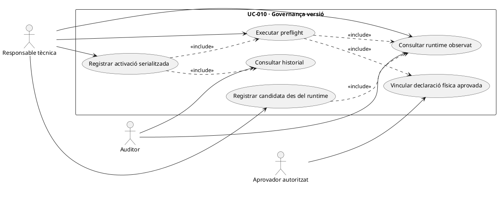
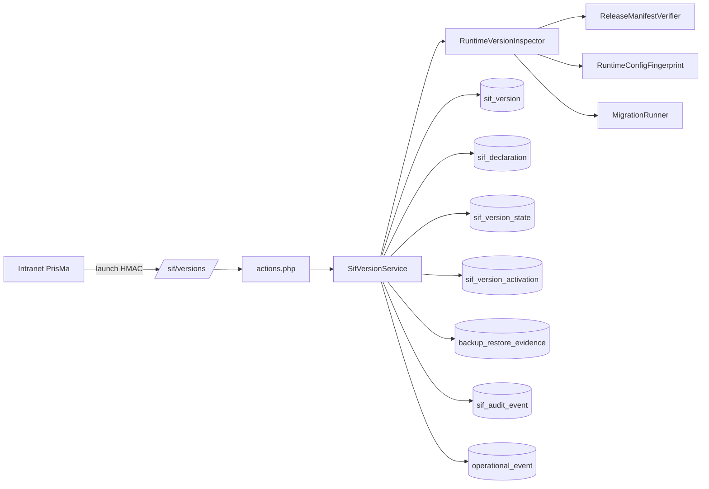
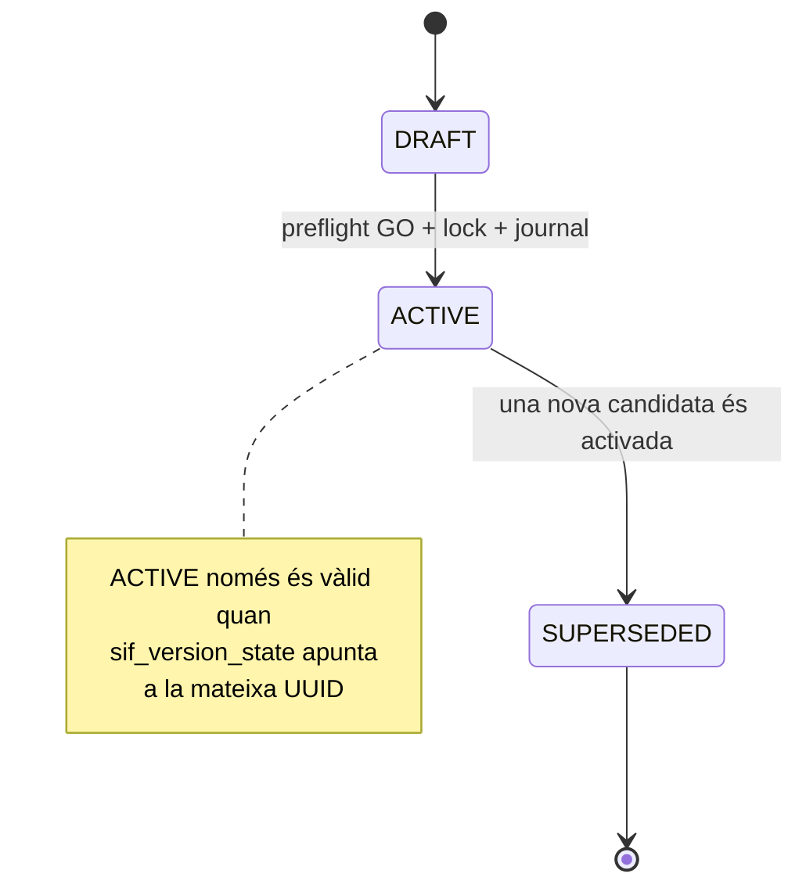

# UC-010 · Gestionar configuració i versió del SIF

**Estat:** `IMPLEMENTAT_EN_BRANCA · CI/ENTORN PENDENT`  
**Auditoria:** 2026-10-03 · PR #139

## 1. Objectiu

UC-010 governa la correspondència entre:

- release observat;
- configuració efectiva;
- esquema de BD;
- declaració responsable;
- evidència de recuperació;
- estat actiu registrat.

L'activació **no desplega**: només registra com a activa una candidata que ja coincideix amb el runtime verificat.

## 2. Inventari documental

| Artefacte | Enllaç |
| --- | --- |
| Fitxa funcional | [UC-010](../06-fitxes-funcionals/uc-010.md) |
| Auditoria detallada | [Auditoria 2026-10-03](uc-010-auditoria-detallada-2026-10-03.md) |
| Classes ACTUAL/FINAL | [Classes](uc-010-classes-actual-final.md) |
| Seqüències ACTUAL/FINAL | [Seqüències](uc-010-sequencies-actual-final.md) |
| Activitats per pàgina/apartat | [Activitats](uc-010-activitats-pagines-actual-final.md) |
| Configuració | [sif/config/README.md](../../sif/config/README.md) |
| Migració | [2026_10_03 UC-010](../../sif/database/migrations/2026_10_03_000001_add_uc010_version_governance.sql) |

## 3. Casos d'ús interns

```plantuml
@startuml
left to right direction
actor "Responsable tècnica" as T
actor "Auditor" as A
actor "Aprovador autoritzat" as D

rectangle "UC-010 · Governança versió" {
  usecase "Consultar runtime observat" as Runtime
  usecase "Registrar candidata des del runtime" as Candidate
  usecase "Vincular declaració física aprovada" as Declaration
  usecase "Executar preflight" as Preflight
  usecase "Registrar activació serialitzada" as Activate
  usecase "Consultar historial" as History
}

A --> Runtime
A --> History
T --> Runtime
T --> Candidate
T --> Preflight
T --> Activate
D --> Declaration
Candidate ..> Runtime : <<include>>
Preflight ..> Runtime : <<include>>
Preflight ..> Declaration : <<include>>
Activate ..> Preflight : <<include>>
Activate ..> History : <<include>>
@enduml
```

## 4. Arquitectura FINAL resumida

```mermaid
flowchart LR
I[Intranet PrisMa] -->|launch HMAC| P[/sif/versions/]
P --> A[actions.php]
A --> S[SifVersionService]
S --> R[RuntimeVersionInspector]
R --> M[ReleaseManifestVerifier]
R --> C[RuntimeConfigFingerprint]
R --> MR[MigrationRunner]
S --> V[(sif_version)]
S --> D[(sif_declaration)]
S --> ST[(sif_version_state)]
S --> AJ[(sif_version_activation)]
S --> B[(backup_restore_evidence)]
S --> AU[(sif_audit_event)]
S --> OP[(operational_event)]
```

## 5. Contracte de candidata

La UI només aporta `VERSION_CODE` i metadades d'operació. El backend registra:

- `GIT_REVISION` observada/configurada;
- `ARTIFACT_HASH` calculat del manifest verificat;
- `CONFIG_HASH` calculat de la configuració carregada;
- `DATABASE_VERSION` derivada de les migracions.

Si el manifest o l'esquema no són íntegres, no es crea candidata.

## 6. Contracte de declaració

La declaració:

- ha d'existir a storage privat;
- no pot sortir del root per traversal;
- es hasheja des dels bytes;
- queda `APPROVED` explícitament;
- es torna a verificar en preflight.

La fila SQL no substitueix el document.

## 7. Contracte d'activació

```mermaid
stateDiagram-v2
[*] --> DRAFT
DRAFT --> ACTIVE: preflight GO + lock + journal
ACTIVE --> SUPERSEDED: una nova candidata és activada
SUPERSEDED --> [*]

note right of ACTIVE
ACTIVE només és vàlid quan
sif_version_state apunta
a la mateixa UUID
end note
```

No es permet deduir exclusivitat del text `STATUS`: el singleton i el lock són part de l'invariant.

## 8. Matriu de comprovacions

| Check | Font |
| --- | --- |
| Activation gate | `SIF_VERSION_ACTIVATION_ENABLED` |
| Git | `SIF_RUNTIME_GIT_REVISION` vs candidata |
| Bytes | release manifest vs files |
| Artifact | hash canònic del mapa path→SHA256 |
| Config | fingerprint runtime |
| DB | `MigrationRunner::inspect()` |
| Declaració | fila APPROVED + hash de bytes |
| Backup | UC-85, si obligatori |
| Concurrència | `sif_version_state FOR UPDATE` |
| Replay | idempotency keys + payload hashes |

## 9. Pàgines

### Intranet

`codi-drive/intranet-actual/sif-verifactu.php` afegeix únicament l'accés al panell. No escriu versions.

### SIF

`sif/public/sif/versions/index.php` mostra:

1. runtime;
2. candidata;
3. llistat;
4. detall;
5. declaració;
6. historial;
7. preflight;
8. activació.

`actions.php` aplica la seguretat backend i delega al servei.

## 10. Límits deliberats

UC-010 no:

- puja el release;
- reinicia PHP/worker;
- modifica DNS/FTP;
- restaura BD;
- signa automàticament una declaració;
- canvia una factura;
- repeteix una operació bancària/fiscal.

El desplegament i la recuperació són processos externs/altres UC; UC-010 n'acredita el resultat abans de registrar ACTIVE.

## 11. Relació amb UC-38 / UC-46 / UC-60 / UC-83 / UC-85

- **UC-38:** aporta/configura emissor, certificat, endpoints i secrets.
- **UC-46:** utilitza el gate UC-010 per l'acta/decisió de tall.
- **UC-60:** consumeix estat read-only.
- **UC-83:** alta candidata/declaració ha de reutilitzar `SifVersionService`.
- **UC-85:** produeix evidència de backup/restauració.

No crear writers paral·lels.

## 12. Estat

### DOCUMENTAT

Complet a nivell de branca.

### IMPLEMENTAT

Circuit PHP/JS/SQL/CLI implementat a PR #139.

### VERIFICAT

Automatització afegida; cal prendre com a font el resultat final dels workflows del PR.

### PENDENT D'ENTORN

Variables, storage privat, manifest real, migracions i E2E en `sif_test*`/preproducció.

**Cap GO tècnic de preproducció implica `production_authorized=true`.**
