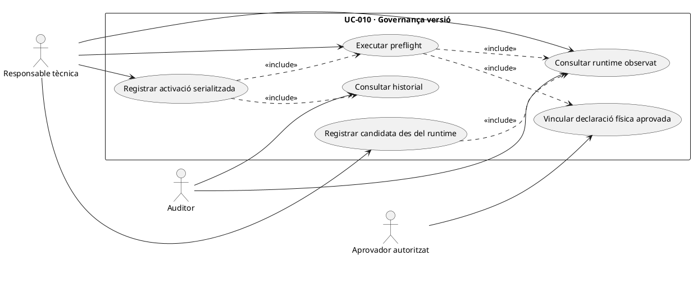
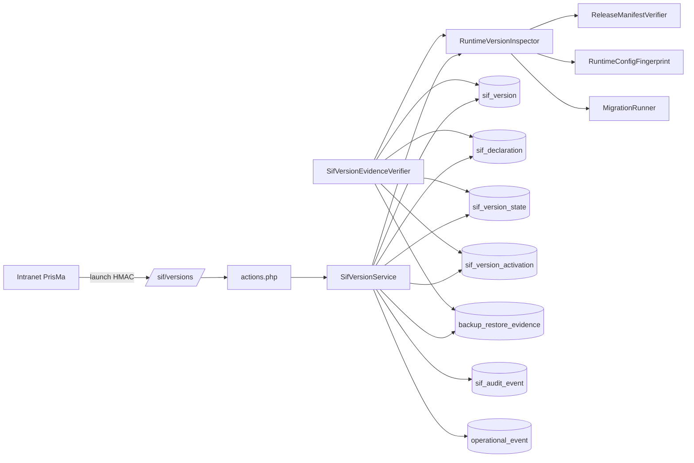
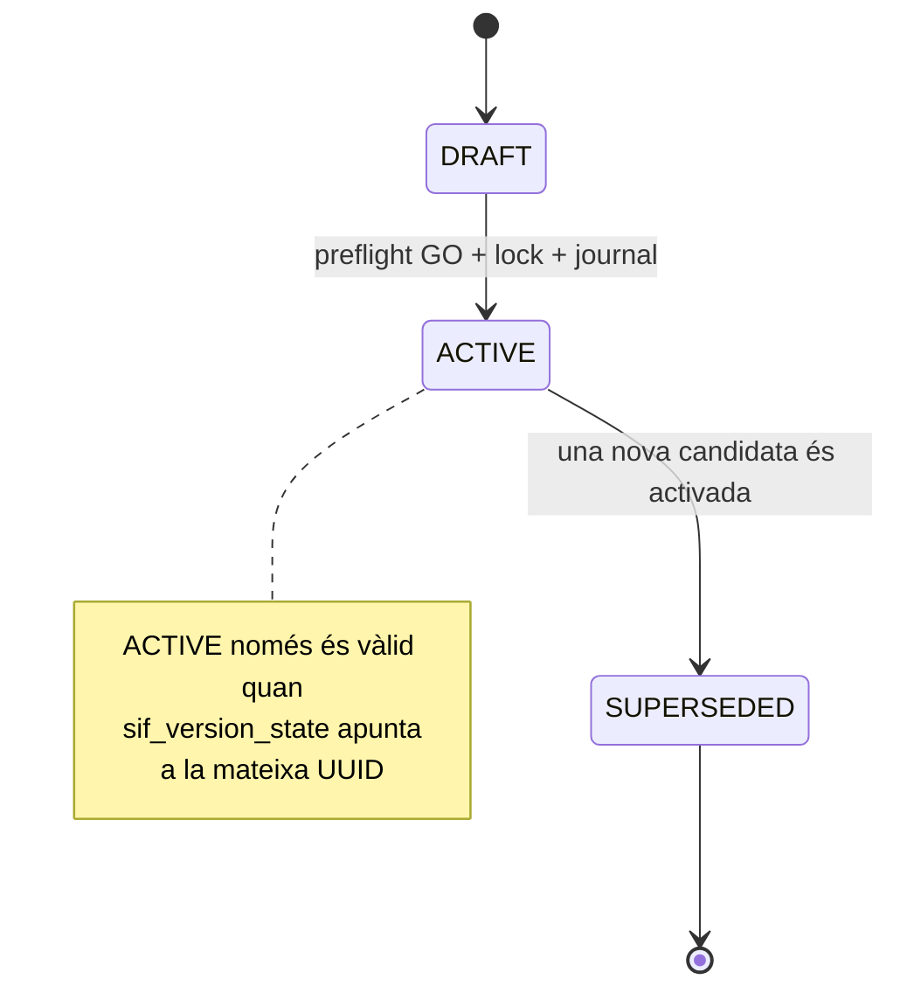

# UC-010 · Gestionar configuració i versió del SIF

**Estat:** `IMPLEMENTAT_EN_BRANCA_RECONCILIADA · CI/ENTORN PENDENT`  
**Auditoria:** 2026-10-04 · antecedent PR #139 no mergejat

## 1. Objectiu

UC-010 governa la correspondència entre:

- release observat;
- configuració efectiva;
- esquema de BD;
- declaració responsable;
- evidència de recuperació;
- estat actiu registrat.

L'activació **no desplega**: només registra com a activa una candidata que ja coincideix amb el runtime verificat.

## 2. Inventari documental

| Artefacte | Enllaç |
| --- | --- |
| Fitxa funcional | [UC-010](../06-fitxes-funcionals/uc-010.md) |
| Auditoria detallada | [Auditoria 2026-10-04](uc-010-auditoria-detallada-2026-10-04.md) |
| Classes ACTUAL/FINAL | [Classes](uc-010-classes-actual-final.md) |
| Seqüències ACTUAL/FINAL | [Seqüències](uc-010-sequencies-actual-final.md) |
| Activitats per pàgina/apartat | [Activitats](uc-010-activitats-pagines-actual-final.md) |
| Configuració | [sif/config/README.md](../../sif/config/README.md) |
| Migració base | [2026_10_03 UC-010](../../sif/database/migrations/2026_10_03_000001_add_uc010_version_governance.sql) |
| Hardening BD | [2026_10_04 000001](../../sif/database/migrations/2026_10_04_000001_harden_uc010_version_governance.sql) |
| Hardening singleton | [2026_10_04 000002](../../sif/database/migrations/2026_10_04_000002_harden_uc010_singleton_state.sql) |

## 3. Casos d'ús interns

```plantuml
@startuml
left to right direction
actor "Responsable tècnica" as T
actor "Auditor" as A
actor "Aprovador autoritzat" as D

rectangle "UC-010 · Governança versió" {
  usecase "Consultar runtime observat" as Runtime
  usecase "Registrar candidata des del runtime" as Candidate
  usecase "Vincular declaració física aprovada" as Declaration
  usecase "Executar preflight" as Preflight
  usecase "Registrar activació serialitzada" as Activate
  usecase "Consultar historial" as History
}

A --> Runtime
A --> History
T --> Runtime
T --> Candidate
T --> Preflight
T --> Activate
D --> Declaration
Candidate ..> Runtime : <<include>>
Preflight ..> Runtime : <<include>>
Preflight ..> Declaration : <<include>>
Activate ..> Preflight : <<include>>
Activate ..> History : <<include>>
@enduml
```

## 4. Arquitectura FINAL resumida

```mermaid
flowchart LR
I[Intranet PrisMa] -->|launch HMAC| P[/sif/versions/]
P --> A[actions.php]
A --> S[SifVersionService]
S --> R[RuntimeVersionInspector]
R --> M[ReleaseManifestVerifier]
R --> C[RuntimeConfigFingerprint]
R --> MR[MigrationRunner]
S --> V[(sif_version)]
S --> D[(sif_declaration)]
S --> ST[(sif_version_state)]
S --> AJ[(sif_version_activation)]
S --> B[(backup_restore_evidence)]
S --> AU[(sif_audit_event)]
S --> OP[(operational_event)]
EV[SifVersionEvidenceVerifier] --> R
EV --> V
EV --> ST
EV --> AJ
EV --> D
EV --> B
```

## 5. Contracte de candidata

La UI només aporta `VERSION_CODE` i metadades d'operació. El backend registra:

- `GIT_REVISION` observada/configurada;
- `ARTIFACT_HASH` calculat del manifest verificat;
- `CONFIG_HASH` calculat de la configuració carregada, amb valors secrets substituïts per marcadors de presència;
- `DATABASE_VERSION` derivada de les migracions.

Si el manifest o l'esquema no són íntegres, no es crea candidata. El manifest ha de contenir exactament els fitxers governats, un `artifact_hash` autoconsistent i cap symlink.

## 6. Contracte de declaració

La declaració:

- ha d'existir a storage privat;
- no pot sortir del root per traversal;
- es hasheja des dels bytes;
- queda `APPROVED` explícitament;
- es torna a verificar en preflight;
- només es pot vincular mentre la candidata és `DRAFT`.

La fila SQL no substitueix el document.

## 7. Contracte d'activació

```mermaid
stateDiagram-v2
[*] --> DRAFT
DRAFT --> ACTIVE: preflight GO + lock + journal
ACTIVE --> SUPERSEDED: una nova candidata és activada
SUPERSEDED --> [*]

note right of ACTIVE
ACTIVE només és vàlid quan
sif_version_state apunta
a la mateixa UUID
end note
```

No es permet deduir exclusivitat del text `STATUS`: el singleton i el lock són part de l'invariant. A més, la BD imposa un únic `ACTIVE` amb guard generat/índex únic, `CHECK` d'estats, singleton `ID=1` i journal d'activació no actualitzable/esborrable.

## 8. Matriu de comprovacions

| Check | Font |
| --- | --- |
| Activation gate | `SIF_VERSION_ACTIVATION_ENABLED` |
| Git | `SIF_RUNTIME_GIT_REVISION` vs candidata |
| Bytes | release manifest extern al release vs inventari exacte de fitxers governats; extres/symlinks bloquegen |
| Artifact | hash canònic del mapa path→SHA256 |
| Config | fingerprint runtime funcional; secrets només `SET/EMPTY` |
| DB | `MigrationRunner::inspect()` + checks UC-010 específics d’índex únic, CHECKs i triggers; no equival a auditar tots els constraints del SIF |
| Declaració | fila APPROVED + hash de bytes |
| Backup | fila UC-85 del mateix entorn, si obligatori; UC-85 encara no acredita un flux complet implementat |
| Concurrència | `sif_version_state FOR UPDATE` + unicitat ACTIVE a BD |
| Replay | `PayloadIdempotencyValidator`: trace metadata exclosa; `reason_code` semàntic |

## 9. Pàgines

### Intranet

`codi-drive/intranet-actual/sif-verifactu.php` afegeix únicament l'accés al panell. No escriu versions.

### SIF

`sif/public/sif/versions/index.php` mostra:

1. runtime;
2. candidata;
3. llistat;
4. detall;
5. declaració;
6. historial;
7. preflight;
8. activació.

`actions.php` aplica la seguretat backend i delega al servei. Les respostes són DTOs explícits: no s’exposen idempotency keys/hashes, guard columns ni `RUNTIME_EVIDENCE_JSON`.

## 10. Límits deliberats

UC-010 no:

- puja el release;
- reinicia PHP/worker;
- modifica DNS/FTP;
- restaura BD;
- signa automàticament una declaració;
- canvia una factura;
- repeteix una operació bancària/fiscal.

El desplegament i la recuperació són processos externs/altres UC; UC-010 n'acredita el resultat abans de registrar ACTIVE.

## 11. Relació amb UC-38 / UC-46 / UC-60 / UC-83 / UC-85

- **UC-38:** aporta/configura emissor, certificat, endpoints i secrets.
- **UC-46:** utilitza el gate UC-010 per l'acta/decisió de tall.
- **UC-60:** consumeix estat read-only.
- **UC-83:** alta candidata/declaració ha de reutilitzar `SifVersionService`.
- **UC-85:** produeix evidència de backup/restauració.

No crear writers paral·lels.

## 12. Estat

### DOCUMENTAT

Complet a nivell de branca.

### IMPLEMENTAT

Circuit PHP/JS/SQL/CLI reconciliat sobre el `main` actual a `audit/uc-010-reconciliacio-2026-10-04`. No es reutilitza la versió antiga del repositori d'auditoria de PR #139.

### VERIFICAT

Els tests UC-010 del PR #139 van passar; la suite global antiga tenia sis fallades alienes a UC-010. Cal reexecutar CI sobre la branca reconciliada per verificar el resultat final.

### PENDENT D'ENTORN

Variables, storage privat, manifest real, migracions i E2E en `sif_test*`/preproducció.

**Cap GO tècnic de preproducció implica `production_authorized=true`.**

## 13. Correccions de l'auditoria 2026-10-04

- només una candidata `DRAFT` és activable; `ACTIVE` o `SUPERSEDED` amb una key nova són conflicte;
- el singleton es bloqueja abans de la comprovació idempotent autoritativa dins la transacció;
- el manifest de release ha d'estar fora de tot l'arbre `sif/`, evitant autoreferència;
- la UI conserva l'idempotency key davant fallades de xarxa/5xx i mostra errors de mutació;
- l'activació requereix confirmació explícita al navegador;
- la branca reutilitza `SifAuditEventRepository` del `main` actual;
- la verificació d'esquema es descriu amb el seu abast real;
- l'evidència UC-85 es manté com a dependència pendent, no com a garantia completa.

## 14. Enduriments addicionals de la continuació

- declaracions noves queden prohibides després que la versió deixi de ser `DRAFT`;
- el manifest no només verifica hashes: detecta fitxers governats inesperats i symlinks;
- el builder i el verifier comparteixen la mateixa llista de roots governats;
- el preflight minimitza la projecció d'evidència UC-85 i no envia `EVIDENCE_JSON`, referències privades o executor al navegador.

## 15. Hardening reconciliat addicional

- `CONFIG_HASH`: secrets substituïts per `__SECRET_SET__|__SECRET_EMPTY__`; rotació de secret no canvia la versió.
- Persistència: un sol `ACTIVE` a BD, CHECKs d'estat, journal d'activació immutable i singleton `ID=1` no eliminable.
- Preflight: comprova també la coherència singleton ↔ ACTIVE i la presència dels guards físics UC-010.
- API: projeccions DTO; dades d'idempotència i evidence JSON queden internes.
- Launch: URL HTTPS sota `prisma.cat`, path exacte, UUIDv4 i anti-replay persistent.
- Manifest: `artifact_hash` declarat ha de concordar amb el mapa canònic.
- Evidència post-activació: CLI read-only amb `production_authorized=false`.
