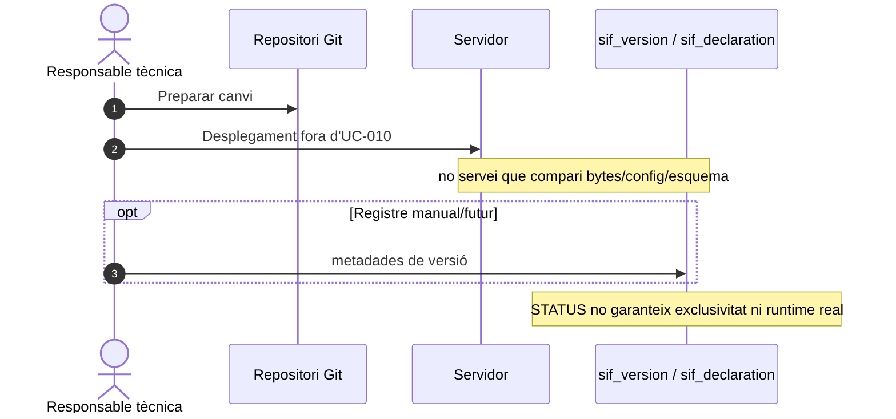
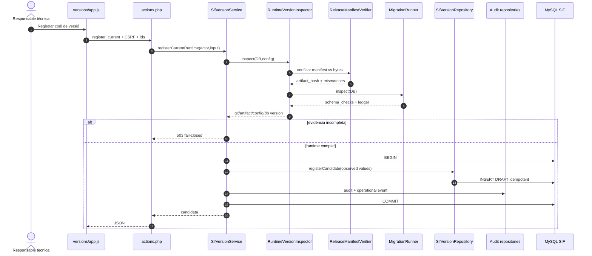
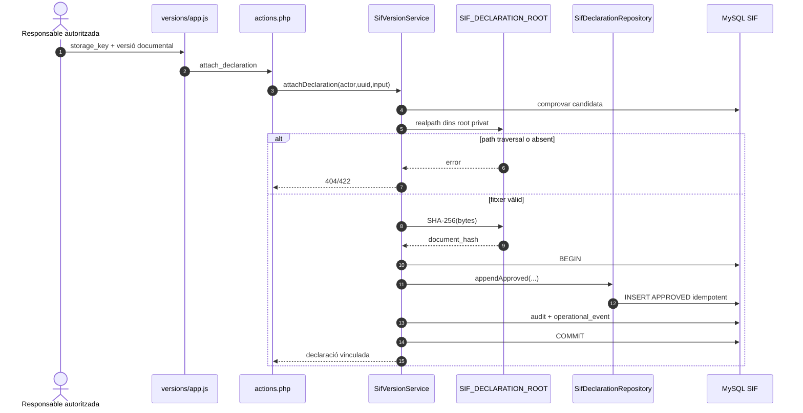
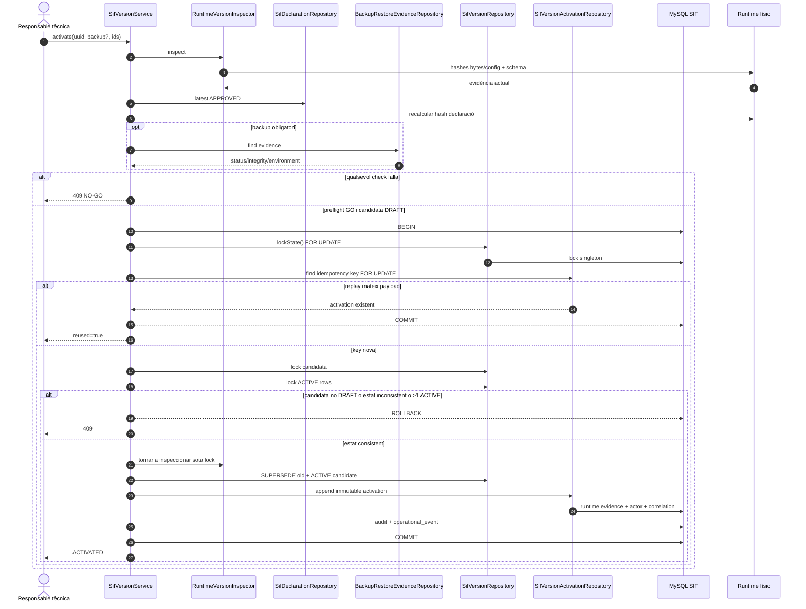
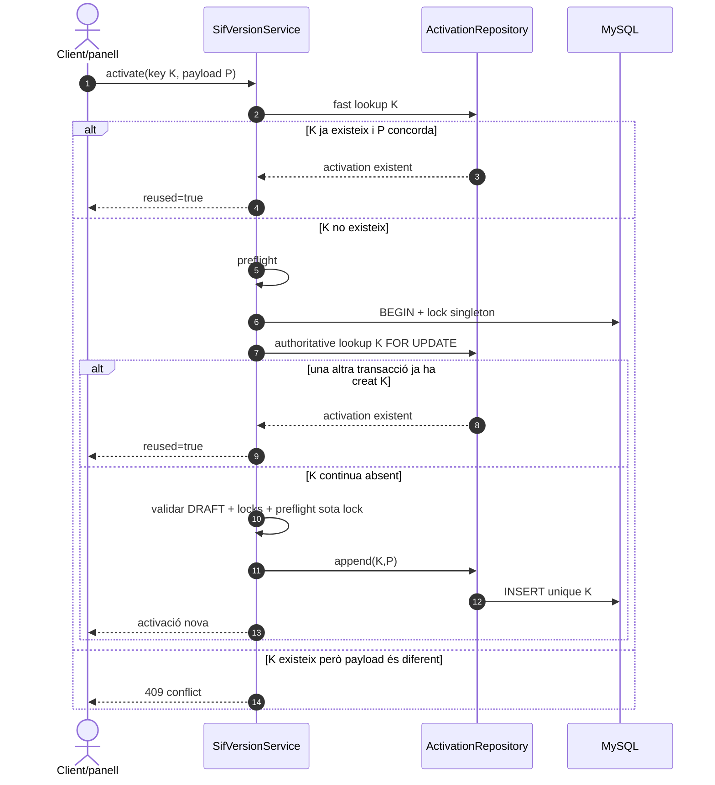
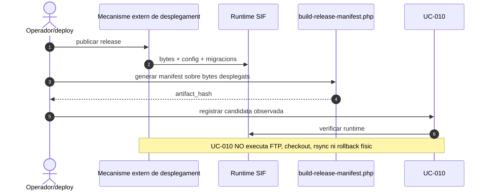

# UC-010 · Diagrames de seqüència ACTUAL / FINAL

## 1. ACTUAL — abans de l'auditoria

No existia una seqüència executable UC-010. El màxim acreditable era persistència SQL i documentació de disseny.

## 2. FINAL A — registrar candidata des del runtime observat

**Invariante:** el navegador no pot proposar els quatre hashes/versions de runtime.

## 3. FINAL B — vincular declaració real

## 4. FINAL C — preflight i activació serialitzada

## 5. FINAL D — replay idempotent

## 6. FINAL E — frontera de desplegament

Aquesta separació evita marcar ACTIVE una versió que només estava “prevista” però no realment servida.

## 7. Nota de verificació 2026-10-04

La seqüència FINAL representa el codi reconciliat, no el PR #139 original. El canvi d'ordre del lock/idempotència i el gate `DRAFT` són correccions derivades de l'auditoria de concurrència i traçabilitat.
