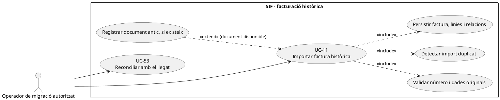
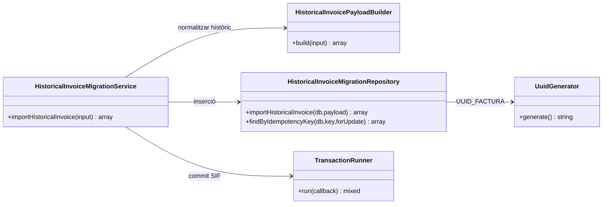
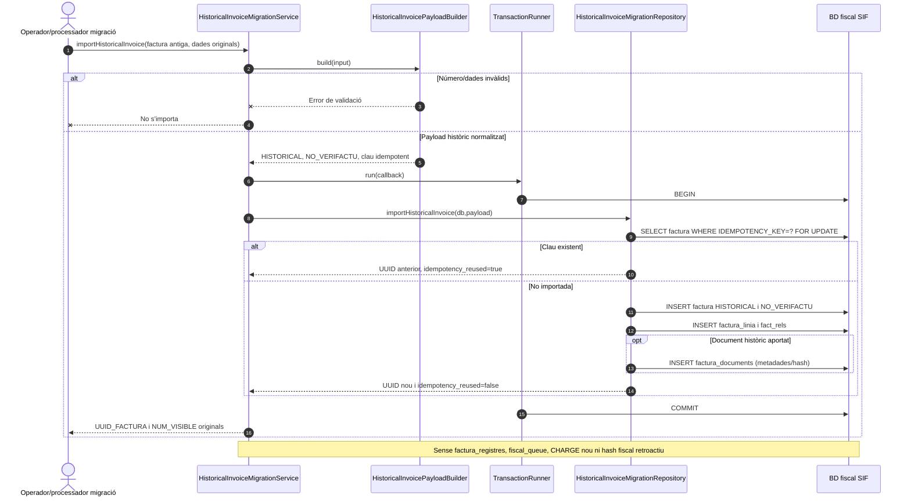
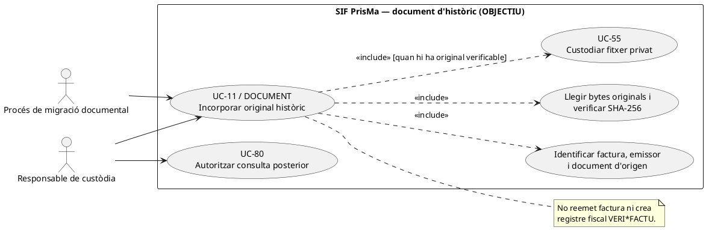
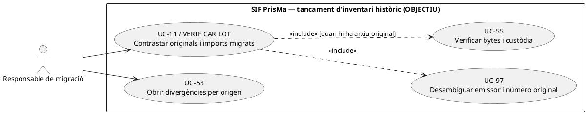

# UC-11 · Importar factura històrica sense reemetre-la

**Objectiu del catàleg:** incorporar factures anteriors al SIF com a **històriques**, preservant número visible, dades de receptor, línies i referències llegades, sense crear artificialment registres VERI*FACTU nous. **Estat comprovat al codi:** `HistoricalInvoiceMigrationService`, `HistoricalInvoicePayloadBuilder` i `HistoricalInvoiceMigrationRepository` implementen un import local transaccional. **No acredita** que s'hagi migrat tot el llegat, ni que s'hagi reconciliat documentalment cada fitxer antic.

## 1. Fitxa específica

| Element | Comportament verificat i condició |
| --- | --- |
| Actor | Procés de migració/operador amb permisos d'importació, no alumnat ni canal TPV ordinari. El servei PHP no és per si mateix una pantalla amb autorització de servidor. |
| Identificador original | `num_visible`/`num_factura` amb patró `LLETRA+ANY(4)/NÚMERO`; la sèrie, any i seqüència es deriven del número si no s'aporten separadament. **Pendent:** validar consistència si es proporcionen valors diferents dels derivats. |
| Dades mínimes | `billing`, `totals` i almenys una línia; `issue_date` per defecte és **la data actual** si no s'aporta. Per a una migració fidel cal exigir **data original explícita**, no acceptar silenciosament el default. |
| Clau idempotent | `HISTORIC|FACT:<num_visible>` si no n'hi ha d'explícita. El repositori recupera un resultat si la clau ja existeix; **no compara el payload antic i el nou** quan la clau coincideix. |
| Persistència local | Insereix `factura` amb `SOURCE_CHANNEL=MIGRACIO`, `ESTAT_FACTURA=HISTORICAL` per defecte i `ESTAT_AEAT=NO_VERIFACTU`; insereix `factura_linia`, `fact_rels` i document opcional a `factura_documents`. |
| Registre fiscal i pagament | Aquest servei **no** crida `InvoiceService`, no crea `factura_registres`, `fiscal_queue`, `payment_transaction` ni `payment_allocation`. `payment_status` importat és una dada històrica declarada, no prova d'un ingrés bancari nou. |
| Document antic opcional | `type=PDF/XML/QR`, path fins a 255 caràcters, hash hexadecimal de 64 caràcters i estat `ARCHIVED` per defecte. El repositori registra metadades; **no copia físicament el document** al storage ni verifica el seu hash. |

### 1.1. Flux principal implementat

1. El procés prepara una factura antiga amb número visible, **data original**, receptor, import real, línies, relacions al llegat i document original quan existeixi. La preparació i extracció des del llegat **no estan implementades dins de `HistoricalInvoiceMigrationService`**.
2. `HistoricalInvoicePayloadBuilder::build()` analitza número visible, normalitza sèrie/any/seqüència, fixa canal `MIGRACIO`, estat `HISTORICAL` i `NO_VERIFACTU`, comprova que hi ha `billing`, `totals` i una línia, i prepara relació per defecte `HISTORIC_WEB_FACTURES` amb `legacy_id` si no n'hi ha de pròpies.
3. El servei obre una transacció amb `TransactionRunner`; `HistoricalInvoiceMigrationRepository::findByIdempotencyKey(...,true)` cerca una factura amb la mateixa clau.
4. Si ja existeix, retorna `UUID_FACTURA`, `NUM_VISIBLE` i `idempotency_reused=true`. **Pendent important:** comparar `num_visible`, receptor, totals, línies i hash de document per detectar una mateixa clau amb dades contradictòries.
5. Si no existeix, crea UUID nou i insereix **factura històrica, línies i relacions** dins la mateixa transacció; només si el payload porta `document`, insereix metadades del document antic.
6. Confirma i retorna `aeat_status=NO_VERIFACTU`. L'import no consumeix una **nova** numeració fiscal ni afegeix aquest document retrospectivament a la cadena/registre AEAT del SIF.
7. Un procés de reconciliació separat UC-53 comprova identificador històric, ruta/hash del document i correlació de cobrament/inscripció si aquestes dades existeixen. **No** tractar el simple estat històric `PAID` com a `CHARGE` registrat avui.

### 1.2. Alternatives i punts crítics

| Cas | Resultat i control pendent |
| --- | --- |
| Número visible amb patró invàlid | El builder rebutja; no crea factura. |
| Número original duplicat amb una clau idempotent diferent | El repositori busca per **clau**; el comportament davant número duplicat depèn de restriccions de BD. Comprovar abans d'importar i registrar conflicte, mai renumerar una factura històrica silenciosament. |
| Import idempotent amb payload diferent | Avui es recupera l'anterior sense comparar contingut; bloquejar en el flux final si les dades discrepen. |
| Falta data d'emissió antiga | El builder pren `date('Y-m-d H:i:s')`: risc d'atribuir data de migració a la factura històrica; exigir-la al canal. |
| Fitxer PDF opcional amb ruta no accessible | Els camps de metadata poden importar-se, però el servei no comprova bytes ni custòdia. UC-55 ha de verificar integritat abans d'oferir el document. |
| Factura històrica cobrada | `ESTAT_COBRAMENT` és una dada importada; sense evidència i model explícit no crear un ingrés nou fictici ni atribuir diners a inscripció. |
| Factura històrica d'una empresa amb N inscripcions | Conservar `fact_rels` per participant quan la font ho acrediti; no suposar que una relació equival a un moviment econòmic individual. |
| Factura anterior que necessita una correcció actual | Classificació específica sobre històrics pendent: `FiscalRecordService` rebutja `NO_VERIFACTU` per les seves rutes UC-30/31; no inserir a cegues una anul·lació fiscal nova sobre aquella factura. |

**Prova localitzada, no executada ara:** `HistoricalInvoiceMigrationServiceTest::testImportsHistoricalInvoiceWithoutFiscalRecordOrQueue`. La prova confirma el contracte local de no crear registre/cua; no substitueix un inventari reconciliat del llegat.

### 1.3. Inventari del llegat i informe de control de la importació

**Origen concret que cal preservar.** El flux de migració acordat conserva `web.factures`, `NUM_VISIBLE` i numeració original, `FACTURA_RELACIONADA`, inscripcions i relacions operatives. En el llegat, `FACTURA_RELACIONADA` pot agrupar una factura ordinària A, una rectificativa negativa R i diverses inscripcions d'empresa/grup; és **un agrupador històric**, no la relació fiscal nova de rectificació ni un rebut bancari. El procés d'extracció ha de recuperar per cada origen l'ID de `web.factures`, emissor acreditat si n'hi ha més d'un, sèrie/número/data originals, receptor, imports, relacions amb `ID_INSC/IDPAG`, documents i dades de cobrament històric **amb la seva font**. El repositori SIF rep aquest payload ja preparat: no extreu les files llegades ni comprova per si sol que el lot és complet.

**Separació entre importació de metadades i prova real.** `HistoricalInvoiceMigrationRepository::insertDocument()` només insereix `TIPUS`, `PATH_FITXER`, `HASH_FITXER` i `ESTAT`. No transfereix els bytes, no comprova el hash físic i no certifica que el PDF de `generaFactura($id,true)` conservi la representació original: el generador llegat pot utilitzar dades vives. Per cada factura, distingir «document antic verificat i custodiat», «metadades sense bytes verificats» i «document original no localitzat» com a **classificacions de l'informe**, no enums implementats. No generar un PDF actual i etiquetar-lo com a original històric immutable.

**Visibilitat i camps que el model actual no recupera fidelment.** `HistoricalInvoiceMigrationRepository::insertRelations()` aplica `VISIBLE_ALUMNE=1` quan la relació importada no aporta el valor; una factura antiga d'empresa/grup **no** ha de passar a ser consultable íntegrament per un participant a causa d'aquest valor per defecte. Resoldre receptor i visibilitat explícits abans d'exposar la factura al portal (UC-80). `insertInvoice()` grava `EMESA_ABANS_COBRAMENT=0` i `E_FACT=0` per a tot l'històric: aquests valors de la migració **no demostren** que la factura antiga fos emesa després de cobrar o que mai no s'enviés electrònicament. Mostrar com a dades no recuperades quan la font no permet assegurar-ne l'estat original; no interpretar el zero importat com a història demostrada.

**Control agregat per lot abans del tancament.** La documentació del projecte exigeix informe per **any i sèrie**, primer/últim número, nombre de factures, imports i incidències. Afegir comprovació per **emissor jurídic i origen** quan existeixin diverses entitats, i relació de números duplicats, dates originals absents, factures A/R, imports negatius, pagaments de font no contrastada i documents sense bytes. Comparar el conjunt de `web.factures` seleccionat amb el conjunt realment importat per ID d'origen; no concloure «migració completa» a partir de l'èxit d'una única inserció o d'una prova PHP unitària. Una incidència no obliga a crear un nou registre VERI*FACTU retrospectiu.

### 1.4. Proves de lot i història (no executades)

| ID | Escenari | Resultat exigible |
| --- | --- | --- |
| HM-01 | Importar A i R històriques amb la mateixa `FACTURA_RELACIONADA` | Dos documents històrics diferenciats, agrupador preservat i cap registre fiscal nou. |
| HM-02 | Factura d'empresa antiga amb tres participants i `VISIBLE_ALUMNE` absent | No publicar PDF complet per efecte del valor per defecte; validar permís específicament. |
| HM-03 | Metadada PDF amb hash però bytes absents o reconstruïts des de BD viva | Estat d'evidència no verificat, sense afirmar que és l'original custodiat. |
| HM-04 | Dues files d'origen/emissor diferent comparteixen número visible | Detectar col·lisió i classificar abans d'importar; no renumerar el llegat per silenciar-la. |
| HM-05 | Històric emès abans de cobrar però `EMESA_ABANS_COBRAMENT=0` importat | No inferir el fet històric del zero forçat; conservar prova original separada si existeix. |
| HM-06 | Reutilitzar clau històrica amb receptor o total diferent | Conflicte de contingut objectiu; la branca actual de reús no el detecta i cal control previ. |
| HM-07 | Lot amb una factura omesa i imports per sèrie que no coincideixen | Informe de conciliació incomplet i reprocessament només de la fila absent, sense duplicitat de les importades. |

## 2. Diagrama de casos d'ús



## 3. Diagrama de classes del codi comprovat



## 4. Diagrama de seqüència — importació o reintent



### 4.1. Acció independent: incorporar els bytes de l'original històric — UC-11/55, DISSENY

**Actor/disparador:** procés de migració documental o responsable de custòdia verifica que una factura històrica ja importada té un original físic recuperable. Aquesta fase pot passar **després** d'haver importat la factura i les seves línies. **Precondicions:** `UUID_FACTURA` històric, emissor i origen documentats, ruta/font llegat, bytes realment llegits, tipus de document, SHA-256 recalculat i dret de custòdia. **Postcondició:** còpia privada íntegra del **fitxer històric real** amb origen i hash verificats; si no existeix, registrar `DOCUMENT_MISSING` com a **classificació de l'expedient proposada**, sense inventar un PDF antic ni dir que `ARCHIVED` prova custòdia. Si la consulta requereix una representació reconstruïda, etiquetar-la com a reconstrucció **diferent** de l'original.

**Contrast PHP:** `HistoricalInvoicePayloadBuilder::document()` només valida tipus, path i *format* hexadecimal del hash que rep. `HistoricalInvoiceMigrationRepository::insertDocument()` inserta aquests tres valors i l'estat subministrat (`ARCHIVED` per defecte), però **no llegeix ni copia el fitxer, no calcula SHA-256 dels bytes i no verifica l'existència de la ruta**. `DocumentRepository::registerDocument()` tampoc copia el fitxer: calcula el hash del `contents` aportat i registra metadades. El procés d'extracció/custòdia és una integració pendent separada del `COMMIT` d'importació de la factura.



```mermaid
sequenceDiagram
autonumber
actor M as Migrador documental
participant H as HistoricalInvoiceMigrationRepository [PHP, metadades]
participant Source as Arxiu original llegat [FONT A VERIFICAR]
participant Store as Storage privat immutable [DISSENY]
participant D as DocumentRepository [PHP, només metadata]
participant SIF as factura + factura_documents [SQL]
participant Inc as Incidència de custòdia [DISSENY]
M->>SIF: Localitzar UUID_FACTURA històric i emissor/origen
M->>Source: Localitzar l'original emès a la data històrica
alt Fitxer absent o només PDF reconstruït amb dades actuals
 Source-->>M: Original NO acreditat
 M->>Inc: Obrir incidència/estat d'evidència original desconegut [OBJECTIU]
 M-->>M: Conservar factura HISTORICAL, cap original inventat
else Bytes originals accessibles
 Source-->>M: Bytes originals i identificació d'origen
 M->>M: Calcular SHA-256 real i contrastar metadades, tipus i factura
 alt Hash declarat difereix o emissor no acreditat
  M->>Inc: Bloquejar publicació; investigar origen, versió i receptor
 else Coincidència amb document original identificat
  M->>Store: Desar bytes en storage privat i tornar-los a llegir
  Store-->>M: Path privat + bytes/hash verificats
  M->>SIF: Cercar metadata històrica preexistent per UUID/path/hash
  alt Metadata coherent ja importada per UC-11
   SIF-->>M: Referència existent; enllaçar-ne storage verificat [OBJECTIU]
  else Falta metadata i no hi ha referència contradictòria
   M->>D: registerDocument(db,UUID_FACTURA,type,path,bytes) [PHP existent]
   D->>SIF: INSERT metadata CREATED, sense escriure bytes
  else Metadata contradictòria
   M->>Inc: Mantenir original sense publicar fins a reconciliar
  end
  M-->>M: Custòdia verificada o incidència, factura fiscal intacta
 end
end
Note over M,SIF: Aquesta coordinació de bytes/storage i estats d'evidència NO està implementada per l'importador PHP actual.
```

### 4.2. Acció independent: verificar inventari d'històrics i documentació incompleta — UC-11/53/97, DISSENY

**Actor/disparador:** responsable de migració vol tancar el lot i permetre consulta de factures antigues. **Precondicions:** inventari d'origen amb ID de cada factura de l'Associació/SL, emissor acreditat, número i data originals, estat de migració i fitxer si existeix. **Postcondició:** recompte i resultat **per document original**, diferenciant `INVOICE_IMPORTED` (dades migrades), `FILE_VERIFIED` (bytes històrics custodis) i `DOCUMENT_UNVERIFIED` (metadades sense bytes o emissor no acreditat), **etiquetes de control proposades**, no enums SQL actuals; una fila `ARCHIVED` no satisfà automàticament `FILE_VERIFIED`.



```mermaid
sequenceDiagram
autonumber
actor R as Responsable migració
participant L as Inventari original de factures/fitxers [LECTURA]
participant S as SIF històrics/fact_rels [LECTURA]
participant Store as Storage privat i hash físic [DISSENY]
participant Diff as UC-53 incidències [DISSENY]
R->>L: Llistar emissors, ID original, número, data, document i hash si consta
L-->>R: N originals amb origen i grau d'evidència
loop Per cada emissor + sistema + ID original
 R->>S: Comparar UUID importat, NUM_VISIBLE, línies, relacions i NO_VERIFACTU
 alt Manca factura al SIF o col·lisió entre emissors
  S-->>R: NOT_IMPORTED/CONFLICT
  R->>Diff: Registrar divergència sense renumerar originals
 else Factura històrica importada
  S-->>R: UUID_FACTURA i metadata de document, si n'hi ha
  opt L'origen acredita fitxer físic
   R->>Store: Verificar còpia i SHA-256 de bytes reals
   Store-->>R: VERIFIED o MISSING/MISMATCH
  end
 end
end
R-->>R: Informe per origen: factura migrada / bytes verificats / emissor acreditat
Note over L,Diff: L'importador PHP no fa inventari de completitud ni verifica storage; cap recompte d'un PDF inferit d'ARCHIVED.
```

| ID de prova pendent | Escenari | Resultat exigible |
| --- | --- | --- |
| HI-11-07 | Importar document amb `path` i hash de 64 hexadecimals però sense fitxer físic | `ARCHIVED` com a metadata importada, **no** `FILE_VERIFIED`; consulta bloquejada fins a prova de bytes. |
| HI-11-08 | Original recuperat posteriorment i hash declarat igual al físic | Custòdia privada verificada i metadata vinculada a la mateixa factura històrica; no segona emissió. |
| HI-11-09 | Original absent però PDF reconstruït avui per generador llegat | Identificar reconstrucció com a tal, no presentar-la com a original històric custodiat. |
| HI-11-10 | Dos emissors amb mateix `NUM_VISIBLE` i distinta factura antiga | Dos orígens independents per emissor/ID; cap fusió per la clau per defecte `HISTORIC|FACT:<num>`. |
| HI-11-11 | Lot amb 50 factures importades i 3 PDF físics absents | Informe separat: 50 dades migrades, només 47 fitxers verificats si la resta també supera el control de hash; 3 incidències documentals. |

## 5. Traçabilitat

[UC-11 original](../06-fitxes-funcionals/uc-011.md) · [UC-53 conciliació](uc-053-detectar-resoldre-divergencies.md) · [UC-55 custòdia](uc-055-custodiar-reintentar-documents.md) · [HistoricalInvoiceMigrationService](../../sif/src/Service/HistoricalInvoiceMigrationService.php) · [PayloadBuilder](../../sif/src/Service/HistoricalInvoicePayloadBuilder.php) · [Repository](../../sif/src/Repository/HistoricalInvoiceMigrationRepository.php) · [Prova d'integració](../../sif/tests/Integration/HistoricalInvoiceMigrationServiceTest.php) · [Revisió dels fons per inscripció](00-revisio-moviments-inscripcions.md).
