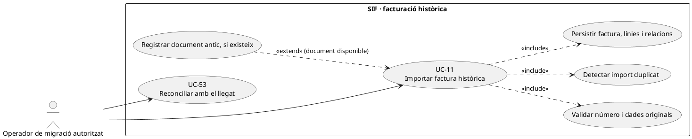
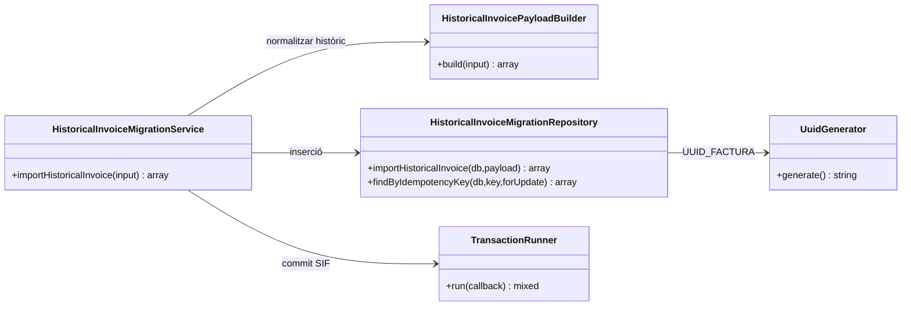
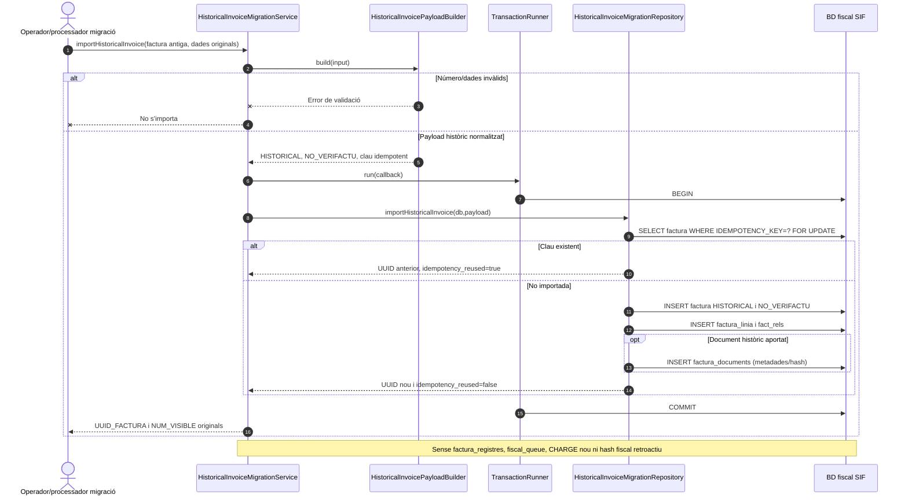

# UC-11 · Importar factura històrica sense reemetre-la

**Objectiu del catàleg:** incorporar factures anteriors al SIF com a **històriques**, preservant número visible, dades de receptor, línies i referències llegades, sense crear artificialment registres VERI*FACTU nous. **Estat comprovat al codi:** `HistoricalInvoiceMigrationService`, `HistoricalInvoicePayloadBuilder` i `HistoricalInvoiceMigrationRepository` implementen un import local transaccional. **No acredita** que s'hagi migrat tot el llegat, ni que s'hagi reconciliat documentalment cada fitxer antic.

## 1. Fitxa específica

| Element | Comportament verificat i condició |
| --- | --- |
| Actor | Procés de migració/operador amb permisos d'importació, no alumnat ni canal TPV ordinari. El servei PHP no és per si mateix una pantalla amb autorització de servidor. |
| Identificador original | `num_visible`/`num_factura` amb patró `LLETRA+ANY(4)/NÚMERO`; la sèrie, any i seqüència es deriven del número si no s'aporten separadament. **Pendent:** validar consistència si es proporcionen valors diferents dels derivats. |
| Dades mínimes | `billing`, `totals` i almenys una línia; `issue_date` per defecte és **la data actual** si no s'aporta. Per a una migració fidel cal exigir **data original explícita**, no acceptar silenciosament el default. |
| Clau idempotent | `HISTORIC|FACT:<num_visible>` si no n'hi ha d'explícita. El repositori recupera un resultat si la clau ja existeix; **no compara el payload antic i el nou** quan la clau coincideix. |
| Persistència local | Insereix `factura` amb `SOURCE_CHANNEL=MIGRACIO`, `ESTAT_FACTURA=HISTORICAL` per defecte i `ESTAT_AEAT=NO_VERIFACTU`; insereix `factura_linia`, `fact_rels` i document opcional a `factura_documents`. |
| Registre fiscal i pagament | Aquest servei **no** crida `InvoiceService`, no crea `factura_registres`, `fiscal_queue`, `payment_transaction` ni `payment_allocation`. `payment_status` importat és una dada històrica declarada, no prova d'un ingrés bancari nou. |
| Document antic opcional | `type=PDF/XML/QR`, path fins a 255 caràcters, hash hexadecimal de 64 caràcters i estat `ARCHIVED` per defecte. El repositori registra metadades; **no copia físicament el document** al storage ni verifica el seu hash. |

### 1.1. Flux principal implementat

1. El procés prepara una factura antiga amb número visible, **data original**, receptor, import real, línies, relacions al llegat i document original quan existeixi. La preparació i extracció des del llegat **no estan implementades dins de `HistoricalInvoiceMigrationService`**.
2. `HistoricalInvoicePayloadBuilder::build()` analitza número visible, normalitza sèrie/any/seqüència, fixa canal `MIGRACIO`, estat `HISTORICAL` i `NO_VERIFACTU`, comprova que hi ha `billing`, `totals` i una línia, i prepara relació per defecte `HISTORIC_WEB_FACTURES` amb `legacy_id` si no n'hi ha de pròpies.
3. El servei obre una transacció amb `TransactionRunner`; `HistoricalInvoiceMigrationRepository::findByIdempotencyKey(...,true)` cerca una factura amb la mateixa clau.
4. Si ja existeix, retorna `UUID_FACTURA`, `NUM_VISIBLE` i `idempotency_reused=true`. **Pendent important:** comparar `num_visible`, receptor, totals, línies i hash de document per detectar una mateixa clau amb dades contradictòries.
5. Si no existeix, crea UUID nou i insereix **factura històrica, línies i relacions** dins la mateixa transacció; només si el payload porta `document`, insereix metadades del document antic.
6. Confirma i retorna `aeat_status=NO_VERIFACTU`. L'import no consumeix una **nova** numeració fiscal ni afegeix aquest document retrospectivament a la cadena/registre AEAT del SIF.
7. Un procés de reconciliació separat UC-53 comprova identificador històric, ruta/hash del document i correlació de cobrament/inscripció si aquestes dades existeixen. **No** tractar el simple estat històric `PAID` com a `CHARGE` registrat avui.

### 1.2. Alternatives i punts crítics

| Cas | Resultat i control pendent |
| --- | --- |
| Número visible amb patró invàlid | El builder rebutja; no crea factura. |
| Número original duplicat amb una clau idempotent diferent | El repositori busca per **clau**; el comportament davant número duplicat depèn de restriccions de BD. Comprovar abans d'importar i registrar conflicte, mai renumerar una factura històrica silenciosament. |
| Import idempotent amb payload diferent | Avui es recupera l'anterior sense comparar contingut; bloquejar en el flux final si les dades discrepen. |
| Falta data d'emissió antiga | El builder pren `date('Y-m-d H:i:s')`: risc d'atribuir data de migració a la factura històrica; exigir-la al canal. |
| Fitxer PDF opcional amb ruta no accessible | Els camps de metadata poden importar-se, però el servei no comprova bytes ni custòdia. UC-55 ha de verificar integritat abans d'oferir el document. |
| Factura històrica cobrada | `ESTAT_COBRAMENT` és una dada importada; sense evidència i model explícit no crear un ingrés nou fictici ni atribuir diners a inscripció. |
| Factura històrica d'una empresa amb N inscripcions | Conservar `fact_rels` per participant quan la font ho acrediti; no suposar que una relació equival a un moviment econòmic individual. |
| Factura anterior que necessita una correcció actual | Classificació específica sobre històrics pendent: `FiscalRecordService` rebutja `NO_VERIFACTU` per les seves rutes UC-30/31; no inserir a cegues una anul·lació fiscal nova sobre aquella factura. |

**Prova localitzada, no executada ara:** `HistoricalInvoiceMigrationServiceTest::testImportsHistoricalInvoiceWithoutFiscalRecordOrQueue`. La prova confirma el contracte local de no crear registre/cua; no substitueix un inventari reconciliat del llegat.

## 2. Diagrama de casos d'ús

## 3. Diagrama de classes del codi comprovat

## 4. Diagrama de seqüència — importació o reintent

## 5. Traçabilitat

[UC-11 original](../06-fitxes-funcionals/uc-011.md) · [UC-53 conciliació](uc-053-detectar-resoldre-divergencies.md) · [UC-55 custòdia](uc-055-custodiar-reintentar-documents.md) · [HistoricalInvoiceMigrationService](../../sif/src/Service/HistoricalInvoiceMigrationService.php) · [PayloadBuilder](../../sif/src/Service/HistoricalInvoicePayloadBuilder.php) · [Repository](../../sif/src/Repository/HistoricalInvoiceMigrationRepository.php) · [Prova d'integració](../../sif/tests/Integration/HistoricalInvoiceMigrationServiceTest.php) · [Revisió dels fons per inscripció](00-revisio-moviments-inscripcions.md).
