# UC-11 · Importar factura històrica sense reemetre-la

**Objectiu del catàleg:** incorporar factures anteriors al SIF com a **històriques**, preservant número visible, emissor/receptor, línies, fiscalitat disponible i referències llegades, sense crear artificialment registres VERI*FACTU nous. **Estat comprovat al codi:** `HistoricalInvoiceMigrationService`, `HistoricalInvoicePayloadBuilder` i `HistoricalInvoiceMigrationRepository` implementen un import local transaccional. **Revisió 03/10/2026:** la branca `audit/uc-011-2026-10-03` reforça data original, coherència de numeració, validació estructural/fiscal, estat HISTORICAL, visibilitat privada, preservació d'emissor/camps fiscals i idempotència per hash de la **projecció materialment persistent**. **No acredita** que s'hagi migrat tot el llegat, ni que s'hagi reconciliat documentalment cada fitxer antic.

Paquet d'auditoria específic: [classes ACTUAL/FINAL](uc-011-classes-actual-final.md) · [seqüències ACTUAL/FINAL](uc-011-sequencies-actual-final.md) · [activitats ACTUAL/FINAL](uc-011-activitats-actual-final.md) · [traçabilitat](uc-011-tracabilitat-implementacio.md) · [auditoria 03/10](05-auditoria-detallada-uc-011-2026-10-03.md).

## 1. Fitxa específica

| Element | Comportament verificat i condició |
| --- | --- |
| Actor | Procés de migració/operador amb permisos d'importació, no alumnat ni canal TPV ordinari. El servei PHP no és per si mateix una pantalla amb autorització de servidor. |
| Identificador original | `num_visible`/`num_factura` amb patró `LLETRA+ANY(4)/NÚMERO`; la sèrie, any i seqüència es deriven del número. **Branca 03/10:** si es proporcionen valors explícits diferents dels derivats, es rebutgen amb 422. |
| Dades mínimes | `billing.name/nif`, `totals.import_base/taxable_base/total`, almenys una línia vàlida i **`issue_date` original explícita**. La branca 03/10 valida també dates, imports, tipus F1/F2/R1-R5, relacions i causes d'exempció. |
| Clau idempotent | `HISTORIC|FACT:<num_visible>` si no n'hi ha d'explícita. La branca 03/10 desa `IDEMPOTENCY_PAYLOAD_HASH` sobre una projecció canònica de les dades realment persistides: aliases equivalents no provoquen conflicte; mateixa clau amb dades materials diferents retorna 409. |
| Persistència local | Insereix `factura` amb `SOURCE_CHANNEL=MIGRACIO`, `ESTAT_FACTURA=HISTORICAL` i `ESTAT_AEAT=NO_VERIFACTU`; insereix `factura_linia`, `fact_rels` i document opcional. Quan la font els aporta, conserva `EMISSOR_NIF/EMISSOR_NOM`, `DESCRIPCIO_OPERACIO`, inversió del subjecte passiu, causa d'exempció/no-subjecció i recàrrec d'equivalència. |
| Registre fiscal i pagament | Aquest servei **no** crida `InvoiceService`, no crea `factura_registres`, `fiscal_queue`, `payment_transaction` ni `payment_allocation`. `payment_status` importat és una dada històrica declarada, no prova d'un ingrés bancari nou. |
| Document antic opcional | `type=PDF/XML/QR`, path fins a 255 caràcters, hash hexadecimal de 64 caràcters i estat `ARCHIVED` per defecte. El repositori registra metadades; **no copia físicament el document** al storage ni verifica el seu hash. |

### 1.1. Flux principal implementat

1. El procés prepara una factura antiga amb número visible, **data original**, receptor, import real, línies, relacions al llegat i document original quan existeixi. La preparació i extracció des del llegat **no estan implementades dins de `HistoricalInvoiceMigrationService`**.
2. `HistoricalInvoicePayloadBuilder::build()` analitza número visible, normalitza i valida sèrie/any/seqüència, dates, tipus, billing, imports, línies, relacions i fiscalitat; fixa `MIGRACIO`, `HISTORICAL` i `NO_VERIFACTU`, normalitza emissor/descripció i prepara relació per defecte `HISTORIC_WEB_FACTURES` amb `legacy_id` si no n'hi ha de pròpies.
3. El servei obre una transacció amb `TransactionRunner`; `HistoricalInvoiceMigrationRepository::findByIdempotencyKey(...,true)` cerca una factura amb la mateixa clau.
4. Si ja existeix, la branca 03/10 projecta només les dades materials que el repository persisteix i compara el seu hash canònic amb `IDEMPOTENCY_PAYLOAD_HASH`. Aliases equivalents poden reutilitzar la mateixa factura; una diferència material o un hash antic no usable retorna 409 i rollback.
5. Si no existeix, crea UUID nou i insereix **factura històrica, emissor/camps fiscals disponibles, línies i relacions** dins la mateixa transacció; només si el payload porta `document`, insereix metadades del document antic.
6. Confirma i retorna `aeat_status=NO_VERIFACTU`. L'import no consumeix una **nova** numeració fiscal ni afegeix aquest document retrospectivament a la cadena/registre AEAT del SIF.
7. Un procés de reconciliació separat UC-53 comprova identificador històric, ruta/hash del document i correlació de cobrament/inscripció si aquestes dades existeixen. **No** tractar el simple estat històric `PAID` com a `CHARGE` registrat avui.

### 1.2. Alternatives i punts crítics

| Cas | Resultat i control pendent |
| --- | --- |
| Número visible amb patró invàlid | El builder rebutja; no crea factura. |
| Número original duplicat d'un altre emissor/origen | El SQL base imposa `UNIQUE(NUM_VISIBLE)` i `UNIQUE(TIPUS_SERIE,ANY_FACT,NUM_SEQ)` globalment sense emissor. Amb clau diferent, l'`INSERT` falla per unicitat; amb la mateixa clau per defecte, el hash material detecta la discrepància i retorna 409 si les dades difereixen. Continua sent un **bloqueig de model multiemissor**, no un cas a renumerar o fusionar silenciosament. |
| Import idempotent amb dades materials diferents | **Corregit a la branca 03/10:** el hash de la projecció persistent ha de coincidir; si discrepa, 409 i cap mutació. Aliases diferents però equivalents es reutilitzen. |
| Falta data d'emissió antiga | **Corregit a la branca 03/10:** el builder exigeix `issue_date`/`data_emissio`; no inventa la data de migració. |
| Fitxer PDF opcional amb ruta no accessible | Els camps de metadata poden importar-se, però el servei no comprova bytes ni custòdia. UC-55 ha de verificar integritat abans d'oferir el document. |
| Factura històrica cobrada | `ESTAT_COBRAMENT` és una dada importada; sense evidència i model explícit no crear un ingrés nou fictici ni atribuir diners a inscripció. |
| Factura històrica d'una empresa amb N inscripcions | Conservar `fact_rels` per participant quan la font ho acrediti; no suposar que una relació equival a un moviment econòmic individual. |
| Factura anterior que necessita una correcció actual | Classificació específica sobre històrics pendent: `FiscalRecordService` rebutja `NO_VERIFACTU` per les seves rutes UC-30/31; no inserir a cegues una anul·lació fiscal nova sobre aquella factura. |

**Prova localitzada, no executada ara:** `HistoricalInvoiceMigrationServiceTest::testImportsHistoricalInvoiceWithoutFiscalRecordOrQueue`. La prova confirma el contracte local de no crear registre/cua; no substitueix un inventari reconciliat del llegat.

### 1.3. Inventari del llegat i informe de control de la importació

**Origen concret que cal preservar.** El flux de migració acordat conserva `web.factures`, `NUM_VISIBLE` i numeració original, `FACTURA_RELACIONADA`, inscripcions i relacions operatives. En el llegat, `FACTURA_RELACIONADA` pot agrupar una factura ordinària A, una rectificativa negativa R i diverses inscripcions d'empresa/grup; és **un agrupador històric**, no la relació fiscal nova de rectificació ni un rebut bancari. El procés d'extracció ha de recuperar per cada origen l'ID de `web.factures`, emissor acreditat si n'hi ha més d'un, sèrie/número/data originals, receptor, imports, relacions amb `ID_INSC/IDPAG`, documents i dades de cobrament històric **amb la seva font**. El repositori SIF rep aquest payload ja preparat: no extreu les files llegades ni comprova per si sol que el lot és complet.

**Separació entre importació de metadades i prova real.** `HistoricalInvoiceMigrationRepository::insertDocument()` només insereix `TIPUS`, `PATH_FITXER`, `HASH_FITXER` i `ESTAT`. No transfereix els bytes, no comprova el hash físic i no certifica que el PDF de `generaFactura($id,true)` conservi la representació original: el generador llegat pot utilitzar dades vives. Per cada factura, distingir «document antic verificat i custodiat», «metadades sense bytes verificats» i «document original no localitzat» com a **classificacions de l'informe**, no enums implementats. No generar un PDF actual i etiquetar-lo com a original històric immutable.

**Visibilitat i camps que el model actual no recupera fidelment.** `HistoricalInvoiceMigrationRepository::insertRelations()` aplicava `VISIBLE_ALUMNE=1`; **branca 03/10:** el default passa a `0`. El repository ja conserva emissor, descripció d'operació i camps fiscals ampliats quan el payload els aporta. En canvi, `EMESA_ABANS_COBRAMENT=0` i `E_FACT=0` continuen forçats per a l'històric: aquests zeros **no demostren** el comportament històric real. Quan la font no ho acredita, tractar-los com a dades no recuperades, no com a fets.

**Control agregat per lot abans del tancament.** La documentació del projecte exigeix informe per **any i sèrie**, primer/últim número, nombre de factures, imports i incidències. Afegir comprovació per **emissor jurídic i origen** quan existeixin diverses entitats, i relació de números duplicats, dates originals absents, factures A/R, imports negatius, pagaments de font no contrastada i documents sense bytes. Comparar el conjunt de `web.factures` seleccionat amb el conjunt realment importat per ID d'origen; no concloure «migració completa» a partir de l'èxit d'una única inserció o d'una prova PHP unitària. Una incidència no obliga a crear un nou registre VERI*FACTU retrospectiu.

### 1.4. Proves de lot i història (no executades)

| ID | Escenari | Resultat exigible |
| --- | --- | --- |
| HM-01 | Importar A i R històriques amb la mateixa `FACTURA_RELACIONADA` | Dos documents històrics diferenciats, agrupador preservat i cap registre fiscal nou. |
| HM-02 | Factura d'empresa antiga amb tres participants i `VISIBLE_ALUMNE` absent | No publicar PDF complet per efecte del valor per defecte; validar permís específicament. |
| HM-03 | Metadada PDF amb hash però bytes absents o reconstruïts des de BD viva | Estat d'evidència no verificat, sense afirmar que és l'original custodiat. |
| HM-04 | Dues files d'origen/emissor diferent comparteixen número visible | Detectar col·lisió i classificar abans d'importar; no renumerar el llegat per silenciar-la. |
| HM-05 | Històric emès abans de cobrar però `EMESA_ABANS_COBRAMENT=0` importat | No inferir el fet històric del zero forçat; conservar prova original separada si existeix. |
| HM-06 | Reutilitzar clau històrica amb receptor o total diferent | Conflicte 409 per hash material diferent; no reutilitzar la factura anterior. |
| HM-08 | Reintentar la mateixa factura amb aliases `num_factura/data_emissio` | Reuse de la mateixa UUID; aliases equivalents no generen conflicte. |
| HM-09 | Factura amb emissor, descripció i recàrrec d'equivalència acreditats | Camps preservats a `factura`/`factura_linia`, sense registre fiscal nou. |
| HM-07 | Lot amb una factura omesa i imports per sèrie que no coincideixen | Informe de conciliació incomplet i reprocessament només de la fila absent, sense duplicitat de les importades. |

### 1.5. Superfície llegada ACTUAL i cut-over

La pàgina `codi-drive/intranet-actual/alumnes-factura.php` carrega `alumnes-factura.js` i, segons feature flag, `alumnes-factura-sif.js`. Aquesta UI **no executa UC-011**: és la font operativa que consulta primer el SIF/UC-007 amb fallback al llegat i encara pot editar, anul·lar o regenerar una factura antiga.

Els endpoints `guardarDadesFactura_Factures.php`, `anularFactura_Factures.php` i `descarregaFactura.php` passen per `SifLegacyInvoiceMutationGuard`. Quan `SIF_BLOCK_LEGACY_INVOICE_MUTATIONS=1` i `SIF_UC007_QUERY_ENABLED=1`, el guard busca una factura SIF per `HISTORIC_WEB_FACTURES/source_id` o `factura_relacionada` i bloqueja el llegat amb 409. Per tant, les `fact_rels` d'UC-011 formen part real del **mecanisme de cut-over**.

`descarregaFactura.php` crida `Intranet->generaFactura(id,true)` i genera un PDF temporal des de dades vives. Aquesta representació pot ser útil per consulta, però no prova els bytes de l'original històric.

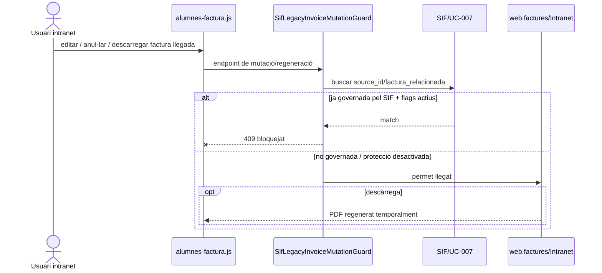
```mermaid
sequenceDiagram
actor U as Usuari intranet
participant JS as alumnes-factura.js
participant G as SifLegacyInvoiceMutationGuard
participant S as SIF/UC-007
participant L as web.factures/Intranet
U->>JS: editar / anul·lar / descarregar factura llegada
JS->>G: endpoint de mutació/regeneració
G->>S: buscar source_id/factura_relacionada
alt ja governada pel SIF + flags actius
 S-->>G: match
 G--xJS: 409 bloquejat
else no governada / protecció desactivada
 G->>L: permet llegat
 opt descàrrega
  L-->>JS: PDF regenerat temporalment
 end
end
```

**Pendent de verificació de cut-over:** provar a `sif_pre` que una factura migrada queda consultable al SIF i que editar/anul·lar/regenerar pel flux llegat queda bloquejat amb els dos flags actius.

## 2. Diagrama de casos d'ús

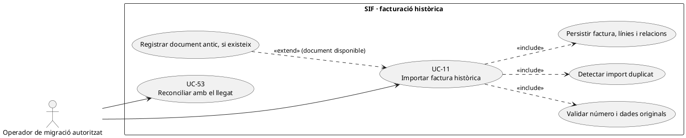
```plantuml
@startuml
left to right direction
actor "Operador de migració autoritzat" as Op
rectangle "SIF · facturació històrica" {
 usecase "UC-11\nImportar factura històrica" as Main
 usecase "Validar número i dades originals" as Check
 usecase "Detectar import duplicat" as Dup
 usecase "Persistir factura, línies i relacions" as Save
 usecase "Registrar document antic, si existeix" as Doc
 usecase "UC-53\nReconciliar amb el llegat" as Rec
}
Op --> Main
Main ..> Check : <<include>>
Main ..> Dup : <<include>>
Main ..> Save : <<include>>
Doc ..> Main : <<extend>> (document disponible)
Op --> Rec
@enduml
```

### Vista de casos d’ús per a GitHub (Mermaid)

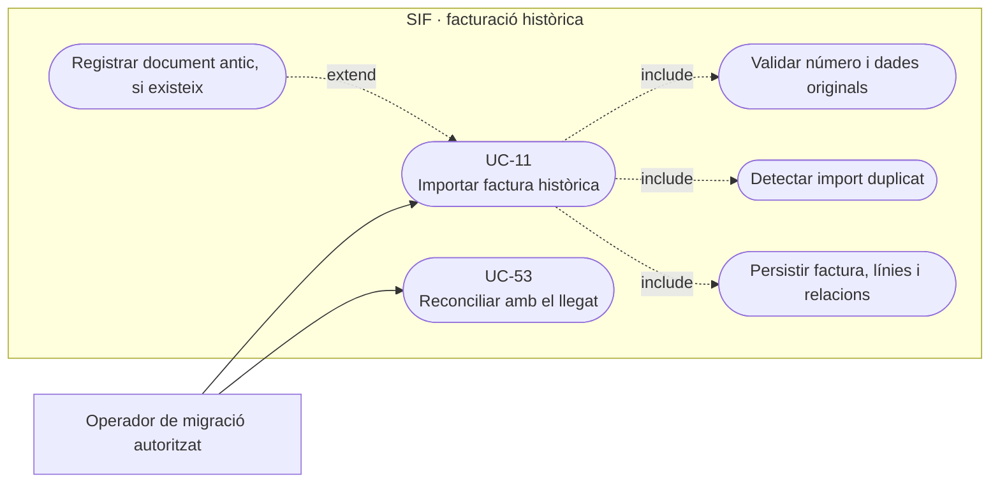
```mermaid
flowchart LR
  actor_0["Operador de migració autoritzat"]
  subgraph SIF_BOX["SIF · facturació històrica"]
    uc_0(["UC-11<br/>Importar factura històrica"])
    uc_1(["Validar número i dades originals"])
    uc_2(["Detectar import duplicat"])
    uc_3(["Persistir factura, línies i relacions"])
    uc_4(["Registrar document antic, si existeix"])
    uc_5(["UC-53<br/>Reconciliar amb el llegat"])
  end
  actor_0 --> uc_0
  uc_0 -.->|include| uc_1
  uc_0 -.->|include| uc_2
  uc_0 -.->|include| uc_3
  uc_4 -.->|extend| uc_0
  actor_0 --> uc_5
```

## 3. Diagrama de classes del codi comprovat

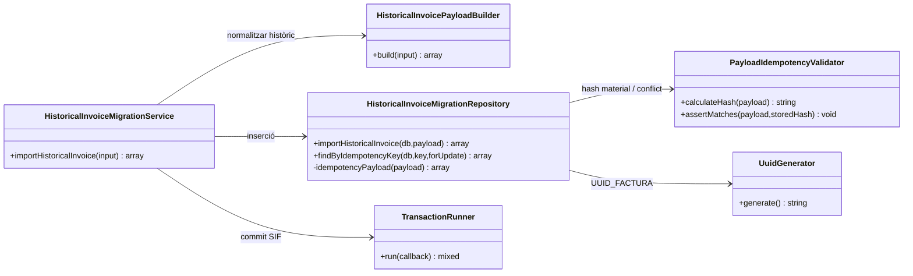
```mermaid
classDiagram
direction LR
class HistoricalInvoiceMigrationService {
 +importHistoricalInvoice(input) array
}
class HistoricalInvoicePayloadBuilder {
 +build(input) array
}
class HistoricalInvoiceMigrationRepository {
 +importHistoricalInvoice(db,payload) array
 +findByIdempotencyKey(db,key,forUpdate) array
 -idempotencyPayload(payload) array
}
class PayloadIdempotencyValidator {
 +calculateHash(payload) string
 +assertMatches(payload,storedHash) void
}
class TransactionRunner {
 +run(callback) mixed
}
class UuidGenerator {
 +generate() string
}
HistoricalInvoiceMigrationService --> HistoricalInvoicePayloadBuilder : normalitzar històric
HistoricalInvoiceMigrationService --> TransactionRunner : commit SIF
HistoricalInvoiceMigrationService --> HistoricalInvoiceMigrationRepository : inserció
HistoricalInvoiceMigrationRepository --> PayloadIdempotencyValidator : hash material / conflict
HistoricalInvoiceMigrationRepository --> UuidGenerator : UUID_FACTURA
```

## 4. Diagrama de seqüència — importació o reintent

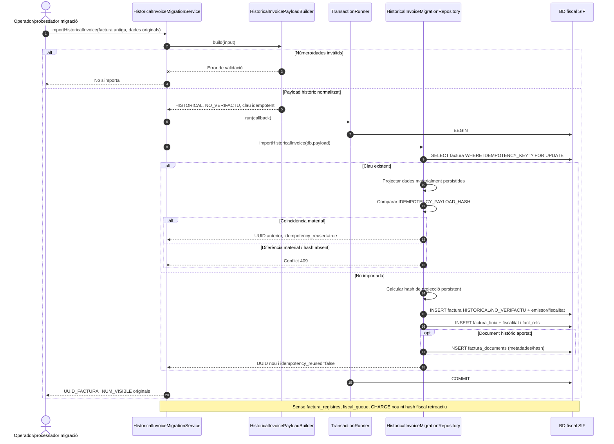
```mermaid
sequenceDiagram
autonumber
actor O as Operador/processador migració
participant S as HistoricalInvoiceMigrationService
participant B as HistoricalInvoicePayloadBuilder
participant T as TransactionRunner
participant R as HistoricalInvoiceMigrationRepository
participant DB as BD fiscal SIF
O->>S: importHistoricalInvoice(factura antiga, dades originals)
S->>B: build(input)
alt Número/dades invàlids
 B--xS: Error de validació
 S--xO: No s'importa
else Payload històric normalitzat
 B-->>S: HISTORICAL, NO_VERIFACTU, clau idempotent
 S->>T: run(callback)
 T->>DB: BEGIN
 S->>R: importHistoricalInvoice(db,payload)
 R->>DB: SELECT factura WHERE IDEMPOTENCY_KEY=? FOR UPDATE
 alt Clau existent
  R->>R: Projectar dades materialment persistides
  R->>R: Comparar IDEMPOTENCY_PAYLOAD_HASH
  alt Coincidència material
   R-->>S: UUID anterior, idempotency_reused=true
  else Diferència material / hash absent
   R--xS: Conflict 409
  end
 else No importada
  R->>R: Calcular hash de projecció persistent
  R->>DB: INSERT factura HISTORICAL/NO_VERIFACTU + emissor/fiscalitat
  R->>DB: INSERT factura_linia + fiscalitat i fact_rels
  opt Document històric aportat
   R->>DB: INSERT factura_documents (metadades/hash)
  end
  R-->>S: UUID nou i idempotency_reused=false
 end
 T->>DB: COMMIT
 S-->>O: UUID_FACTURA i NUM_VISIBLE originals
end
Note over S,DB: Sense factura_registres, fiscal_queue, CHARGE nou ni hash fiscal retroactiu
```

### 4.1. Acció independent: incorporar els bytes de l'original històric — UC-11/55, DISSENY

**Actor/disparador:** procés de migració documental o responsable de custòdia verifica que una factura històrica ja importada té un original físic recuperable. Aquesta fase pot passar **després** d'haver importat la factura i les seves línies. **Precondicions:** `UUID_FACTURA` històric, emissor i origen documentats, ruta/font llegat, bytes realment llegits, tipus de document, SHA-256 recalculat i dret de custòdia. **Postcondició:** còpia privada íntegra del **fitxer històric real** amb origen i hash verificats; si no existeix, registrar `DOCUMENT_MISSING` com a **classificació de l'expedient proposada**, sense inventar un PDF antic ni dir que `ARCHIVED` prova custòdia. Si la consulta requereix una representació reconstruïda, etiquetar-la com a reconstrucció **diferent** de l'original.

**Contrast del model multiemissor:** abans d'incorporar bytes d'un segon original amb número aparentment igual cal identificar **emissor + sistema + ID original** (UC-97). La taula `factura` no permet avui dues files homònimes d'emissors diferents només amb una clau idempotent nova; no associar el PDF de la SL a la factura d'Associació reutilitzada erròniament.

**Contrast PHP:** `HistoricalInvoicePayloadBuilder::document()` només valida tipus, path i *format* hexadecimal del hash que rep. `HistoricalInvoiceMigrationRepository::insertDocument()` inserta aquests tres valors i l'estat subministrat (`ARCHIVED` per defecte), però **no llegeix ni copia el fitxer, no calcula SHA-256 dels bytes i no verifica l'existència de la ruta**. `DocumentRepository::registerDocument()` tampoc copia el fitxer: calcula el hash del `contents` aportat i registra metadades. El procés d'extracció/custòdia és una integració pendent separada del `COMMIT` d'importació de la factura.

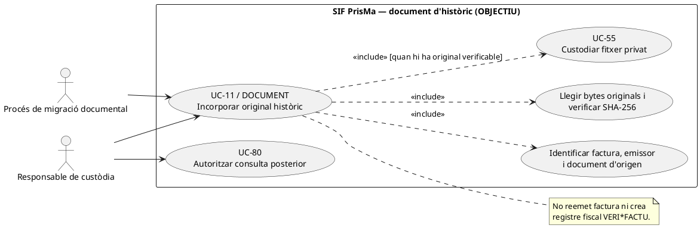
```plantuml
@startuml
left to right direction
actor "Procés de migració documental" as M
actor "Responsable de custòdia" as R
rectangle "SIF PrisMa — document d'històric (OBJECTIU)" {
 usecase "UC-11 / DOCUMENT\nIncorporar original històric" as Import
 usecase "Identificar factura, emissor\ni document d'origen" as Origin
 usecase "Llegir bytes originals i\nverificar SHA-256" as Check
 usecase "UC-55\nCustodiar fitxer privat" as Store
 usecase "UC-80\nAutoritzar consulta posterior" as Read
}
M --> Import
R --> Import
Import ..> Origin : <<include>>
Import ..> Check : <<include>>
Import ..> Store : <<include>> [quan hi ha original verificable]
R --> Read
note right of Import
 No reemet factura ni crea
 registre fiscal VERI*FACTU.
end note
@enduml
```

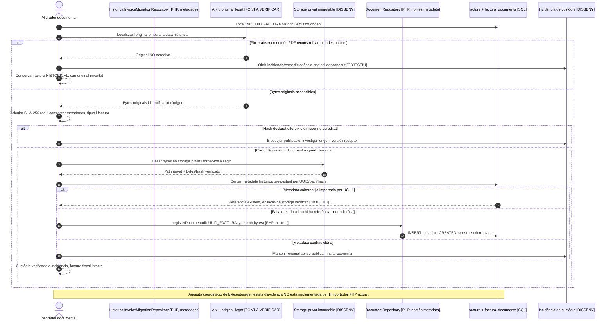
```mermaid
sequenceDiagram
autonumber
actor M as Migrador documental
participant H as HistoricalInvoiceMigrationRepository [PHP, metadades]
participant Source as Arxiu original llegat [FONT A VERIFICAR]
participant Store as Storage privat immutable [DISSENY]
participant D as DocumentRepository [PHP, només metadata]
participant SIF as factura + factura_documents [SQL]
participant Inc as Incidència de custòdia [DISSENY]
M->>SIF: Localitzar UUID_FACTURA històric i emissor/origen
M->>Source: Localitzar l'original emès a la data històrica
alt Fitxer absent o només PDF reconstruït amb dades actuals
 Source-->>M: Original NO acreditat
 M->>Inc: Obrir incidència/estat d'evidència original desconegut [OBJECTIU]
 M-->>M: Conservar factura HISTORICAL, cap original inventat
else Bytes originals accessibles
 Source-->>M: Bytes originals i identificació d'origen
 M->>M: Calcular SHA-256 real i contrastar metadades, tipus i factura
 alt Hash declarat difereix o emissor no acreditat
  M->>Inc: Bloquejar publicació, investigar origen, versió i receptor
 else Coincidència amb document original identificat
  M->>Store: Desar bytes en storage privat i tornar-los a llegir
  Store-->>M: Path privat + bytes/hash verificats
  M->>SIF: Cercar metadata històrica preexistent per UUID/path/hash
  alt Metadata coherent ja importada per UC-11
   SIF-->>M: Referència existent, enllaçar-ne storage verificat [OBJECTIU]
  else Falta metadata i no hi ha referència contradictòria
   M->>D: registerDocument(db,UUID_FACTURA,type,path,bytes) [PHP existent]
   D->>SIF: INSERT metadata CREATED, sense escriure bytes
  else Metadata contradictòria
   M->>Inc: Mantenir original sense publicar fins a reconciliar
  end
  M-->>M: Custòdia verificada o incidència, factura fiscal intacta
 end
end
Note over M,SIF: Aquesta coordinació de bytes/storage i estats d'evidència NO està implementada per l'importador PHP actual.
```

### 4.2. Acció independent: verificar inventari d'històrics i documentació incompleta — UC-11/53/97, DISSENY

**Actor/disparador:** responsable de migració vol tancar el lot i permetre consulta de factures antigues. **Precondicions:** inventari d'origen amb ID de cada factura de l'Associació/SL, emissor acreditat, número i data originals, estat de migració i fitxer si existeix. **Postcondició:** recompte i resultat **per document original**, diferenciant `INVOICE_IMPORTED` (dades migrades), `FILE_VERIFIED` (bytes històrics custodis) i `DOCUMENT_UNVERIFIED` (metadades sense bytes o emissor no acreditat), **etiquetes de control proposades**, no enums SQL actuals; una fila `ARCHIVED` no satisfà automàticament `FILE_VERIFIED`.

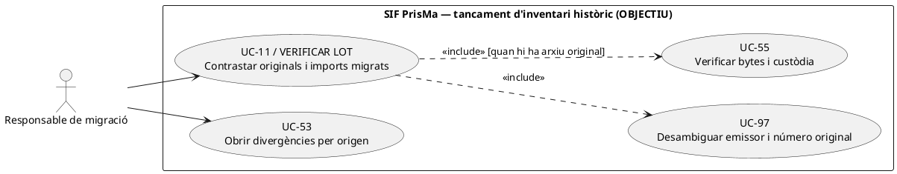
```plantuml
@startuml
left to right direction
actor "Responsable de migració" as R
rectangle "SIF PrisMa — tancament d'inventari històric (OBJECTIU)" {
 usecase "UC-11 / VERIFICAR LOT\nContrastar originals i imports migrats" as Check
 usecase "UC-97\nDesambiguar emissor i número original" as Issuer
 usecase "UC-55\nVerificar bytes i custòdia" as File
 usecase "UC-53\nObrir divergències per origen" as Diff
}
R --> Check
Check ..> Issuer : <<include>>
Check ..> File : <<include>> [quan hi ha arxiu original]
R --> Diff
@enduml
```

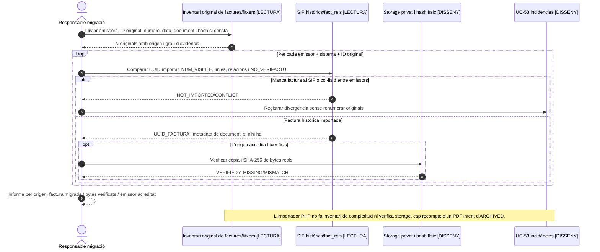
```mermaid
sequenceDiagram
autonumber
actor R as Responsable migració
participant L as Inventari original de factures/fitxers [LECTURA]
participant S as SIF històrics/fact_rels [LECTURA]
participant Store as Storage privat i hash físic [DISSENY]
participant Diff as UC-53 incidències [DISSENY]
R->>L: Llistar emissors, ID original, número, data, document i hash si consta
L-->>R: N originals amb origen i grau d'evidència
loop Per cada emissor + sistema + ID original
 R->>S: Comparar UUID importat, NUM_VISIBLE, línies, relacions i NO_VERIFACTU
 alt Manca factura al SIF o col·lisió entre emissors
  S-->>R: NOT_IMPORTED/CONFLICT
  R->>Diff: Registrar divergència sense renumerar originals
 else Factura històrica importada
  S-->>R: UUID_FACTURA i metadata de document, si n'hi ha
  opt L'origen acredita fitxer físic
   R->>Store: Verificar còpia i SHA-256 de bytes reals
   Store-->>R: VERIFIED o MISSING/MISMATCH
  end
 end
end
R-->>R: Informe per origen: factura migrada / bytes verificats / emissor acreditat
Note over L,Diff: L'importador PHP no fa inventari de completitud ni verifica storage, cap recompte d'un PDF inferit d'ARCHIVED.
```

| ID de prova pendent | Escenari | Resultat exigible |
| --- | --- | --- |
| HI-11-07 | Importar document amb `path` i hash de 64 hexadecimals però sense fitxer físic | `ARCHIVED` com a metadata importada, **no** `FILE_VERIFIED`; consulta bloquejada fins a prova de bytes. |
| HI-11-08 | Original recuperat posteriorment i hash declarat igual al físic | Custòdia privada verificada i metadata vinculada a la mateixa factura històrica; no segona emissió. |
| HI-11-09 | Original absent però PDF reconstruït avui per generador llegat | Identificar reconstrucció com a tal, no presentar-la com a original històric custodiat. |
| HI-11-10 | Dos emissors amb mateix `NUM_VISIBLE` i distinta factura antiga | **Esquema actual bloquejant:** mateixa clau amb dades diferents retorna 409; clau diferent col·lideix amb UNIQUE de número/sèrie-any-seqüència. No vincular el segon PDF a la primera; model multiemissor pendent (UC-97). |
| HI-11-11 | Lot amb 50 factures importades i 3 PDF físics absents | Informe separat: 50 dades migrades, només 47 fitxers verificats si la resta també supera el control de hash; 3 incidències documentals. |

### 4.3. Acció independent: comprovar que l'històric no bloqueja la numeració fiscal nova — DISSENY/BLOQUEJANT

**Disparador:** el procés de migració vol importar factures del mateix any/sèrie que les noves emissions SIF, o dues fonts històriques comparteixen número. **Actor:** responsable tècnica/fiscal de la migració. **Precondicions:** consulta de números originals, emissor acreditat, `fiscal_sequence` i `factura` de la versió objectiu. **Resultat:** informe de conflictes de numeració i decisió de model abans d'inserir l'històric; no canviar directament `LAST_NUM` ni renumerar factures emeses per fer desaparèixer una col·lisió.

**Contrast del PHP/SQL:** `HistoricalInvoiceMigrationRepository::importHistoricalInvoice()` insereix la factura original a `factura` i **no crida** `FiscalSequenceRepository::next()`; `FiscalSequenceRepository::next()` calcula el número següent a partir de `fiscal_sequence.LAST_NUM` i no consulta prèviament la sèrie/any/números que ocupa l'històric. `InvoiceRepository::createInvoiceGraph()` calcula `NUM_VISIBLE` d'aquell número i insereix a `factura`, que té `UNIQUE(NUM_VISIBLE)` i `UNIQUE(TIPUS_SERIE,ANY_FACT,NUM_SEQ)` globals. Si coincideixen, la inserció d'una nova factura **pot fallar per duplicat** malgrat ser dos documents diferents. La solució de model multiemissor/històric no està implementada; **no s'ha provat una execució real d'aquesta col·lisió**.

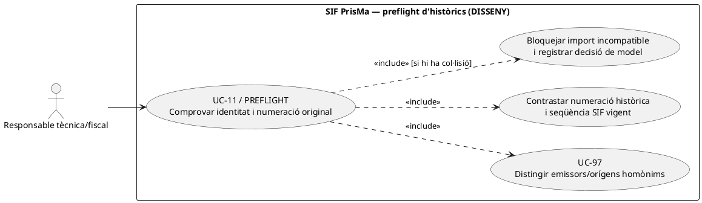
```plantuml
@startuml
left to right direction
actor "Responsable tècnica/fiscal" as R
rectangle "SIF PrisMa — preflight d'històrics (DISSENY)" {
 usecase "UC-11 / PREFLIGHT\nComprovar identitat i numeració original" as Preview
 usecase "UC-97\nDistingir emissors/orígens homònims" as Issuer
 usecase "Contrastar numeració històrica\ni seqüència SIF vigent" as Seq
 usecase "Bloquejar import incompatible\ni registrar decisió de model" as Block
}
R --> Preview
Preview ..> Issuer : <<include>>
Preview ..> Seq : <<include>>
Preview ..> Block : <<include>> [si hi ha col·lisió]
@enduml
```

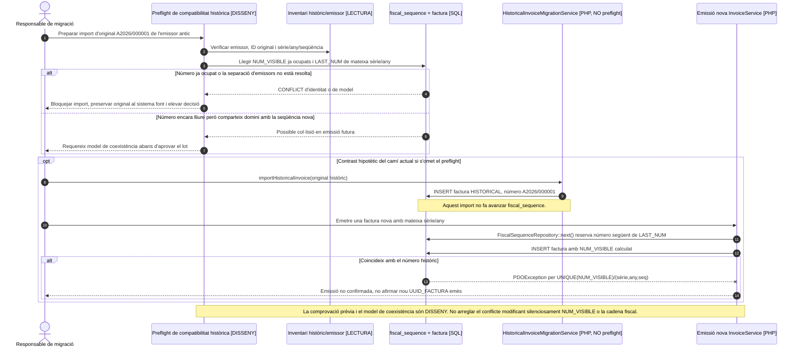
```mermaid
sequenceDiagram
autonumber
actor R as Responsable de migració
participant P as Preflight de compatibilitat històrica [DISSENY]
participant L as Inventari històric/emissor [LECTURA]
participant F as fiscal_sequence + factura [SQL]
participant H as HistoricalInvoiceMigrationService [PHP, NO preflight]
participant N as Emissió nova InvoiceService [PHP]
R->>P: Preparar import d'original A2026/000001 de l'emissor antic
P->>L: Verificar emissor, ID original i sèrie/any/seqüència
P->>F: Llegir NUM_VISIBLE ja ocupats i LAST_NUM de mateixa sèrie/any
alt Número ja ocupat o la separació d'emissors no està resolta
 F-->>P: CONFLICT d'identitat o de model
 P-->>R: Bloquejar import, preservar original al sistema font i elevar decisió
else Número encara lliure però comparteix domini amb la seqüència nova
 F-->>P: Possible col·lisió en emissió futura
 P-->>R: Requereix model de coexistència abans d'aprovar el lot
end
opt Contrast hipotètic del camí actual si s'omet el preflight
 R->>H: importHistoricalInvoice(original històric)
 H->>F: INSERT factura HISTORICAL, número A2026/000001
 Note over H,F: Aquest import no fa avanzar fiscal_sequence.
 R->>N: Emetre una factura nova amb mateixa sèrie/any
 N->>F: FiscalSequenceRepository::next() reserva número següent de LAST_NUM
 N->>F: INSERT factura amb NUM_VISIBLE calculat
 alt Coincideix amb el número històric
  F--xN: PDOException per UNIQUE(NUM_VISIBLE)/(sèrie,any,seq)
  N-->>R: Emissió no confirmada, no afirmar nou UUID_FACTURA emès
 end
end
Note over P,N: La comprovació prèvia i el model de coexistència són DISSENY. No arreglar el conflicte modificant silenciosament NUM_VISIBLE o la cadena fiscal.
```

| Prova pendent | Escenari | Resultat exigible |
| --- | --- | --- |
| HI-11-12 | Històric A2026/000001 al mateix esquema mentre `fiscal_sequence` A/2026 apunta a 0 | Preflight bloqueja la coexistència incompatible; el camí actual pot trobar duplicat al següent `InvoiceRepository::insertInvoice()`. |
| HI-11-13 | Històric amb número igual a una factura SIF ja emesa | Cap import erroni ni renumeració; classificar conflicte d'origen/emissor i preservar factura SIF original. |
| HI-11-14 | Proposta de separar històrics en model propi | Preservar número/emissor i bytes originals, consultabilitat autoritzada i continuïtat de `fiscal_sequence`/cadena nova amb proves end-to-end. |

## 5. Traçabilitat

[UC-11 original](../06-fitxes-funcionals/uc-011.md) · [UC-53 conciliació](uc-053-detectar-resoldre-divergencies.md) · [UC-55 custòdia](uc-055-custodiar-reintentar-documents.md) · [HistoricalInvoiceMigrationService](../../sif/src/Service/HistoricalInvoiceMigrationService.php) · [PayloadBuilder](../../sif/src/Service/HistoricalInvoicePayloadBuilder.php) · [Repository](../../sif/src/Repository/HistoricalInvoiceMigrationRepository.php) · [Prova d'integració](../../sif/tests/Integration/HistoricalInvoiceMigrationServiceTest.php) · [Revisió dels fons per inscripció](00-revisio-moviments-inscripcions.md).
