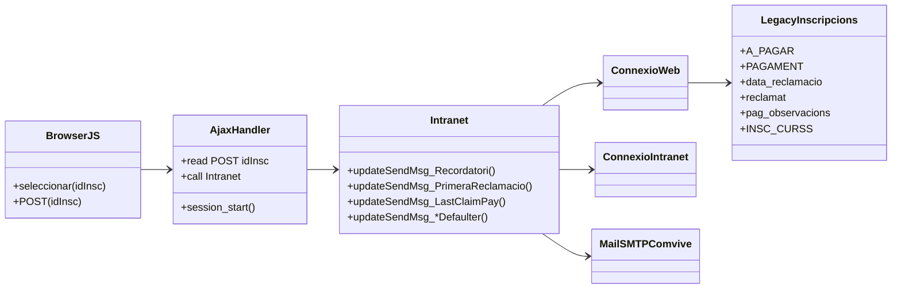
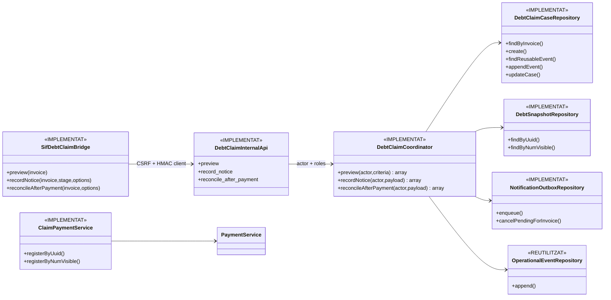

# UC-012 — Classes ACTUAL / FINAL

## 1. ACTUAL — arquitectura observada

### Observacions ACTUAL

- La pàgina/JS decideix quins registres enviar.
- L’AJAX transmet `idInsc` i el llegat concentra consulta, UPDATE, URL i SMTP.
- El saldo es deriva principalment de `A_PAGAR-PAGAMENT`.
- Els POST antics continuen actius fins al cutover; no es reclassifiquen com a segurs pel sol fet d’existir el bridge nou.

## 2. FINAL — arquitectura implementada a la branca d’auditoria

## 3. Responsabilitats FINAL

### Frontera intranet
`ajax/facturacio/sifDebtClaim.php` exigeix feature flag, POST, mateix origen, AJAX, CSRF, actor/rol i permís d’edició. No accepta `ID_INSC` com a autoritat fiscal: exigeix `UUID_FACTURA` o `NUM_VISIBLE`.

### `DebtClaimCoordinator`
Autoritat del cicle de reclamació per acció explícita d’operador. Revalida saldo abans del commit, evita regressions d’etapa, registra events idempotents i no crea cap efecte fiscal/monetari per un avís.

### `DebtClaimCaseRepository`
Persistència versionada de `debt_claim_case` i historial append-only `debt_claim_event`, amb `IDEMPOTENCY_KEY`, `PAYLOAD_HASH`, actor, request/correlation IDs i saldo abans/després.

### `DebtSnapshotRepository`
Construeix saldo des de `factura` + `payment_allocation` + moviments `CHARGE/COMPENSATION/REFUND`. Resol el receptor fiscal de la factura. **No** inventa venciment/pròrroga: UC-096 continua pendent.

### `NotificationOutboxRepository`
Encola avisos idempotents i cancel·la els `PENDING` quan el deute queda a zero. `NotificationOutboxDeliveryService` tracta `CANCELLED` com a no enviable.

### `ClaimPaymentService`
Registra el cobrament real posterior contra la factura existent. La reconciliació del claim es fa després amb `DebtClaimCoordinator::reconcileAfterPayment()`.

## 4. Estat

- Classes ACTUAL: **IMPLEMENTADES LEGACY / inspecció estàtica**.
- Nucli FINAL SIF: **IMPLEMENTAT A `audit/uc-012-2026-10-03`**.
- Frontera segura intranet: **IMPLEMENTADA PERÒ DESACTIVADA PER FEATURE FLAG**.
- Proves: **ESCRITES; GitHub Actions continua en cua**.
- Automatització per dates: **BLOQUEJADA PER UC-096**.
- Cutover/preproducció: **PENDENTS**.
