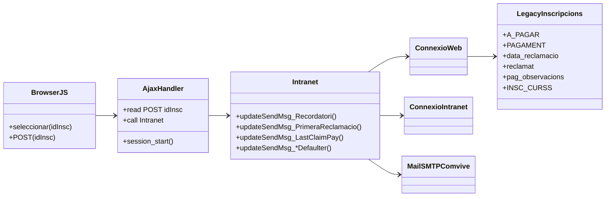
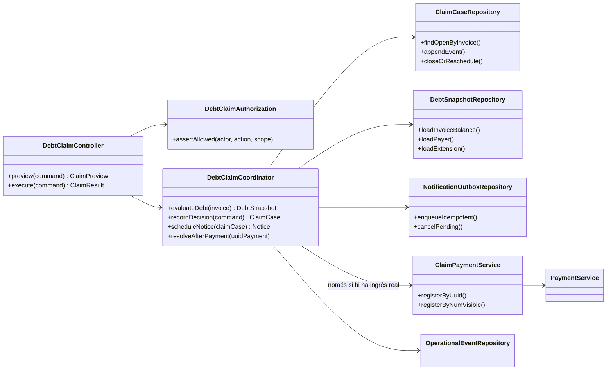

# UC-012 — Classes ACTUAL / FINAL

## 1. ACTUAL — arquitectura observada

### Observacions ACTUAL

- La pàgina/JS decideix quins registres enviar.
- L'AJAX transmet `idInsc`.
- `Intranet.php` concentra consulta, càlcul, UPDATE, generació d'URL i SMTP.
- Estat administratiu, comunicació i eventual baixa queden fortament acoblats.
- El saldo es deriva principalment de `A_PAGAR-PAGAMENT` al llegat.

## 2. FINAL — arquitectura requerida

## 3. Responsabilitats FINAL

### `DebtClaimController`
Frontera autenticada. Valida CSRF/HMAC segons canal, request-id, idempotency-key, actor, rol i payload.

### `DebtClaimCoordinator`
Única autoritat per P-MOR-01..05. No envia correus directament ni modifica factura fiscal pel fet de reclamar.

### `ClaimCaseRepository`
Persistència append-only o versionada de l'expedient: estat, actor, deute observat, destinatari, canal, dates, decisió i correlació.

### `DebtSnapshotRepository`
Construeix saldo real a partir de factura + pagaments + devolucions + assignacions + pròrrogues; evita confiar només en camps denormalitzats del llegat.

### `NotificationOutboxRepository`
Crea una comunicació idempotent **després del commit** i permet cancel·lar/reprogramar avisos obsolets.

### `ClaimPaymentService`
Ja existeix. Només s'invoca després d'acreditar un ingrés real; conserva la factura existent.

## 4. Estat

- Classes ACTUAL: **IMPLEMENTADES**, inspecció estàtica.
- `ClaimPaymentService`: **IMPLEMENTAT + TESTS**.
- Classes FINAL de coordinació: **DISSENYADES / PENDENTS D'IMPLEMENTAR**.
