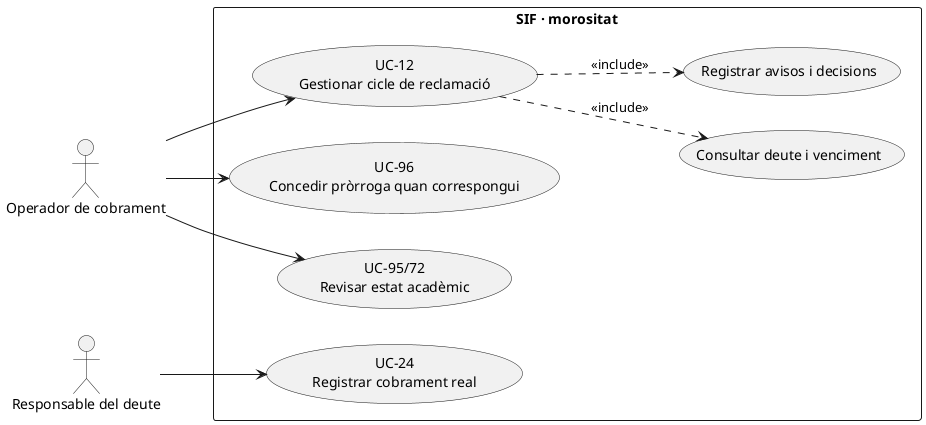
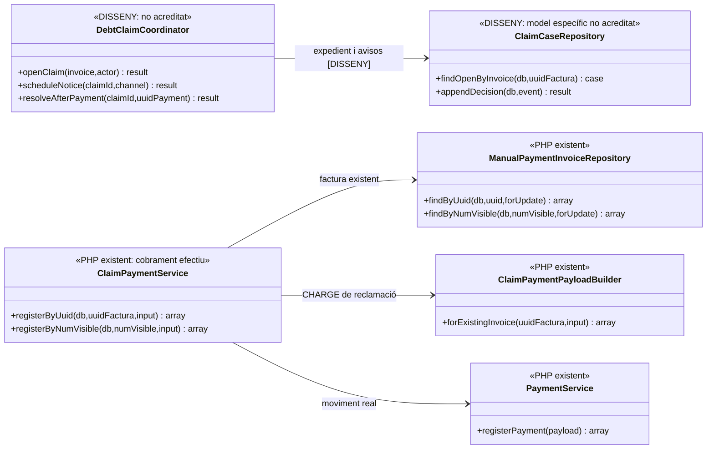
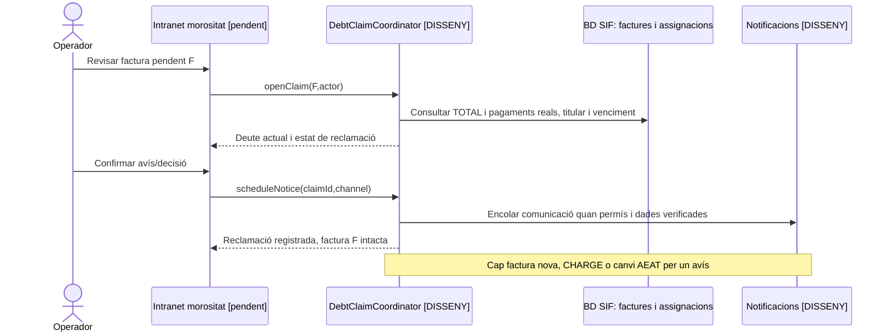
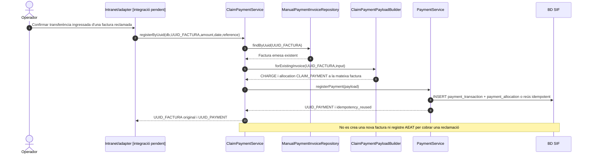

# UC-12 · Gestionar el cicle de morositat i reclamació

**Objectiu del projecte:** controlar el deute, els avisos i les reclamacions **sense confondre morositat amb baixa acadèmica ni crear una rectificativa pel sol fet de reclamar**. Quan la reclamació acaba en un ingrés real, se'n registra el cobrament a la **factura que ja existeix** (UC-24), no s'emet una altra factura.

**Estat verificat:** `ClaimPaymentService::registerByUuid()/registerByNumVisible()` i `ClaimPaymentPayloadBuilder::forExistingInvoice()` implementen el **registre d'un cobrament de reclamació ja rebut**; la factura original es consulta amb `ManualPaymentInvoiceRepository` i `PaymentService` registra el moviment. Els passos de **càlcul de morositat, calendari de recordatoris, pantalles legacy de reclamació, permisos, URL de pagament i outbox de comunicacions** figuren a la documentació, però no s'ha acreditat un orquestrador SIF executable de tot el cicle.

## 1. Fitxa del cas d'ús

| Element | Regla |
| --- | --- |
| Actors | Operador autoritzat de gestió; alumne, empresa o responsable del deute segons factura/relació; procés de recordatoris quan existeixi. No dirigir la reclamació només a la persona inscrita si l'obligat al pagament és una empresa. |
| Dades d'entrada | `UUID_FACTURA`, `NUM_VISIBLE`, receptor/titular del deute, total, pagaments assignats i devolucions, venciment pactat, `ID_INSC`/grup i eventual pròrroga UC-96. La data de venciment i l'escalat no es calculen a `ClaimPaymentService`. |
| Regles de deute | Factura emesa abans del cobrament **continua sent factura real** si està pendent; un recordatori no canvia el seu número, total fiscal, hash ni registre AEAT. Morositat, estat acadèmic i baixa són decisions separades (UC-95/96/72). |
| Registre de reclamació | L'expedient objectiu conserva data, destinatari, canal, motiu, import pendent i resposta; `operational_event`/outbox estan definits, però **no** s'ha acreditat el writer complet del cicle de reclamacions. |
| Cobrament real implementat | `ClaimPaymentPayloadBuilder`: `movement_type=CHARGE`, mètode `TRANSFERENCIA` o `MANUAL`, canal `INTRANET`, import positiu, data real i assignació `CLAIM_PAYMENT` **a la factura existent**. |
| Idempotència del cobrament | Referència present: `CLAIM|REF:<referència>`. Sense referència, exigeix `created_by` i usa `CLAIM|FACT:<num_visible>|DATA:<data>|IMPORT:<import>|USUARI:<usuari>`. Reús d'una clau amb payload contradictori continua requerint control addicional. |
| Pagament per inscripció | Si una factura d'empresa cobreix N inscripcions, el cobrament real únic pot aplicar-se a la factura, però la seva atribució individual exigeix el registre de fons proposat; el simple status `PAID` de factura no permet calcular automàticament la quota de cada persona. |

### 1.1. Flux objectiu complet

1. El canal d'operació consulta factura fiscal existent, total, assignacions, devolucions i deute real. Determina titular, venciment, pròrrogues i si ja hi ha una reclamació oberta. La regla concreta d'escalat/terminis de PrisMa **no queda fixada pel servei de cobrament**.
2. El procés **pendent** obre/actualitza l'expedient de reclamació amb actor, abans/després, import i motiu. L'operador pot decidir un recordatori, pròrroga, incidència o baixa **acadèmica separada**, sense crear una rectificativa automàticament.
3. Per a cada comunicació, es valida el destinatari real i el consentiment/canal quan pertoqui; el document de la factura només s'adjunta si el destinatari hi té accés. L'outbox i la generació d'enllaços de pagament final no estan acreditats com a integració executable del cicle.
4. Si la persona/empresa paga després, l'operador verifica **ingrés real**, import/data i referència, i inicia UC-24 contra `UUID_FACTURA` o `NUM_VISIBLE`.
5. `ClaimPaymentService` carrega la factura existent, `ClaimPaymentPayloadBuilder` construeix el `CHARGE` amb `CLAIM_PAYMENT` i `PaymentService::registerPayment()` crea o reutilitza l'`UUID_PAYMENT` i actualitza l'estat econòmic de factura. **No** es crida `issueInvoice()`.
6. Si el deute era parcial o el pagament rebut no el cobreix tot, el nou saldo pendent es recalcula de les assignacions, sense donar per pagada tota la inscripció o el grup.
7. Es correlacionen reclamació i cobrament, es tanca o reprograma l'expedient segons deute restant, i s'atribueix l'ingrés per inscripció quan existeixi el ledger; els documents fiscals originals es preserven.

### 1.2. Casos alternatius i controls

| Cas | Resposta |
| --- | --- |
| Factura abans de cobrar | Es reclama sobre la factura existent; **cap segon número fiscal** quan arribi la transferència. |
| Reclamació sense cobrament | No crear `payment_transaction` només per enviar correu, fer una trucada o generar URL. |
| Deute parcial | Una nova fracció real és un `CHARGE` amb import efectiu, que no pot excedir arbitràriament el saldo pendent sense classificar sobrant; no crear factura nova pel recordatori. |
| Pagament detectat al fitxer TPV/transferència | UC-25/56 comprova si ja hi ha `UUID_PAYMENT` abans de registrar; un ingrés no es registra dues vegades per haver-se reclamat. |
| Reclamació d'empresa per grup | Una factura/deute a l'empresa, N participants acadèmics; retorn/saldo només segons pagador i atribució individual, no a cada alumne per defecte. |
| Pròrroga vigent | UC-96 separa ajornament de baixa i reclamació; el codi `ClaimPaymentService` no valida automàticament terminis ni prohibeix recordatoris durant una pròrroga. |
| Morositat amb baixa posterior | UC-72 classifica baixa i eventual impacte fiscal; l'impagament per si sol **no** anul·la la factura o el seu registre AEAT. |
| Dos avisos idèntics | Política d'outbox idempotent a definir: no enviar dos correus per retry, ni deduir un segon deute. |

**Buits de tancament:** taula/estats de l'expedient de reclamació, regles de termini, permisos i titular, outbox i URLs, conciliació d'ingrés, traça de fons per inscripció i proves d'extrem a extrem. La implementació de `ClaimPaymentService` és **el cobrament final, no el cicle sencer**.

### 1.3. Rutes de reclamació, primera reclamació i baixa del llegat

**Entrades identificades.** El mapa de rutes documenta `/facturacio/primera-reclamacio/` → `facturacio-primera-reclamacio-pagament.php`, `/facturacio/reclamacio-final/` → `facturacio-reclamacio-final.php` i `/facturacio/morosos/` → `facturacio-control-morosos.php`. El diccionari de `Intranet.php` conté `cnsReclamacions`, `cnsCursosRecordarPag`, `cnsAlumnesRecordarPag`, `cnsCursosClaimBaixes`, `cnsAlumnClaimPag`, `cnsAlumnClaimEntMoros`, `cnsAlumnClaimAlumnNoCertMoros`, `cnsAlumnClaimAlumnCertMoros` i `cnsEntMoros`; les actualitzacions inclouen `updPrimeraReclamacio`, `updClaimDonarBaixa`, `updClaimRecPag`, `updInscCursBaixaiMoros` i `updReclamatDefaulter`. La documentació identifica **vies separades de reclamació i baixa**, però no acredita que el servei nou d'UC-12 coordini aquests handlers.

**Reclamació no equival a baixa ni factura rectificada.** `web.inscripcions.reclamat`, `data_reclamacio` i `pag_observacions` serveixen de seguiment administratiu. `INSC_CURS` és un estat acadèmic i `FACTURA_RELACIONADA` un vincle històric: cap dels dos acredita per si sol un moviment bancari nou. Una primera o última reclamació deixa la factura original vigent i no crea un `ALTA`, `REFUND` o rectificativa pel fet d'emetre l'avís. Si hi ha una **baixa real**, la decisió posterior sobre deute, retorn o saldo es tramita per UC-72/74/28/29 amb evidència per inscrit i pagador.

**Via de regularització encara que hi hagi morositat.** El procediment de la fitxa d'alumne estableix que la persona morosa **ha de poder regularitzar el pagament**. Abans de cada recordatori, identificar si qui deu diners és l'alumne, una empresa o el responsable del grup, i si hi ha pròrroga, fracció, cobrament `UUID_PAYMENT` ja confirmat o `DS_ORDER` amb resultat pendent. Una factura d'empresa pot tenir URL pròpia: no reactivar el pagament individual d'un participant cobert, ni enviar-li el PDF complet o el deute conjunt per coincidència de correu.

**Rutes de reclamació i cobrament posterior.** Si la reclamació deriva en transferència real, contrastar referència, import i data i localitzar `UUID_FACTURA` existent abans d'UC-24. Si el cobrament és visible al banc però només falta sincronitzar el llegat, recuperar `UUID_PAYMENT` i reprendre UC-47/53; no registrar un segon `CHARGE` per «tancar la reclamació». El recordatori futur UC-43 s'ha de cancel·lar o actualitzar quan es modifica el deute o entra en vigor una pròrroga.

### 1.4. Proves addicionals de reclamació i baixa separades (no executades)

| ID | Escenari | Resultat exigible |
| --- | --- | --- |
| MR-12-01 | Primera reclamació sense ingrés real | Expedient/avís, factura original vigent i cap moviment monetari nou. |
| MR-12-02 | Pròrroga aprovada abans d'un recordatori programat | Revalidar venciment i no enviar reclamació obsoleta. |
| MR-12-03 | Factura d'empresa amb tres participants i una reclamació | Destinatari i via de pagament del pagador legítim; no tres deutes individuals ficticis. |
| MR-12-04 | Transferència cobrada i `PAGAMENT` llegat encara pendent | Reconciliar `UUID_PAYMENT` existent, no segona factura/CHARGE. |
| MR-12-05 | Baixa acadèmica després de reclamació | Classificar efecte fiscal/econòmic independent, sense anul·lació de factura automàtica. |
| MR-12-06 | Alumne morós vol pagar i URL individual ha estat desactivada per factura d'empresa | Oferir la via autoritzada del responsable, sense restablir l'URL individual. |

## 2. Diagrama UML de casos d'ús

## 3. Classes: servei de cobrament existent i gestió del cicle pendent

## 4. Seqüència A — reclamació sense moviment monetari (DISSENY)

## 5. Seqüència B — cobrament de reclamació executable

## 6. Traçabilitat

[UC-12 original](../06-fitxes-funcionals/uc-012.md) · [UC-24 cobrament](uc-024-registrar-cobrament-reclamacio.md) · [UC-96 pròrroga original](../06-fitxes-funcionals/uc-096.md) · [UC-95 estat acadèmic original](../06-fitxes-funcionals/uc-095.md) · [UC-25 TPV](uc-025-analitzar-fitxer-tpv.md) · [UC-56 assignar](uc-056-cercar-assignar-cobrament.md) · [ClaimPaymentService](../../sif/src/Service/ClaimPaymentService.php) · [ClaimPaymentPayloadBuilder](../../sif/src/Service/ClaimPaymentPayloadBuilder.php) · [Fluxos de morositat](../03-canvis-pendents/04-fluxos-facturacio.md) · [Traça dels fons](00-revisio-moviments-inscripcions.md).
