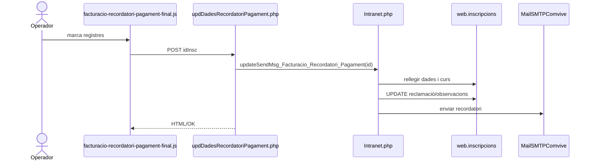
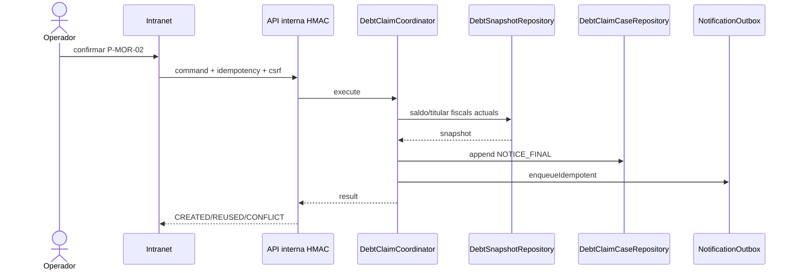
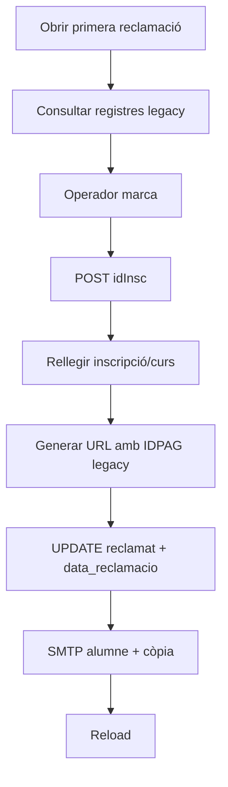
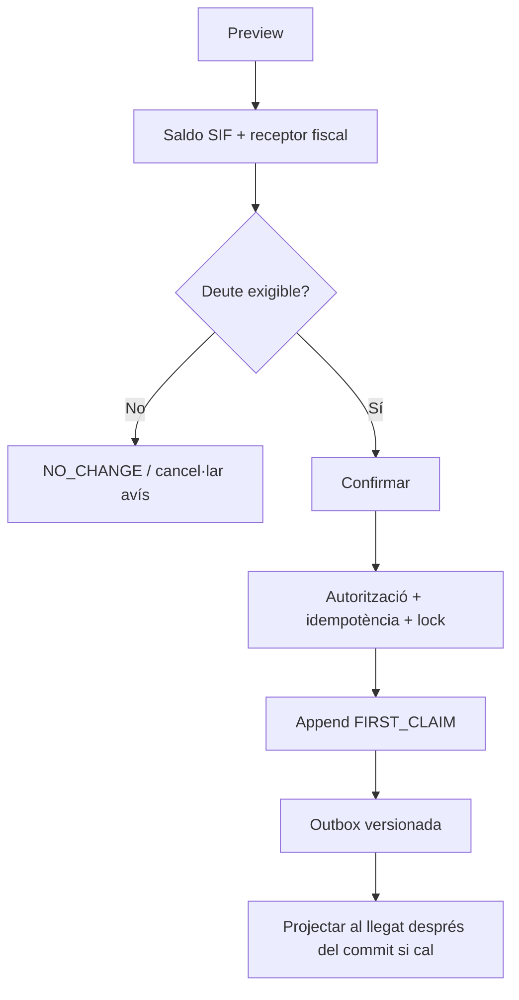
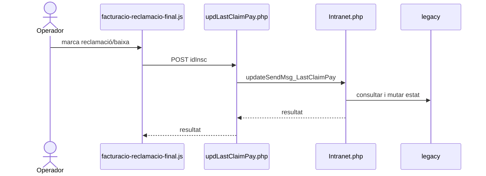
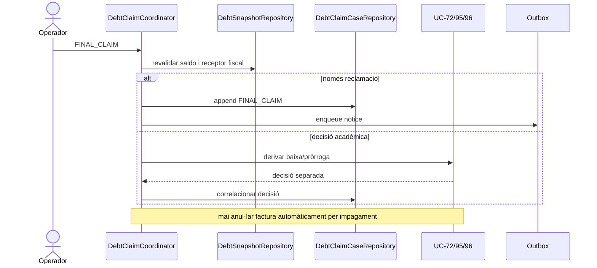
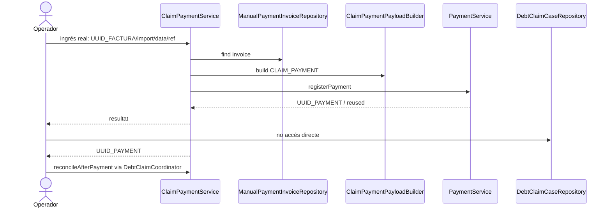

# UC-012 — Seqüències i activitats ACTUAL / FINAL per pàgina

## 1. P-MOR-02 · Recordatori final

### ACTUAL

### FINAL

## 2. P-MOR-03 · Primera reclamació

### ACTUAL

### FINAL

## 3. P-MOR-04 · Reclamació final / eventual baixa

### ACTUAL

### FINAL

## 4. P-MOR-05 · Regularització després de reclamació

## 5. Activitats per superfície

### `facturacio-recordatori-pagament-final.php`
**ACTUAL:** llistar → marcar → POST → UPDATE + SMTP → recarregar.  
**FINAL (nucli implementat):** preview SIF → confirmar via bridge segur → append event → outbox. Projecció legacy només si es decideix al cutover.

### `facturacio-primera-reclamacio-pagament.php`
**ACTUAL:** llistar → generar URL legacy → marcar reclamació → SMTP.  
**FINAL (nucli implementat):** receptor fiscal de factura → FIRST_CLAIM idempotent → outbox. URL de pagament final encara no forma part del cutover.

### `facturacio-reclamacio-final.php`
**ACTUAL:** llistar casos antics → reclamar/baixar en flux acoblat.  
**FINAL (nucli implementat):** FINAL_CLAIM al SIF; qualsevol baixa/pròrroga continua com a ordre separada d’UC-72/95/96.

### `facturacio-control-morosos.php`
**ACTUAL:** quatre conjunts de deute segons entitat/certificat/estat legacy.  
**FINAL:** saldo i receptor provenen del SIF; la UI de llista de casos oberts encara no ha substituït la taula legacy.

## 6. Controls transversals FINAL

Cada mutació ha d'acreditar:
- autenticació + rol + abast;
- CSRF o autenticació de servei;
- `REQUEST_ID` / `CORRELATION_ID`;
- clau idempotent i comparació de payload;
- lock/versió de l'expedient;
- recalcul de saldo abans del commit;
- outbox després del commit;
- cap moviment fiscal/monetari si només s'envia una reclamació.

## 7. Estat d'implementació de les seqüències

- P-MOR-02/03/04: **coordinador/event/outbox implementats a la branca**.
- P-MOR-05: **cobrament existent + reconciliació/tancament implementats**.
- Bridge intranet: **implementat i desactivat per feature flag**.
- Venciment/pròrroga: **no forma part encara del snapshot perquè UC-096 continua en DISSENY**.
- Proves: **escrites; Actions continua en cua**.
- Cutover de les accions dels JS legacy: **pendent**.
