# UC-013 · Diagrames d'activitat ACTUAL / FINAL per pàgina i apartat

**Data d'auditoria:** 29/09/2026  
**Abast:** RM-037 — pàgina per pàgina i apartat per apartat.  
**Regla:** ACTUAL = comportament contrastat al codi. FINAL = comportament objectiu del SIF. No confondre cap diagrama FINAL amb implementació ja desplegada.

## 1. Pàgina pública · Descomptes USOC

### ACTUAL

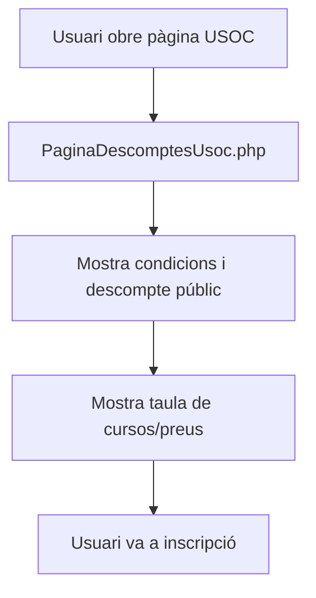

**Codi:** `pagina_descomptes_usoc.php`, `PaginaDescomptesUsoc.php`, `mostrarDescomptesUsoc.min.js`.

**Observació:** el text públic actual indica 20 %. Existeix documentació històrica amb 25 %; no prendre cap percentatge com a constant SIF.

### FINAL

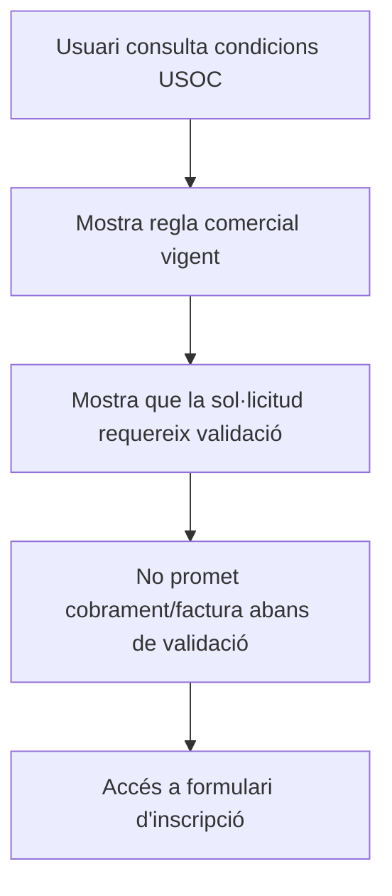

## 2. Pàgina d'inscripció USOC · Apartat dades personals

### ACTUAL

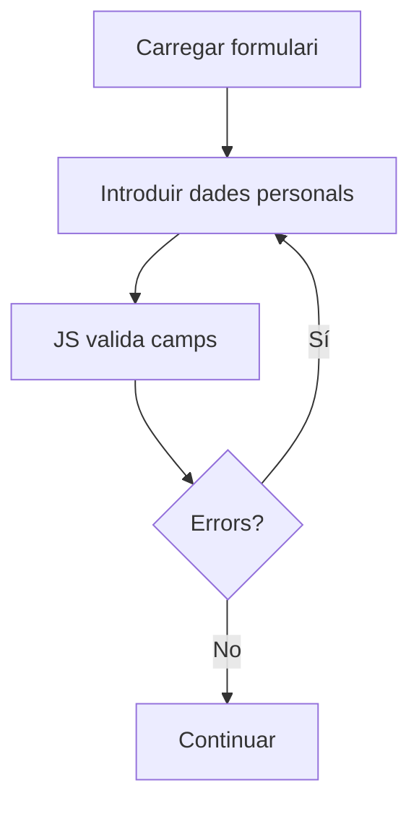

### FINAL

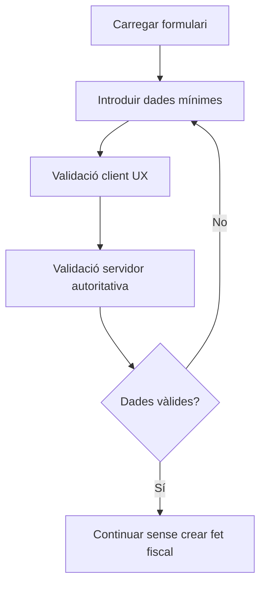

## 3. Pàgina d'inscripció USOC · Apartat dades curriculars

### ACTUAL

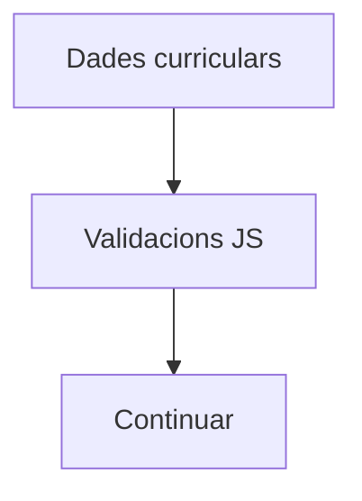

### FINAL

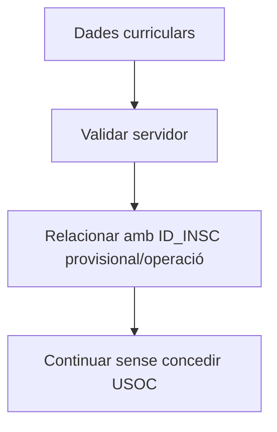

## 4. Pàgina d'inscripció USOC · Apartat curs i afiliació

### ACTUAL

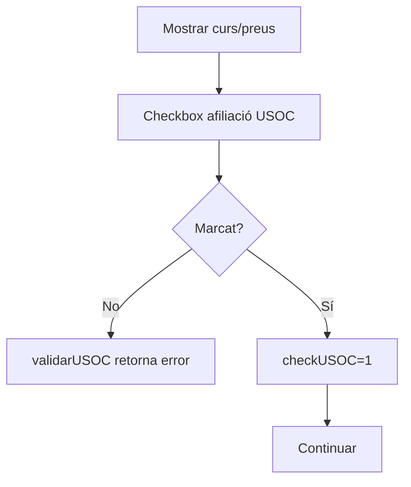

**Precisió:** marcar el checkbox no valida l'afiliació real.

### FINAL

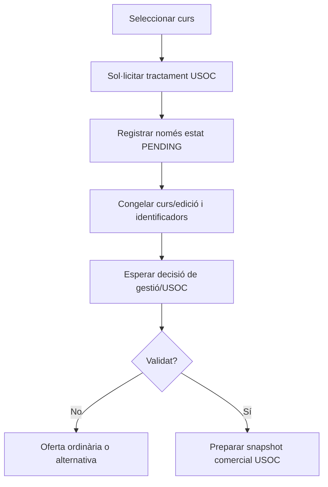

## 5. Endpoint d'enviament de la inscripció

### ACTUAL

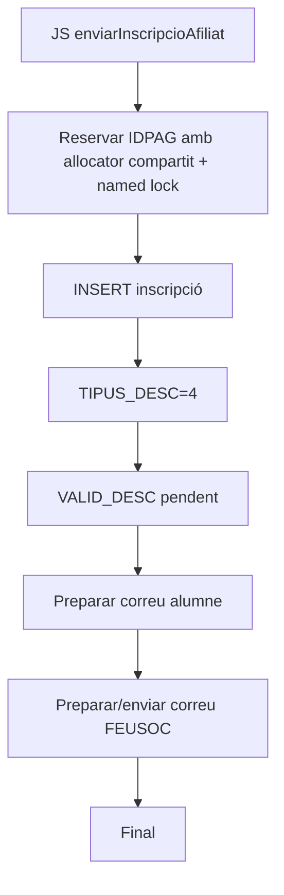

### FINAL

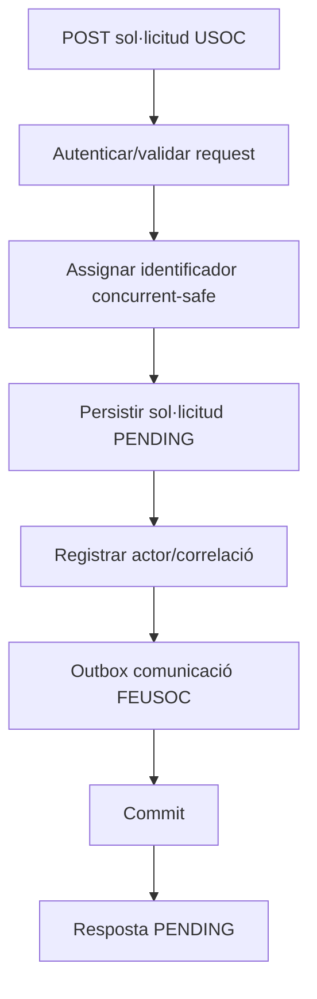

## 6. Intranet · Validar descomptes · Llistat

### ACTUAL

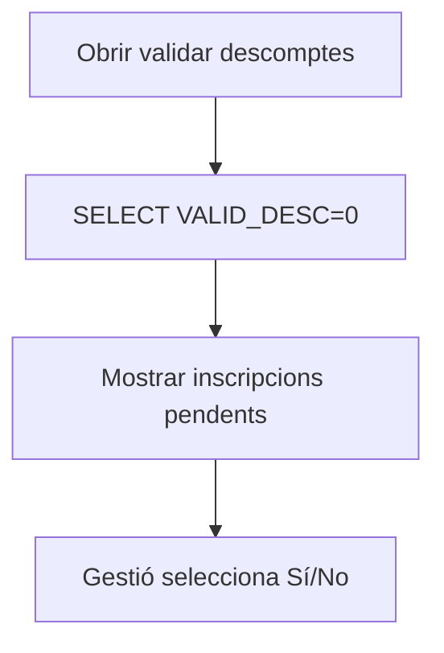

### FINAL

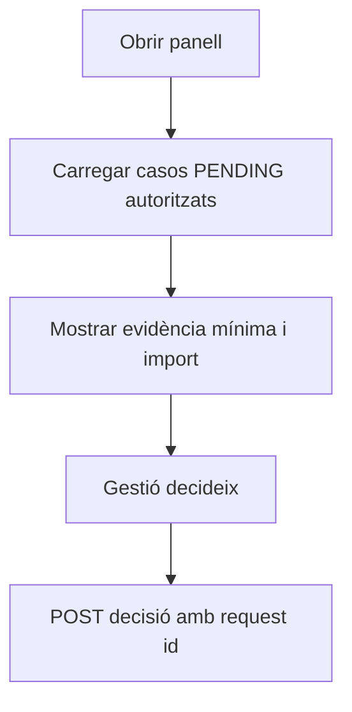

## 7. Intranet · Validar descomptes · Decisió positiva

### ACTUAL

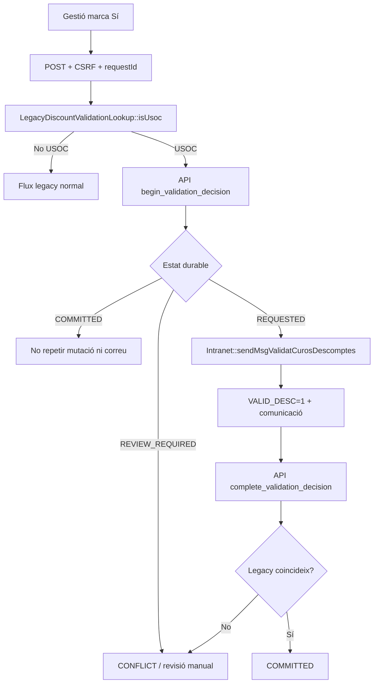

### FINAL

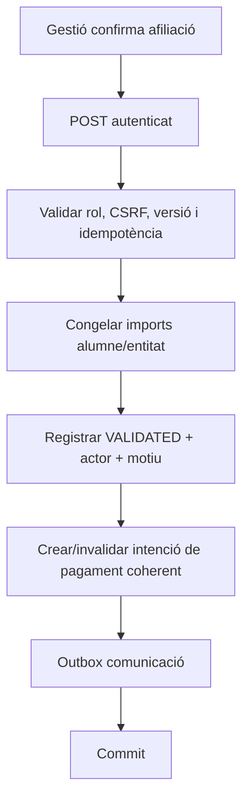

## 8. Intranet · Validar descomptes · Decisió negativa

### ACTUAL

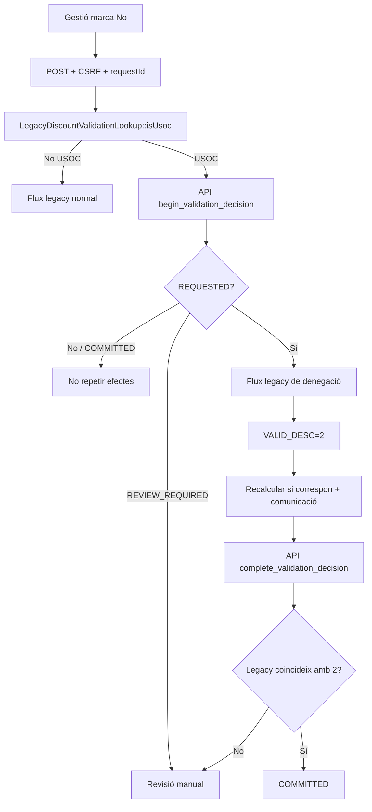

### FINAL

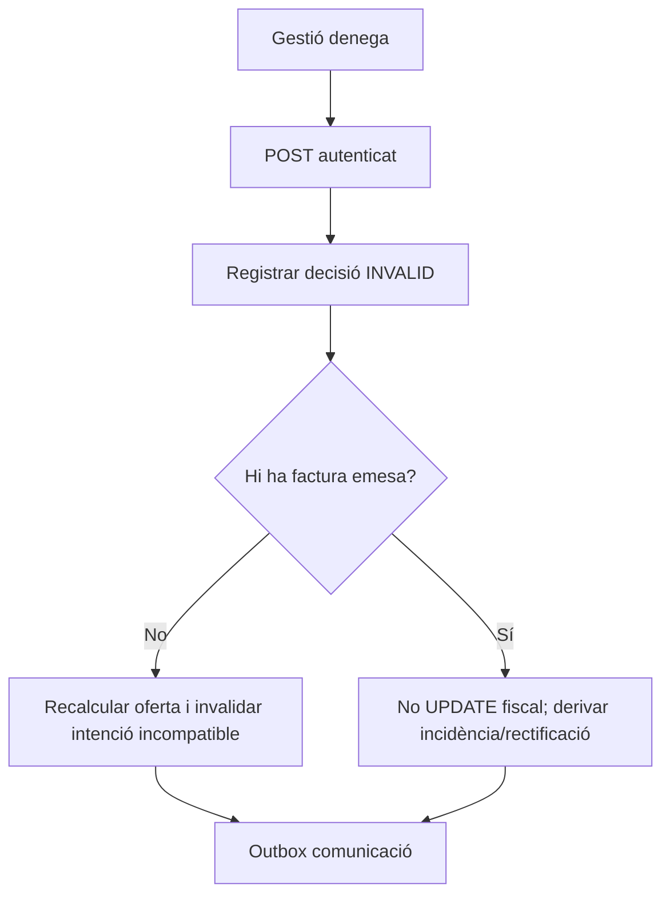

## 9. Pagament alumne · Redsys

### ACTUAL / SIF EXISTENT

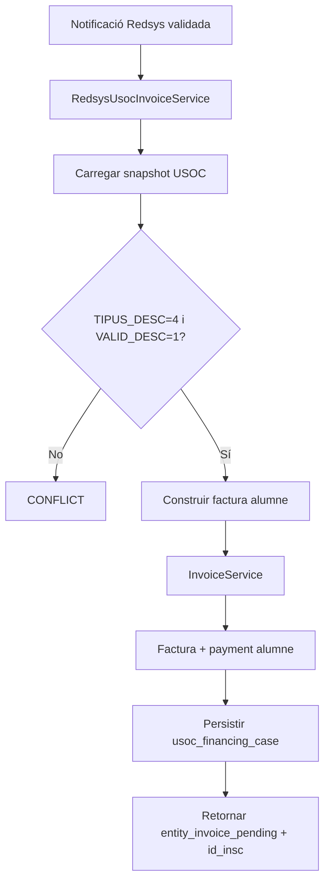

### FINAL

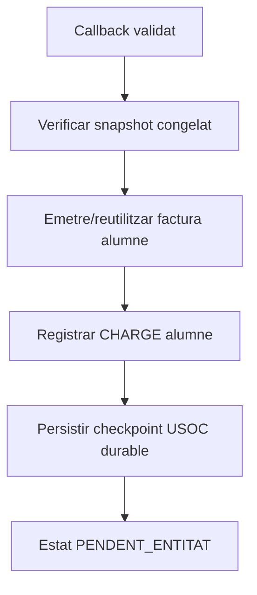

## 10. Factura entitat USOC

### ACTUAL IMPLEMENTAT EN SERVEI, ADAPTADOR NO ACREDITAT

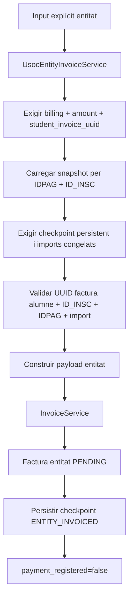

### FINAL

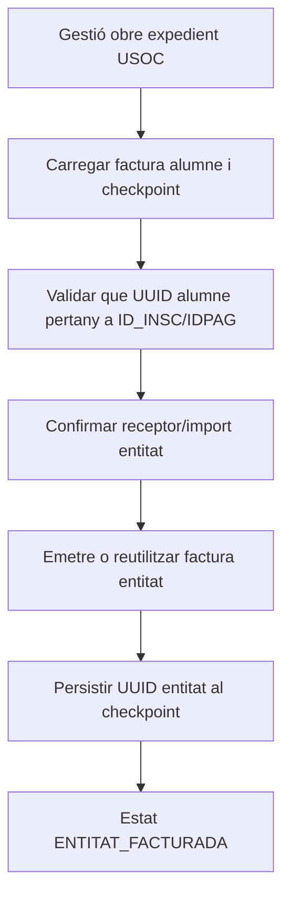

## 11. Cobrament entitat

### ACTUAL / IMPLEMENTAT EN REPOSITORI
`alumnes-usoc-financament.php` ofereix una UI autenticada per consultar l'expedient, emetre factura entitat i registrar cobraments. Addicionalment, `alumnes-mostrar-alumne-usoc.js` injecta un panell contextual sota `#dades-pagament` del modal de Consulta/Modifica alumne quan existeix un expedient USOC; respecta `capabilities.manage` i reutilitza el mateix `SifInternalUsocClient`/API signada. El navegador parla només amb `ajax/alumnes/usocFinancament.php`; aquest controlador valida CSRF i delega al `SifInternalUsocClient`, que signa la petició HMAC cap a `/api/usoc/manage.php`. `UsocEntityPaymentService` registra el cobrament al ledger general i reconcilia l'expedient. L'accés de menú està implementat directament a `mostrarSideBarMenu.php`, fail-closed per `SIF_USOC_MENU_ROLES`, sense assumir ni modificar la taula `apartats`.

### FINAL

```mermaid
flowchart TD
    A[Ingrés real USOC] --> B[Registrar PaymentService]
    B --> C[Assignar a UUID_FACTURA_ENTITAT]
    C --> D{Import complet?}
    D -- No --> E[PARTIAL]
    D -- Sí --> F[PAID]
    E --> G[Actualitzar expedient USOC]
    F --> G
```

## 12. Conciliació final USOC

### ACTUAL / IMPLEMENTAT EN REPOSITORI
Existeixen `usoc_financing_case`, `UsocFinancingCaseRepository` i `UsocCaseReconciler`. La ruta específica `UsocEntityPaymentService` reconcilia automàticament després de cada cobrament de l'entitat; `sif/scripts/reconcile-usoc-case.php` queda com a via manual/controlada de recuperació.

### FINAL

```mermaid
flowchart TD
    A[Reconciliar ID_INSC] --> B[Carregar factura alumne]
    B --> C[Carregar payments alumne]
    C --> D[Carregar factura entitat]
    D --> E[Carregar payments entitat]
    E --> F[Aplicar refunds/compensacions]
    F --> G{Imports i orígens quadren?}
    G -- No --> H[PENDING/CONFLICT]
    G -- Sí --> I[FINANÇAMENT_CONCILIAT]
```

## 13. Canvi de curs / baixa / rectificació

### ACTUAL PROTEGIT

```mermaid
flowchart TD
    A[Operador confirma canvi o baixa] --> B[POST + CSRF + same-origin + permís]
    B --> C[Carregar inscripció legacy]
    C --> D{TIPUS_DESC=4?}
    D -- No --> E[Permetre flux legacy existent]
    D -- Sí --> F[LegacyUsocLifecycleGuard]
    F --> G[lifecycle_guard signat al SIF]
    G --> H{Existeix usoc_financing_case?}
    H -- No --> E
    H -- Sí --> I[409 · bloquejar mutació legacy]
    I --> J[lifecycle_plan signat al SIF]
    J --> K[UsocLifecyclePlanService separa alumne i entitat]
    K --> L[Calcular acció fiscal/econòmica per factura]
    L --> M[Limitar qualsevol retorn al net real cobrat]
    M --> N{Operació?}
    N -- Baixa --> O[Modal decisió alumne / entitat]
    O --> P[execute_cancellation signat]
    P --> Q[Congelar request + plan]
    Q --> R[Rectificar / refund / diferir per pagador]
    R --> S[COMPLETED + handoff sessió]
    S --> T[Verificar checkpoint i executar baixa legacy]
    N -- Canvi curs --> U[Execució fiscal de destí pendent]
```

**Abast:** el guard evita una modificació silenciosa d'un expedient USOC fiscalitzat. `UsocLifecyclePlanService` genera ara un pla separat per pagador i limita el màxim retornable al `net_paid` real de cada factura. La pantalla USOC permet consultar aquest pla. Encara no executa rectificatives, reassignacions, devolucions o saldos.

### FINAL obligatori

```mermaid
flowchart TD
    A[Canvi o baixa USOC] --> B[Recuperar ambdues factures]
    B --> C[Separar pagador alumne i USOC]
    C --> D[Classificar efecte de cada factura]
    D --> E[Rectificatives/trasllats segons cas]
    E --> F[No retornar diners no cobrats]
    F --> G[No compensar un pagador amb l'altre]
    G --> H[Actualitzar conciliació]
```

## 14. Cobertura RM-037

| Superfície | ACTUAL | FINAL | Codi contrastat |
| --- | --- | --- | --- |
| Pàgina informativa USOC | Sí | Sí | Sí |
| Inscripció · personals | Sí | Sí | Sí |
| Inscripció · curriculars | Sí | Sí | Sí |
| Inscripció · curs/USOC | Sí | Sí | Sí |
| Endpoint alta | Sí | Sí | Sí |
| Validar descomptes · llistat | Sí | Sí | Sí |
| Validar positiu | Sí | Sí | Sí |
| Validar negatiu | Sí | Sí | Sí |
| Pagament/factura alumne | Sí | Sí | Sí |
| Factura entitat | Sí | Sí | Servei + pantalla autònoma + panell contextual implementats; desplegament/configuració pendent |
| Cobrament entitat | Sí, dues UI + servei + script | Sí | UI autònoma + panell contextual implementats; menú fail-closed implementat; desplegament/configuració pendent |
| Conciliació | Sí, servei/script | Sí | Implementada a la ruta específica USOC; script manual disponible |
| Canvi/baixa | Sí | Parcial avançat | **Baixa:** guard + planner + modal de decisió + `UsocCancellationExecutionService` + checkpoint de sessió abans del legacy; servei PROVAT i handoff contract PASS; runs `36943292835` (**839/839**) i `36943206570` (**838/838**). **Canvi de curs:** guard + planner, executor encara pendent |

## 15. Pendents de codi derivats dels diagrames

1. Traça persistent SIF de la decisió legacy — IMPLEMENTADA amb `usoc_validation_decision`, protocol REQUESTED/COMMITTED/REVIEW_REQUIRED i reconciliador CLI; resta desplegament/preflight real.
2. Mantenir el test de regressió de l'allocator IDPAG compartit; implementació actual protegida amb named lock.
3. Configurar `SIF_USOC_MENU_ROLES` i validar l'accés de menú al desplegament de preproducció.
4. Validar en preproducció la configuració HMAC, rols i DB legacy amb `preflight-usoc-intranet.php`.
5. Evidència CI conservada a `documentacio/09-proves-qa/uc-013-evidencia-ci-2026-09-30.md`; run `36660979100` **SUCCESS, 646 passed / 0 failed**, incloent E2E de servei fins a `FINANCING_RECONCILED`. Resta validació navegador/desplegament/preproducció.
6. Tractament definit per alumne=0/curs gratuït.


## Canvi de curs USOC · precisió d'estat

**`UC13-GAP-COURSE-EXEC`**: el flux actual és deliberadament fail-closed.

`sifCanviCursPreview.php` consulta `LegacyUsocLifecycleGuard` abans de permetre el preview/confirmació genèric. Quan existeix un expedient USOC amb dues parts, el canvi legacy queda bloquejat. `UsocLifecyclePlanService` pot descriure accions separades per alumne i entitat, però encara no existeix l'executor equivalent al de baixa que rectifiqui/reemeti les factures de curs destí i resolgui diners per pagador.

Això és **protecció implementada**, no un canvi de curs USOC complet.


**Contracte FINAL del canvi de curs:** [UC-013 canvi de curs USOC](uc-013-canvi-curs-usoc-contracte-final.md).


## Preview USOC server-side · IMPLEMENTAT

Per al canvi de curs amb `TIPUS_DESC=4 / VALID_DESC=1`:

1. el JS genèric de canvi de curs cedeix el control al mòdul USOC;
2. `sifUsocCourseChangePreview.php` exigeix POST + sessió + same-origin + permís + CSRF;
3. `LegacyUsocCourseChangePricingResolver` resol els imports al servidor:
   - preu base destí;
   - preu USOC destí;
   - despeses només si `change_number=4`, basades en hores origen;
4. `SifInternalUsocClient::courseChangePreview()` envia el snapshot per HMAC;
5. `UsocCourseChangePreviewService` crea target split + fund plan;
6. la UI mostra alumne/entitat, compensable, pendent i excés;
7. **no es desencadena el handler legacy de canvi de curs**.

Aquesta activitat és preview executable i fail-closed; encara no és l'executor fiscal/econòmic.
