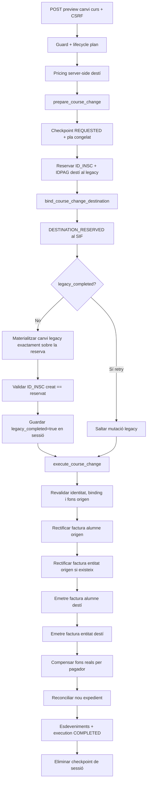

# UC-013 · Contracte FINAL — canvi de curs USOC amb dos pagadors

**Data de revalidació:** 2026-10-03  
**Base reconciliada:** `main@b0e8ff7150c5a8b415cc109d298d82f0db1f68df` · PR #120  
**Estat:** CONTRACTE DOCUMENTAT · FLUX EXECUTIU IMPLEMENTAT AL REPOSITORI · ACCEPTACIÓ OPERATIVA/PREPRODUCCIÓ PENDENT

## 1. Objectiu

Definir com s'ha d'orquestrar un **canvi de curs** quan una inscripció USOC ja té o pot tenir dues obligacions independents:

- part **alumne**;
- part **entitat USOC**.

Aquest contracte evita reproduir el comportament legacy de copiar un únic camp `PAGAMENT` cap a la nova inscripció com si representés tots els diners de l'operació.

## 2. Evidència ACTUAL que fixa el contracte

### 2.1. El descompte USOC es conserva funcionalment al canvi

`Intranet::realitzarCanviCurs_modalCanviCurs()` crea la nova inscripció conservant:

- `TIPUS_DESC`;
- `VALID_DESC`;
- `IDPAG` quan ja existeix.

Per tant una inscripció amb `TIPUS_DESC=4` i `VALID_DESC=1` continua sent USOC després del canvi, tret que el curs destí no tingui una regla USOC aplicable.

### 2.2. El preu USOC del curs destí es recalcula

`Intranet::buscarPreuAPagar_modalCanviCurs()` no copia necessàriament el preu anterior.

Quan:

- `VALID_DESC=1`;
- `TIPUS_DESC=4`;

consulta la taula `descomptes` per al nou `ID_PREU`, curs i mes i obté el preu USOC del **curs destí**.

Això descarta com a regla FINAL conservar cegament l'import USOC del curs origen.

### 2.3. La part entitat representa la diferència/descompte

`LegacyUsocInvoicePayloadBuilder::studentLineAmounts()` utilitza `entity_amount` com a `discount_amount` quan no existeix una base explícita i calcula:

```text
base_amount = student_amount + entity_amount
```

La factura de l'entitat es construeix per aquest `entity_amount`.

Per tant, per a un curs destí elegible:

```text
target_entity_course_amount =
    target_standard_course_amount - target_student_course_amount
```

No s'ha d'usar un percentatge 20/25 hardcoded.

### 2.4. Les despeses de gestió corresponen a l'alumne

El canvi legacy calcula:

```text
A_PAGAR nou = preu curs destí + despeses gestió
```

Les despeses no formen part de la diferència USOC observada. La `management_fee` **no es resol sobre el curs destí**: el legacy la calcula a partir de les hores de l'edició **origen** i només quan el número de canvi és `4` (`Despeses gestió`). Per als altres números de canvi és `0.00`. En el contracte FINAL:

```text
target_student_total =
    target_student_course_amount + management_fee

target_entity_total =
    target_entity_course_amount
```

## 3. Snapshot obligatori abans d'executar

L'executor implementat no treballa amb imports llegits del formulari sense congelar-los: `prepare_course_change` persisteix request/pla i el binding posterior fixa la destinació abans dels efectes.

Ha de persistir dins `usoc_lifecycle_execution.REQUEST_JSON/PLAN_JSON` com a mínim:

### Origen

- `source_id_insc`;
- `source_idpag`;
- curs/any/mes origen;
- `source_student_invoice_uuid`;
- `source_entity_invoice_uuid` si existeix;
- total factura alumne;
- total factura entitat;
- net real cobrat alumne;
- net real cobrat entitat;
- màxim retornable per pagador.

### Destí

- any/mes/curs destí;
- identificador de tarifa/`ID_PREU`;
- `target_standard_course_amount`;
- `target_student_course_amount`;
- `target_entity_course_amount`;
- `management_fee`;
- `target_student_total`;
- `target_entity_total`;
- origen de cadascun dels imports;
- regla USOC utilitzada;
- actor;
- motiu;
- timestamp;
- `requestId`.

## 4. Invariants d'import

Abans de permetre qualsevol efecte fiscal:

```text
target_standard_course_amount > 0
target_student_course_amount > 0
management_fee >= 0
target_entity_course_amount > 0

target_entity_course_amount
  = target_standard_course_amount
  - target_student_course_amount

target_student_total
  = target_student_course_amount
  + management_fee

target_combined_total
  = target_student_total
  + target_entity_total
  = target_standard_course_amount
  + management_fee
```

Si aquestes igualtats no quadren al cèntim → `REVIEW_REQUIRED`.

El resolver actual rebutja explícitament `target_student_course_amount=0`: la variant de curs gratuït USOC continua fail-closed fins que s'aprovi `UC13-GAP-07`. El resolver també rebutja `target_student_course_amount == target_standard_course_amount`, perquè això deixaria `target_entity_course_amount=0` i contradiria el contracte USOC actual, que exigeix una part entitat positiva.

## 5. Regla de validació USOC al destí

### Pot conservar `VALID_DESC=1`

Només quan:

1. l'origen està validat com USOC;
2. el curs destí té una regla `TIPUS_DESC=4` activa/aplicable;
3. es pot determinar sense ambigüitat el preu estàndard i el preu USOC destí;
4. el descompte resultant no és negatiu;
5. no existeix una regla de negoci explícita que exigeixi nova validació.

### Ha d'anar a `REVIEW_REQUIRED`

Quan:

- no hi ha preu USOC destí;
- hi ha múltiples preus/regles aplicables;
- el preu USOC supera el preu estàndard;
- l'origen té evidència fiscal USOC però no expedient coherent;
- falta una de les factures esperades sense justificació;
- existeix una nova validació USOC obligatòria no resolta;
- el curs és la variant gratuïta/alumne=0 que encara no té política aprovada.

## 6. Tractament fiscal per pagador

El canvi de curs modifica el servei/concepte, per tant una factura origen emesa no s'ha de reescriure.

Per cada pagador:

### Sense factura origen

- cap rectificativa;
- el destí només generarà factura si el seu import és fiscalment facturable.

### Amb factura origen activa

- rectificar la factura origen segons UC-005;
- no reutilitzar UUID ni numeració fiscal;
- emetre factura nova del curs destí amb nova relació a la inscripció destí.

### Amb factura ja rectificada/cancel·lada

- `REVIEW_REQUIRED`, tret que el checkpoint demostri que és un retry idempotent de la mateixa execució.

## 7. Reemissió destí

### Factura alumne

Ha de contenir:

- curs destí;
- nova `ID_INSC` destí;
- part de curs que paga l'alumne;
- despeses de gestió, si fiscalment corresponen a la mateixa factura;
- descompte USOC explícit;
- referència/traça de l'operació de canvi.

### Factura entitat

Ha de contenir:

- el mateix curs destí;
- nova `ID_INSC` destí;
- només `target_entity_total`;
- receptor fiscal USOC explícit;
- relació amb la factura alumne destí;
- cap cobrament fictici.

## 8. Diners reals: no copiar `PAGAMENT`

El SIF ha de calcular els diners disponibles de cada pagador a partir de:

- `payment_transaction`;
- `payment_allocation`;
- refunds;
- compensacions;
- snapshot del `UsocLifecyclePlanService`.

Per cada pagador:

```text
available_real_funds = net_paid
target_obligation = target_total_for_same_payer
```

### Si `available_real_funds < target_obligation`

- compensar només els fons reals disponibles;
- deixar `amount_due = target_obligation - available_real_funds`;
- no crear CHARGE fictici.

### Si són iguals

- compensació completa;
- cap import pendent.

### Si `available_real_funds > target_obligation`

- compensar fins a l'obligació destí;
- l'excés queda com a decisió explícita:
  - refund;
  - saldo/credit balance;
  - o seguiment diferit.

Mai transferir l'excés de l'alumne a l'entitat ni a l'inrevés.

## 9. Mecanisme de compensació

El repositori ja disposa de `EnrollmentFundMovementRepository::insertOrReuseCompensationAllocation()`.

Aquest mecanisme és preferible a copiar el valor legacy `PAGAMENT` perquè:

- exigeix un `CHARGE` origen confirmat;
- és idempotent;
- registra import i inscripció destí;
- manté correlació;
- permet reconstruir l'origen dels fons.

Si l'arquitectura final exigeix crear un `credit_balance` intermedi per a excedents, s'ha d'usar `CreditBalanceService`, no un saldo implícit al legacy.

## 10. Ordre d'execució ACTUAL/FINAL

El codi implementat utilitza un handoff en dues fases perquè la inscripció destí continua essent una mutació legacy:



### Recuperació després de fallada parcial

Si el legacy s'ha materialitzat però l'execució SIF falla, el context conserva `legacy_completed=true`. El retry no torna a crear la inscripció, reutilitza la mateixa reserva/binding i reprèn només l'execució SIF idempotent.

## 11. Idempotència

Clau de nivell operació:

```text
REQUEST_ID
OPERATION=COURSE_CHANGE
ID_INSC_ORIGEN
IDPAG
payload_hash
plan_hash
```

Subclaus recomanades:

```text
UC013|COURSE_CHANGE|<requestId>|STUDENT|RECTIFY
UC013|COURSE_CHANGE|<requestId>|ENTITY|RECTIFY
UC013|COURSE_CHANGE|<requestId>|STUDENT|TARGET_INVOICE
UC013|COURSE_CHANGE|<requestId>|ENTITY|TARGET_INVOICE
UC013|COURSE_CHANGE|<requestId>|STUDENT|COMPENSATE
UC013|COURSE_CHANGE|<requestId>|ENTITY|COMPENSATE
```

Mateix `requestId` + payload divergent → `CONFLICT`.

## 12. Casos de prova obligatoris

| ID | Escenari | Resultat esperat |
|---|---|---|
| US13-CC-01 | mateix preu destí, tots dos pagadors cobrats | dues rectificacions, dues reemissions, compensacions completes |
| US13-CC-02 | curs destí més car | pendents separats per pagador |
| US13-CC-03 | curs destí més barat | excés separat per pagador; cap creuament |
| US13-CC-04 | entitat encara no ha pagat | alumne pot compensar; entitat continua sense fons reals |
| US13-CC-05 | entitat parcialment pagada | només net real compensable |
| US13-CC-06 | factura entitat encara no emesa | no inventar rectificativa; crear destí segons contracte |
| US13-CC-07 | retry mateix request | reutilització idempotent |
| US13-CC-08 | retry amb imports destí diferents | CONFLICT |
| US13-CC-09 | regla USOC destí absent | REVIEW_REQUIRED |
| US13-CC-10 | múltiples regles/preus destí | REVIEW_REQUIRED |
| US13-CC-11 | despeses de gestió | només obligació alumne |
| US13-CC-12 | curs gratuït USOC | fail-closed fins política UC13-GAP-07 |
| US13-CC-13 | falla tram legacy després del SIF | reprendre handoff sense repetir fiscal/econòmic |
| US13-CC-14 | source payment refundat parcialment | compensar només net real |
| US13-CC-15 | excés convertit en saldo | `credit_balance` explícit i auditable |

## 13. Estat

- **DOCUMENTAT:** sí.
- **IMPLEMENTAT:** guard, payer snapshot, planner, `LegacyUsocCourseChangePricingResolver` server-side, `UsocCourseChangeTargetResolver`, `UsocCourseChangeFundPlanService`, `UsocCourseChangePreviewService`, endpoint/UI de preview, `UsocCourseChangeExecutionPreparationService` i infraestructura de compensació. El preview no mou diners ni emet documents; la preparació persisteix `REQUESTED` amb request/plan congelats i tampoc aplica efectes.
- **VERIFICAT:** contrast estàtic contra codi real.
- **PENDENT OPERATIU/FUNCIONAL:** CI final del PR reconciliat, E2E navegador/preproducció amb configuració real, resolució explícita dels excessos (`credit_balance` o refund segons decisió), curs gratuït/alumne=0, entitat=0 fora del contracte actual i validacions comercials/fiscals 20/25 % + EXEMPT/E1.
