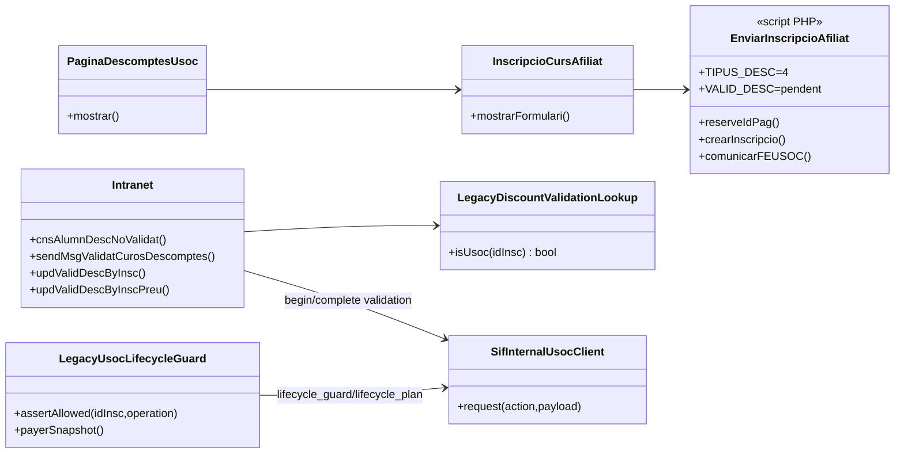
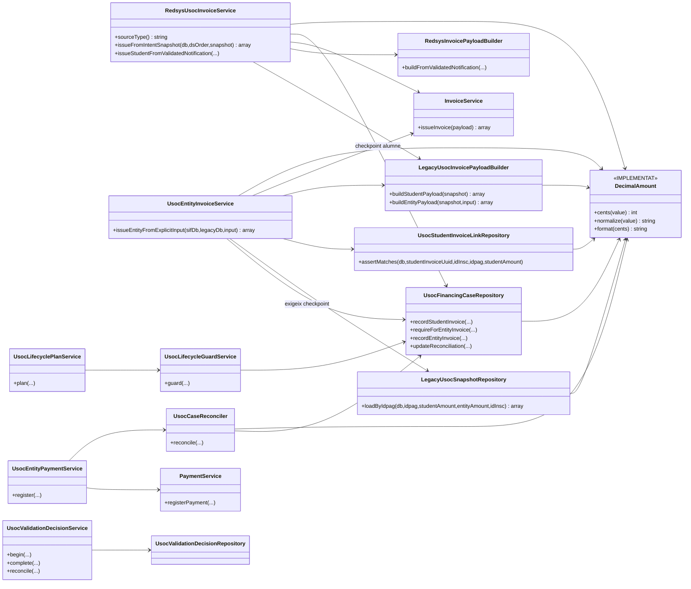
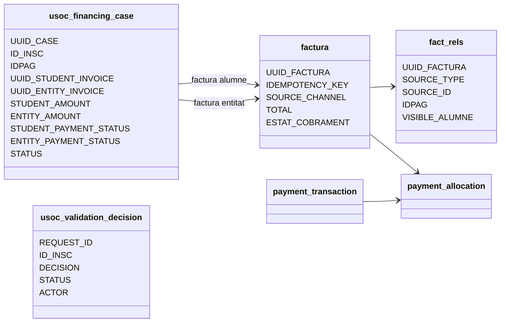
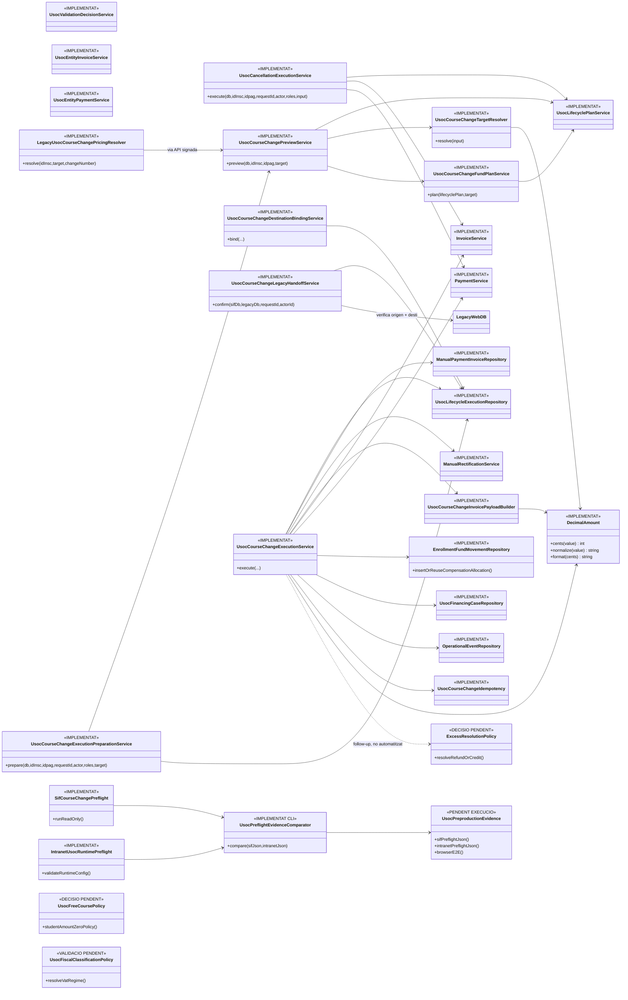

# UC-013 · Classes ACTUAL / FINAL — Orquestrar la doble facturació USOC

**Data d'auditoria:** 2026-10-04  
**Main contrastat:** `6c8137ff1652ac89a1a81ad18cf79fc4689b1757`  
**Abast:** web PrisMa, intranet, pay.prisma.cat/SIF, doble pagador alumne + entitat USOC, conciliació i lifecycle.  
**Criteri:** ACTUAL descriu responsabilitats observades al codi; FINAL descriu l'arquitectura objectiu o residual. No es marca com implementat allò que només existeix com a disseny.

## 1. Classes ACTUAL — web i intranet legacy

### Responsabilitats observades

- La web pública mostra la proposta USOC i el formulari només sol·licita el tractament; marcar USOC no valida l'afiliació.
- `enviarInscripcioAfiliat.php` crea la inscripció legacy amb `TIPUS_DESC=4`, `VALID_DESC` pendent i reserva `IDPAG` amb l'allocator compartit protegit per named lock.
- La validació manual passa per POST + CSRF + rol d'edició i un `requestId`.
- Per USOC, la decisió legacy queda coordinada amb el SIF mitjançant dues fases durables abans/després de la mutació.
- Els canvis de curs/baixes USOC ja no poden continuar cegament: el guard consulta el SIF i bloqueja quan existeix expedient fiscal/econòmic.

## 2. Classes ACTUAL — nucli SIF USOC

### Responsabilitats verificades al main actual

- `RedsysUsocInvoiceService` factura només la part alumne i persisteix/reutilitza `usoc_financing_case`.
- `UsocEntityInvoiceService` exigeix `ID_INSC`, `IDPAG`, imports, UUID de factura alumne i billing explícit; comprova checkpoint abans de facturar.
- `UsocStudentInvoiceLinkRepository` valida que la factura alumne sigui realment Redsys/USOC, de la mateixa inscripció i del mateix import.
- `LegacyUsocInvoicePayloadBuilder` exigeix `TIPUS_DESC=4` i `VALID_DESC=1`, usa imports explícits i construeix dues factures fiscals separades.
- `UsocEntityPaymentService` registra cobrament real de l'entitat i força reconciliació posterior.
- `UsocValidationDecisionService` manté el protocol `REQUESTED / COMMITTED / REVIEW_REQUIRED`.
- `UsocLifecyclePlanService` planifica per pagador separat i limita el màxim retornable al net real cobrat.
- Els imports monetaris UC-013 es normalitzen i comparen en cèntims enters mitjançant `DecimalAmount`; no s'arrodoneixen silenciosament valors amb més de dues posicions decimals.

## 3. Persistència ACTUAL

**Invariant:** el pagament Redsys de l'alumne no pot saldar la factura USOC; cada factura conserva el seu propi origen de diners i estat de cobrament.

## 4. Classes FINAL / arquitectura executiva i residual

**Precisió del diagrama FINAL:** `UsocCourseChangeExecutionService` no crida `CreditBalanceService`. Quan hi ha excés, retorna `EXCESS_REQUIRES_EXPLICIT_CREDIT_OR_REFUND` i deixa la resolució com a decisió explícita. Per tant, qualsevol relació directa amb un servei de crèdit seria documentació falsa de l'estat actual.

## 5. Diferències ACTUAL → FINAL

| Responsabilitat | ACTUAL | FINAL / pendent |
|---|---|---|
| Doble factura | Implementada | Mantenir contracte |
| Doble pagador | Implementat | Mantenir separació estricta |
| Checkpoint durable | Implementat | Mantenir i evidenciar runtime |
| Cobrament entitat | Implementat | Provar preproducció real |
| Validació legacy↔SIF | Implementada en dues fases | Provar configuració real |
| UI USOC | Implementada al repositori | Desplegament/rols/secrets/preflight real |
| Baixa | Guard + planner + executor implementats | Acreditar CI actual i preproducció |
| Canvi de curs | Guard + planner + pricing server-side + resolver + fund planner + preview + `prepare` + reserva destí + `bind` + verificació durable `LEGACY_COMPLETED` + executor + reemissió + compensacions + `COMPLETED` implementats | Resta preproducció/navegador, configuració real i resolució operativa d'excessos |
| Alumne=0 | Bloquejat fail-closed | Decisió funcional/fiscal |
| Regla 20/25 % | No hardcoded al SIF | Decisió comercial fora del nucli |
| IVA | EXEMPT/E1 al builder | Validació fiscal de totes les variants |
| Aritmètica monetària | Cèntims enters / `DecimalAmount` + parser estricte legacy | Mantenir invariant; cap float ni arrodoniment silenciós |
| Preflight | SIF + runtime intranet separats | Executar tots dos a preproducció i conservar JSON/SHA/timestamp |
| Excessos | `requires_follow_up`, sense resolució automàtica | Decidir refund o `credit_balance` per pagador |

## 6. Estat

- **Documentat:** sí, ara també amb classes ACTUAL/FINAL separades.
- **Implementat:** nucli de doble facturació, cobrament, checkpoint, conciliació, validació durable, UI, lifecycle planner i flux complet de canvi de curs: pricing server-side, resolver, fund planner, preparation, reserva/binding de destí, `UsocCourseChangeLegacyHandoffService`, checkpoint `LEGACY_COMPLETED`, executor, reemissió, compensacions i esdeveniments.
- **Verificat:** inspecció estàtica sobre el PR #152 reconciliat amb `main@6c8137ff1652ac89a1a81ad18cf79fc4689b1757`.
- **Provat:** existeixen proves d'integració/contracte específiques per preparation, binding, executor, idempotència, preview, reserva legacy i handoff. L'acceptació definitiva correspon al CI del PR reconciliat i a preproducció.
- **Pendent:** CI del SHA final, execució dels dos preflights a preproducció, E2E navegador, curs gratuït, resolució explícita d'excessos i validacions comercials/fiscals. Tant la baixa com el canvi de curs disposen d'executor SIF.

## 7. Contracte FINAL del canvi de curs

El detall d'imports, compensacions, idempotència i casos límit queda fixat a:

- [Contracte FINAL · canvi de curs USOC](uc-013-canvi-curs-usoc-contracte-final.md)

La diferència principal respecte del legacy és que el FINAL **no copia `PAGAMENT`**. Els fons reals s'han de compensar per pagador mitjançant moviments auditables.
