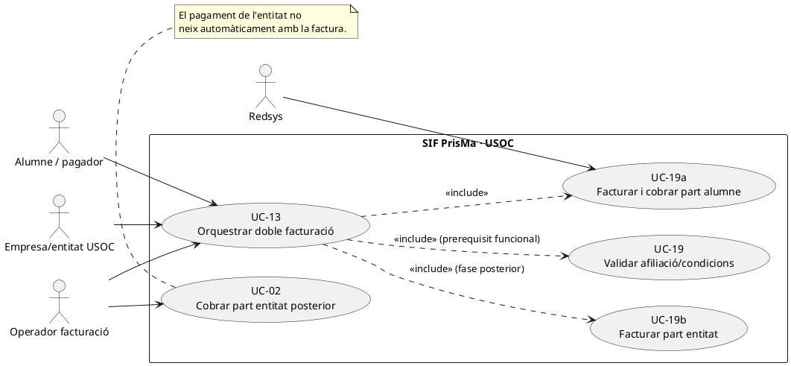
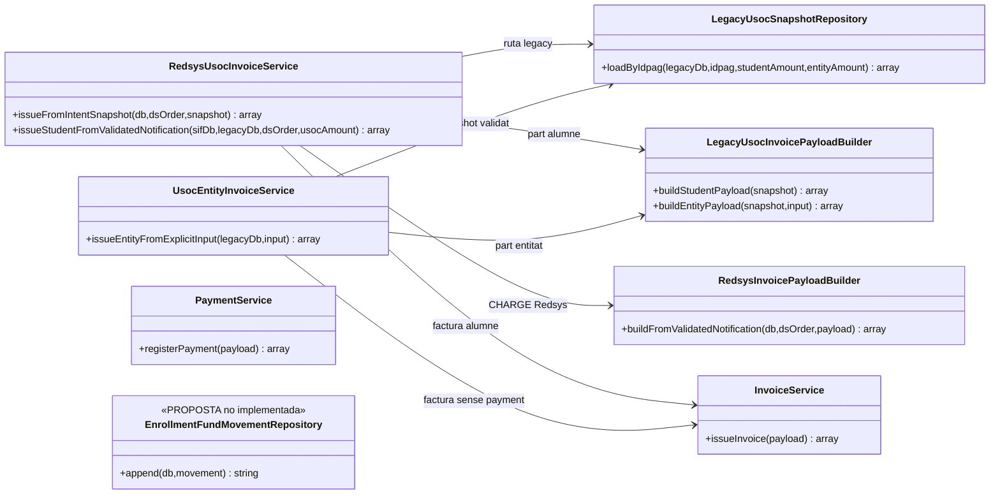
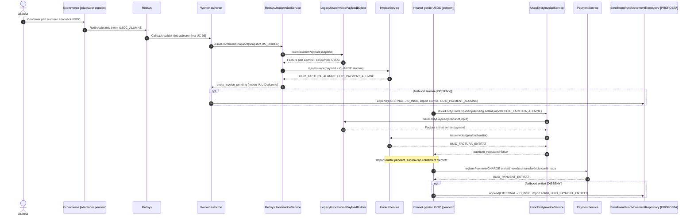
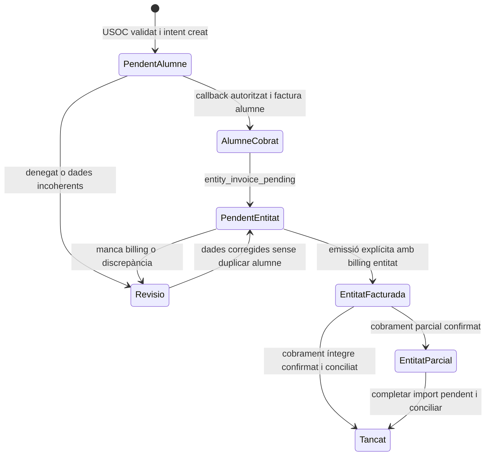
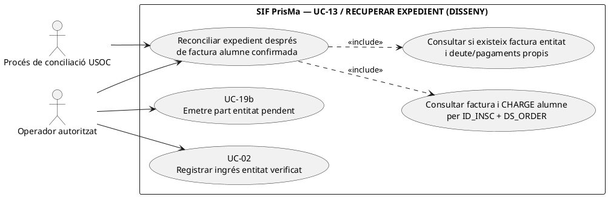
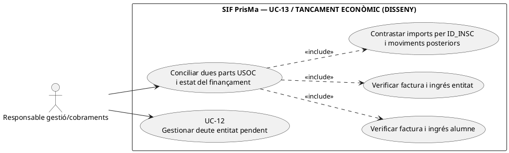
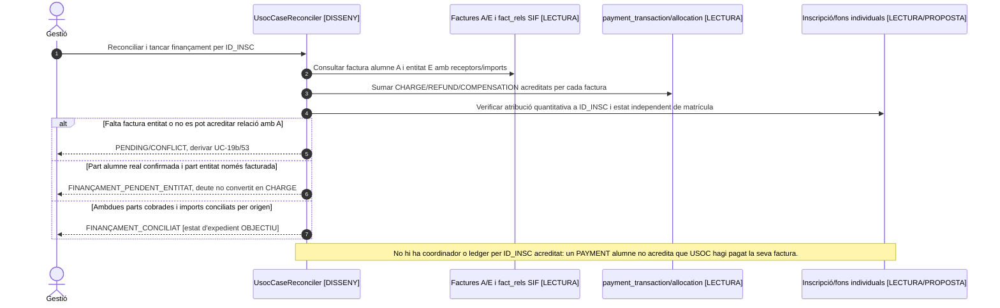

# UC-13 · Orquestrar la doble facturació USOC — fitxa i UML integrats

**Objectiu:** conservar **dues obligacions/factures diferenciades** per una mateixa inscripció USOC: la part que paga l'alumne i la part que correspon a l'entitat. **No** confondre una única inscripció amb una única factura, ni interpretar un pagament Redsys de l'alumne com si hagués cobrat també la part de l'entitat.

**Estat contrastat:** existeixen `RedsysUsocInvoiceService` (part alumne) i `UsocEntityInvoiceService` (factura explícita a l'entitat), `LegacyUsocSnapshotRepository` i `LegacyUsocInvoicePayloadBuilder`. El primer servei retorna explícitament `entity_invoice_pending`; el segon retorna `payment_registered=false`. **No es dedueix d'aquests serveis un orquestrador final atòmic que emeti dues factures, cobri dues parts i reconciliï el llegat en una sola transacció.**

## 1. Fitxa funcional del cas mare

| Element | Contracte |
| --- | --- |
| Actors | Alumne/pagador, entitat USOC com a receptor/pagador de la seva part, operador autoritzat de facturació, Redsys i worker SIF. |
| Precondició segons builder | `inscription.TIPUS_DESC=4` i `VALID_DESC=1`; `LegacyUsocInvoicePayloadBuilder` i repositori rebutgen una inscripció no classificada/validada com USOC. La comprovació de justificants i afiliació completa és UC-19 separada. |
| Identitat comercial | Una inscripció `ID`, `IDPAG`, curs i edició, import pagat per alumne i import corresponent a l'entitat **separats en el snapshot**. |
| Resultat part alumne | Factura a nom de l'alumne amb descompte USOC i import alumne; `payment_transaction CHARGE` Redsys només per aquest import, amb `UUID_FACTURA`/ `UUID_PAYMENT` associats. |
| Resultat part entitat | Factura fiscal distinta amb dades `billing` explícites de l'entitat i import de l'entitat; `UsocEntityInvoiceService` emet **sense registrar cobrament inicial**, deixa `payment_registered=false` i conserva `student_invoice_uuid`. |
| Resultat complet | Les dues factures i imports correlacionats a **una inscripció**, amb estat de cobrament propi per cadascuna i la part de l'entitat registrada com a deute fins a la confirmació d'un cobrament posterior real. |
| Traça de fons per inscripció | Un registre d'atribució de l'import de l'alumne quan arriba Redsys; un segon registre referenciat a **un altre pagament real** si l'entitat cobra després. No crear `CHARGE` fictici per l'import pendent. |

### 1.1. Flux objectiu amb serveis verificats

1. El procés comercial valida que l'operació és USOC i congela `student_amount`, `entity_amount`, receptor fiscal de cadascuna i `ID_INSC`; la validació de l'afiliació/condicions no es presumeix completada pel simple `TIPUS_DESC`.
2. L'alumne confirma compra i es crea intenció Redsys `SOURCE_TYPE=USOC_ALUMNE` amb snapshot, incloent **import de l'entitat positiu**, i import Redsys previst **només** de la part alumne (UC-63).
3. UC-03 valida el callback i `RedsysUsocInvoiceService::issueFromIntentSnapshot()` exigeix `usoc.entity_amount` positiu, construeix la factura de part alumne via `LegacyUsocInvoicePayloadBuilder::buildStudentPayload()`, incorpora el cobrament validat i crida `InvoiceService`.
4. Retorna `UUID_FACTURA` de l'alumne i dades `entity_invoice_pending`: `source_type=USOC_ENTITAT`, `entity_amount`, `student_invoice_uuid`, `idpag`, `requires_explicit_billing=true`. **Això no és una factura ja emesa a l'entitat.**
5. El canal de gestió recull **dades fiscals explícites de l'entitat** i confirma import/relació. `UsocEntityInvoiceService::issueEntityFromExplicitInput()` exigeix `idpag`, `student_amount`, `amount`, `student_invoice_uuid` i `billing.name/nif`, recarrega snapshot validat i emet la factura de l'entitat. Retorna `payment_registered=false`.
6. El pagament posterior de l'entitat segueix UC-02/22/24 segons el canal, imputat a la factura de l'entitat, sense tornar a emetre-la. Cada factura manté estat fiscal i de cobrament propi.
7. El registre monetari proposat atribueix a una sola inscripció **dos imports d'origen diferent**: part alumne quan el `CHARGE` Redsys s'ha confirmat, i part entitat **només** quan s'ha confirmat el seu ingrés. La suma d'atribucions ha de reconciliar-se amb els moviments originals i les dues factures, sense duplicar imports.
8. Un canvi de curs, baixa o rectificativa ha de tenir present **ambdues factures i pagadors**: no retornar diners de l'entitat a l'alumne ni reduir la factura de l'alumne per un deute de l'entitat sense decisió motivada.

### 1.2. Alternatives i incerteses que exigeixen decisions específiques

| Cas | Regla |
| --- | --- |
| Alumne paga i encara falta factura de l'entitat | Factura/pagament alumne confirmats; expedient USOC parcial, `entity_invoice_pending`; no marcar tot el cas complet ni crear cobrament entitat. |
| Dades fiscals de l'entitat absents | `UsocEntityInvoiceService` rebutja; cap factura fiscal a receptor deduït automàticament. |
| `TIPUS_DESC` diferent de 4 o `VALID_DESC` diferent de 1 | Constructor i repositori USOC rebutgen en les rutes consultades. |
| Callback alumne duplicat | Reutilitza factura i pagament de l'alumne, no genera repetidament factura entitat. |
| Factura entitat existent per mateix origen | La clau base del builder entitat combina inscripció i UUID de factura alumne; exigeix conciliació d'import/receptor davant un reintent amb entrada contradictòria. |
| Import de l'entitat que no s'arriba a cobrar | Es conserva deute o incidència; no crear `EXTERNAL → INSCRIPCIÓ` per l'import no ingressat. |
| Fracció entitat, subvenció alternativa o modificació posterior | Cal decidir receptor, concepte, import i classificació del finançament, sense canviar les factures emeses en lloc; UC-05/71/72 quan correspongui. |
| Factura i cobrament en BDs/canals diferents | No s'ha acreditat una transacció única alumne+entitat+inscripció; usar correlació, idempotència i conciliació entre fases. |

**Proves localitzades, no executades:** `RedsysUsocInvoiceServiceTest`, `UsocEntityInvoiceServiceTest` i preflight/preproducció respectius. Existència de proves no acredita el cicle complet de dos pagadors fins a dues factures cobrades i dos imports atribuïts.

### 1.3. Validació manual, import de referència i curs gratuït USOC — contrast amb el circuit de PrisMa

**U-VAL — validació abans del descompte:** el circuit descrit identifica el descompte «Afiliat USOC» amb `TIPUS_DESC=4`, però la persona que el demana pot estar pendent de comprovació (`VALID_DESC=0`). La intranet ha de confirmar manualment l'afiliació amb USOC abans d'establir `VALID_DESC=1` i permetre la compra/facturació amb aquest descompte (UC-19). Si no es confirma, el circuit ha de recalcular l'import de compra abans de l'emissió; si ja existeix factura, no corregir-ne l'import amb un UPDATE silenciós. Que el builder exigeixi `VALID_DESC=1` no acredita que la comprovació externa s'hagi dut a terme.

**U-IMPORT — import observat, no tarifa universal:** el xat original i els fluxos del projecte descriuen com a cas habitual un primer pagament de **10 € de l'alumne** i el pagament de la diferència per USOC; el descompte d'afiliació es descriu com del **25 %**. Aquests valors han de sortir del preu i de les condicions confirmades **de l'operació concreta**; no es poden codificar com a constants universals en el SIF ni inferir l'import USOC simplement restant `A_PAGAR - PAGAMENT` d'un registre viu. Conservar snapshot d'import base, import de l'alumne, import assumit per USOC, descompte, condició validada, data/usuari de validació i receptors fiscals diferents.

**U-GRATUÏT — variant històrica «Altres: Curs gratuït USOC»:** el xat també descriu aquest circuit especial i el paràmetre `anticipi-preu-usoc`. No presumir que segueixi la regla 10 € + diferència, ni que pugui passar directament per `RedsysUsocInvoiceService`: la ruta actual de UC-19a/19b exigeix `student_amount > 0` i `entity_amount > 0` i, per tant, **no acredita la tramitació d'un import d'alumne zero**. Cal recuperar les condicions i els imports exactes del cas especial, decidir receptor i factura(s) corresponents i preparar un circuit fiscal validat abans d'adaptar la implementació; cap factura de 0 € o CHARGE fictici no es crea per completar artificialment les dues parts.

**U-ORIGEN — deute diferent d'ingrés:** emetre la factura USOC encara pendent no atribueix fons de l'entitat a la inscripció. Cada cobrament parcial de l'entitat es vincula exclusivament a la factura USOC, mentre que el CHARGE inicial Redsys de l'alumne continua pertanyent a la factura alumne. Un canvi/baixa ha de consultar les dues factures i titularitats abans de decidir reassignacions, retorns o saldos.

### 1.4. Proves d'acceptació afegides (no executades)

| ID | Cas | Resultat exigible |
| --- | --- | --- |
| US-01 | Alumne sol·licita USOC i VALID_DESC continua a 0 | Cap emissió USOC amb descompte fins a validació manual acreditada. |
| US-02 | Afiliació denegada abans de facturar | Recalcular compra sense descompte i no crear dues factures USOC fictícies. |
| US-03 | Cas habitual amb primer ingrés alumne de 10 € | Snapshot d'import de cada part i dues factures diferenciades, només el cobrament real de l'alumne al començament. |
| US-04 | «Curs gratuït USOC» amb part d'alumne igual a 0 | Circuit especial pendent de decisió; no forçar builder que exigeix imports positius ni CHARGE de 0 €. |
| US-05 | Entitat encara no ha pagat o paga parcialment | Factura entitat pendent/PARTIAL segons moviment real, factura alumne intacta. |
| US-06 | Baixa/canvi quan alumne ha pagat i USOC deu la seva part | No retornar diners no cobrats ni confondre titulars o rectificar automàticament les dues factures. |
## 2. Diagrama UML de casos d'ús



## 3. Subdiagrama de classes — dos handlers sense orquestrador fictici



`PaymentService` és el servei de cobrament de la factura entitat **posterior i independent**; no es dibuixa una dependència directa fictícia des de `UsocEntityInvoiceService`.

## 4. Seqüència principal — dues factures, cobraments separats



La fletxa simplificada de Redsys al worker **representa el camí via callback signat i cua descrit a UC-03**, no una crida directa de Redsys al worker ni l'existència d'un orquestrador USOC complet.

## 5. Diagrama d'estat de l'expedient (DISSENY)



**Aquest diagrama és la proposta d'estats de l'expedient**, no una classe o taula de workflow `UsocOrchestrator` identificada en l'actual codi.

### 5.1. Acció independent: reconstruir l'expedient conjunt després de l'emissió de l'alumne — DISSENY/PARCIAL

**Disparador:** el worker ha confirmat factura/cobrament de l'alumne, però el resultat `entity_invoice_pending` no arriba al panell, s'ha perdut la resposta, o falta la factura de la part entitat. **Actor:** procés de conciliació USOC / gestió autoritzada. **Entrada:** `DS_ORDER`, `UUID_FACTURA_ALUMNE` i `ID_INSC` acreditats, imports i receptor de la intenció congelada, fets fiscals i bancaris SIF actuals. **Postcondició:** expedient reconstruït amb **dues línies de finançament** i estat separat per factura/pagament, amb pas pendent només per la part que falta; **no tornar a cobrar ni emetre la factura alumne** per recuperar les dades de la part entitat.

**Contrast de codi:** `RedsysUsocInvoiceService::issueFromIntentSnapshot()` retorna `entity_invoice_pending` en un array un cop ha delegat `InvoiceService::issueInvoice()`. El servei PHP no té en aquests mètodes un writer d'expedient USOC durable ni un procés que, a partir d'un `UUID_FACTURA_ALUMNE`, asseguri l'emissió posterior de la part entitat. `LegacyUsocSnapshotRepository::loadByIdpag()` llegeix el primer registre llegat d'un IDPAG (`ORDER BY ID LIMIT 1`), i no valida per si sol que aquest sigui l'inscrit fiscal de la factura alumne. `UsocEntityInvoiceService` només comprova que el UUID d'alumne aportat no sigui buit: cal contrastar-lo amb la factura SIF i l'ID_INSC abans d'autoritzar l'emissió (UC-19b).



```mermaid
sequenceDiagram
autonumber
actor O as Gestió/worker conciliació
participant C as UsocCaseReconciler [DISSENY]
participant I as Factures/pagaments i fact_rels SIF [LECTURA]
participant L as Llegat inscripcions [LECTURA]
participant E as UsocEntityInvoiceService [PHP; UC-19b]
participant P as PaymentService [PHP; UC-02]
O->>C: recoverUsocCase(ID_INSC,DS_ORDER,UUID_FACTURA_ALUMNE)
C->>I: Verificar factura alumne A, UUID_PAYMENT real i DS_ORDER
C->>L: Contrastar ID_INSC concret, TIPUS_DESC/VALID_DESC i snapshot original
alt Alumne sense cobrament validat, UUID aliè o IDPAG ambigu
 I-->>C: Manca evidència/CONFLICT
 C-->>O: Incidència sense crear factura entitat ni un altre CHARGE alumne
else Factura i cobrament alumne confirmats
 C->>I: Cercar factura USOC_ENTITAT pel mateix cas i pagaments atribuïts
 alt Factura entitat E ja existeix
  I-->>C: UUID_FACTURA_ENTITAT i estat pendent/parcial/pagat
  C-->>O: Recuperar E i només les accions posteriors pendents
 else Encara no s'ha emès factura entitat
  I-->>C: Només factura alumne A confirmada
  C-->>O: Proposta UC-19b PENDING amb UUID A, cap segona emissió A
  opt Responsable valida receptor i import entitat [DISSENY]
   O->>E: issueEntityFromExplicitInput(legacyDb,input contrastat)
   E-->>O: UUID_FACTURA_ENTITAT, payment_registered=false
  end
 end
 opt Transferència entitat externa confirmada posteriorment
  O->>P: registerPayment(CHARGE entitat, UUID_FACTURA_ENTITAT)
  P-->>O: UUID_PAYMENT real, sense recrear factura alumne
 end
end
Note over C,P: Recuperador i checkpoint per cas no acreditats. La relectura evita inferir un ingrés d'entitat del cobrament de l'alumne.
```

### 5.2. Acció independent: verificar i tancar l'expedient de finançament sense confondre dos pagadors — DISSENY

**Disparador:** gestió vol marcar completat el finançament USOC d'una inscripció. **Precondicions:** factura alumne i factura entitat **diferents**, identitat fiscal/inscripció i import de cadascuna contrastats; assignacions de pagament reals per factura, i qualsevol `REFUND` o compensació posterior classificats per pagador. **Postcondició:** `FINANÇAMENT_CONCILIAT` com a **estat objectiu de l'expedient**, diferent d'estat acadèmic, certificat o acceptació AEAT; si la part entitat només està facturada o pagada parcialment, conservar deute i no declarar el cas complet.





| Prova pendent | Escenari | Resultat exigible |
| --- | --- | --- |
| UO-13-07 | Factura/CHARGE alumne confirmats i resposta `entity_invoice_pending` perduda | Recuperar UUID alumne i estat de la part entitat sense segon CHARGE ni altra factura alumne. |
| UO-13-08 | IDPAG compartit amb diversos inscrits; factura alumne vinculada a un ID_INSC diferent del primer llegat | Bloquejar i reconciliar identitat, no facturar per al primer ID automàticament. |
| UO-13-09 | Factura entitat existent però encara sense transferència acreditada | Recuperar factura/deute, no tornar a emetre-la ni declarar finançament complet. |
| UO-13-10 | Entitat paga només una fracció del seu import | Expedient parcial i pendent restant, amb pagament alumne intacte. |
| UO-13-11 | Una factura alumne i una entitat amb dos pagaments reals diferents | Finançament conciliable només quan ambdós imports i orígens estan contrastats per ID_INSC; cap duplicació del moviment alumne. |

## 6. Traçabilitat

[UC-13 original](../06-fitxes-funcionals/uc-013.md) · [UC-19a original](../06-fitxes-funcionals/uc-019a.md) · [UC-19b original](../06-fitxes-funcionals/uc-019b.md) · [Revisió fons inscripció](00-revisio-moviments-inscripcions.md) · [RedsysUsocInvoiceService](../../sif/src/Service/RedsysUsocInvoiceService.php) · [UsocEntityInvoiceService](../../sif/src/Service/UsocEntityInvoiceService.php) · [LegacyUsocInvoicePayloadBuilder](../../sif/src/Service/LegacyUsocInvoicePayloadBuilder.php) · [LegacyUsocSnapshotRepository](../../sif/src/Repository/LegacyUsocSnapshotRepository.php) · [RedsysUsocInvoiceServiceTest](../../sif/tests/Integration/RedsysUsocInvoiceServiceTest.php) · [UsocEntityInvoiceServiceTest](../../sif/tests/Integration/UsocEntityInvoiceServiceTest.php).

**No acreditat:** classificació d'afiliació externa completa, pagament entitat real, prova d'extrem a extrem, classe d'orquestració, transacció conjunta o ledger per inscripció implementat.
