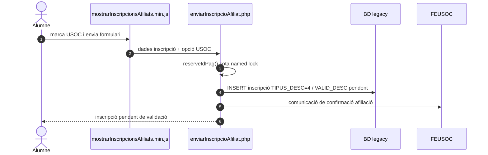
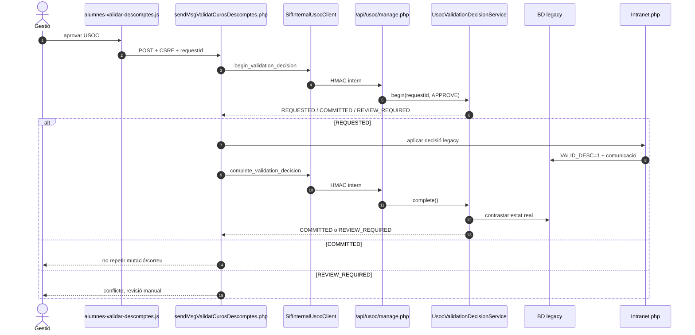
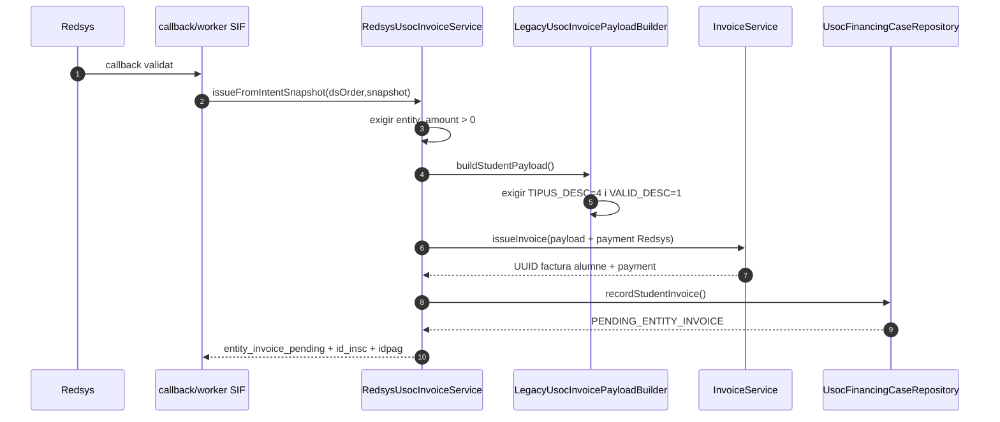
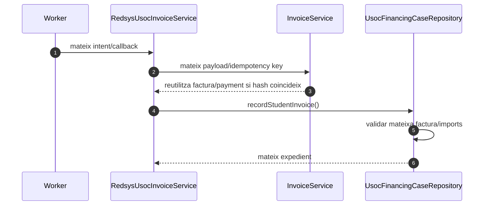
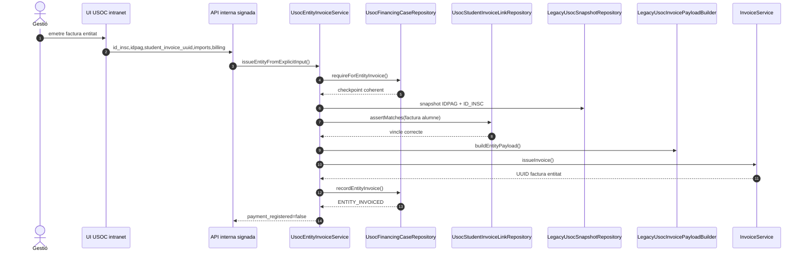
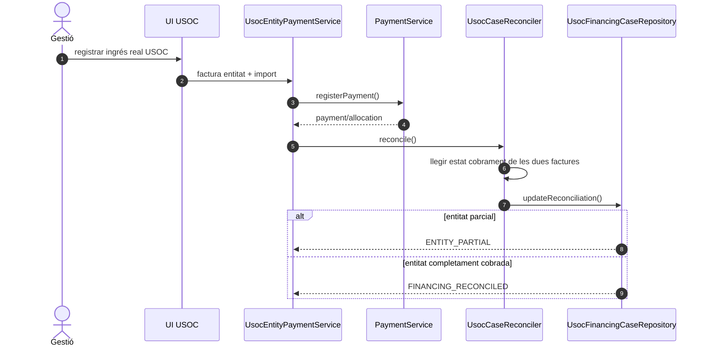
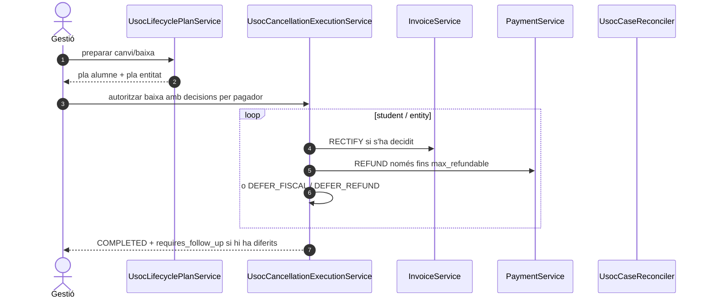
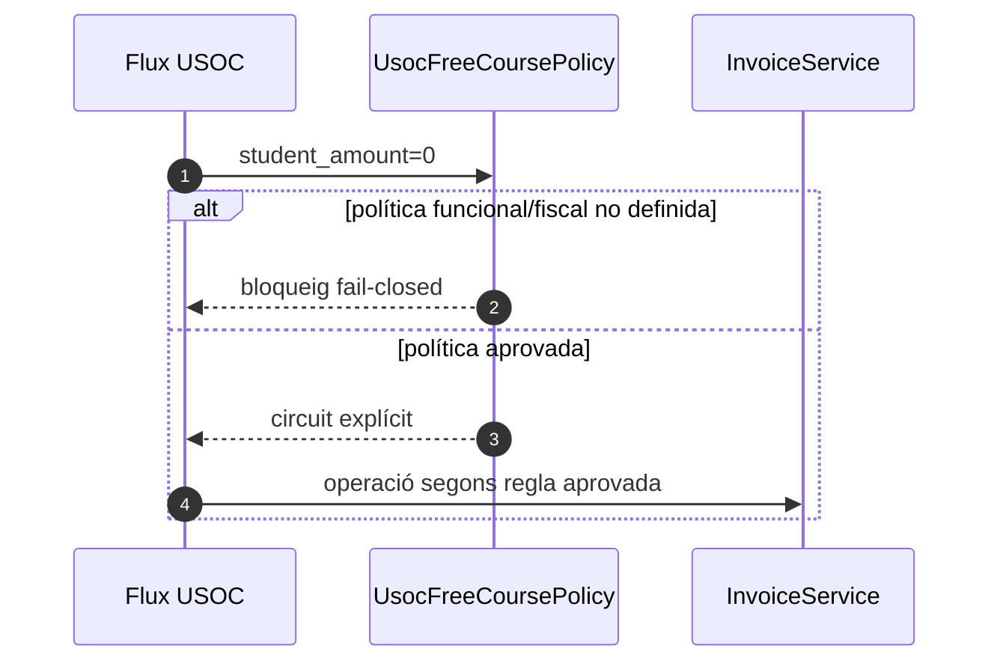

# UC-013 · Seqüències ACTUAL / FINAL — Orquestrar la doble facturació USOC

**Data d'auditoria:** 2026-10-02  
**Main contrastat:** `f7fa0822f82be96e842d9f2d031e643ab07f617c`

## 1. ACTUAL — sol·licitud USOC



**ACTUAL:** marcar l'opció USOC no valida l'afiliació ni crea encara la segona factura.

## 2. ACTUAL — validació positiva durable legacy ↔ SIF



## 3. ACTUAL — factura i cobrament de la part alumne



## 4. ACTUAL — reintent alumne



**Invariant:** mateix idempotency key amb payload divergent no es reutilitza silenciosament.

## 5. ACTUAL — emissió factura entitat



## 6. ACTUAL — cobrament parcial/complet de l'entitat



## 7. ACTUAL — canvi de curs / baixa

```mermaid
sequenceDiagram
autonumber
actor G as Gestió
participant L as endpoint legacy
participant Guard as LegacyUsocLifecycleGuard
participant API as API USOC signada
participant GS as UsocLifecycleGuardService
participant Plan as UsocLifecyclePlanService

G->>L: POST canvi/baixa + CSRF
L->>Guard: comprovar TIPUS_DESC=4
Guard->>API: lifecycle_guard
API->>GS: guard(ID_INSC)
GS-->>API: payer_snapshot / allowed
alt expedient USOC fiscalitzat
 API-->>L: 409 requires orchestration
 L->>API: lifecycle_plan
 API->>Plan: plan(snapshot,operation)
 Plan-->>L: accions separades per pagador + max_refundable
 L-->>G: preview; no mutació legacy
else sense evidència USOC fiscal
 L-->>G: flux legacy permès
end
```

## 8. ACTUAL — baixa USOC executiva amb dos pagadors



**ACTUAL:** la baixa ja té `UsocCancellationExecutionService`, amb idempotència per `requestId`, rectificatives/refunds separats i persistència d'esdeveniments. **PENDENT:** executor equivalent per al canvi de curs i evidència de preproducció.

## 9. FINAL — variant curs gratuït



Actualment el builder rebutja `student_amount=0`; no s'inventa una factura o cobrament fictici.

## 10. Estat

- **Documentat:** seqüències principals ACTUAL/FINAL separades.
- **Implementat:** sol·licitud, validació durable, factura/cobrament alumne, checkpoint, factura/cobrament entitat, conciliació, guard, planner, resolver d'imports destí i pla econòmic pur per pagador.
- **Verificat:** inspecció estàtica sobre el main indicat.
- **Provat:** evidència CI prèvia específica del UC-013 cobreix E2E de servei, idempotència, parcial/complet, validació durable, UI contracts i lifecycle planner.
- **Pendent:** E2E navegador/preproducció sobre configuració real i executor d'efectes del canvi de curs. El preview USOC server-side ja està implementat; la baixa ja està implementada al repositori.


## 11. FINAL — canvi de curs USOC executable

```mermaid
sequenceDiagram
autonumber
actor G as Gestió
participant UI as Intranet canvi curs
participant Guard as LegacyUsocLifecycleGuard
participant API as API USOC
participant Plan as UsocLifecyclePlanService
participant Target as UsocCourseChangeTargetResolver
participant Exec as UsocCourseChangeExecutionService
participant Rect as ManualRectificationService
participant Inv as InvoiceService
participant Funds as EnrollmentFundMovementRepository
participant Credit as CreditBalanceService
participant Legacy as Legacy canvi curs

G->>UI: confirmar curs destí
UI->>Guard: inspect(course_change)
Guard->>API: lifecycle_guard / lifecycle_plan
API->>Plan: snapshot separat student/entity
Plan-->>UI: origen congelat + max_refundable
UI->>Target: preu estàndard + preu USOC destí + fee
Target->>Target: entity = standard - student
Target->>Target: validar invariants i regla USOC destí
alt incoherent o regla absent
 Target-->>UI: REVIEW_REQUIRED
else coherent
 UI->>Exec: execute(requestId, origen, destí)
 loop alumne / entitat
  Exec->>Rect: rectificar factura origen si existeix
 end
 Exec->>Inv: emetre factura alumne destí
 Exec->>Inv: emetre factura entitat destí si import > 0
 loop alumne / entitat
  Exec->>Funds: compensar només fons reals del mateix pagador
  opt excés
   Exec->>Credit: crear saldo o aplicar decisió explícita
  end
 end
 Exec-->>UI: COMPLETED + handoff token/checkpoint
 UI->>Legacy: crear/mutar inscripció destí
 Legacy-->>UI: OK
end
```

**Invariant:** mai usar fons de l'alumne per saldar la part USOC ni a l'inrevés. El detall complet és a [contracte FINAL de canvi de curs](uc-013-canvi-curs-usoc-contracte-final.md).


## 12. ACTUAL — preview server-side del canvi de curs USOC

```mermaid
sequenceDiagram
autonumber
actor G as Gestió
participant UI as alumnes-usoc-lifecycle-preview.js
participant EP as sifUsocCourseChangePreview.php
participant Price as LegacyUsocCourseChangePricingResolver
participant API as API USOC signada
participant Prev as UsocCourseChangePreviewService
participant Life as UsocLifecyclePlanService
participant Target as UsocCourseChangeTargetResolver
participant Funds as UsocCourseChangeFundPlanService

G->>UI: clic Guardar canvi USOC
UI->>EP: POST + CSRF + id/edició/número canvi
EP->>Price: resolve()
Price->>Price: validar USOC origen
Price->>Price: preu base + preu USOC destí
Price->>Price: fee=origen si canvi 4, altrament 0
Price-->>EP: pricing snapshot server-side
EP->>API: course_change_preview HMAC
API->>Prev: preview()
Prev->>Life: lifecycle plan course_change
Prev->>Target: split student/entity/fee
Prev->>Funds: compensable/pendent/excés per pagador
Funds-->>Prev: fund plan
Prev-->>EP: preview sense efectes
EP-->>UI: pricing + target + fund plan
UI-->>G: mostrar preview; no continuar al legacy
```

**Invariant:** el preview no confia en `apagar`, `pagat` ni `despeses` editables del navegador per determinar el contracte USOC.
