# UC-014 — Diagrames d'activitat ACTUAL i FINAL per pàgina i apartat

**Data d'auditoria:** 29/09/2026  
**Compliment RM-037:** aquest document separa pàgines, apartats i processos servidor. Les capçaleres, cookies i components comuns no es reclasifiquen com UC-014.

## 0. Superfícies i apartats

| ID | Pàgina/procés | Apartats UC-014 |
| --- | --- | --- |
| P-CUR-01 | `pagina_confirmacio_inscripcio_automatic.php` + `PagamentCursAutomatic::mostrarPaginaConfirmacio()` | A càrrega; B estat/preu; C targeta/transferència; D variants/descompte compartides |
| P-CUR-02 | `pagina_pagament_automatic.php` + `PagamentCursAutomatic::mostrar()` | A dades curs; B pendent; C targeta; D transferència; E fraccionat |
| P-CUR-03 | `pagina_efectuar_pagament_automatic.php` | A POST; B DS_ORDER; C imports; D formulari Redsys; E cancel·lar/confirmar |
| P-CUR-04 | Redsys + `realitzaPagamentAutomatic.php` | A recepció; B validació; C factura; D cobrament/fracció; E correus/estat |
| P-CUR-05 | `respostaOkPagamentAutomatic.php` / `respostaKoPagamentAutomatic.php` | A retorn navegador; B missatge; C consulta estat real FINAL |
| P-CUR-06 | SIF asíncron | A intenció; B callback; C cua; D worker; E factura/cobrament; F atribució quantitativa; G sync/outbox |

## 1. P-CUR-01 — Confirmació d'inscripció

### 1.1 ACTUAL

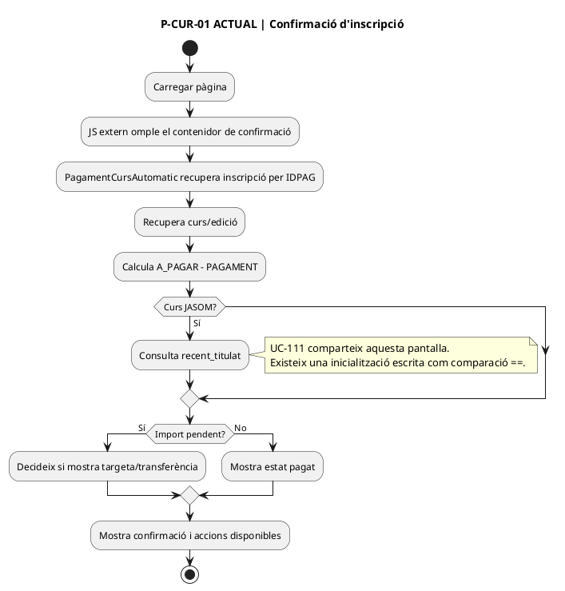

### 1.2 FINAL

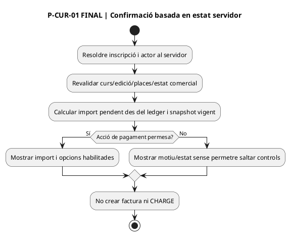

## 2. P-CUR-02 — Pàgina de pagament

### 2.1 ACTUAL

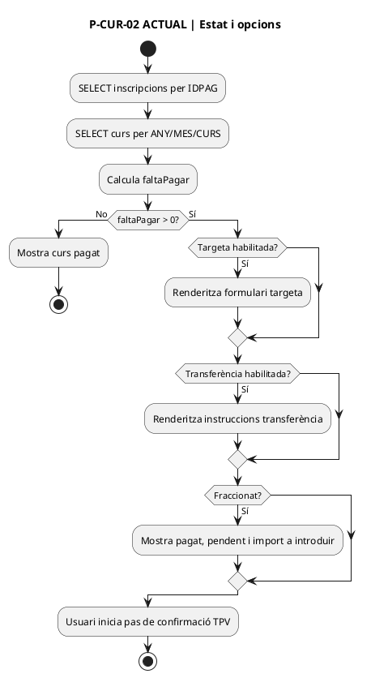

### 2.2 FINAL

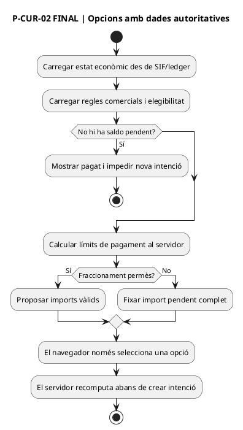

## 3. P-CUR-03 — Confirmació i enviament a Redsys

### 3.1 ACTUAL

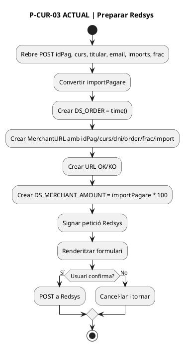

### 3.2 FINAL

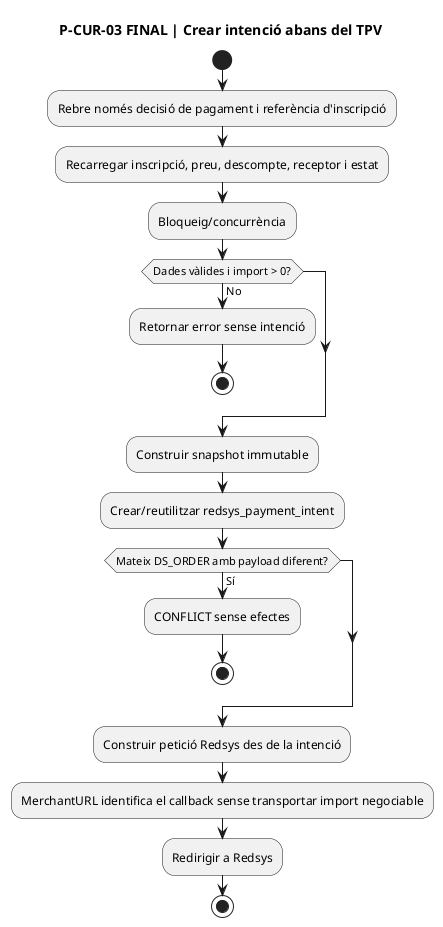

**Implementació al repositori:** el pont candidat ja crea/reutilitza la intenció mitjançant `SifRedsysCourseIntentClient`. La MerchantURL SIF exigeix `SIF_REDSYS_COURSE_CUTOVER_ENABLED=1` i `SIF_REDSYS_CALLBACK_URL` HTTPS; la URL sola no activa el tall i amb el flag a `0` es conserva el callback llegat com a transició/rollback. El tall d'entorn continua **PENDENT D'ACREDITAR**.

## 4. P-CUR-04 — Callback servidor

### 4.1 ACTUAL

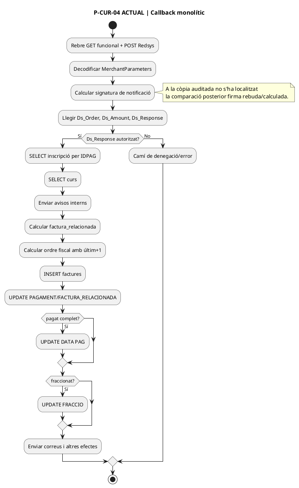

### 4.2 FINAL

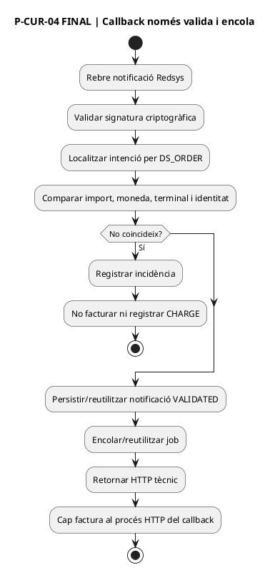

## 5. P-CUR-05 — Retorn del navegador

### 5.1 ACTUAL

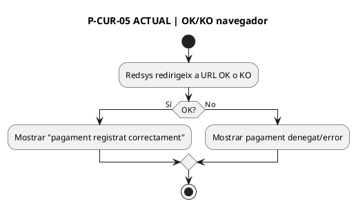

### 5.2 FINAL

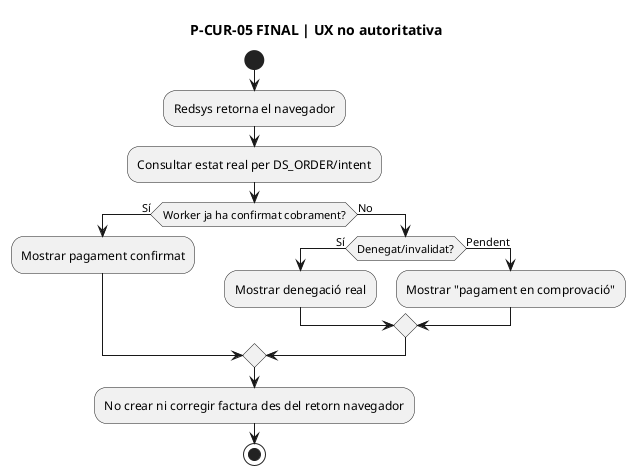

**Implementació al repositori:** `respostaOkPagamentAutomatic.php` i `respostaKoPagamentAutomatic.php` deleguen a `CoursePaymentReturnStatus`, que consulta per HMAC `SifRedsysCourseStatusClient` → `POST /api/redsys/course-status.php` → `RedsysCoursePaymentStatusService`. Els estats exposats són `PENDING`, `PROCESSING`, `CONFIRMED`, `REJECTED` i `REVIEW`; `CONFIRMED` exigeix job `PROCESSED` amb `UUID_FACTURA` i `UUID_PAYMENT`. Si la consulta SIF no està activa o falla, el retorn queda `UNVERIFIED/PENDING` i no afirma èxit.

**Verificació:** `RedsysCoursePaymentStatusServiceTest` i `RedsysCourseReturnBoundaryTest` han passat als tres workflows del PR #55. **Desplegament/preproducció real:** no acreditats.

## 6. P-CUR-06 — Worker SIF

### 6.1 ACTUAL

No existeix equivalent llegat separat: les responsabilitats es concentren en el callback.

### 6.2 FINAL

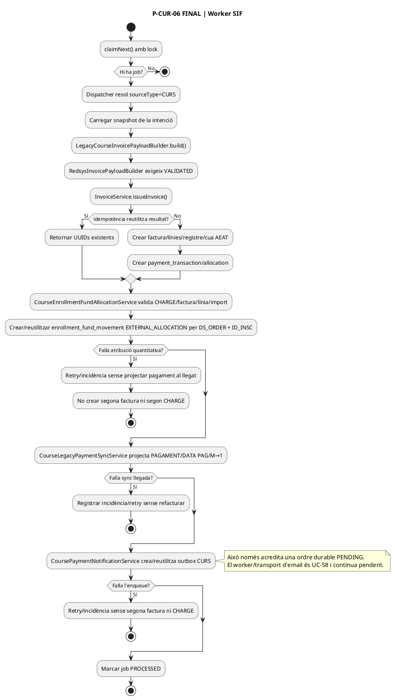

## 7. Apartats transversals i variants

### 7.1 Pagament parcial

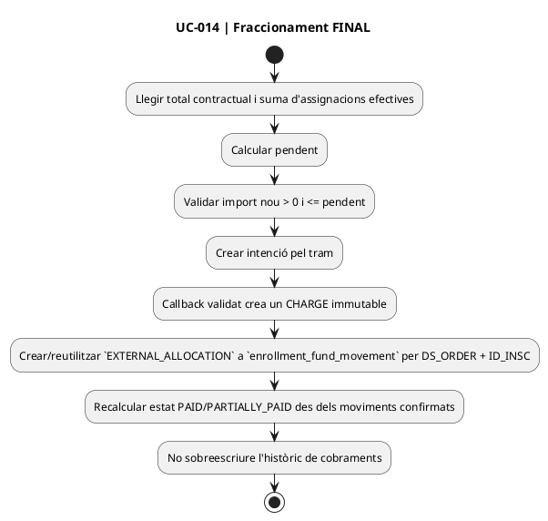

### 7.2 Callback duplicat

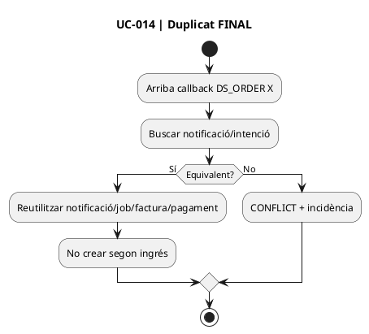

### 7.3 Sincronització acadèmica fallida

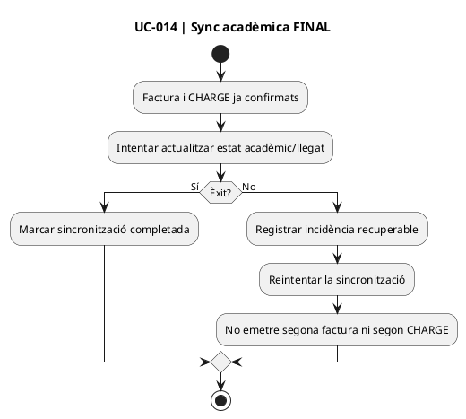

**Evidència A14-17 — 02/10/2026:** `CourseEnrollmentFundAllocationServiceTest` cobreix alta/reús, trams parcials i mismatch fail-closed; `RedsysCourseEndToEndSimulatedTest` exigeix un únic moviment al complet/duplicat i dos moviments amb suma 120,00 al parcial→complet. Suites SIF: **841 passed / 0 failed**.

## 8. Cobertura i límits

- Els JS externs referenciats per les pàgines actuals no s'han localitzat en la mateixa còpia auditada; la traça JS continua **PENDENT**.
- El runtime productiu no s'ha inspeccionat.
- UC-111 comparteix branques de la pantalla de pagament; aquesta fitxa només en deixa la dependència, no redefineix les seves regles.
- Taller i jornada continuen a UC-014a/014b.
