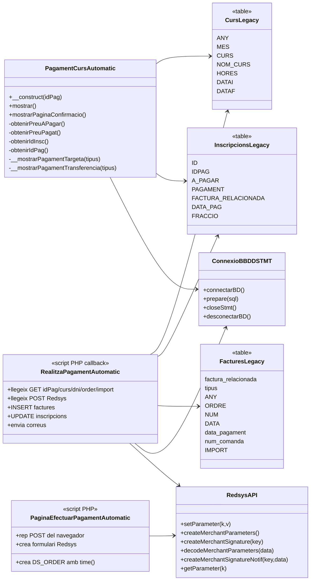
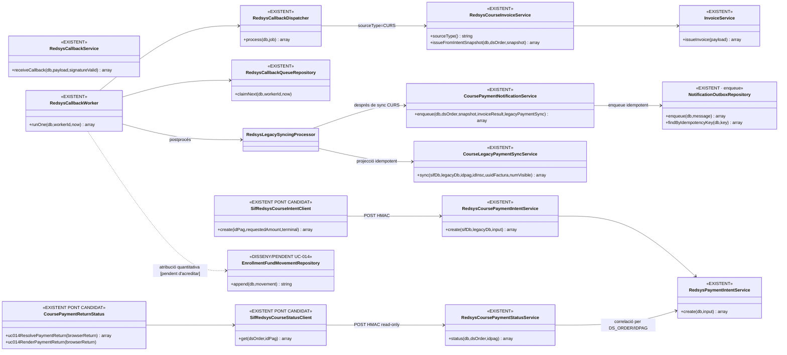

# UC-014 — Diagrames de classes ACTUAL i FINAL

**Data d'auditoria:** 29/09/2026  
**Abast:** compra d'un curs ordinari per Redsys. UC-014a (taller) i UC-014b (jornada) continuen separats.  
**Regla d'evidència:** ACTUAL = lectura estàtica del codi disponible al repositori; no acredita desplegament productiu. FINAL = codi SIF existent quan es marca `EXISTENT`; `DISSENY/PENDENT` quan encara no hi ha integració executable completa.

## 1. Classes i components ACTUALS

### Lectura de riscos de l'ACTUAL

- El callback llegat concentra validació bancària, facturació, actualització de la inscripció i correus.
- La numeració fiscal es calcula amb patrons `SELECT últim + 1`.
- `idPag`, `order`, `import` i altres dades funcionals viatgen a la MerchantURL.
- A la còpia revisada es calcula una signatura de notificació Redsys, però no s'ha localitzat la comparació posterior amb la signatura rebuda.
- El flux actual usa camps acumulatius de la inscripció per representar cobrament/fraccionament.

## 2. Classes i components FINAL — implementats o previstos

## 3. Correspondència ACTUAL → FINAL

| Responsabilitat | ACTUAL | FINAL |
| --- | --- | --- |
| Mostrar estat/preu del curs | `PagamentCursAutomatic` | pont candidat + serveis SIF amb rellegida autoritativa del servidor |
| Crear ordre TPV | `time()` a la pàgina PHP | `SifRedsysCourseIntentClient` → `RedsysCoursePaymentIntentService` → intenció persistent |
| Transportar dades al callback | GET de MerchantURL | `DS_ORDER` + snapshot de la intenció |
| Validar callback | `RedsysAPI` dins script monolític | `RedsysCallbackService` |
| Facturar | `INSERT factures` al callback | `InvoiceService` |
| Registrar cobrament | camps `PAGAMENT/FRACCIO` | `payment_transaction/payment_allocation` |
| Assignar a inscripció | implícit per `IDPAG` | relació + moviment quantitatiu per inscripció |
| Numeració fiscal | càlcul al canal web | seqüència central SIF |
| Reintents | no acreditats | idempotència per intenció/notificació/factura/pagament |
| Postprocessat acadèmic | barrejat amb callback | `RedsysLegacySyncingProcessor` / `CourseLegacyPaymentSyncService` posterior al SIF |
| Notificació de pagament | correus immediats dins callback | `CoursePaymentNotificationService` → `notification_outbox`; lliurament UC-58 separat |

## 4. Estat

**DOCUMENTAT:** ACTUAL i FINAL.  
**IMPLEMENTAT:** nucli Redsys/SIF, pont candidat d'intenció, sync llegada de curs, productor durable d'outbox CURS i retorn navegador read-only contra estat SIF. L'atribució quantitativa addicional per inscripció continua pendent d'acreditar dins UC-014.  
**VERIFICAT:** CI amb E2E intern simulat, retorn autoritatiu i boundaries de preproducció; lectura estàtica del pont candidat.  
**PENDENT:** desplegament/preproducció real, activació de MerchantURL SIF i retirada del callback fiscal llegat després de l'evidència.
