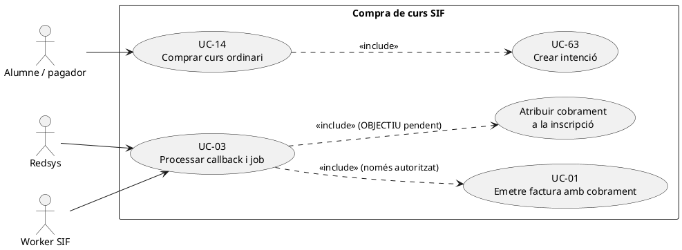
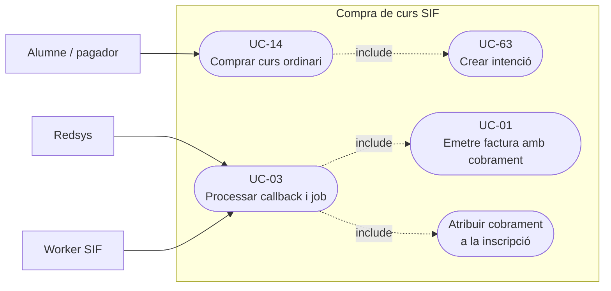
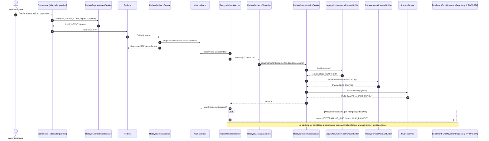

# UC-14 · Comprar un curs normal per Redsys — fitxa i UML integrats

**Objectiu:** convertir una compra de curs/edició pagada realment per Redsys en una factura SIF i un cobrament econòmic atribuït a la **inscripció correcta**. Una intenció pendent, un callback denegat i un cobrament confirmat **no són el mateix estat**. Aquest cas és de compra de **curs ordinari**; taller i jornada tenen variants UC-14a/14b que no es donen per cobertes per aquesta fitxa.

**Codi contrastat:** `RedsysPaymentIntentService` (UC-63), `RedsysCallbackService`/`RedsysCallbackWorker` (UC-03), `RedsysCourseInvoiceService`, `LegacyCourseInvoicePayloadBuilder`, `RedsysInvoicePayloadBuilder`, `InvoiceService` i `PaymentRepository`. La integració final de l'ecommerce, disponibilitat de places, descompte justificat, accés acadèmic i atribució monetària per inscripció **no queden acreditades només per aquests serveis**.

## 1. Fitxa del cas

| Camp | Contracte |
| --- | --- |
| Actors | Alumne/pagador a l'ecommerce; Redsys; worker SIF. |
| Entrada abans del TPV | Inscripció `ID`, curs i edició, import previst, receptor fiscal, descomptes aplicats i snapshot de l'operació; `DS_ORDER`/terminal i intenció UC-63. |
| Identitat fiscal de l'handler | `LegacyCourseInvoicePayloadBuilder` construeix `idempotency_key=LEGACY|CURS|INSCRIPCIO:<ID>` inicial; `RedsysInvoicePayloadBuilder` el substitueix per una clau de factura que conté tipus d'origen, `IDPAG` i `DS_ORDER`. |
| Dades de línia | Línia `source_type=INSCRIPCIO`, `source_id=ID`, concepte i convocatòria, import base, descompte congelat si n'hi ha, import final. Relació `fact_rels` a inscripció amb `VISIBLE_ALUMNE=1` al builder ordinari. |
| Import real cobrat | `RedsysInvoicePayloadBuilder` afegeix bloc `payment` a partir de notificació `VALIDATED`, amb `movement_type=CHARGE`, `method=REDSYS`, `DS_ORDER` i `IDPAG`. |
| Resultat | Factura i pagament inicial en UC-01, `UUID_FACTURA`, `UUID_PAYMENT` i relació a inscripció. L'atribució quantitativa addicional per inscripció segueix pendent del nou ledger. |

### 1.1. Flux principal asíncron

1. L'alumne selecciona curs i edició i confirma compra; l'adaptador ecommerce **objectiu** valida inscripció, preu, descompte, places i receptor fiscal i crea intenció `redsys_payment_intent` amb `DS_ORDER` i snapshot (UC-63). No es factura ni es registra `CHARGE` pel sol fet de preparar l'intent.
2. Redsys rep la petició i envia callback signat. La recepció verifica signatura, import, divisa i terminal contra la intenció, desa notificació i encua job (UC-03); **la recepció HTTP no emet factura**.
3. El worker reclama el job i `RedsysCallbackDispatcher` selecciona `RedsysCourseInvoiceService` amb `sourceType=CURS` i `SNAPSHOT_JSON` de la intenció.
4. `RedsysCourseInvoiceService::issueFromIntentSnapshot()` passa el snapshot a `LegacyCourseInvoicePayloadBuilder::build()` (inscripció, curs, import i dades fiscals). `RedsysInvoicePayloadBuilder::buildFromValidatedNotification()` exigeix notificació `VALIDATED` i incorpora `payment`, `DS_ORDER` i `IDPAG`.
5. `InvoiceService::issueInvoice()` crea/reutilitza factura, registre fiscal, cadena, cua AEAT, relació d'inscripció i moviment de cobrament inicial en la transacció del nucli.
6. El worker marca el job processat amb els UUIDs. La sincronització d'inscripció, accés al curs, documents i estat del llegat són fases **diferents** que necessiten correlació/conciliació.
7. **Requisit detectat en la revisió:** a més de la imputació a factura, registrar una atribució `EXTERNAL → INSCRIPCIÓ` per l'import real, vinculada a `UUID_PAYMENT` i al participant. **Aquesta taula/servei encara és proposta.**

### 1.2. Alternatives, errors i control dels imports

| Escenari | Regla |
| --- | --- |
| TPV denega o no retorna cobrament | No executar handler emissor ni crear pagament inicial; gestionar notificació no autoritzada. |
| Callback duplicat o worker reexecutat | Reutilitzar intenció, notificació, job, factura, pagament **i, quan s'implementi, atribució d'inscripció**; no generar segon ingrés. |
| Inscripció desplaçada o dada del llegat modificada després del pagament | El worker asíncron usa snapshot congelat, no reconstrueix el preu des de les dades vives. El canvi posterior és UC-71 i no una mutació silenciosa del document. |
| Descompte aplicat | El builder congela imports/descompte en la línia; la verificació del dret al descompte en el moment de compra correspon al canal/regles específiques, no s'infereix de `issueInvoice()`. |
| Preu notificador ≠ preu de la compra | Validar import pre-TPV i línia/totals congelats; no assumir que tots els controls fiscals finals es compleixen perquè el callback és signat. |
| Un mateix `IDPAG` cobreix pack o grup | No passar-lo al handler de `CURS` per comoditat; UC-15/16 tenen N inscripcions i regles de visibilitat diferents. |
| Compra confirmada però sincronització acadèmica falla | Factura i pagament persistits; incidència i recuperació idempotent del llegat, no una nova facturació. |

**Proves localitzades, no executades:** `RedsysCourseInvoiceServiceTest`, `RedsysAsyncFlowTest`, `RedsysPaymentIntentTest`. Falta demostració del flux complet ecommerce–Redsys–SIF–inscripció acadèmica en l'entorn corresponent.

## 2. Diagrama UML de casos d'ús

### Vista de casos d’ús per a GitHub (Mermaid)

## 3. Subdiagrama de classes reals i atribució objectiu

```mermaid
classDiagram
direction LR
class RedsysPaymentIntentService {
 +create(db,input) array
}
class RedsysCallbackService {
 +receiveCallback(db,payload,signatureValid) array
}
class RedsysCallbackWorker {
 +runOne(db,workerId,now) array
}
class RedsysCallbackDispatcher {
 +process(db,job) array
}
class RedsysIntentHandler {
 <<interface>>
 +issueFromIntentSnapshot(db,dsOrder,snapshot) array
}
class RedsysCourseInvoiceService {
 +sourceType() string
 +issueFromIntentSnapshot(db,dsOrder,snapshot) array
}
class LegacyCourseInvoicePayloadBuilder {
 +build(snapshot) array
}
class RedsysInvoicePayloadBuilder {
 +buildFromValidatedNotification(db,dsOrder,payload) array
}
class InvoiceService {
 +issueInvoice(payload) array
}
class EnrollmentFundMovementRepository {
 <<PROPOSTA>>
 +append(db,movement) string
}
RedsysCallbackWorker --> RedsysCallbackDispatcher : processa job
RedsysCallbackDispatcher --> RedsysIntentHandler : selecciona CURS
RedsysCourseInvoiceService ..|> RedsysIntentHandler
RedsysCourseInvoiceService --> LegacyCourseInvoicePayloadBuilder : línia inscripció
RedsysCourseInvoiceService --> RedsysInvoicePayloadBuilder : notificació
RedsysCourseInvoiceService --> InvoiceService : factura+CHARGE
```

`RedsysPaymentIntentService`, `RedsysCallbackService` i `RedsysCallbackWorker` pertanyen a fases separades; la seva col·locació al mateix diagrama **no** implica crides directes entre elles.

## 4. Seqüència — compra confirmada asíncrona

## 5. Traçabilitat

[Fitxa original UC-14](../06-fitxes-funcionals/uc-014.md) · [UC-63](uc-063-crear-intencio-redsys.md) · [UC-03](uc-003-processar-cobrament-redsys-asincron.md) · [UC-01](uc-001-emetre-o-reutilitzar-factura.md) · [Revisió dels fons](00-revisio-moviments-inscripcions.md) · [RedsysCourseInvoiceService](../../sif/src/Service/RedsysCourseInvoiceService.php) · [LegacyCourseInvoicePayloadBuilder](../../sif/src/Service/LegacyCourseInvoicePayloadBuilder.php) · [RedsysInvoicePayloadBuilder](../../sif/src/Service/RedsysInvoicePayloadBuilder.php) · [RedsysCourseInvoiceServiceTest](../../sif/tests/Integration/RedsysCourseInvoiceServiceTest.php).
