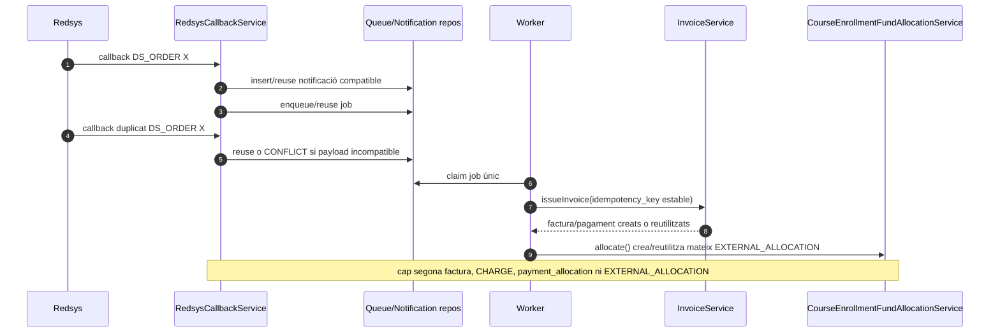
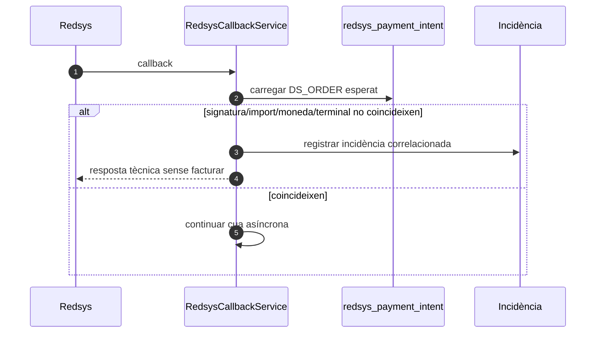
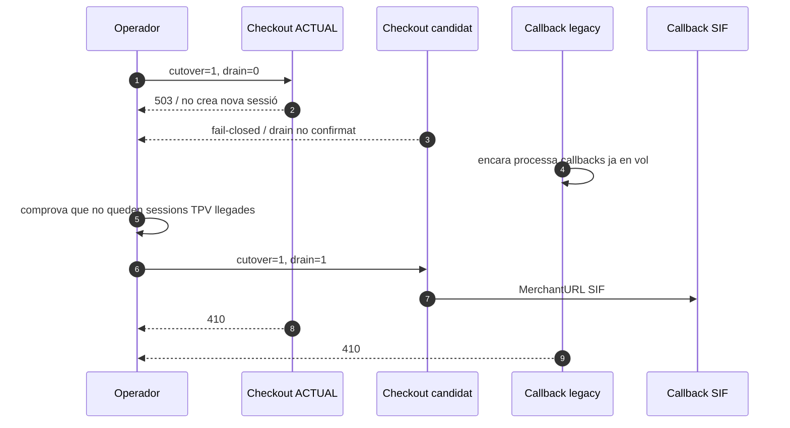

# UC-014 — Diagrames de seqüència ACTUAL i FINAL

**Data/revalidació:** 02/10/2026.  
**Objectiu:** separar el recorregut llegat que factura dins del callback de l'arquitectura final asíncrona del SIF.

## 1. ACTUAL — compra i callback llegat

```mermaid
sequenceDiagram
autonumber
actor A as Alumne/pagador
participant J as JS pagament/confirmació
participant P as PagamentCursAutomatic
participant E as pagina_efectuar_pagament_automatic.php
participant G as JasomNovicePaymentGate
participant R as Redsys
participant C as realitzaPagamentAutomatic.php
participant DB as BD llegada
participant M as Mail
participant OK as respostaOk/Ko

A->>J: Obre pagament / confirma inscripció
J->>P: AJAX + keyEncr
P->>DB: SELECT inscripcions + curs
DB-->>P: preu, pagat, FRACCIONAT, curs, IDPAG
P-->>J: HTML targeta/transferència
J-->>A: mostra estat i valida UX
A->>E: POST decisió/import
E->>G: assertCanPrepare(DB, POST)
G->>DB: rellegeix saldo, FRACCIONAT i estat JASOM
DB-->>G: context autoritatiu
G-->>E: import/fraccionament autoritzats
E->>E: DS_ORDER = random_int(12 dígits) [fallback]
E->>R: formulari TPV amb amount/order + MerchantData signat (IDPAG/import/frac)
R->>C: POST notificació; query legacy només compatibilitat
C->>C: valida HMAC_SHA256_V1
C->>C: extreu IDPAG/import/frac de Ds_MerchantData signat
C->>C: valida amount + currency=978 + terminal + merchant code + Ds_Response numèric
C->>C: valida order + amount + coherència del query si existeix
C->>DB: SELECT inscripció/curs
alt Ds_Response autoritzat
  C->>DB: calcula factura_relacionada i ordre [llegat]
  C->>DB: INSERT factures [llegat]
  C->>DB: UPDATE PAGAMENT/FACTURA_RELACIONADA/DATA PAG/FRACCIO
  C->>M: correus només després de validar
else denegat/error
  C-->>R: HTTP 400 / sense efecte fiscal
end
R-->>OK: retorn navegador OK/KO
OK-->>A: missatge visual
```

### Punts que el diagrama ACTUAL encara no resol arquitectònicament

1. La branca 02/10 endureix signatura, import, `IDPAG`, secrets, fraccionament, moneda, terminal, merchant code i `Ds_Response` del fallback mitjançant `Ds_MerchantData` signat i configuració d'entorn; la MerchantURL ja no porta context funcional. Tot i així, `DS_ORDER` i la factura encara neixen fora del SIF mentre aquest fallback sigui actiu.
2. La numeració/facturació del callback llegat no és idempotent com el nucli SIF i s'ha de retirar després del cutover.
3. El retorn OK/KO del navegador llegat no és prova suficient de persistència fiscal/econòmica; el pont candidat sí consulta estat SIF.
4. La rotació de credencials històriques i l'evidència del runtime desplegat continuen pendents.
5. El callback llegat és només una via temporal de rollback; no s'ha de considerar disseny FINAL.

## 2. FINAL — intenció, callback, cua, emissió i retorn autoritatiu

```mermaid
sequenceDiagram
autonumber
actor A as Alumne/pagador
participant Web as pagina_efectuar_pagament_automatic.php
participant IC as SifRedsysCourseIntentClient
participant Intent as RedsysCoursePaymentIntentService
participant R as Redsys
participant C as RedsysCallbackService
participant Q as RedsysCallbackQueue
participant W as RedsysCallbackWorker
participant D as RedsysCallbackDispatcher
participant H as RedsysCourseInvoiceService
participant I as InvoiceService
participant Fund as CourseEnrollmentFundAllocationService / EnrollmentFundMovementRepository
participant Sync as RedsysLegacySyncingProcessor / CourseLegacyPaymentSyncService
participant Outbox as CoursePaymentNotificationService / notification_outbox
participant Ret as respostaOk/KoPagamentAutomatic.php
participant SC as SifRedsysCourseStatusClient
participant Status as RedsysCoursePaymentStatusService

A->>Web: Confirma pagament de la inscripció
Web->>IC: create(IDPAG, import sol·licitat, terminal)
IC->>Intent: POST HMAC /api/redsys/course-intent.php
Intent->>Intent: rellegeix inscripció i saldo pendent
Intent-->>IC: DS_ORDER + import autoritatiu
IC-->>Web: intenció creada/reutilitzada
Web->>R: formulari TPV amb DS_ORDER de la intenció
R->>C: callback signat a MerchantURL SIF [quan tall activat]
C->>C: valida signatura + merchant code + DS_ORDER + import + moneda + terminal
C->>Q: persisteix notificació i encola/reutilitza job
C-->>R: HTTP tècnic sense factura
W->>Q: claimNext()
Q-->>W: job únic
W->>Sync: process(job)
Sync->>D: dispatcher.process(job)
D->>H: issueFromIntentSnapshot()
H->>I: issueInvoice(payload + CHARGE)
I-->>H: UUID_FACTURA + UUID_PAYMENT + reused?
H->>Fund: allocate(DS_ORDER, snapshot, invoiceResult)
Fund->>Fund: valida CHARGE + factura + línia + import
Fund-->>H: EXTERNAL_ALLOCATION idempotent + UUID_MOVEMENT
H-->>D: resultat fiscal/econòmic + fund_allocations
D-->>Sync: resultat
Sync->>Sync: CourseLegacyPaymentSyncService.sync()
Sync->>Outbox: enqueue COURSE_PAYMENT_CONFIRMED
Outbox-->>Sync: UUID_NOTIFICATION PENDING/reused
Sync-->>W: resultat + sync + outbox
W->>Q: markProcessed(result)
R-->>Ret: retorn navegador OK o KO
Ret->>SC: get(DS_ORDER, IDPAG)
SC->>Status: POST HMAC /api/redsys/course-status.php
Status->>Status: correlaciona intent + notificació + cua
Status-->>SC: PENDING/PROCESSING/CONFIRMED/REJECTED/REVIEW
SC-->>Ret: estat read-only
Ret-->>A: mostra estat autoritatiu
Note over Ret,Status: CONFIRMED només amb PROCESSED + UUID_FACTURA + UUID_PAYMENT
Note over Web,C: el tall final exigeix cutover=1 + drain=1 + URL SIF HTTPS; cutover=1/drain=0 només bloqueja nous checkouts i drena callbacks llegats
```

**Implementat i verificat per CI anterior:** intenció SIF, callback/cua/worker, factura+cobrament, `EXTERNAL_ALLOCATION` per inscripció, projecció llegada, outbox CURS, consulta read-only d'estat i retorn OK/KO fail-closed. El PR #95 acredita fund allocation amb suites SIF 841/0 i quatre workflows verds. **Pendent d'entorn:** configurar MerchantURL/cutover, rotar secrets i executar Redsys/preproducció real. El hardening ACTUAL 02/10 ha estat revalidat al PR #105: `SIF PHP MySQL tests`, `SIF checks` i `UC-111 integration verification` han acabat en verd sobre el head de codi `56d32d600d26d39d94b8a7227e4d732f07d35ce5`.
## 3. FINAL — callback duplicat



## 4. FINAL — import o payload incompatible



## 5. Estat

**DOCUMENTAT:** seqüència ACTUAL, FINAL nominal, duplicat i conflicte.  
**IMPLEMENTAT:** serveis SIF centrals, pont candidat d'intenció, callback/cua/worker, `CourseEnrollmentFundAllocationService` + `EnrollmentFundMovementRepository`, sync llegada, productor `notification_outbox` CURS i retorn autoritatiu OK/KO.  
**VERIFICAT:** CI amb E2E intern simulat, `EXTERNAL_ALLOCATION` idempotent, mismatch fail-closed, duplicat, parcial→complet, boundaries de preproducció i tests del retorn autoritatiu; PR #95 amb 841 passed / 0 failed.  
**PENDENT:** lliurament/retries d'email UC-58, desplegament/preproducció amb Redsys real, rotació/configuració de secrets, activació del flag de cutover i retirada posterior de l'autoritat fiscal llegada.


**Inventari executable relacionat:** [PHP/JS ACTUAL, pont candidat i SIF — 02/10](uc-014-inventari-codi-php-js-actual-final-2026-10-02.md).


## 6. CUTOVER — drenatge segur de sessions legacy



**Invariant:** no es retira el callback llegat fins haver aturat nous checkouts i drenat les sessions ja iniciades.
