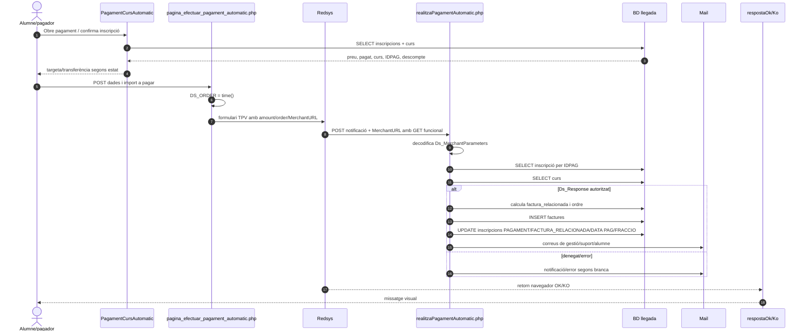
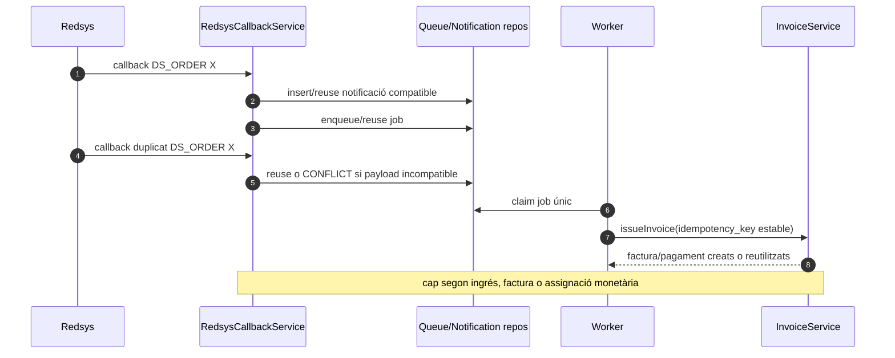
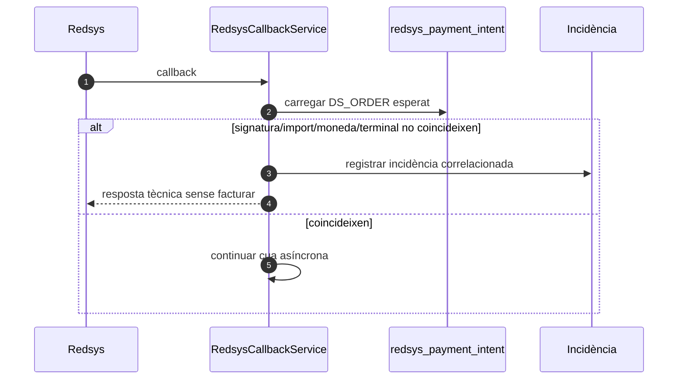

# UC-014 — Diagrames de seqüència ACTUAL i FINAL

**Data:** 29/09/2026.  
**Objectiu:** separar el recorregut llegat que factura dins del callback de l'arquitectura final asíncrona del SIF.

## 1. ACTUAL — compra i callback llegat



### Punts que el diagrama ACTUAL no dona per resolts

1. No s'ha localitzat a la còpia revisada la comparació efectiva entre la signatura recalculada i la rebuda.
2. No s'ha acreditat la igualtat entre `Ds_Order` del payload i `order` de la MerchantURL.
3. No s'ha acreditat la igualtat entre `Ds_Amount` i l'import funcional utilitzat posteriorment.
4. El retorn OK/KO del navegador no és una prova suficient de persistència fiscal/econòmica.
5. El callback duplicat no té una protecció idempotent equivalent a la del SIF nou en el fragment auditat.

## 2. FINAL — intenció, callback, cua, emissió i retorn autoritatiu

```mermaid
sequenceDiagram
autonumber
actor A as Alumne/pagador
participant Web as pagina_efectuar_pagament_automatic.php
participant IC as SifRedsysCourseIntentClient
participant Intent as RedsysCoursePaymentIntentService
participant R as Redsys
participant C as RedsysCallbackService
participant Q as RedsysCallbackQueue
participant W as RedsysCallbackWorker
participant D as RedsysCallbackDispatcher
participant H as RedsysCourseInvoiceService
participant I as InvoiceService
participant Sync as RedsysLegacySyncingProcessor / CourseLegacyPaymentSyncService
participant Outbox as CoursePaymentNotificationService / notification_outbox
participant Ret as respostaOk/KoPagamentAutomatic.php
participant SC as SifRedsysCourseStatusClient
participant Status as RedsysCoursePaymentStatusService

A->>Web: Confirma pagament de la inscripció
Web->>IC: create(IDPAG, import sol·licitat, terminal)
IC->>Intent: POST HMAC /api/redsys/course-intent.php
Intent->>Intent: rellegeix inscripció i saldo pendent
Intent-->>IC: DS_ORDER + import autoritatiu
IC-->>Web: intenció creada/reutilitzada
Web->>R: formulari TPV amb DS_ORDER de la intenció
R->>C: callback signat a MerchantURL SIF [quan tall activat]
C->>C: valida signatura + DS_ORDER + import + moneda + terminal
C->>Q: persisteix notificació i encola/reutilitza job
C-->>R: HTTP tècnic sense factura
W->>Q: claimNext()
Q-->>W: job únic
W->>Sync: process(job)
Sync->>D: dispatcher.process(job)
D->>H: issueFromIntentSnapshot()
H->>I: issueInvoice(payload + CHARGE)
I-->>H: UUID_FACTURA + UUID_PAYMENT + reused?
H-->>D: resultat fiscal/econòmic
D-->>Sync: resultat
Sync->>Sync: CourseLegacyPaymentSyncService.sync()
Sync->>Outbox: enqueue COURSE_PAYMENT_CONFIRMED
Outbox-->>Sync: UUID_NOTIFICATION PENDING/reused
Sync-->>W: resultat + sync + outbox
W->>Q: markProcessed(result)
R-->>Ret: retorn navegador OK o KO
Ret->>SC: get(DS_ORDER, IDPAG)
SC->>Status: POST HMAC /api/redsys/course-status.php
Status->>Status: correlaciona intent + notificació + cua
Status-->>SC: PENDING/PROCESSING/CONFIRMED/REJECTED/REVIEW
SC-->>Ret: estat read-only
Ret-->>A: mostra estat autoritatiu
Note over Ret,Status: CONFIRMED només amb PROCESSED + UUID_FACTURA + UUID_PAYMENT
Note over Web,C: el tall exigeix SIF_REDSYS_COURSE_CUTOVER_ENABLED=1 + URL SIF HTTPS; la URL sola no activa
```

**Implementat i verificat per CI:** intenció SIF, callback/cua/worker, factura+cobrament, projecció llegada, consulta read-only d'estat i retorn OK/KO fail-closed. **Pendent d'entorn:** configurar la MerchantURL SIF i executar Redsys/preproducció real.
## 3. FINAL — callback duplicat



## 4. FINAL — import o payload incompatible



## 5. Estat

**DOCUMENTAT:** seqüència ACTUAL, FINAL nominal, duplicat i conflicte.  
**IMPLEMENTAT:** serveis SIF centrals, pont candidat d'intenció, callback/cua/worker, sync llegada, productor `notification_outbox` CURS i retorn autoritatiu OK/KO.  
**VERIFICAT:** CI amb E2E intern simulat, idempotència, parcial→complet, boundaries de preproducció i tests del retorn autoritatiu.  
**PENDENT:** lliurament/retries d'email UC-58, desplegament/preproducció amb Redsys real, activació del flag de cutover i retirada posterior de l'autoritat fiscal llegada.
